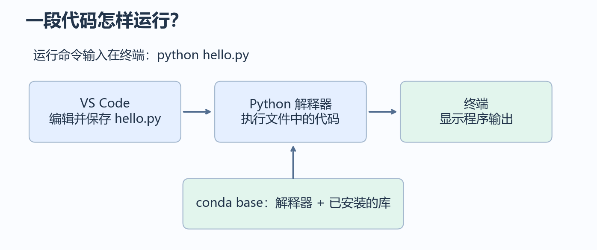
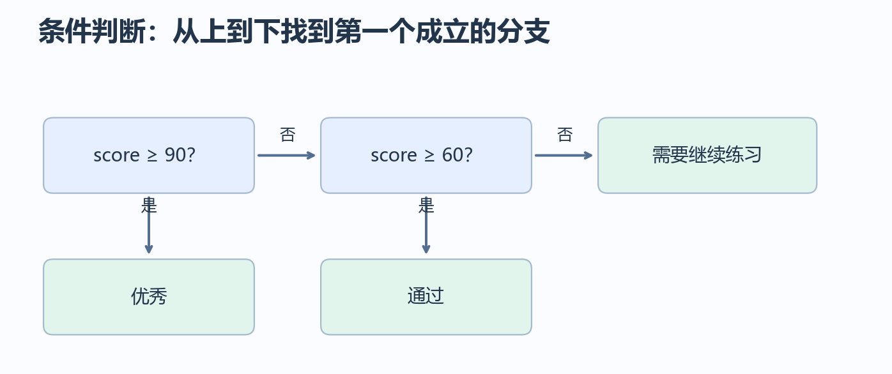
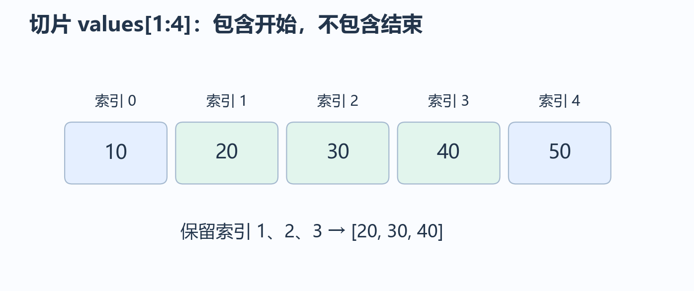
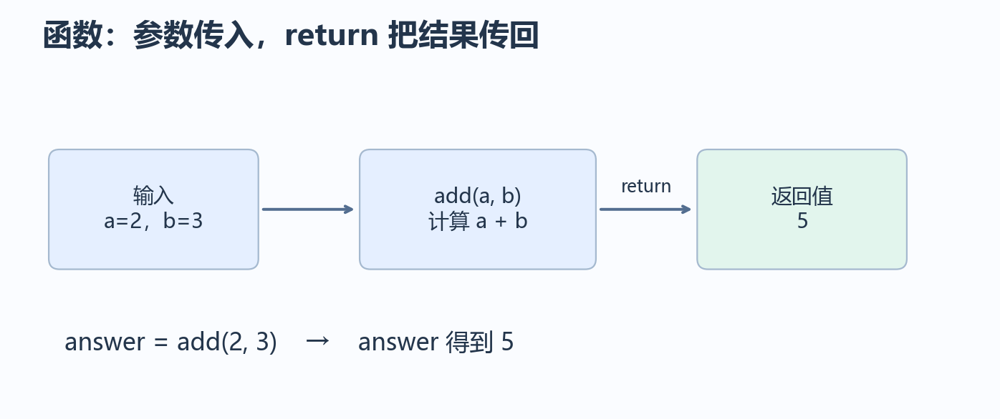

# 第 1 章：Python 基础

这一章从“怎样运行一行代码”开始，逐步讲到函数、类与对象。没有写过程序也可以从头读；如果你会 Java 等语言，可以略读变量和条件判断，但请认真阅读缩进、切片与对象共享。数组形状与广播在第 3 章学习。

本章不设置章末作品。每次只运行一个短例子，先猜结果，再运行，最后用自己的话解释结果。遇到陌生词，可以先停在当前小节，不必一口气读完。

## 阅读路线

环境与运行 → 变量与运算 → 容器与控制流程 → 函数 → 类与对象。

文件处理、调试与模块组织在第 2 章学习，NumPy 与画图在第 3 章学习。

## 1.1 准备环境：conda + VS Code

先分清三个工具的职责：VS Code 用来写代码，Python 解释器负责执行代码，conda 管理解释器和第三方库。终端是输入运行命令的地方。



### 已安装 conda 的读者

Windows 上从开始菜单打开 **Anaconda Prompt**；使用 Miniconda 时打开对应的 Prompt。下面的命令输入在终端，不要写进 `.py` 文件。

```bash
conda --version
conda env list
conda activate base
python --version
python -c "import sys; print(sys.executable)"
```

`conda env list` 列出已有环境，星号表示当前环境。`base` 是安装 conda 时附带的基础环境。最后一条命令显示正在使用的 Python 路径；每台机器的路径可以不同。

macOS/Linux 用户打开终端；如果安装后尚不能使用 conda，按安装程序提示初始化并重新打开终端。

### 尚未安装的读者

1. 从 [Miniconda 官方安装说明](https://www.anaconda.com/docs/getting-started/miniconda/install) 下载对应系统的安装程序，也可以使用已经安装的 Anaconda。
2. 安装后重新打开 Prompt，运行上面的检查命令。
3. 安装 [VS Code](https://code.visualstudio.com/)，在扩展面板安装 Microsoft 发布的 **Python** 扩展。

### 让 VS Code 使用同一个环境

1. 建一个用于学习的文件夹，例如 `python-study`，在 VS Code 中选择“文件 → 打开文件夹”。
2. 按 `Ctrl+Shift+P`（macOS 为 `Cmd+Shift+P`），输入 `Python: Select Interpreter`，选择 conda 的 `base` 解释器。
3. 新建终端，运行 `python -c "import sys; print(sys.executable)"`，确认路径与 Prompt 中一致。
4. 若列表没有 base，使用“输入解释器路径”选择安装目录里的 Python；Windows 通常是安装目录下的 `python.exe`。

解释器选择与终端激活需要保持一致。终端显示 `(base)` 有助于判断，但实际以 `sys.executable` 为准。操作依据：[VS Code Python 环境说明](https://code.visualstudio.com/docs/python/environments)。

如果 VS Code 终端提示找不到 conda，可以暂时在 Anaconda Prompt 中运行代码，编辑仍使用 VS Code。要在 PowerShell 中初始化，可在 Prompt 执行 `conda init powershell`，然后关闭并重新打开 VS Code。它会修改终端启动配置，不需要每次执行。此处不要求你修改系统执行策略。

### 后续章节的绘图库与镜像站

本章只用 Python 自带功能。到第 3 章 NumPy 与数据可视化时再检查：

```bash
conda activate base
python -c "import numpy, matplotlib; print(numpy.__version__, matplotlib.__version__)"
```

如果提示某个库不存在，在已激活 base 的终端中执行：

```bash
python -m pip install numpy matplotlib -i https://mirrors.tuna.tsinghua.edu.cn/pypi/web/simple
```

`python -m pip` 表示用当前 Python 对应的安装工具；`-i` 只为这次安装指定镜像，不修改全局配置。这里使用[清华 PyPI 镜像](https://mirrors.tuna.tsinghua.edu.cn/help/pypi/)。它服务于 pip；conda 的包渠道是另一套地址，见[清华 Anaconda 镜像说明](https://mirrors.tuna.tsinghua.edu.cn/help/anaconda/)。本章无需修改 conda 渠道，也不需要升级已有的全部包。镜像不可用时可以去掉 `-i` 参数使用默认源。

> 本章沿用 base。后续机器学习部分再创建专用 conda 环境，届时逐步说明环境隔离。

## 1.2 第一个文件：代码写在哪里，怎样运行

在学习文件夹中建立 `hello.py`，保存为以下内容：

```python
print("你好，Python！")
print(2 + 3)
```

在 VS Code 终端中确认当前位置是该文件夹，再运行：

```bash
python hello.py
```

输出：

```text
你好，Python！
5
```

`print` 把括号里的内容显示出来。引号内是文字；`2 + 3` 是需要计算的表达式。Python 通常从上往下执行语句。修改后先保存，再运行，否则可能运行旧内容。

也可以使用 Python 扩展的“在终端中运行 Python 文件”。本章先使用明确的 `python 文件名.py` 命令，便于看清运行过程。

| 你看到的东西 | 在哪里使用 |
|---|---|
| `print(2 + 3)` | `.py` 文件里的 Python 代码 |
| `python hello.py` | 终端里的命令 |
| `>>>` | Python 交互模式的提示符，不要复制进文件 |
| `(base)` | 终端环境标记，不属于命令 |

注释用于解释代码，不参与执行：

```python
# 算出三个数字的总和
print(10 + 20 + 30)  # 也可以写行尾注释
```

**随堂检查：** `print("2 + 3")` 和 `print(2 + 3)` 有何区别？前者输出文字 `2 + 3`，后者输出计算结果 `5`。

## 1.3 变量、类型与表达式

变量是给一个值起的名字。赋值语句中的 `=` 表示“把右边的结果交给左边的名字”，不是数学里的等式。

```python
price = 12
quantity = 3
total = price * quantity
print(total)
```

输出 `36`。`total` 保存这次计算的结果；以后修改 `price`，不会自动重新计算 `total`。

```python
price = 12
total = price * 3
price = 20
print(total)  # 仍然是 36
```

常见的值有这些类型：

| 类型 | 示例 | 用途 |
|---|---|---|
| `int` 整数 | `3`、`-2` | 数量、编号 |
| `float` 浮点数 | `3.5` | 近似表示小数 |
| `str` 字符串 | `"猫"` | 文字 |
| `bool` 布尔值 | `True`、`False` | 判断结果 |
| `None` | `None` | 表示暂时没有值 |

```python
name = "小林"
score = 88.5
passed = True
print(type(name).__name__)
print(type(score).__name__)
print(f"{name}的成绩是{score}，通过：{passed}")
```

输出依次为 `str`、`float`、`小林的成绩是88.5，通过：True`。最后一行的 `f` 字符串允许把变量写进 `{}`。

名字使用字母、数字和下划线，不能以数字开头。建议写 `student_score` 等有意义的名字；避免把变量命名为 `list`、`str`、`sum`，这些是 Python 已有功能的名称。

| 运算符 | 含义 | 例子与结果 |
|---|---|---|
| `+ - *` | 加、减、乘 | `3 * 4 → 12` |
| `/` | 除法 | `7 / 2 → 3.5` |
| `//` | 向下取整的除法 | `7 // 2 → 3` |
| `%` | 余数 | `7 % 2 → 1` |
| `**` | 乘方 | `2 ** 3 → 8` |

括号先算，乘除通常先于加减。容易拿不准时写括号：`(2 + 3) * 4` 为 `20`。`//` 是向负无穷取整，例如 `-7 // 2` 为 `-4`。

浮点数通常近似表示小数，因此 `0.1 + 0.2` 可能显示为 `0.30000000000000004`。先记住“小数计算可能有微小误差”，后面的数学和数值计算会再解释。

**随堂检查：** `count = 2; count = count + 1` 后 count 是多少？答案是 `3`。实际写代码时可分成两行，不必使用分号。

## 1.4 输入、类型转换与条件判断

`input` 等待用户输入，返回的始终是字符串，即使输入的是数字。

```python
age_text = input("请输入年龄：")
age = int(age_text)
print(f"明年你将是{age + 1}岁")
```

输入 `18` 后输出 `明年你将是19岁`。`int` 把适合的文本转换成整数；`float("3.5")` 转成小数；`str(18)` 转成文本。`int("你好")` 会报错，我们在第 2 章的异常处理小节解决。

比较产生布尔值：`==` 判断相等，`!=` 判断不等，另有 `>`、`>=`、`<`、`<=`。`=` 是赋值，`==` 才是比较。

```python
score = 72
if score >= 90:
    print("优秀")
elif score >= 60:
    print("通过")
else:
    print("需要继续练习")
```

输出 `通过`。Python 从上往下检查；进入第一个符合条件的分支后，就跳过其余分支。冒号后面缩进的代码属于该分支，通常使用 **4 个空格**。同一层缩进必须一致。



`and` 表示两者都成立，`or` 表示至少一个成立，`not` 表示取反。

```python
age = 20
has_ticket = True
print(age >= 18 and has_ticket)  # True
```

> Java 读者：Python 使用缩进确定代码块，不使用花括号；布尔字面量写成 `True`、`False`。

**随堂检查：** 将 score 改成 `95` 和 `40`，分别输出什么？答案为 `优秀`、`需要继续练习`。

## 1.5 列表、元组、字典与集合

一个变量可以对应一组数据。先按“怎样找到数据”区分四种容器：

| 容器 | 示例 | 常见用途 |
|---|---|---|
| 列表 `list` | `[80, 90, 70]` | 按顺序存放，可以修改 |
| 元组 `tuple` | `(1920, 1080)` | 一组位置固定的值，元素位置不能重新赋值 |
| 字典 `dict` | `{"name": "小林", "score": 90}` | 用键查值 |
| 集合 `set` | `{"猫", "狗"}` | 去重、成员判断，不靠位置取元素 |

列表从 **0** 开始编号。负数从末尾数，`-1` 是最后一个。

```python
scores = [80, 90, 70]
print(scores[0])   # 80
print(scores[-1])  # 70
scores[1] = 95
scores.append(85)
print(scores)     # [80, 95, 70, 85]
print(len(scores))  # 4
```

`scores.append(85)` 的意思是“调用这个列表的 append 方法，向末尾添加 85”。方法可以先理解成某个对象自带的操作。

```python
student = {"name": "小林", "score": 90}
print(student["name"])  # 小林
student["score"] = 92
print(student.get("age", "未填写"))  # 未填写
print("score" in student)  # True：判断键是否存在

words = ["猫", "狗", "猫"]
unique_words = set(words)
print(len(unique_words))  # 2
print("猫" in unique_words)  # True
```

集合的显示顺序不作为本章验收结果；空集合写 `set()`，`{}` 是空字典。元组中的对象本身可能可变，当前先使用数字组成的元组。

**随堂检查：** 学生名单用列表，按学号查学生信息用字典，统计不重复的词用集合。

## 1.6 索引、切片与对象共享

切片从一组数据中取出一段，写法为 `数据[开始:结束:步长]`。开始位置包含在内，结束位置不包含在内。

```python
values = [10, 20, 30, 40, 50]
print(values[1:4])  # [20, 30, 40]
print(values[:3])   # [10, 20, 30]
print(values[::2])  # [10, 30, 50]
print(values[::-1]) # [50, 40, 30, 20, 10]
```



字符串也能索引和切片，但不能直接修改其中一个字符：

```python
word = "Python"
print(word[0])   # P
print(word[1:4]) # yth
```

另一个容易误解的地方是：赋值给另一个名字，不一定复制数据。

```python
a = [1, 2]
b = a
b.append(3)
print(a)  # [1, 2, 3]

c = a.copy()
c.append(4)
print(a)  # [1, 2, 3]
print(c)  # [1, 2, 3, 4]
```

`a` 和 `b` 指向同一个列表；`copy()` 创建新的外层列表。若里面还有列表，内层对象仍可能共享，这是“浅拷贝”；暂时只用一层列表即可。

**随堂检查：** `values[2:2]` 是什么？答案为 `[]`，因为没有位置落在这个区间里。

## 1.7 for 与 while：让操作重复执行

`for` 逐个取出容器里的元素：

```python
scores = [80, 90, 70]
total = 0
for score in scores:
    total = total + score
print(total)  # 240
```

每轮的变化是：

| 当前 score | 加之前的 total | 加之后的 total |
|---|---|---|
| 80 | 0 | 80 |
| 90 | 80 | 170 |
| 70 | 170 | 240 |

`range(3)` 提供 `0、1、2`，适合明确知道重复次数的情况。`range(1, 4)` 提供 `1、2、3`，同样不包含结束值。

```python
for index, score in enumerate([80, 90]):
    print(index, score)
```

输出两行 `0 80`、`1 90`。`enumerate` 同时提供编号和元素，逗号把这两个值分别交给两个名字。

`while` 在条件成立时重复：

```python
count = 0
while count < 3:
    print(count)
    count += 1
```

输出 `0、1、2`。`count += 1` 等价于此处的 `count = count + 1`；遗漏它会一直循环。如果程序停不下来，在终端按 `Ctrl+C` 中断。

`break` 提前结束整个循环；`continue` 跳过这一轮剩余语句。先用普通循环表达清楚，再考虑这些控制方式。

**随堂检查：** 将 total 初始化放进 for 的内部会怎样？每轮都重置，最后只能得到 `70`。

## 1.8 常用写法：字符串处理与推导式

数据中的文本往往需要清理。先用一个明确例子：

```python
text = "  Cat,Dog,Cat  "
clean = text.strip().lower()
words = clean.split(",")
print(words)  # ['cat', 'dog', 'cat']
print(" / ".join(words))  # cat / dog / cat
```

`strip` 去掉两端空白，`lower` 转成小写，`split` 按分隔符拆开，`join` 把字符串列表连接。字符串方法通常返回新字符串。

列表推导式是某些循环的简写：

```python
squares = []
for number in range(4):
    squares.append(number ** 2)
print(squares)  # [0, 1, 4, 9]

squares = [number ** 2 for number in range(4)]
print(squares)  # [0, 1, 4, 9]
```

初次阅读可按“对 range 中的每个 number，计算 number ** 2”解释。不要追求把复杂操作都挤进一行。

## 1.9 函数：把一段操作命名

函数接收输入，执行操作，并可以返回结果。先看最简单的例子：

```python
def add(a, b):
    result = a + b
    return result

answer = add(2, 3)
print(answer)  # 5
```

`def` 定义函数，`a`、`b` 是参数，调用时的 `2`、`3` 是传入的值。定义函数时不会执行函数体，调用时才执行。`return` 把结果交回调用处，并结束这次调用。



`print` 与 `return` 不同：前者让人看见内容，后者让后续代码拿到结果。没有执行 return 的函数，返回 `None`。

```python
def show_sum(a, b):
    print(a + b)

answer = show_sum(2, 3)
print(answer)
```

依次输出 `5` 和 `None`。

参数可以有默认值，也能按名字传入：

```python
def greet(name, prefix="你好"):
    return f"{prefix}，{name}"

print(greet("小林"))  # 你好，小林
print(greet(name="小林", prefix="早上好"))  # 早上好，小林
```

函数内新建的变量通常只在函数内有效，叫局部变量。先采用“参数传入、return 传出”的方式，减少对外部变量的修改。默认参数暂时使用数字、字符串、None，避免使用会被修改的列表。

**随堂检查：** 想把函数算出的均值用于下一次计算，应该使用 print 还是 return？使用 return；要展示时再 print。

## 1.10 类与对象：读懂后面的模型代码

类把相关的数据和操作放在一起；对象是按照这个定义创建的具体实例。先从学生信息理解：

```python
class Student:
    def __init__(self, name, score):
        self.name = name
        self.score = score

    def passed(self):
        return self.score >= 60

student = Student("小林", 90)
print(student.name)      # 小林
print(student.passed())  # True
```

`__init__` 在创建实例时初始化数据；`self` 指当前实例。`self.score` 是这个对象保存的成绩，`passed` 是这个对象提供的方法。调用 `student.passed()` 时，不需要手动传 self。

继承允许在已有类的基础上扩展：

```python
class Animal:
    def __init__(self, name):
        self.name = name

class Cat(Animal):
    def __init__(self, name):
        super().__init__(name)

    def speak(self):
        return "喵"

cat = Cat("小花")
print(cat.name, cat.speak())  # 小花 喵
```

`Cat(Animal)` 表示 Cat 继承 Animal，`super().__init__` 调用父类的初始化方法。以后遇到 `class Model(nn.Module)` 时，可以先识别“模型继承框架提供的基础类”。这里无需设计复杂的类体系。

## 1.11 本章自检

| 问题 | 参考答案 |
|---|---|
| 代码和运行命令分别写在哪里？ | Python 代码写入 .py 文件，运行命令写在终端。 |
| = 与 == 有何不同？ | 赋值与相等比较。 |
| input 返回什么类型？ | 字符串，数字运算前需要转换。 |
| 列表切片包含结束位置吗？ | 不包含。 |
| for 与 while 有何不同？ | 前者遍历元素，后者按条件重复。 |
| print 与 return 有何不同？ | 显示内容与返回结果。 |
| self 表示什么？ | 当前实例。 |

下一章继续学习怎样把代码拆成模块，并处理文件与表格数据。本章不设置章末作品。
### 补充练习与验收

先独立完成[本章两道练习](../assets/practice/part01.md#第01章)，再核对参考答案和本章验收证据。本部分不设章末作品。

[下一章：组织代码与数据处理](02-组织代码与数据处理.md) · [项目目录](../README.md)
