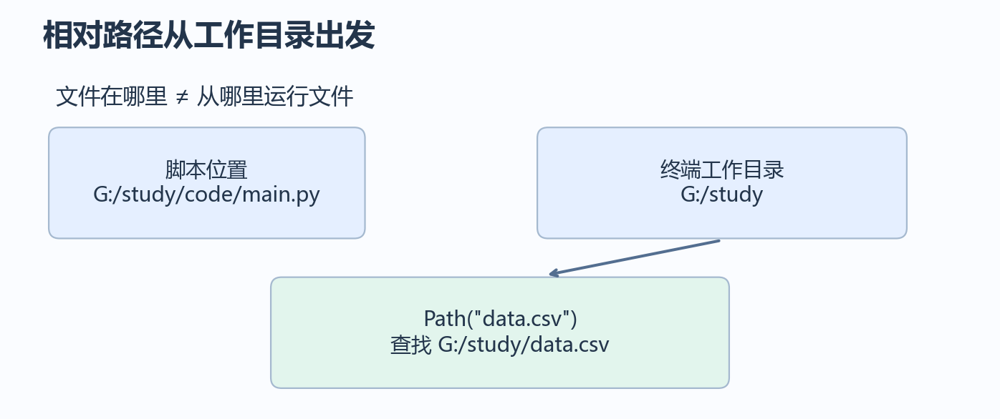
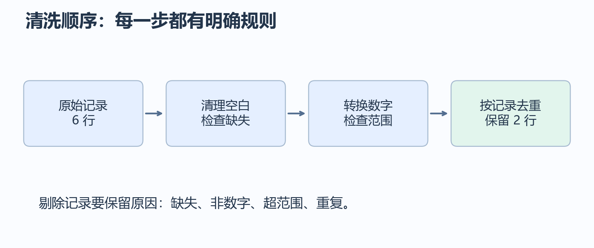

# 第 2 章：组织代码与数据处理

上一章学习了变量、循环、函数和对象。这一章把这些工具用于文件和表格：找到数据，读入数据，检查和清理，再保存结果。环境继续使用 conda base + VS Code，不设置章末作品。

本章所有 Python 代码块都可单独运行；需要数据的例子会先创建自己的小文件。请在学习文件夹中运行，示例会创建或覆盖明确命名的文件。输出里的文件绝对路径因机器而异。

## 2.1 文件夹、文件和工作目录

文件夹组织文件，路径描述文件在哪里。终端的当前工作目录是运行命令时所在的目录，不一定是代码文件所在的目录。



```python
from pathlib import Path

print(Path.cwd())
folder = Path("learning_data")
folder.mkdir(exist_ok=True)
path = folder / "notes.txt"
path.write_text("今天学习文件路径", encoding="utf-8")
print(path.exists())  # True
print(path.name)      # notes.txt
print(path.suffix)    # .txt
print(path.resolve())
```

`Path` 表示路径；`/` 在这里连接路径片段，不是数字除法。`mkdir` 创建目录，`exist_ok=True` 允许目录已经存在。`resolve()` 显示绝对路径。

如果 Windows 中路径含反斜杠，可写 `Path(r"G:\study\data")`，前面的 r 避免把 `\n` 等解释成转义字符；也可写正斜杠 `Path("G:/study/data")`。

在 `.py` 文件里，如果要始终使用脚本旁边的数据，可以通过 `Path(__file__).resolve().parent` 找到脚本所在目录。`__file__` 是当前文件路径，在交互窗口中不一定存在，因此先采用终端运行 `.py` 的方式。

**随堂检查：** 在另一个文件夹运行脚本，`Path("data.csv")` 从哪里找？从当前工作目录找，不是自动从脚本旁边找。

## 2.2 将一段处理拆成函数

先建立一个可以手算核对的任务：给定几个人的成绩，计算平均分，并筛出及格的人。

```python
def mean_score(scores):
    if len(scores) == 0:
        raise ValueError("成绩列表不能为空")
    return sum(scores) / len(scores)

def passed_students(rows, threshold=60):
    result = []
    for row in rows:
        if row["score"] >= threshold:
            result.append(row["name"])
    return result

rows = [{"name": "小林", "score": 90}, {"name": "小周", "score": 50}]
scores = [row["score"] for row in rows]
print(mean_score(scores))      # 70.0
print(passed_students(rows))   # ['小林']
```

`raise` 主动报告错误，避免空列表导致除以零。两个函数各负责一个明确操作，输入通过参数传入，结果通过 return 交回。这样可以单独核验某一步，而不必每次运行全部流程。

先保持“一个函数解决一个具体问题”，不需要为几行代码设计复杂结构。

## 2.3 模块与程序入口

当一个文件越来越长时，可以把可复用函数放进另一个 `.py` 文件。下面创建 `helpers.py` 与 `main.py`，演示这种结构：

```text
python-study/
├── helpers.py   ← 定义可复用函数
└── main.py      ← 导入函数并组织执行流程
```

将这一段保存为 `helpers.py`：

```python
def double(number):
    return number * 2
```

将下一段保存为同目录的 `main.py`：

```python
from helpers import double

def main():
    print(double(6))

if __name__ == "__main__":
    main()
```

在终端执行 `python main.py`，输出 `12`。直接运行 main.py 时，`__name__` 为 `"__main__"`，因此调用 main；被另一个文件导入时，这个分支不执行。

导入模块时，模块顶层的语句会执行，所以数据读取、用户输入等流程尽量放进 main。模块名不要与使用的库重名，例如不要把自己的文件叫 `csv.py` 或 `numpy.py`。

## 2.4 包、环境和依赖

标准库随 Python 提供，例如 pathlib、csv、json；第三方库由环境中的安装工具安装，例如 NumPy、Matplotlib。模块是代码组织单位，安装包可能包含多个模块，安装名与导入名也可能不同。

继续在 VS Code 选择 base 解释器，并在终端确认：

```bash
conda activate base
python -c "import sys; print(sys.executable)"
python -m pip show numpy matplotlib
```

第三方库缺失时，按第 1 章安装。清华镜像的一次性使用方式是：

```bash
python -m pip install numpy matplotlib -i https://mirrors.tuna.tsinghua.edu.cn/pypi/web/simple
```

镜像配置依据：[清华 PyPI 镜像说明](https://mirrors.tuna.tsinghua.edu.cn/help/pypi/)。本章不更改 conda 渠道或升级 base 的全部包。

可以在 `requirements.txt` 中逐行记录直接使用的第三方库，然后运行 `python -m pip install -r requirements.txt`。不要为了两三个库把整个 base 的全部包都当作项目必需依赖。后续模型章节再学习创建独立 conda 环境。

## 2.5 文本文件与编码

文本文件保存文字，编码决定文字怎样变成文件中的字节。读写时统一用 UTF-8，减少中文乱码。

```python
from pathlib import Path

path = Path("reading_notes.txt")
path.write_text("Python\n数学\n机器学习\n", encoding="utf-8")
text = path.read_text(encoding="utf-8")
lines = text.splitlines()
print(lines)  # ['Python', '数学', '机器学习']
```

`splitlines` 按换行拆分，不保留换行符。读一个小文件可以一次读完；较大的文件可以按行处理：

```python
from pathlib import Path

path = Path("reading_lines.txt")
path.write_text("  Python  \n\n  数学  \n", encoding="utf-8")
with path.open("r", encoding="utf-8") as file:
    for line in file:
        cleaned = line.strip()
        if cleaned:
            print(cleaned)
```

输出两行 `Python`、`数学`。空字符串在 if 中被视为 False，因此空行被跳过。with 负责在离开代码块时关闭文件。

| 模式 | 意义 |
|---|---|
| `r` | 读取；不存在时报告错误 |
| `w` | 写入；存在时清空旧内容 |
| `a` | 追加；保留旧内容，在末尾继续写 |

本章使用自己创建的小文件，便于看清覆盖与追加的区别。

## 2.6 CSV：把表格读成记录

CSV 通常用逗号分列、用换行分行。使用 csv 标准库处理，避免直接 split 误拆带引号或带逗号的字段。

```python
import csv
from pathlib import Path

path = Path("csv_demo.csv")
with path.open("w", encoding="utf-8", newline="") as file:
    writer = csv.writer(file)
    writer.writerow(["name", "score"])
    writer.writerow(["小林", 90])
    writer.writerow(["小周", 75])

with path.open("r", encoding="utf-8", newline="") as file:
    rows = list(csv.DictReader(file))

print(rows[0])  # {'name': '小林', 'score': '90'}
print(type(rows[0]["score"]).__name__)  # str
scores = [int(row["score"]) for row in rows]
print(sum(scores) / len(scores))  # 82.5
```

DictReader 将列名作为字典的键，每行作为一个字典。文件里的数字依然是文本，需要明确转换成 int 或 float。`newline=""` 让 csv 模块处理换行。

如果文件由某些表格软件导出并带 UTF-8 BOM，可尝试读取时使用 `encoding="utf-8-sig"`。先确认文件编码，不能通过随意更换编码证明数据正确。

## 2.7 JSON：保存带结构的数据

CSV 适合规则表格；JSON 可以表达字典中包含列表等嵌套结构。

```python
import json
from pathlib import Path

record = {"name": "小林", "scores": [80, 90], "active": True}
path = Path("student_record.json")
text = json.dumps(record, ensure_ascii=False, indent=2)
path.write_text(text, encoding="utf-8")
loaded = json.loads(path.read_text(encoding="utf-8"))
print(loaded["scores"])  # [80, 90]
print(loaded["active"])  # True
```

ensure_ascii=False 保留可读的中文，indent=2 让层级更清楚。JSON 文本里的布尔值写成 true/false，没有值写 null；读取后对应 Python 的 True/False/None。JSON 的键通常是字符串，不能随意保存函数、Path 或 NumPy 数组。

**随堂检查：** 一张学生成绩表用什么格式？CSV 比较自然。一个学生有多门成绩和嵌套信息？JSON 更容易表达。

## 2.8 清洗：缺失值、非法值与重复记录

清洗先确定规则，再写代码。下面采用这些规则：名字去掉两端空白；空名字、空成绩、不能转换的成绩、不在 0～100 的成绩都不进入均值；完全相同的“名字与成绩”记录只保留一次。



```python
raw_rows = [
    {"name": " 小林 ", "score": "90"},
    {"name": "小周", "score": ""},
    {"name": "小吴", "score": "缺考"},
    {"name": "小林", "score": "90"},
    {"name": "小郑", "score": "120"},
    {"name": "小何", "score": "70"},
]

clean_rows, rejected, seen = [], [], set()
for row in raw_rows:
    name = row["name"].strip()
    score_text = row["score"].strip()
    if not name or not score_text:
        rejected.append((row, "缺失字段"))
        continue
    try:
        score = float(score_text)
    except ValueError:
        rejected.append((row, "成绩不是数字"))
        continue
    if not 0 <= score <= 100:
        rejected.append((row, "成绩超出范围"))
        continue
    key = (name, score)
    if key in seen:
        rejected.append((row, "重复记录"))
        continue
    seen.add(key)
    clean_rows.append({"name": name, "score": score})

print(clean_rows)
print(len(rejected))  # 4
print(sum(row["score"] for row in clean_rows) / len(clean_rows))  # 80.0
```

清洗结果为小林 90.0、小何 70.0。缺失成绩不能未经说明就变成 0，否则会改变均值含义。去重键也不是万能规则：同一个人可能有不同考试成绩，实际任务应根据学号、考试编号等确定记录身份。

这个例子特意有有效行；实际处理应检查清洗后是否为空，再计算均值。

## 2.9 保存处理结果并保留处理依据

输出文件与原始文件分开，便于复查。以下独立例子演示写入已清洗的记录：

```python
import csv
from pathlib import Path

rows = [{"name": "小林", "score": 90.0}, {"name": "小何", "score": 70.0}]
folder = Path("processed_data")
folder.mkdir(exist_ok=True)
path = folder / "clean_scores.csv"
with path.open("w", encoding="utf-8", newline="") as file:
    writer = csv.DictWriter(file, fieldnames=["name", "score"])
    writer.writeheader()
    writer.writerows(rows)
print(path.exists())  # True
```

处理记录至少说明：输入多少行、保留多少行、剔除什么原因、采用什么单位和规则。以后训练模型时，这些信息有助于判断效果改变来自数据还是算法。

## 2.10 调试、异常与小范围验证

按照“路径 → 原始文字 → 转换后的值 → 清洗数量 → 输出”检查，中间哪里不对，就停在那里。不要用一个笼统的 except 把所有错误隐藏。

```python
def parse_score(text):
    try:
        score = float(text.strip())
    except ValueError:
        return None
    if not 0 <= score <= 100:
        return None
    return score

assert parse_score(" 90 ") == 90.0
assert parse_score("") is None
assert parse_score("缺考") is None
assert parse_score("120") is None
assert parse_score("0") == 0.0
print("5 项检查通过")
```

`is None` 判断是否为没有值。不要写 `if score` 来判断是否有效，因为合法的 0 分同样会被当作 False。边界 0 与 100 也需要验证。

在 VS Code 中给转换或筛选语句设置断点，观察当前 row、score_text、score。操作见[官方 Python 调试说明](https://code.visualstudio.com/docs/python/debugging)。

向 AI 求助时，可以给出两三行匿名样例、清洗规则、预期结果和实际结果，让它先找规则与代码不一致的位置。

## 2.11 本章自检

| 问题 | 参考答案 |
|---|---|
| 相对路径的起点是什么？ | 当前工作目录。 |
| 为什么把处理步骤拆成函数？ | 可以分别检查输入和输出，减少重复代码。 |
| 为什么执行入口使用 __name__ 判断？ | 导入函数时不自动执行主流程。 |
| CSV 读取的 90 是数字吗？ | 通常是字符串，需要转换。 |
| 缺失成绩可以直接补 0 吗？ | 需要任务依据；不能默认当作真实 0 分。 |
| 去重前应确定什么？ | 什么字段共同标识一条记录。 |
| 为什么不直接覆盖原始文件？ | 保留来源，便于复查处理过程。 |

下一章把清洗后的数字组织成数组，并用图观察分布和关系。
### 补充练习与验收

先独立完成[本章两道练习](../assets/practice/part01.md#第02章)，再核对参考答案和本章验收证据。本部分不设章末作品。

[上一章：Python 基础](01-Python基础.md) · [下一章：NumPy 与数据可视化](03-NumPy与数据可视化.md)
