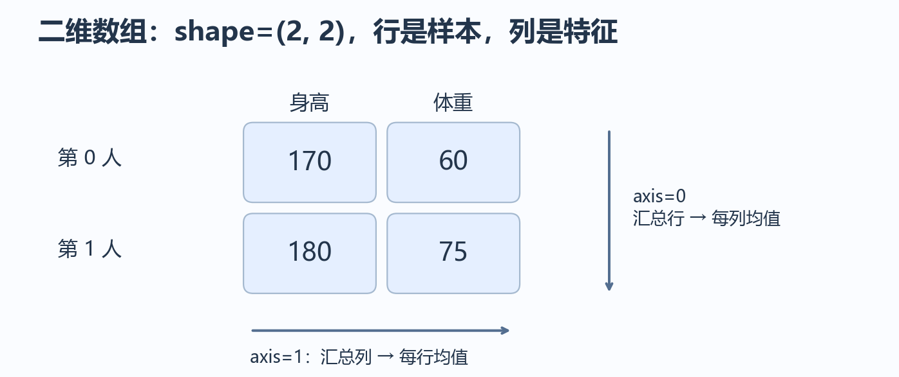
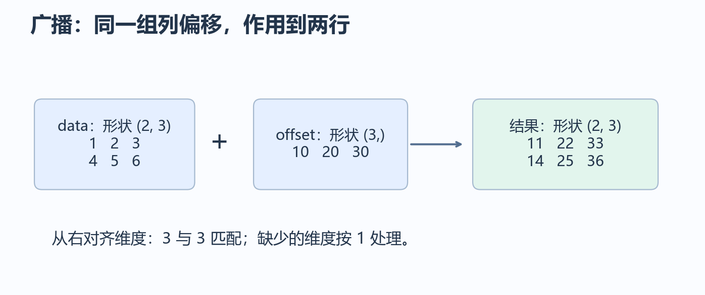
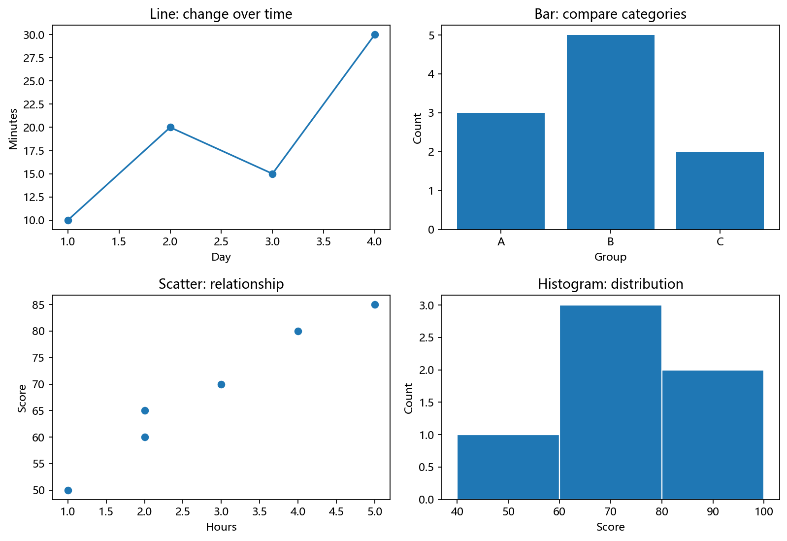
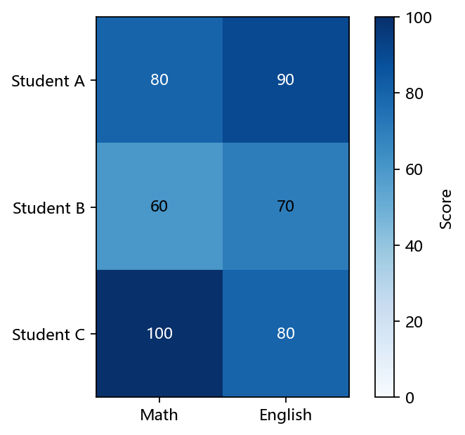

# 第 3 章：NumPy 与数据可视化

上一章解决了“怎样读到可靠的数据”。本章学习把数字组织成数组、进行批量计算，并画出能解释数据的图。继续使用 conda base + VS Code，不设置章末作品。

每个 Python 代码块都可单独运行。数组输出的空格和小数显示可能不同，重点看值、类型和形状。绘图例子使用英文标签以避免中文字体问题，图片写入当前工作目录的 `learning_plots/`。

## 3.1 安装检查与学习对象

在已激活 base 的终端运行：

```bash
python -c "import sys, numpy, matplotlib; print(sys.executable); print(numpy.__version__); print(matplotlib.__version__)"
```

缺库时再安装：

```bash
python -m pip install numpy matplotlib -i https://mirrors.tuna.tsinghua.edu.cn/pypi/web/simple
```

镜像与安装范围见[清华 PyPI 镜像说明](https://mirrors.tuna.tsinghua.edu.cn/help/pypi/)。无需重新安装已经可用的库。

本章约定二维表格中“行是样本，列是特征”。三个人各有两科成绩，就形成 3 行、2 列的数组。



## 3.2 创建数组：值、形状与类型

```python
import numpy as np

scores = np.array([[80, 90], [60, 70], [100, 80]], dtype=np.float64)
print(scores.shape)  # (3, 2)
print(scores.ndim)   # 2
print(scores.size)   # 6
print(scores.dtype)  # float64
print(np.zeros((2, 3)))
print(np.ones((1, 2)))
print(np.arange(0, 6, 2))  # [0 2 4]
print(np.linspace(0, 1, 3))  # [0.  0.5 1. ]
```

shape 是每个轴的长度，ndim 是轴的数量，size 是元素总数，dtype 是元素存储类型。zeros 创建全 0，ones 创建全 1。arange 按步长取数、不包含终点；linspace 指定数量，默认包含两端。

整数数组和浮点数组不同。`np.array([1, 2]).astype(float)` 返回浮点数组；转换不会凭空提高原始数据的精度。小数转换成整数会丢掉小数部分，应先明确数据含义。

## 3.3 索引、切片与布尔筛选

```python
import numpy as np

scores = np.array([[80, 90], [60, 70], [100, 80]])
print(scores[0, 1])    # 90：第 0 行、第 1 列
print(scores[0])       # [80 90]：一行
print(scores[:, 0])    # [80 60 100]：一列，shape=(3,)
print(scores[:, 0:1].shape)  # (3, 1)：保留二维形状
mask = scores[:, 0] >= 80
print(mask)  # [ True False  True]
print(scores[mask])  # 保留第 0、2 行
```

逗号分隔不同轴的选择，冒号表示全部位置。一个整数索引通常会去掉该轴；切片可以保留它。这就是“看上去都是一列，shape 却不同”的原因。

两个条件用 `&`，每个条件都加括号：

```python
import numpy as np

values = np.array([50, 70, 90, 100])
mask = (values >= 60) & (values < 100)
print(values[mask])  # [70 90]
```

数组条件不能直接使用 Python 的 and/or，因为你需要的是每个位置分别判断。

## 3.4 视图与复制：修改会影响谁

普通数组切片通常共享原来的数据，称为视图。

```python
import numpy as np

original = np.array([10, 20, 30])
view = original[:2]
view[0] = 99
print(original)  # [99 20 30]
copied = original[:2].copy()
copied[0] = 0
print(original)  # [99 20 30]
```

想保留原始数组时，明确使用 copy。整数数组索引和布尔筛选通常产生副本，但不要把这种行为推断到所有索引操作。先分清自己要读取还是要修改。

## 3.5 批量运算与按轴汇总

列表的 `* 2` 重复列表，数组的 `* 2` 逐元素乘 2：

```python
import numpy as np

print([1, 2] * 2)  # [1, 2, 1, 2]
print(np.array([1, 2]) * 2)  # [2 4]
scores = np.array([[80, 90], [60, 70], [100, 80]])
print(scores.mean(axis=0))  # [80. 80.]：每科均值
print(scores.mean(axis=1))  # [85. 65. 90.]：每人均值
print(scores.mean())       # 80.0：全部元素均值
print(scores.sum(axis=1))  # [170 130 180]
```

axis 指定哪条轴被汇总。axis=0 汇总各行，留下每列的结果；axis=1 汇总各列，留下每行的结果。省略 axis 通常汇总全部元素。

**随堂检查：** shape 为 `(3, 2)` 的成绩数组按 axis=0 求均值，结果 shape 是多少？`(2,)`，因为行轴被汇总掉。

## 3.6 reshape、转置与拼接

```python
import numpy as np

values = np.arange(6)
table = values.reshape(2, 3)
print(table)  # [[0 1 2], [3 4 5]]（按两行显示）
print(table.T.shape)  # (3, 2)
print(values.reshape(-1, 1).shape)  # (6, 1)
top = np.array([[1, 2]])
bottom = np.array([[3, 4]])
print(np.concatenate([top, bottom], axis=0))  # [[1 2], [3 4]]
print(np.stack([values, values]).shape)  # (2, 6)
```

reshape 保持元素总数；`-1` 让 NumPy 推算一个维度。二维转置交换行列，不能用一维数组的 `.T` 创建列向量。

concatenate 沿已有轴连接，其他轴长度要匹配；stack 新增一个轴，输入数组形状要一致。先打印 shape，再决定操作，避免靠试错乱换 reshape。

## 3.7 广播：形状不同也能配合计算



```python
import numpy as np

data = np.array([[1, 2, 3], [4, 5, 6]])
offset = np.array([10, 20, 30])
print(data + offset)  # [[11 22 33], [14 25 36]]
row_offset = np.array([[100], [200]])
print(data + row_offset)  # [[101 102 103], [204 205 206]]
print(data.mean(axis=0, keepdims=True).shape)  # (1, 3)
```

从右对齐维度，相同长度或其中一个为 1 就可以匹配；缺少的维度按 1 处理。`(2, 3)` 配 `(3,)` 是每列一个偏移，配 `(2, 1)` 是每行一个偏移；配 `(2,)` 则不能直接相加。

keepdims=True 在汇总后保留长度为 1 的轴，便于后续广播。广播可以理解为在计算中复用数据，不要求实际复制成同样大小的数组。

## 3.8 逐元素乘法与矩阵乘法

```python
import numpy as np

a = np.array([[1, 2], [3, 4]])
b = np.array([[10, 20], [30, 40]])
print(a * b)  # [[10 40], [90 160]]
print(a @ b)  # [[70 100], [150 220]]
```

`*` 对应位置相乘，`@` 是矩阵乘法。第二个结果左上角为 `1×10 + 2×30 = 70`。二维规则为 `(m, k) @ (k, n) → (m, n)`；字母只是表示长度。

一个更贴近数据的例子：每科给一个权重，得到每个人的加权成绩。

```python
import numpy as np

scores = np.array([[80, 90], [60, 70], [100, 80]])
weights = np.array([0.4, 0.6])
result = scores @ weights
print(result)  # [86. 66. 88.]
```

第一个人的结果是 `80×0.4 + 90×0.6 = 86`。这里右侧是一维向量，结果 shape 为 `(3,)`。数学部分将继续解释向量和线性变换。

## 3.9 缺失值、非有限值与数值误差

NumPy 常用 nan 表示缺失或未定义的浮点值。nan 不等于自身，所以不能用 `values == np.nan` 找缺失值。

```python
import numpy as np

values = np.array([80.0, np.nan, 100.0])
print(np.isnan(values))  # [False True False]
print(np.nanmean(values))  # 90.0：忽略 nan
mixed = np.array([1.0, np.nan, np.inf])
print(np.isfinite(mixed))  # [True False False]
print(np.isclose(0.1 + 0.2, 0.3))  # True
```

nanmean 忽略缺失值，不代表缺失问题已经解决；如果全部缺失，无法得到正常均值。isfinite 检查既不是 nan 也不是无穷大的值。isclose 用误差容忍比较浮点数；容忍范围应匹配实际任务。

## 3.10 随机数与可复现实验

```python
import numpy as np

rng_a = np.random.default_rng(42)
rng_b = np.random.default_rng(42)
a = rng_a.integers(0, 10, size=5)
b = rng_b.integers(0, 10, size=5)
print(np.array_equal(a, b))  # True
print(rng_a.normal(loc=0, scale=1, size=3).shape)  # (3,)
```

integers 的上界不包含；normal 生成正态分布样本，loc 控制中心，scale 控制分散程度，概率部分会深入解释。同样的种子和调用顺序用于复现，不要每轮重新创建同一种子的生成器。

## 3.11 从 CSV 到数组，再保存

```python
import csv
from pathlib import Path
import numpy as np

path = Path("array_scores.csv")
path.write_text("name,math,english\n小林,80,90\n小周,60,70\n", encoding="utf-8")
with path.open("r", encoding="utf-8", newline="") as file:
    rows = list(csv.DictReader(file))
names = [row["name"] for row in rows]
scores = np.array([[float(row["math"]), float(row["english"])] for row in rows])
print(names)  # ['小林', '小周']
print(scores.shape)  # (2, 2)
np.save("array_scores.npy", scores)
loaded = np.load("array_scores.npy", allow_pickle=False)
print(np.array_equal(scores, loaded))  # True
```

名字留在列表里，数字进入数组，避免一张混合字符串与数字的数组难以计算。`.npy` 保存数组形状和 dtype，适合自己程序重新读取；CSV 更便于与人或表格软件交换。

## 3.12 Matplotlib：一张图由什么组成

fig 是整张画布，ax 是具体坐标区域。画一张图的过程是“准备数据 → 选择图形 → 标注单位 → 保存或显示”。



| 要回答的问题 | 图形 |
|---|---|
| 学习时间怎样随日期变化？ | 折线图 |
| 不同类别的数量有何差异？ | 柱状图 |
| 两个数值变量之间有何关系？ | 散点图 |
| 一组数字集中在哪里？ | 直方图 |

不同图形传达不同问题，不要仅因为“画得出来”就随意连接没有顺序关系的点。

## 3.13 折线图与柱状图

```python
from pathlib import Path
import matplotlib.pyplot as plt

out = Path("learning_plots")
out.mkdir(exist_ok=True)
fig, axes = plt.subplots(1, 2, figsize=(10, 4))
axes[0].plot([1, 2, 3, 4], [10, 20, 15, 30], marker="o")
axes[0].set(title="Study time", xlabel="Day", ylabel="Minutes", xticks=[1, 2, 3, 4])
axes[0].grid(alpha=0.3)
axes[1].bar(["A", "B", "C"], [3, 5, 2])
axes[1].set(title="Group size", xlabel="Group", ylabel="Count")
fig.tight_layout()
fig.savefig(out / "line_and_bar.png", dpi=150)
plt.show()
plt.close(fig)
```

subplots(1, 2) 创建一行两列坐标区域，用 axes[0] 和 axes[1] 选择。tight_layout 调整间距，savefig 保存图片。先保存再 show，减少不同显示后端的差异。

## 3.14 散点图与直方图

```python
from pathlib import Path
import matplotlib.pyplot as plt

out = Path("learning_plots")
out.mkdir(exist_ok=True)
hours = [1, 2, 2, 3, 4, 5]
scores = [50, 60, 65, 70, 80, 85]
fig, axes = plt.subplots(1, 2, figsize=(10, 4))
axes[0].scatter(hours, scores)
axes[0].set(title="Hours and scores", xlabel="Hours", ylabel="Score")
axes[1].hist(scores, bins=[40, 60, 80, 100], edgecolor="white")
axes[1].set(title="Score distribution", xlabel="Score", ylabel="Count")
fig.tight_layout()
fig.savefig(out / "scatter_and_hist.png", dpi=150)
plt.show()
plt.close(fig)
```

散点图中一个点代表一对观察值；看到学习时间与成绩一起增长，不能仅凭这几个点证明学习时间是唯一原因。直方图按数值区间统计，bins 规定区间边界；除最后一组外，通常左闭右开，最后一组包含最右端点。

柱状图比较类别，直方图观察连续数值的分布，二者不能只根据“都有柱子”混用。

## 3.15 用热力图查看二维数据

```python
from pathlib import Path
import numpy as np
import matplotlib.pyplot as plt

out = Path("learning_plots")
out.mkdir(exist_ok=True)
scores = np.array([[80, 90], [60, 70], [100, 80]])
fig, ax = plt.subplots(figsize=(5, 4))
image = ax.imshow(scores, cmap="Blues", vmin=0, vmax=100)
ax.set_xticks([0, 1], labels=["Math", "English"])
ax.set_yticks([0, 1, 2], labels=["Student A", "Student B", "Student C"])
for row in range(3):
    for col in range(2):
        ax.text(col, row, str(scores[row, col]), ha="center", va="center", color="black" if scores[row, col] < 80 else "white")
fig.colorbar(image, ax=ax, label="Score")
fig.tight_layout()
fig.savefig(out / "score_heatmap.png", dpi=150)
plt.show()
plt.close(fig)
```



颜色表示大小，颜色条说明颜色与数值的关系。比较多个图时使用一致的颜色范围，避免同样的蓝色代表不同分数。以后 CNN 特征图和注意力矩阵也会使用类似方式。

## 3.16 图像可读性与常见问题

每张图至少要检查标题、坐标、单位和样本来源。条形图一般从 0 起显示数值轴，避免夸大类别差异；折线图若缩小显示范围，应让范围清楚可见。

| 现象 | 检查方式 |
|---|---|
| x 和 y 长度不同 | 打印 len(x)、len(y) |
| 中文变成方框 | 选择本机存在的中文字体，或先用英文标签 |
| 图片找不到 | 打印输出路径的 resolve()，确认工作目录 |
| 弹窗没有出现 | 可能处于无图形界面环境，先查看保存的 PNG |
| 图例没有显示 | plot 指定 label 后调用 ax.legend() |
| 多个图互相叠加 | 每个例子新建 fig，结束后 close(fig) |

Windows 可以在已安装 Microsoft YaHei 时设置 `plt.rcParams["font.sans-serif"] = ["Microsoft YaHei"]`；macOS/Linux 要选各自存在的字体，不能照搬字体名字。

## 3.17 本章自检与数学部分入口

| 问题 | 参考答案 |
|---|---|
| 3 个人、2 科成绩的 shape 是什么？ | `(3, 2)`。 |
| 每科均值使用哪条轴？ | axis=0。 |
| `(3,)` 与 `(3, 1)` 一样吗？ | 不一样，前者一维，后者二维列数组。 |
| 普通切片修改为何影响原数组？ | 通常是共享数据的视图。 |
| 广播匹配怎样判断？ | 从右对齐，对应长度相同或一方为 1。 |
| `(3, 2) @ (2, 4)` 结果形状？ | `(3, 4)`。 |
| 判断 nan 应该用什么？ | np.isnan。 |
| 两个数值变量的关系用什么图？ | 散点图，关系不等于因果。 |
| 数值分布用什么图？ | 直方图，注意区间选择。 |

接下来进入数学部分。你已经有了操作数字、观察图形、验证小例子的工具，下一步解释这些计算背后的函数、向量与概率含义。

进入前可做[第二部分入口自测](../附录/02-学习路线与前置自测.md#3-第二部分入口数组与函数是否熟悉)。若按轴计算或对象共享还不熟，按题后的补读位置回看即可，不需要提前学习导数。
### 补充练习与验收

先独立完成[本章两道练习](../assets/practice/part01.md#第03章)，再核对参考答案和本章验收证据。本部分不设章末作品。

[上一章：组织代码与数据处理](02-组织代码与数据处理.md) · [下一部分：数学基础](../第二部分-面向机器学习的数学基础/README.md) · [项目目录](../README.md)
