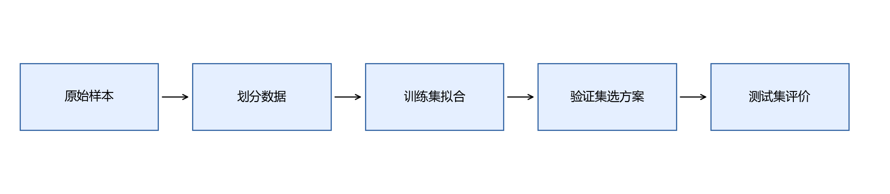
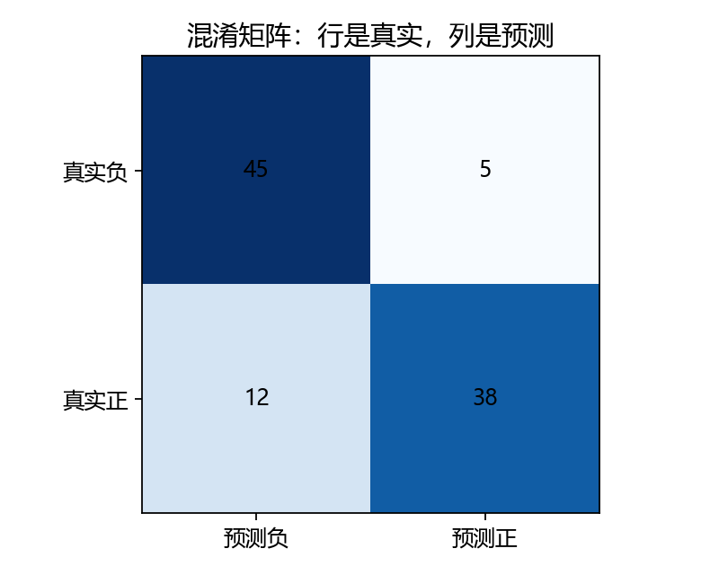
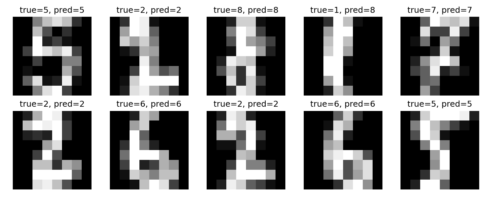

# 第8章 机器学习任务与模型评价

读完这一章，你应能把“训练一个模型”拆成数据、任务、训练和评价四件事，并交付一个能保存、重新加载的分类器。需要的基础：数组索引、均值、概率和函数；暂时不用推导神经网络。

开始运行前，先按[第10章的环境设置](10-PyTorch训练与模型管理.md#101-使用conda与vs-code建立独立环境)准备 `handmade-ml` 并选择对应解释器；这里只需完成安装，不必提前学习第10章其余内容。

数学较久不用时，先做[第三部分入口自测](../附录/02-学习路线与前置自测.md#4-第三部分入口先检查局部计算)。本章先建立任务与评价，反向传播留到第9章；不必先背完整网络公式。

## 本章内容

本章使用digits数据集建立手写数字分类任务。输入是一张8×8灰度图，输出是0～9中的一个数字。先确定数据划分和评价方法，再训练基线模型并检查预测结果。


本部分后续还包含文本分类和序列生成实验。三个实验分别使用数字图片、教学反馈句子和随机数字序列；最后提供统一命令行入口，模型之间没有联合训练。

## 8.1 机器学习解决什么问题

传统程序由人写判断规则。例如根据某个区域是否有闭合笔画来猜3或8，但换一种笔迹，这条规则就可能失效。机器学习则提供带答案的例子，让程序选择参数，使预测更接近答案。模型结构、输入格式和评价方式仍由人确定。

“学会”在这里指参数根据训练数据发生了变化。识别训练集之外的样本是否可靠，要另行评价。模型输出一个数字不等于理解了数字的含义。

### 从一条手写规则开始

一种直接做法是按像素亮度写条件：“上半部分比较亮，就猜3”。问题是，同一个数字可以写得高一点、矮一点，也可能向左偏；数字8的上半部分也可能很亮。规则必须不断补例外，仍然很难覆盖不同人的笔迹。

于是我们改变工作方式：给程序许多图片及正确编号，选择一个能把图片变成分数的函数，再调整函数里的参数。以后遇到一张新图片，仍然按同一个函数计算。训练没有把所有图片变成永久记忆，也不会自动保证新笔迹可识别。

这也解释了为什么“能运行”和“能学习”不同。一个始终返回3的函数能运行；一个会根据训练数据更新参数的函数在学习；一个在独立测试样本上仍读对的函数，才提供了一些泛化证据。后面每次改模型，都要区分这三个层次。

## 8.2 样本、特征、标签与参数

一个样本是一条观察记录；特征是模型读取的数值；标签是希望预测的答案；参数是训练过程调整的数值。

以手写数字为例，一张图是一个样本，64个像素是特征，数字0～9是标签，分类器的权重是参数。把所有样本排成数组：

```math
X\in\mathbb R^{n\times d},\quad y\in\{0,\ldots,9\}^n.
```

这里 $`n`$ 是样本数，$`d=64`$ 是每条样本的特征数。`X[0]` 是一张图展开后的像素，`y[0]` 是它的答案；`X[:, 0]` 是所有图的第一个像素。

```python
from sklearn.datasets import load_digits
digits = load_digits()
print(digits.data.shape)    # (1797, 64)
print(digits.images.shape)  # (1797, 8, 8)
print(digits.target[0])     # 0
```

这是 scikit-learn 内置的8×8灰度图，像素范围0～16，**不是28×28的MNIST**。[数据说明](https://scikit-learn.org/stable/modules/generated/sklearn.datasets.load_digits.html)

### 跟踪一张图片进入数组

把8×8图片按行展开：第一行的8个像素排在前面，第二行接在后面，直到得到64个数。展开没有删除像素值，只是暂时改变了形状。`digits.images[0].reshape(-1)`应当与`digits.data[0]`相同。

```python
import numpy as np
assert np.array_equal(digits.images[0].reshape(-1), digits.data[0])
print(digits.data[0, :8])  # 第一行的8个像素
print(digits.target[0])   # 与这张图片对应的编号
```

标签不能因为打乱图片而留在原地。若先对图片单独洗牌，再把原标签交给模型，模型读到的就可能是“3的图片，8的答案”。随机打乱应该作用于同一组样本索引，再用这些索引同时取图片和标签。

参数与超参数也要区分：权重是训练调整的参数；本章的`C`、后面的学习率和隐藏单元数，是由我们配置的超参数。验证集主要帮助选这些配置。

## 8.3 回归、分类与无监督学习

| 任务 | 答案形式 | 例子 | 常见评价 |
|---|---|---|---|
| 回归 | 连续数值 | 根据面积预测价格 | MAE、MSE |
| 分类 | 离散类别 | 手写数字识别 | 准确率、F1 |
| 聚类 | 不提供类别标签 | 把相似文档分组 | 结合业务检查，必要时轮廓系数 |

聚类得到的“第0组”不自动代表某种语义。学习方法与任务也要区分：神经网络可以做回归、分类或生成；“深度学习”不是一种标签形式。

### 不同任务的输入与输出

编号识别是分类，因为答案来自0～9这十个类别。若预测一张图片需要多少分钟复习，答案可以是12.5分钟，就成了回归。若没有老师给类别，只想把笔迹相似的图片放到一起，可以考虑聚类。

任务改变时，数据和评价也要改变。编号错一位就是类别错误；复习时间预测成13分钟、实际12分钟，则通常按误差大小评价。不能把分类的90%准确率与回归的平均误差1分钟比较谁更优秀。

本部分先走监督学习：训练时有标签。聚类只作任务地图，暂时不要求写实现，避免在尚未走通训练流程前同时学习太多路线。

## 8.4 训练集、验证集与测试集



训练集用来拟合参数，验证集用来选配置，测试集用来评价已经选定的方案。本部分统一按约60%/20%/20%分层划分。分层是让各集合尽量维持原来的类别比例。

```python
import numpy as np
from sklearn.model_selection import train_test_split
indices = np.arange(len(digits.target))
development, test = train_test_split(
    indices, test_size=0.2, stratify=digits.target, random_state=42)
train, valid = train_test_split(
    development, test_size=0.25,
    stratify=digits.target[development], random_state=42)
assert not set(train) & set(test)
```

第二次的25%来自剩下的80%，所以验证集约占总体20%。随机种子让本次划分可重复，但不会让模型必然更好。时间序列、同一患者的多条记录不能直接套随机划分，应按时间或主体分组，防止相关记录跨集合。

### 三份数据分别扮演什么角色

可以把训练集看成练习册，验证集看成用于调整学习方法的小测，测试集看成方案已经定好后的考试。反复看测试成绩来改模型，相当于提前看考试反馈并练习同一套题，最后的分数不再回答“面对未见数据怎样”。

1797条数据在这套划分中得到1077条训练、360条验证、360条测试。我们保存的是索引，后面逻辑回归、MLP与CNN沿用相同索引逻辑，减少比较时的数据差异。

这里有一个现实限制：digits没有提供本章可用的完整书写者分组。随机分层评价的是这个数据集合中的留出样本，不能自动解释成“从未见过的新书写者”。实际收集自习室数据时，最好记录书写者，再按人分组验证。

## 8.5 预处理与数据泄漏

标准化先给公式：

```math
x'_{ij}=\frac{x_{ij}-\mu_j}{s_j},\quad
\mu_j=\frac1{n_{train}}\sum_{i\in train}x_{ij}.
```

每列特征有自己的均值和标准差。均值、标准差必须在训练集上估计，再用于验证与测试。如果提前对全部数据拟合标准化，模型间接获得了测试数据的信息，这叫数据泄漏。

```python
from sklearn.pipeline import make_pipeline
from sklearn.preprocessing import StandardScaler
from sklearn.linear_model import LogisticRegression
model = make_pipeline(StandardScaler(), LogisticRegression(max_iter=1000))
model.fit(digits.data[train], digits.target[train])
prediction = model.predict(digits.data[valid])
```

`Pipeline`把预处理和模型绑定，也让交叉验证在每个训练折内拟合预处理。缺失值填补、词表、特征选择同样遵守这个边界。[常见错误](https://scikit-learn.org/stable/common_pitfalls.html)

### 一个具体的泄漏例子

假设训练像素值是0和10，训练均值为5；测试样本是20。正确做法用训练均值5处理所有集合。如果把20提前算进均值，均值变成10，训练样本的表示就已经受测试数据影响。虽然没有看测试标签，评价边界仍然被改变了。

标准化还需要保存训练标准差。推理时来一张新图片，不应为了这张图片重新算“训练统计量”，否则模型接收到的坐标系变了。Pipeline把统计量和分类器保存在一起，正是为了解决这个问题。

第10章和第11章改用固定除以16。16来自数据格式已知的像素上限，不是从测试集估计出来的数，所以不会产生同样的统计拟合泄漏。这是两个不同的预处理约定，需要分别记住。

## 8.6 先建立一个基线

基线是便于比较的简单方案。第一种基线总猜训练集中最多的类别；第二种是上面的逻辑回归。它名字里有“回归”，本章用它做分类，第9章会解释。

```python
from sklearn.dummy import DummyClassifier
baseline = DummyClassifier(strategy="most_frequent")
baseline.fit(digits.data[train], digits.target[train])
print(baseline.score(digits.data[valid], digits.target[valid]))
```

如果十个类别相对均衡，总猜一种类别通常只有约十分之一正确。新模型若连这个结果都达不到，应先检查输入和标签是否错位。

### 为什么先做简单模型

假如一个复杂CNN读对了80%的图片，而一个简单逻辑回归能读对96%，复杂结构没有在这次任务上带来收益。基线让我们知道“至少应该达到哪里”，也能发现数据、训练或实现上的错误。

多数类基线的用途更朴素：它告诉我们只利用类别比例能拿到多少成绩。它不读取笔画；如果新模型只高出一点点，就要问是否真的利用了图像信息。

先把两个基线的验证结果记下来，再进入神经网络。以后遇到模型变差，能回到这条简单流水线检查：数据是不是读对，划分是不是一致，标签是不是错位。

## 8.7 准确率、混淆矩阵、精确率与召回率

先规定二分类的正类，本节暂时选“这是不是数字8的图片”。TP是真正例，FP是假正例，FN是假负例，TN是真负例：

```math
\begin{aligned}
Accuracy&=\frac{TP+TN}{TP+TN+FP+FN},\\
Precision&=\frac{TP}{TP+FP},\\
Recall&=\frac{TP}{TP+FN}.
\end{aligned}
```



图中TP=38、FP=5、FN=12、TN=45。准确率83%，精确率 $`38/43\approx88.4\%`$，召回率 $`38/50=76\%`$。精确率问“判为正的里面有多少真是正”；召回率问“实际为正的里面找到多少”。

多分类混淆矩阵也按**行是真实类别，列是预测类别**读。对角线上是正确结果，其他格子能告诉我们哪两个数字经常混淆。

### 把正类改成“这是不是数字8的图片”

数字分类也可以构造二分类评价任务。暂时把真实数字8视作正类，其他数字视作负类：把真实8读成8是TP；把真实3误读成8是FP；把真实8读成3是FN。图中45、5、12、38是手算用的100个样本的示例，不是本机模型的实际混淆矩阵。

83%准确率说明100张里读对83张；88.4%精确率说明程序声称“是8”的43张中，38张真是8；76%召回率说明50张真实8里面找到了38张。三个分母不同，对应三个不同问题。

漏检与误检对应不同类型的错误。评价时需要分别统计，并结合任务要求判断可接受程度，不能仅用总准确率代替错误分析。

## 8.8 F1、阈值与类别不平衡

```math
F1=\frac{2PR}{P+R}.
```

这是精确率和召回率的调和平均；两者一高一低时，不会简单被高值掩盖。分母为零需要约定，本部分代码使用`zero_division=0`。多分类`macro_f1`先算每个类别的F1，再等权平均，类别较少的样本也得到同等关注。

假设1000张数字图片中只有10张编号8，全部猜“不是8”，准确率99%，但数字8的召回率0。这是假设的类别不平衡例子，真实digits十类相对均衡。评价时应同时报告类别数量和各类指标。

二分类模型可以输出概率，再按阈值决定类别。降低阈值通常会多抓一些正例，也多误报一些负例。阈值只能用验证集选择；不同任务的误报和漏报代价需要分别考虑。PR曲线展示阈值变化下的精确率和召回率。

### 阈值会改变同一模型的决定

设模型对四张图片输出“是8”的概率`[0.9, 0.6, 0.4, 0.2]`，真实二分类标签为`[1, 0, 1, 0]`。阈值0.5时，TP=1、FP=1、FN=1，精确率与召回率都是0.5。阈值降到0.3时，TP=2、FP=1、FN=0，精确率为2/3，召回率为1。

不是模型重新训练得更聪明了，而是我们对同一组概率采用了不同决策规则。阈值选择可以在验证集上做；选择后固定下来，再评价测试集。多分类通常直接取最大分数类别，不是给十个类别都套0.5阈值。

F1中的P和R在这一节分别表示精确率与召回率，不是某个样本的预测概率。看到符号时先确定它所在公式的含义，避免把不同层次的“概率”和“指标”混在一起。

## 8.9 欠拟合、过拟合与泛化

训练集和验证集都差，可能是模型过于简单、特征不合适或尚未训练充分；训练集很好、验证集较差，可能是过拟合，也可能是两者分布不同。泛化指在未参与训练的新数据上仍能表现良好。

改进前先看数据和错误样本。增加数据、减少模型复杂度、正则化都可能有帮助，但不能保证解决问题。后面会用训练与验证曲线辅助判断。

### 用两份成绩判断下一步

模型在训练图片上准确率很高，在新图片上却经常出错。这时继续让模型记住训练数据未必有用，应检查是否过拟合，或者新图片字体、背景与训练样本不同。

如果训练和验证都差，可以尝试检查训练步骤、增加合适特征或换模型。若训练很好验证差，可以尝试更合适的正则化、更多独立数据或较简单模型。两种情况的方向不同，所以不要看到“准确率低”就统一加层。

泛化不是一个模型结构名称，而是一种表现。我们每次画训练/验证曲线，就是为了观察同一个模型在已参与拟合和未参与拟合的数据上发生了什么。

## 8.10 交叉验证与实验记录

K折交叉验证把训练集再分成K份，轮流用其中一份评价，其余拟合。这里使用3折，仅在训练集合内部操作；外面的验证集仍用于最终方案选择，测试集保持独立。[交叉验证说明](https://scikit-learn.org/stable/modules/cross_validation.html)

每次实验至少记录数据版本、划分、预处理、配置、验证指标和运行环境。本章参考脚本只比较`C=0.1`与`C=1`，不是穷举调参。`C`控制正则化强度的倒数，第9章再解释其作用。

### 交叉验证不是把测试集反复用掉

3折训练内部验证中，同一个训练样本会在某一折充当内部评价样本，在其他折参与拟合；外面的360条测试样本仍然完全不参与。每折要重新拟合预处理，不能复用从全部1077条训练样本估计的标准化结果，否则内部验证也会泄漏。

本章脚本记录3折平均准确率供观察，最终在外部验证集比较两个`C`，保存胜出的模型；不会根据测试成绩重新选择。它是一套教学用的固定选择规则，不是最复杂的嵌套交叉验证。

一份实验记录最好能回答“哪个数据，哪个划分，哪个方案，哪个结果”。当CNN和逻辑回归相差一点点时，先查看这些条件是否一致，再讨论结构。

## 8.11 保存、加载与新样本预测

```python
import joblib
joblib.dump(model, "digits_pipeline.joblib")
restored = joblib.load("digits_pipeline.joblib")
print(restored.predict(digits.data[test[:3]]))
```

保存的是整条流水线，预测时不用重新拟合标准化。新输入仍须64维、同样的像素范围与排列。只加载自己生成或可信来源的模型文件；序列化文件会涉及Python对象加载。

### 推理时需要保存的参数与统计量

只有类别权重不够，训练时计算的均值、标准差也必须保存。保存整条Pipeline后，加载对象会按同一顺序处理新样本，再输出类别。

预测接口接受的是二维批量：一张图也要整理成`(1,64)`，不能把`(64,)`当作批量传进去。8×8图片可以`reshape(1,64)`；像素顺序与训练时一致是前提。

这一步把“实验结果”变成了可调用的模块。后面还会遇到类似要求：文本模型需要词表，Transformer需要特殊符号与结构配置。一个模型文件能否独立使用，取决于它有没有保存这些约定。

## 8.12 章末产出：分类器与评价报告

在工作区根目录运行：

```powershell
python script/part03/08_sklearn_task.py
```

参考实现保存模型、固定划分、预测图片和JSON报告到`outputs/part03/`。报告中包括基线、交叉验证、验证结果和最终测试结果。测试集结果只用于报告，不能据此反复选`C`。



标题中`true`是真实标签，`pred`是预测。图片展示前10条测试样本，完整评价以报告为准。

验收：能解释每个集合的用途；模型优于多数类基线；加载前后预测一致；能从混淆矩阵指出一种常见错误，并说明准确率不能回答哪些问题。

**随堂检查：**先对全部数据标准化再划分，有没有标签泄漏才算安全？答案：不安全；即使没读标签，也使用了未来评价数据的分布。只在训练集拟合统计量。

### 保存可复核的实验结果

这一章交付的是编号识别第一版，而不是“机器学习全部学完”。把报告里的多数类基线、两个配置的验证成绩、选中配置和测试成绩分别找出来；它们回答不同问题。

再挑一条错误记录，检查原图、真实标签和预测标签。不要先猜“模型没学会”，先观察图片是否模糊、两个数字的笔画是否接近，以及预处理是否按约定执行。

现在可以继续问一个新问题：分类器内部为什么会选择这些权重？第9章把库函数拆成数值运算，让我们从一张数字3的图片的概率开始，追踪一次参数更新。
### 补充练习与验收

先独立完成[本章两道练习](../assets/practice/part03.md#第08章)，再核对参考答案和本章验收证据。记录自己的输入、结果与边界案例，不要求复制作者的实验数值。

[返回目录](README.md) · [下一章](09-模型如何学习与神经网络.md)
