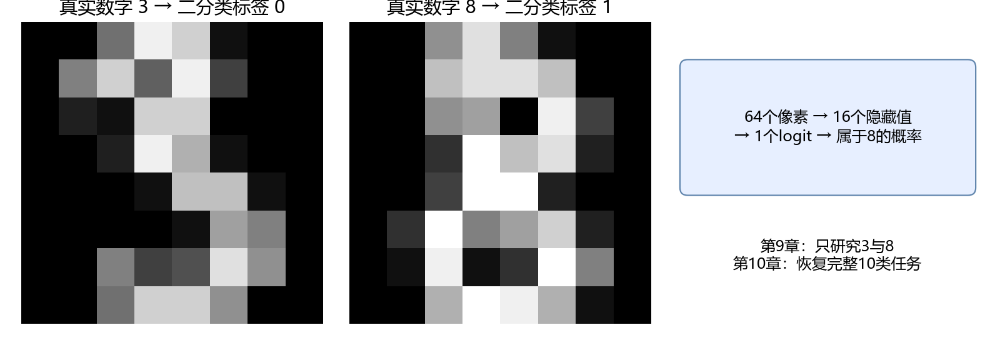
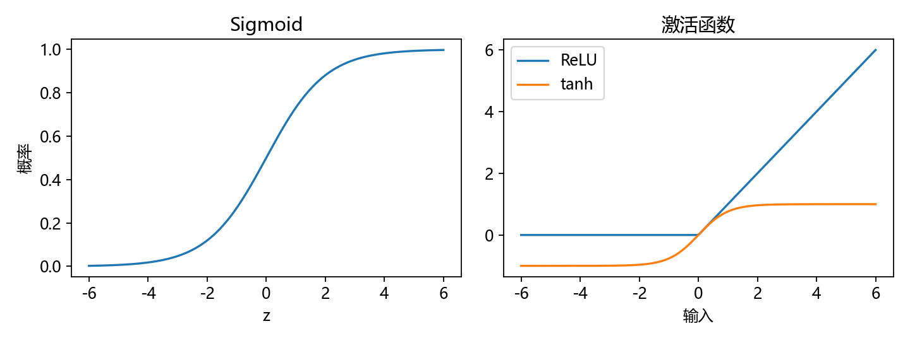
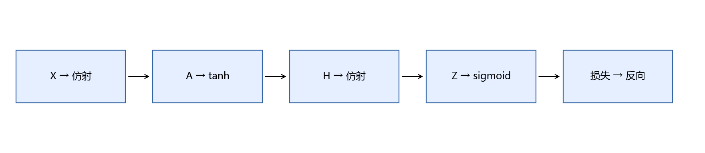
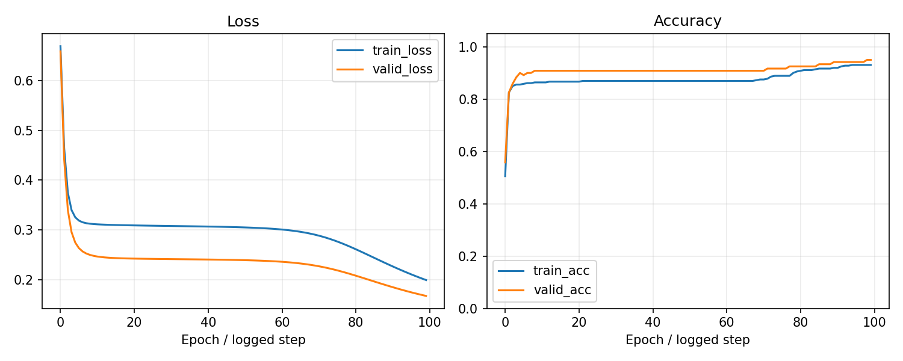
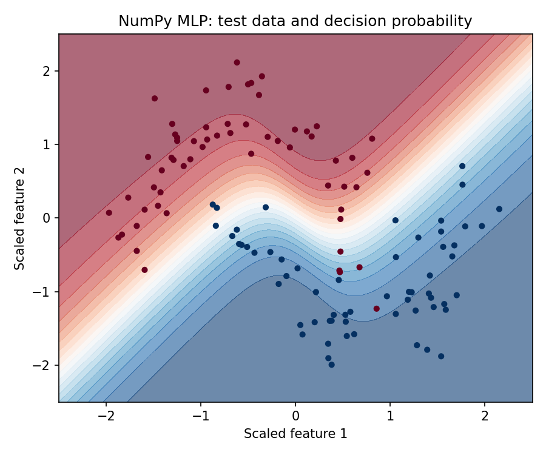
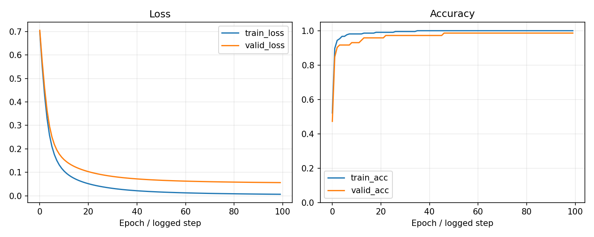

# 第9章 模型如何学习与神经网络

目标：把“模型训练”理解为计算预测、衡量错误、求导并更新参数；最终手写一个识别3与8的NumPy二分类网络。需要第4章导数与链式法则、第5章矩阵乘法、第6章对数与似然。首次阅读可先完成9.1～9.11，再回来看优化器。

## 本章内容

本章从digits中选取数字3和8，约定3对应标签0，8对应标签1。输入为64个像素，使用NumPy实现64→16→1网络，逐步计算预测、损失、梯度和参数更新。



另设双月数据实验，用于观察二维决策边界。双月坐标不是数字图片提取出的特征，两个实验分别报告结果。局部公式先给定义和数值例子，反向传播沿计算顺序推导。

## 9.1 从线性模型开始

```math
\hat y_i=x_i^Tw+b.
```

特征向量$`x_i`$有$`d`$个数，权重$`w`$也有$`d`$个，偏置$`b`$是标量。先假设只读取两个位置的灰度值，用两个特征手算一个分数。取$`x=(2,3),w=(0.5,-1),b=4`$，输出为$`2`$；这个分数不是已经识别出的数字2，后面还需要定义分类概率。

批量写法：$`X(n,d)@w(d,1)+b`$得到$`(n,1)`$。不要把`y(n,)`直接减去预测`(n,1)`，NumPy广播会产生$`(n,n)`$；先统一形状。

### 先让一个输入对预测产生可见影响

在线性模型里，某个像素的权重为正，增加它通常会提高logit；权重为负则降低logit。这只是固定其他输入时的局部模型关系，不等于这个像素在现实中“导致”数字8。

为了手算，我们先只放两个人为选出的特征。上文$`x=(2,3)`$的数字只是数值练习，不是实际digits像素；实际主线读取64个像素，不把图像压成这两个数。

批量计算的每一行对应一张图片。如果$`X`$为$`(5,64)`$、$`w`$为$`(64,1)`$，输出是5个分数，不是64个。用形状检查先明确“谁对应样本，谁对应特征”，再读矩阵公式，会少很多困惑。

## 9.2 均方误差：先定义，再解释

```math
L(w,b)=\frac1n\sum_{i=1}^n(\hat y_i-y_i)^2.
```

若预测$`(2,4)`$、真实$`(1,6)`$，平方误差是$`(1,4)`$，平均损失2.5。平方防止正负误差抵消，并使较大的错误受更大惩罚。损失是训练的目标，评价还可以报告MAE；两者不必完全一致。

### 回归损失与分类损失的区别

我们先用MSE练习推导，是因为平方函数的导数简单，容易看清误差怎样进入梯度。编号3和8是类别，不应该把它们直接当成连续数值，用“预测7比预测2更接近8”来定义类别好坏。正式二分类稍后使用交叉熵。

这里先沿一条连续预测走：若真实值为1、预测为2，误差+1；真实值为6、预测为4，误差-2。平方让两个方向都付出代价。平均而非总和，使相同误差水平下，损失不单纯因为样本数增加而变大。

有的教材使用$`L=\frac{1}{2n}\sum e_i^2`$，目的是在求导时抵消2。它与本章没有1/2的约定差一个常数，梯度也差一个常数；比较公式时先核对定义，不要把它当成谁推导错了。

## 9.3 从一个样本推到批量梯度

先看一个样本。令$`e=wx+b-y`$，则$`L=e^2`$。链式法则给出：

```math
\frac{\partial L}{\partial w}=2e\,x,\qquad
\frac{\partial L}{\partial b}=2e.
```

再对$`n`$个样本求平均：

```math
\nabla_w L=\frac2nX^T(Xw+b-y),\quad
\frac{\partial L}{\partial b}=\frac2n\sum_i(\hat y_i-y_i).
```

括号内是$`(n,1)`$，左乘$`X^T(d,n)`$得到$`(d,1)`$，与$`w`$一致。梯度告诉我们在当前位置，微小改变每个参数会怎样改变损失。

### 真正算一次链式法则

取$`x=2,y=1,w=0,b=0`$。前向得到$`\hat y=0,e=-1,L=1`$；局部导数$`\partial L/\partial e=2e=-2`$，$`\partial e/\partial w=x=2`$，相乘得到$`\partial L/\partial w=-4`$。偏置的局部导数为1，因此偏置梯度为-2。

梯度为负，意味着在当前位置增加权重会降低损失。这个判断只在局部成立；增加过多可能越过最低点。还要注意：计算这一批所有参数的梯度时，使用同一组旧参数，不能先更新$`w`$再用新$`w`$计算$`b`$的梯度。

从单样本到批量没有新魔法：每条样本提供一个梯度贡献，对它们取平均；矩阵乘法把这些乘法与求和放在一起。$`X^T`$这一转置正是在把同一特征对所有样本的贡献汇总回来。

## 9.4 梯度下降、学习率与收敛

```math
\theta_{t+1}=\theta_t-\eta\nabla_\theta L(\theta_t).
```

$`\theta`$代表全部参数，$`\eta`$是学习率。以$`L(w)=(w-3)^2`$为例，$`w=0`$时梯度$`-6`$，取$`\eta=0.1`$，更新后$`w=0.6`$，向最小值3靠近。学习率太大可能跳过最低点并发散；太小会很慢。

训练循环不只是重复公式，还要检查损失是否有限、验证集是否改善，以及是否达到预算。梯度为零不必然意味着全局最优。

### 更新之后重新算损失

沿用上一节，学习率0.1，权重从0变成0.4，偏置从0变成0.2。新的预测是$`2\times0.4+0.2=1`$，这条样本的平方损失变成0。一次恰好达到答案是这个手算例子的巧合，多个样本通常不能同时被一步满足。

如果把学习率改成1，得到$`w=4,b=2`$，预测10，损失81，比开始更差。梯度方向正确，也不能保证任意步长都能下降。

```python
def mse_one(w, b):
    return (2 * w + b - 1) ** 2
print(mse_one(0, 0), mse_one(0.4, 0.2), mse_one(4, 2))
# 1, 0.0, 81
```

在实际训练中，不要只看一次更新。观察多步曲线、有限数值与验证损失，才知道当前设置是否工作。

## 9.5 为什么特征缩放有帮助

一个特征范围0～1，另一个范围0～10000时，统一学习率可能对两者不合适。标准化把每列尺度拉近，使优化更容易；并不保证每个模型都需要它。树模型对单调缩放通常不敏感。

本章标准化统计量只从训练集计算；验证集与测试集共享训练统计量。常量特征的标准差应按约定处理为1，避免除零。

### 训练统计量怎样进入手写实现

主线的每个像素作为一列，使用训练集均值与标准差。某个位置如果总是背景，标准差为0；`StandardScaler`会把相应尺度处理为1，避免除零。我们保存64个均值和64个尺度，与网络参数一起用于新图。

新数字图片需要先使用训练时保存的统计量变换，再输入网络。如果仅加载网络权重，却对新图另算一套标准化，输入的含义就改变了。

二维双月边界图画的是标准化后的坐标，不能把图中的横纵轴解释成64个像素中的两个真实属性。这张图只帮助观察非线性边界；正式图像结果见同一报告的`digits_binary`字段。

## 9.6 逻辑回归、Sigmoid与决策边界

```math
z=x^Tw+b,\qquad p=\sigma(z)=\frac1{1+e^{-z}}.
```



$`z=0`$时$`p=0.5`$；$`z=2`$时$`p\approx0.881`$。这将任意实数映射到0～1，作为正类概率的模型输出。默认阈值0.5时，边界满足$`x^Tw+b=0`$，二维中是一条直线。

这个“概率”是否校准，需要另行验证；高分并不自动表示可信。逻辑回归的线性边界难以分开弯月形数据，下一步需要非线性网络。

### “是8的概率”与“读出的编号”

我们约定标签1代表8，标签0代表3。因此$`p=0.8`$表示模型把80%的概率质量分给8；按阈值0.5输出标签1，再映射回数字8。标签0不是图片里的数字0，这层映射必须记在报告中。

Sigmoid导数是$`\sigma'(z)=\sigma(z)(1-\sigma(z))`$。可以先从$`\sigma(z)=(1+e^{-z})^{-1}`$求导，再整理成$`p(1-p)`$。$`z=0`$时导数最大，为0.25；远离0时函数更平，梯度可能较小。

概率输出比硬标签多提供了一个数值，但当前模型只见过3和8。如果拿来一张数字7的图片，它仍会在3和8之间选一个，不会自动说“不在训练类别里”。

## 9.7 从最大似然到二分类交叉熵

先给训练目标：

```math
L=-\frac1n\sum_i[y_i\log p_i+(1-y_i)\log(1-p_i)].
```

只看一条记录。$`y=1`$时损失$`-\log p`$：$`p=0.9`$损失约0.105，$`p=0.1`$约2.303。真实为正却十分自信地猜负，会受到更大惩罚。

推导：伯努利概率写成$`p^y(1-p)^{1-y}`$；假设样本在模型条件下独立，联合似然是这些概率的乘积；取对数把乘积变成求和；取负号将最大化变成最小化，最后取平均。

把它与Sigmoid组合求导，得$`\partial L/\partial z_i=(p_i-y_i)/n`$。数值实现可直接从logit算`logaddexp(0,z)-y*z`，避免先算极小概率再取对数。

### 交叉熵为什么得到这么简单的梯度

先只看一条样本，去掉平均系数。对概率求导：

```math
\frac{\partial \ell}{\partial p}
=-\frac{y}{p}+\frac{1-y}{1-p}
=\frac{p-y}{p(1-p)}.
```

再乘Sigmoid的局部导数$`p(1-p)`$，得到$`\partial\ell/\partial z=p-y`$；对批量取平均，才多出$`1/n`$。这里不是“记一个简写”，而是两个局部导数的因子抵消。

假如真实是8，$`y=1`$，模型$`p=0.2`$，logit梯度为-0.8，更新会倾向提高对应logit。如果真实是3，$`y=0`$而$`p=0.8`$，梯度为+0.8，更新倾向降低logit。同样大小的梯度体现了两种相反错误。

数值实现直接用logit，是为了避免在$`p`$接近0或1时计算不稳定的对数。数学推导可以写概率形式，代码不必机械照抄每个中间数。

## 9.8 Softmax与多分类交叉熵

```math
p_{ic}=\frac{e^{z_{ic}-m_i}}{\sum_k e^{z_{ik}-m_i}},\quad
m_i=\max_k z_{ik},\qquad L=-\frac1n\sum_i\log p_{i,y_i}.
```

减去每行最大值不改变概率，因为分子、分母同乘$`e^{-m_i}`$；它能避免指数溢出。三个logit都是0时，三个类别概率都是$`1/3`$，真实类别损失$`\log3`$。

类别互斥时用Softmax；一篇文章可以同时属于多个主题时，常按标签分别使用Sigmoid，这是多标签任务。PyTorch的`CrossEntropyLoss`接收原始logit和类别编号，不要提前Softmax。

### 从3/8恢复到十个编号时，目标怎样改变

二分类只需一个logit，Sigmoid给出正类概率。十个互斥编号通常输出十个logit，再Softmax成一行概率。真实标签是编号$`y_i`$，交叉熵从这行取出真实类别的概率并取负对数，不需要手工给十个类别都写一条损失。

用one-hot目标$`t_{ic}`$表达时，logit梯度为$`\partial L/\partial z_{ic}=(p_{ic}-t_{ic})/n`$。真实类别若分到很少概率，更新倾向提高它；错误类别分到太多概率，更新倾向压低它。

```python
import numpy as np
scores = np.array([[0., 1., 2.]])
stable = scores - scores.max(axis=1, keepdims=True)
probabilities = np.exp(stable) / np.exp(stable).sum(axis=1, keepdims=True)
assert np.allclose(probabilities.sum(axis=1), 1)
print(probabilities, -np.log(probabilities[0, 2]))
```

这个例子只用3个类别方便手算；第10章的实际输出有10类。概率和为1来自模型定义，不是它已经证明“这一定是一张有效数字图片”。

## 9.9 神经元、激活与多层感知机

一个神经元先做加权和，再经过激活函数。若连续两层都只有线性计算，$`(XW_1+b_1)W_2+b_2`$仍能合成一层，所以中间需要非线性。

本章网络：

```math
\begin{aligned}
A&=XW_1+b_1,\\
H&=\tanh A,\\
Z&=HW_2+b_2,\\
P&=\sigma Z.
\end{aligned}
```

主线输入$`(n,64)`$、隐藏权重$`(64,16)`$、隐藏值$`(n,16)`$、输出权重$`(16,1)`$。隐藏单元学到的是输入的组合变换，不必人为解释成某个语义。ReLU常用于后续网络；本章用tanh便于展示连续导数。

### 主线网络与二维练习共享什么

主线使用$`X:(n,64),W_1:(64,16),W_2:(16,1)`$，输入是3/8图像。二维练习使用$`X:(n,2),W_1:(2,16)`$；其余计算和梯度逻辑相同。改变输入特征数，并不要求重新发明反向传播。

网络先把64个像素组合成16个数，再通过tanh得到非线性表示，然后组合成一个logit。16并不表示图像中有16种真实笔画；它只是我们给模型设置的表示容量。

参数量可手算：主线有$`64\times16+16+16\times1+1=1057`$个参数。参数比样本数多，不等于一定失败，也不保证一定成功，需要看训练与验证表现。

## 9.10 计算图与逐层反向传播



先从损失回到最后的logit，令$`D_Z=(P-y)/n`$。接着沿每个局部运算退回：

```math
\begin{aligned}
D_{W_2}&=H^TD_Z,\\
D_{b_2}&=\sum_i D_{Z,i},\\
D_H&=D_ZW_2^T.
\end{aligned}
```

因$`tanh'(a)=1-tanh^2(a)`$，得到

```math
\begin{aligned}
D_A&=D_H\odot(1-H^2),\\
D_{W_1}&=X^TD_A,\\
D_{b_1}&=\sum_i D_{A,i}.
\end{aligned}
```

$`\odot`$是逐元素乘法。主线先检查维度：$`D_H(n,16)`$与$`H(n,16)`$逐元素运算；$`X^T(64,n)D_A(n,16)`$得到$`(64,16)`$。偏置通过广播加给每条样本，因此反向需要沿样本轴求和，保留$`(1,16)`$或与原偏置一致的形状。二维辅助网络把64换成2，其余步骤相同。

这组公式是在组合链式法则之后得到的，不需要一次背完。沿“当前节点的梯度×当前操作的局部导数”逐步走，遇到分支则把各条路径贡献相加。

### 数字8样本的反向计算

先保存前向的$`H`$和$`P`$，因为反向会用到它们。假如一张标签为8的图片得到$`p=0.2`$，它对$`D_Z`$的贡献为$`-0.8/n`$。把这一误差信号乘隐藏值，得到输出权重的梯度；再乘输出权重，误差信号才回到隐藏层。

此时还没到第一层权重，中间隔着tanh，所以要逐元素乘$`1-H^2`$。最后左乘$`X^T`$，把各像素对隐藏单元的影响汇总起来。每一步只完成一个局部操作，整组公式才显得不突兀。

若某个隐藏值已经接近1或-1，$`1-H^2`$接近0，这条局部路径的梯度较小。导数不仅给出方向，也决定不同路径传回的幅度。

偏置梯度沿样本轴求和，原因是同一个偏置被每条样本共享使用。用代码看形状时，别忘了本章`forward`把最终logit临时压成`(n,)`；反向再通过`[:,None]`恢复`(n,1)`以进行矩阵乘法。

## 9.11 用有限差分检查梯度

```math
g_{numeric,j}=\frac{L(\theta+\epsilon e_j)-L(\theta-\epsilon e_j)}{2\epsilon}.
```

$`e_j`$只改变第$`j`$个参数。取$`\epsilon=10^{-5}`$，比较手写导数与数值近似；不是用它替代训练，而是检查实现。太大的$`\epsilon`$近似较粗，太小会受浮点误差影响。

参考脚本对小批量的全部网络参数检查，报告最大绝对误差，并要求小于$`10^{-6}`$。使用float64、平滑tanh和较小的初始化；含ReLU时应避开不可导的0点。只看损失下降不能证明梯度正确。

### 数值检查在检查什么

先固定小批量、固定参数；选择一个权重，加一个很小的$`\epsilon`$算损失，减一个$`\epsilon`$再算损失。二者差除以$`2\epsilon`$，就是这个方向的局部斜率近似。随后把参数恢复原值，不能让检查过程悄悄改了模型。

有限差分不会告诉你“选的任务是否正确”。如果标签全错，手写梯度与数值梯度仍可能完全一致，因为它们都在求同一个错误目标的导数。梯度检查验证计算实现，数据检查验证任务定义，两者不可互相替代。

本章检查二维网络的小批量，便于把全部参数逐一检查。主线3/8网络复用同一组实现；第10章再对同结构数值例子与PyTorch自动求导交叉核对。这里每项检查都有明确边界。

## 9.12 小批量、SGD与Momentum

完整训练集算梯度叫全批量；随机一条或一小批数据估计梯度常称SGD或小批量SGD。一轮epoch是通常意义上遍历一次训练集；一个step是更新一次参数。

Momentum的一种约定是$`v_t=\beta v_{t-1}+g_t`$，$`\theta_{t+1}=\theta_t-\eta v_t`$。历史梯度积累形成惯性，可能减少来回摆动。不同实现对$`v`$是否乘$`(1-\beta)`$有不同约定，读公式时要核对。

### 一轮与一步会影响你怎样读曲线

1077张训练图片，批量64，一轮需要17步，最后一批不足64张；更新25轮约425步。第9章NumPy实验用全批量，一次更新读取整个训练集，所以“1000步”不是第10章的“1000轮”。

Momentum可以想成把最近几次方向相似的梯度累积起来。如果某方向反复正负摆动，历史贡献可能部分抵消；持续指向同一方向则积累。这个直觉不意味着它永远比普通梯度下降好。

本章NumPy参考实现故意使用普通全批量梯度下降，让推导与更新逐项对应。下一章用小批量AdamW，届时要分清哪些变化来自框架，哪些来自优化器和数据读取方式。

## 9.13 Adam、权重衰减与正则化

Adam先累积一阶、二阶统计：$`m_t=\beta_1m_{t-1}+(1-\beta_1)g_t`$，$`v_t=\beta_2v_{t-1}+(1-\beta_2)g_t^2`$；再做偏差修正$`\hat m_t=m_t/(1-\beta_1^t)`$、$`\hat v_t=v_t/(1-\beta_2^t)`$，更新

```math
\theta_{t+1}=\theta_t-\eta\frac{\hat m_t}{\sqrt{\hat v_t}+\epsilon}.
```

这里所有平方、除法都逐元素进行。它按历史梯度尺度调整更新，仍然需要合适的学习率。

L2正则化把$`\lambda\|\theta\|^2/2`$加入损失；在普通SGD下可写出收缩项。AdamW把权重衰减与自适应梯度更新分离；不能把所有优化器里的L2与权重衰减直接视为相同。Dropout在训练时随机屏蔽部分激活，推理时关闭；早停按验证集选择模型，都是控制过拟合的工具。

### 正则化怎样改变目标或训练行为

L2项对权重的导数是$`\lambda w`$，于是普通SGD更新变成$`w_{new}=(1-\eta\lambda)w-\eta g`$。这展示了“收缩”从哪里来；Adam按历史梯度缩放后，直接把L2塞进梯度与独立权重衰减不再等价。

Dropout常使用反向保留率缩放：保留概率$`q`$时，训练激活变成$`m\odot h/q`$，使期望仍为$`h`$；评价时使用完整激活。不应在预测一张图片时仍随机丢掉它的部分隐藏值。

早停不需要给损失增加一个新项，而是按验证结果选训练时刻。本章固定步数并保存验证最佳参数；第10章会说明怎样把它扩展为等待若干轮未改善后停止。

## 9.14 选读：决策树提供另一条学习路线

树模型根据条件逐步划分样本，例如“某个像素是否大于阈值”。分类树常通过减少Gini不纯度$`1-\sum_c p_c^2`$或熵选择划分。它不通过本章的反向传播训练；过深的树同样可能过拟合。

理解这点就够：机器学习不等于神经网络，选择模型应比较任务适配程度和验证结果。暂不要求实现完整决策树。

### 为什么这里保留树模型这个分支

不同模型的学习算法并不相同。决策树的训练不依赖同样的梯度更新：它搜索按特征阈值划分样本的规则，再把划分组织成树。相同的训练/验证边界与评价指标仍能使用，但学习算法不同。

如果把一组图片划成只有单个样本的叶子，训练表现很容易变好，却可能无法处理新笔迹。限制深度、叶子样本数等配置，同样需要验证集选择。

选读这一节的目的，是避免把机器学习、神经网络和反向传播三个概念画等号。进入下一章不要求先写完整树实现。

## 9.15 章末产出：NumPy网络与边界图

```powershell
python script/part03/09_numpy_network.py
```

脚本运行两个实验：主线从digits选出3与8，按训练集标准化，训练64→16→1网络；辅助实验生成固定种子的双月形数据，训练2→16→1网络并与线性逻辑回归比较。两者分别按各自验证损失选择参数，保存权重、标准化统计量和曲线；二维边界与梯度检查来自辅助实验。




曲线横轴是每20步记录一次的序号，边界图背景是正类概率，散点颜色是真实类别；它只用于训练完成后的展示。

验收：梯度误差满足阈值；主线与辅助模型加载后的结果相同；能从报告找到3/8分类结果并解释标签映射；能说明二维边界与图像任务的区别；能解释`X.T @ D_A`的形状。改隐藏层数量时只用验证结果选配置。

**检查：**对隐藏层梯度再次除以$`n`$对不对？答案：不对，本章$`D_Z`$已除以$`n`$，沿链式法则继续传递即可。

### 两份实验结果分别怎样读

报告的`digits_binary`记录数字分类实验：真实3/8图像，64→16→1网络，输出`09-digits-model.npz`与`09-digits-training.png`。顶层的`mlp_test`、`baseline_test`与二维边界图来自双月辅助实验，不能把它们说成编号识别成绩。



主线固定训练1000步，每10步记录一次；双月练习固定2000步，每20步记录一次。曲线横轴是记录序号，最佳模型根据验证损失选择。数值成绩以报告为准，不要求手写网络一定胜过每个库模型。

本章完成预测、损失、梯度和更新的手写实现及数值检查。下一章使用框架实现完整十类任务，并学习模型保存与训练恢复。
### 补充练习与验收

先独立完成[本章两道练习](../assets/practice/part03.md#第09章)，再核对参考答案和本章验收证据。记录自己的输入、结果与边界案例，不要求复制作者的实验数值。

[上一章](08-机器学习任务与模型评价.md) · [返回目录](README.md) · [下一章](10-PyTorch训练与模型管理.md)
