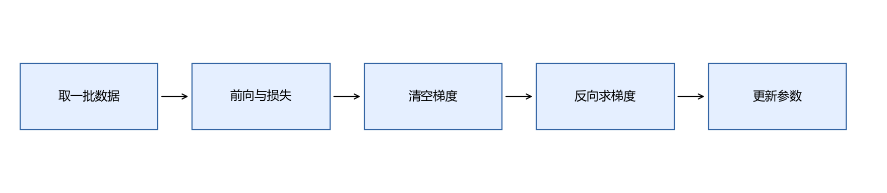
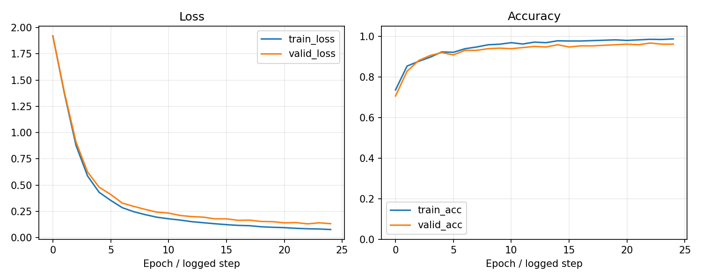

# 第10章 PyTorch训练与模型管理

目标：把上章手写梯度换成自动求导，建立可训练、可评价、可保存、可恢复的完整流程。自动求导负责计算梯度，数据划分与评价仍由你负责。

## 本章内容

本章恢复digits完整十类分类任务。输入为64个像素，模型输出10个类别分数。先用简单表达式检查自动求导，再与NumPy梯度对照，最后完成训练、验证、保存与恢复。

PyTorch负责计算梯度；任务定义、预处理、数据划分和模型选择仍由程序明确规定。训练循环依次完成取数据、前向计算、计算损失、求梯度和更新参数。

## 10.1 使用conda与VS Code建立独立环境

本部分固定一组教学版本，便于复现，不要求追随最新版。以下命令在PowerShell或Anaconda Prompt执行；若PowerShell尚未初始化conda，可先在Anaconda Prompt运行。

```powershell
conda create -n handmade-ml python=3.12 pip -y --override-channels -c https://mirrors.tuna.tsinghua.edu.cn/anaconda/pkgs/main
conda activate handmade-ml
python -m pip install numpy==1.26.4 matplotlib==3.8.4 scikit-learn==1.5.2 pillow joblib -i https://pypi.tuna.tsinghua.edu.cn/simple
python -m pip install torch==2.5.1 torchvision==0.20.1 --index-url https://download.pytorch.org/whl/cpu
python -c "import torch; print(torch.__version__); print(torch.cuda.is_available())"
```

CPU版本打印`False`是预期结果。本部分基础实验全部可在CPU完成。通用Python包使用清华PyPI镜像；conda创建使用清华Anaconda镜像；PyTorch使用官方CPU索引，二者不要混为一谈。镜像不可用时，普通库去掉`-i`改用默认PyPI，conda渠道换为官方`defaults`；版本仍保持一致。[清华PyPI说明](https://mirrors.tuna.tsinghua.edu.cn/help/pypi/) · [官方版本组合](https://pytorch.org/get-started/previous-versions/)

VS Code按`Ctrl+Shift+P`，选择`Python: Select Interpreter`，选`handmade-ml`。新建终端后检查`python -c "import sys; print(sys.executable)"`，确认确实是该环境，而不是base。GPU安装涉及驱动与CUDA组合，后面部署和算子部分再展开；需要自行启用GPU时按[官方安装页](https://pytorch.org/get-started/locally/)选择对应组合。

### 先确认终端与编辑器说的是同一个Python

很多“明明安装了却无法import”的问题，来自库装进一个环境，VS Code运行另一个。终端里`python -m pip`的Python，与右下角选择的解释器，应当指向同一个`handmade-ml`。

先运行一次版本打印，再训练图片。CPU实验得到`cuda.is_available() == False`不需要修复；没有显卡也能学习张量和自动求导。环境是为了让实验可运行，而不是先学习全部CUDA版本关系。

建议安装命令按顺序完成，一条结束后再执行下一条，避免并发安装同一个依赖造成文件与版本元数据混杂。库下载镜像改变的是来源，不能把互不匹配的torch与torchvision版本硬拼在一起。

## 10.2 Tensor的形状、类型与设备

Tensor是可参与自动求导的多维数组。分类输入通常是float32，类别编号通常是int64（`torch.long`），模型与输入应在同一设备。

```python
import torch
x = torch.tensor([[1., 2.], [3., 4.]], dtype=torch.float32)
y = torch.tensor([0, 1], dtype=torch.long)
print(x.shape, x.dtype, x.device)
print(x @ torch.ones(2, 1))  # (2, 1)
```

`reshape`改变观察形状，不能替代维度交换；交换图像通道轴应使用`permute`。`.numpy()`要求CPU张量且不参与梯度，常用`tensor.detach().cpu().numpy()`。

### 把一个批次的三个约定写清楚

MLP输入`(64,64)`里，第一个64是批量张数，第二个64是每张图的像素数；CNN输入`(64,1,8,8)`才把通道和空间轴单独写出。两个64刚好相同只是这次配置的巧合。

图像使用float32，因为权重与像素需要连续计算；真实编号使用long，因为交叉熵要把它当作类别索引。整数图片不是类别标签，类别编号也不应该为了“与输入一致”变成float。

```python
import torch
card_batch = torch.zeros(64, 1, 8, 8, dtype=torch.float32)
card_labels = torch.zeros(64, dtype=torch.long)
flat_batch = card_batch.flatten(start_dim=1)
assert flat_batch.shape == (64, 64)
assert card_labels.dtype == torch.long
```

这里生成全零数据只是检查接口形状，不拿它代替真实训练图片。

## 10.3 自动求导与计算图

```python
x = torch.tensor([2., 3.], requires_grad=True)
loss = x.square().sum()
loss.backward()
print(x.grad)  # tensor([4., 6.])
```

公式是$`L=x_1^2+x_2^2`$，梯度$`(2x_1,2x_2)`$。`requires_grad=True`让框架跟踪相关运算，`backward()`沿计算图运用链式法则。它不是数值试探，也不会替你决定损失是否合理。

非标量输出的反向传播需要指定上游梯度；初学先把批量损失求平均成标量。动态图每次前向重新建立，默认反向后释放中间缓存。

### 与上一章的梯度一一对应

第9章手工保存隐藏激活，再用局部导数传回；PyTorch也要保留反向需要的信息，只是由框架自动记录。你定义怎样从输入算损失，它就对这个计算图求导。

参考脚本先使用float64小批量，分别用NumPy和PyTorch实现同一个tanh二分类网络，然后比较所有参数梯度。这个对照说明“自动求导与手算公式在该测试上相同”，不是在宣称正式MLP与第9章网络结构完全一样；正式MLP使用ReLU、Dropout与10类输出。

如果把某一步写成Python数值运算，或转成NumPy后再算，框架可能无法继续追踪。图的连续性与模型目标一样，需要你读懂。

## 10.4 梯度累积、清零与停止求导

`.grad`默认累加，多次调用反向不会覆盖。一般每个更新步骤之前用`optimizer.zero_grad()`清除旧梯度。刻意做梯度累积时，则在多个小批量之后更新，且要正确缩放损失。

`detach()`把某个值从图上断开；`torch.no_grad()`让一段计算不建立梯度图。不要用`loss.item()`计算后续损失：它得到Python数值，梯度链已经断开。

### 用两次backward看见累积

```python
import torch
weight = torch.tensor(2., requires_grad=True)
weight.square().backward()
assert weight.grad.item() == 4
weight.square().backward()
assert weight.grad.item() == 8
weight.grad.zero_()
assert weight.grad.item() == 0
```

第二次前向重新建立一张图，梯度却仍加到同一个参数的`.grad`中。每个新批次希望单独更新时，忘记清零会把历史批次梯度也算进去。

`zero_grad`不是把权重恢复初始值，`detach`也不是复制一个全新的模型。它们分别影响梯度缓存与图连接；真正的参数更新仍由`step`完成。

## 10.5 Module与参数注册

```python
from torch import nn
class Classifier(nn.Module):
    def __init__(self):
        super().__init__()
        self.net = nn.Sequential(
            nn.Linear(64, 64), nn.ReLU(),
            nn.Dropout(0.1), nn.Linear(64, 10))
    def forward(self, x):
        return self.net(x)
```

`nn.Linear(64,10)`把每条64维输入变成10个logit。赋给`self`的子模块会注册参数，`model.parameters()`才能交给优化器。动态创建多层应使用`nn.ModuleList`或`nn.Sequential`，普通Python列表不会自动注册其中的子模块。

### forward为什么只返回logit

一个批次进来，第一层把64维变成64维隐藏表示，ReLU保留非线性，训练时Dropout随机丢弃部分激活，最后一层产生10个logit。这里的64个隐藏值与64个像素数量相同，不表示一一对应。

不要在`forward`里把类别取argmax再返回。argmax把连续分数变成离散编号，训练损失会失去所需的分数信息。先返回logit，交叉熵用于训练，argmax用于展示预测。

用`sum(p.numel() for p in model.parameters())`可以检查参数量。若你添加了一层却参数量完全没变，先检查这层是不是没有注册，而不是马上怀疑优化器。

## 10.6 Dataset与DataLoader

```python
from torch.utils.data import TensorDataset, DataLoader
dataset = TensorDataset(torch.randn(100, 64), torch.randint(0, 10, (100,)))
loader = DataLoader(dataset, batch_size=16, shuffle=True, num_workers=0)
xb, yb = next(iter(loader))
print(xb.shape, yb.shape)  # (16, 64), (16,)
```

Dataset定义“一条数据怎么取”，DataLoader负责组成批次。训练常打乱；评价无需打乱。本教程Windows示例使用`num_workers=0`，避免初学阶段多进程入口与环境问题。

### 从“第几张图片”走到“这个批次”

TensorDataset把同一索引处的图片与编号一起取出；DataLoader的打乱改变样本顺序，但不拆散它们的对应关系。每个批次仍有一一配对的`xb`与`yb`。

最后一批可能只有53张：1077除以64余53。模型不要把批量大小硬编码成64，应该读取当前`xb.shape[0]`；本章层和损失都可以处理较小批次。

评价时不需要梯度也不需要打乱。为了保持例子简单，参考脚本在CPU上一口气评价整个digits训练或验证集合；较大任务应按批次评价，并正确按样本数汇总损失。

## 10.7 一个完整训练步骤



```python
model = Classifier()
optimizer = torch.optim.AdamW(model.parameters(), lr=0.003, weight_decay=1e-4)
model.train()
for xb, yb in loader:
    logits = model(xb)
    loss = nn.functional.cross_entropy(logits, yb)
    optimizer.zero_grad()
    loss.backward()
    optimizer.step()
```

这里logit是$`(B,10)`$，标签$`(B,)`$，损失是标量。清零放在前向前或反向前都可以，关键是反向前不存在不希望累积的旧梯度。`backward()`计算梯度，`step()`才修改参数。

### 一批图片走过训练循环

拿到64张图片，模型输出`(64,10)`；交叉熵根据64个真实编号取对应概率项并平均；反向计算每个参数对这个平均损失的导数；优化器按照当前状态更新参数。下一批前向时，读取的已经是更新后的参数。

因此记录损失时要知道自己记录的是什么：更新前这批的训练损失，还是一轮结束后整份数据的评价损失。本章曲线采用后者，使训练与验证更容易比较。

还可以用一个很小的训练子集调试：如果连几十张图片都无法拟合，先查流程、标签与学习率。这个动作检查训练机制，不是拿小集成绩当作泛化结论。

## 10.8 train、eval与no_grad各做什么

`model.train()`启用训练行为，例如Dropout；`model.eval()`切换评价行为，例如关闭Dropout、让BatchNorm使用保存的统计量。`eval()`本身不会关闭求导，评价通常还需`no_grad()`。

```python
model.eval()
with torch.no_grad():
    logits = model(torch.zeros(3, 64))
    prediction = logits.argmax(dim=1)
```

不切换`eval`，同一个输入可能因Dropout得到不同输出。反过来，训练时遗忘`train`也会改变你实际训练的模型行为。

`argmax(dim=1)`选每条样本中分数最高的类别编号。若只需要类别，不必先Softmax，因为Softmax不会改变同一行各类别的大小次序。

### 同一张数字图片为什么两次结果可能不同

训练模式下，Dropout每次采样不同掩码；所以即使输入一样，隐藏计算也可能变化。评价模式关闭这一随机行为，便于重复预测。`no_grad`则是节省构图与梯度存储，不负责关闭Dropout。

常见组合是训练使用`train()`并启用梯度，验证使用`eval()`加`no_grad()`。验证结束准备下一轮时要重新`train()`，否则Dropout会一直处在关闭状态。

预测编号使用`argmax`；展示概率时才加Softmax。不要把一个大logit直接当作概率，因为它可能大于1、也可能为负。

## 10.9 验证曲线、最佳模型与早停

每轮训练后在固定验证集评价，记录训练与验证损失。参考脚本的“训练损失”也在`eval`模式下对整份训练集重算，因此比训练时混合Dropout的小批量损失更便于与验证曲线比较。

验证损失最低时复制参数：`best = copy.deepcopy(model.state_dict())`。仅保存引用可能随下一轮训练改变。早停是在连续若干轮未改善后停止训练；本章参考实现固定25轮并恢复验证最佳参数，**没有实现提前停止循环**。[保存模型说明](https://docs.pytorch.org/tutorials/beginner/saving_loading_models.html)

### 用曲线作决定，而不是凭感觉加轮数

如果训练损失持续下降，验证损失先降后升，较晚的权重未必比早一点的好。本章会保留验证损失最低的那一轮，即使训练固定跑完25轮，最终推理仍使用最佳权重。

早停可以设置`patience=5`：每次验证改善就重置计数，没改善加1，达到5停止。还要定义改善最小幅度，避免浮点抖动不停重置。这个扩展需要修改循环；参考实现当前只保存最佳模型，不提前结束。

当验证集只有很少样本时，一个样本的对错就可能引起较大波动。曲线是诊断线索，不是自动判决，最好同时看数据量与错误类型。

## 10.10 常见错误与排查顺序

| 现象 | 先检查 |
|---|---|
| 矩阵不能相乘 | 输出末维是否等于下一层输入维度 |
| 标签类型错误 | 多分类标签是否long，范围是否0～C-1 |
| loss为NaN | 输入是否有限、学习率是否过大、是否手工log(0) |
| loss不下降 | 参数是否注册、是否step、是否断开计算图 |
| 验证结果忽高忽低 | 是否eval、验证集是否固定、样本是否太少 |

先尝试在极小训练集上拟合，确认流程能学习；再扩大数据。不要用测试集排查并选择大量配置。

### 排查时先把范围缩小

一次只改变一个条件：打印首批输入、标签形状，查看几张原图，再检查logit与损失是否有限。若同时换数据、加层、换优化器，结果好了也难以知道原因。

分类标签的有效范围是0～9；输入像素不需要long。Windows上从NumPy整数数组构造Tensor时，显式写`dtype=torch.long`，不要依赖平台整数默认宽度。这也是参考实现已经固定的约定。

可以把某个正常批次缓存下来，反复在它上面检查前向和反向。调试过程用训练数据；不要根据测试集试出最好的所有设置，然后把测试分数当作独立结果。

## 10.11 保存权重、恢复训练与推理

推理只需要模型结构、最佳权重和预处理约定。恢复训练还需要最后一轮权重、优化器状态、轮数和随机状态。最佳权重与最后权重可能不同，不能把最佳模型和另一轮优化器状态随意拼接。

```python
torch.save(model.state_dict(), "best.pt")
loaded = Classifier()
loaded.load_state_dict(torch.load("best.pt", weights_only=True))
loaded.eval()
```

本章保存`10_best.pt`用于推理，`10_resume.pt`用于恢复，包含AdamW状态与CPU随机状态。脚本验证恢复后再更新一个批次能得到有限损失；它不宣称逐位复现完整训练轨迹。复杂精确续训还需DataLoader、采样顺序、其他随机数生成器以及GPU随机状态。

### 两个文件是为了回答两个问题

只进行预测时，加载`10_best.pt`：定义同一模型结构，加载验证最佳参数，切换eval，再使用同一像素预处理。如果今天训练中断，加载`10_resume.pt`：恢复最后参数与AdamW动量统计，再继续优化。

AdamW不是每步都从零开始，其内部一阶与二阶状态会影响下一次更新；只恢复参数而不恢复优化器，可以继续训练，却不是从同一个训练状态继续。

参考验证只确认恢复后能更新一批并得到有限损失。精确接着原来的随机数据顺序训练，还需保存更多采样状态；当前DataLoader与恢复演示没有把这个更强的要求实现完。

## 10.12 章末产出：训练、加载与续训实验

```powershell
python script/part03/10_torch_training.py
```

产出是训练曲线、最佳权重、最后训练检查点和报告。输入使用第8章相同digits划分，像素固定除以16，不从测试集拟合统计量。



报告还记录第9章同结构NumPy梯度与PyTorch自动求导的最大绝对差，要求小于`1e-10`；比较使用float64小批量，正式分类训练使用float32。

验收：自动求导得到$`(4,6)`$；重新加载最佳权重预测完全一致；恢复优化器后可更新一个批次；能解释`eval`与`no_grad`的不同职责。

**检查：**有`loss.backward()`就训练完成了吗？答案：还没有；它只把梯度写入参数，更新需要优化器`step()`。

### 保存后的模型与训练状态

找到报告里的自动求导对照误差、十类测试指标、加载一致性和续训损失。它们分别验证数学计算、留出数据表现、推理文件和训练状态，不要只看最后一项准确率。

和第8章相比，本章使用固定除以16而不是StandardScaler，模型和优化器也不同。相同划分让比较更有意义，但仍不是只改变“是否使用PyTorch”这一项的严格实验。

下一章不重写训练框架，而是把全连接的读图方式换成局部卷积。我们保留数据、划分和主要训练流程，观察结构变化带来了什么。

[上一章](09-模型如何学习与神经网络.md) · [返回目录](README.md) · [下一章](11-CNN与图像识别.md)
