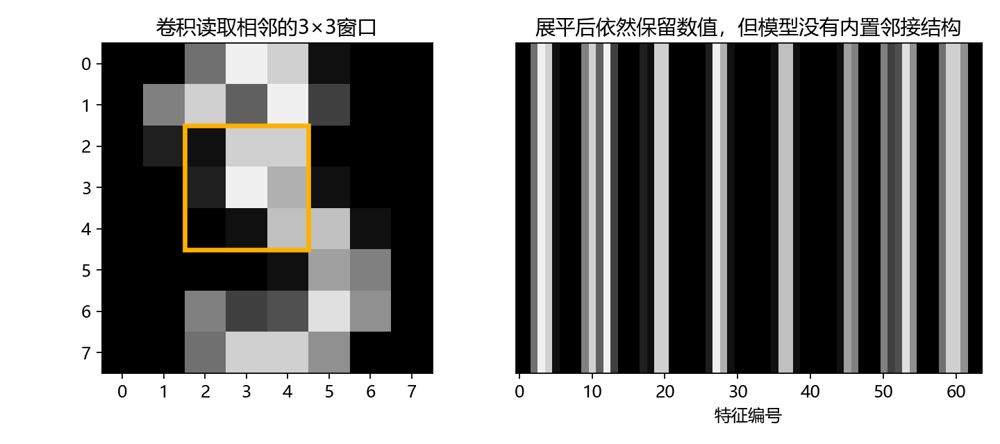
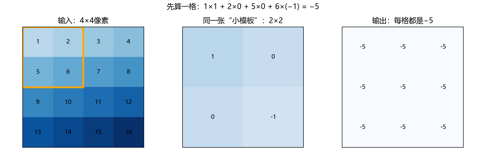
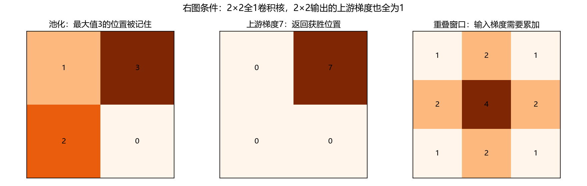
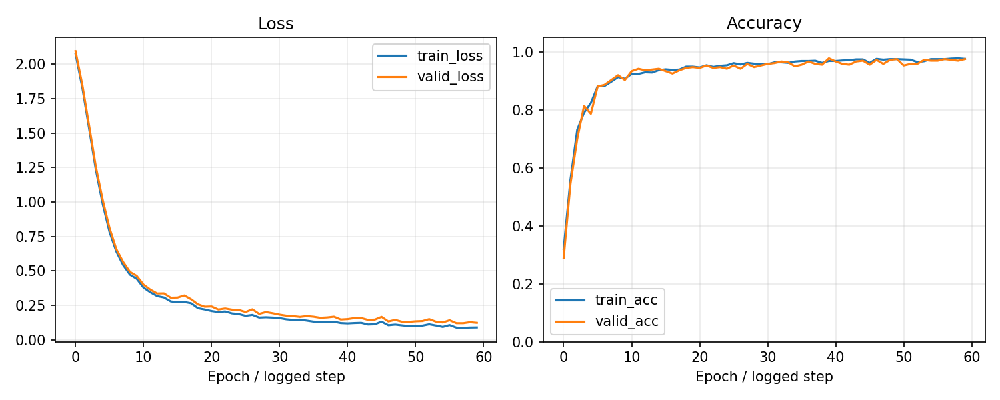
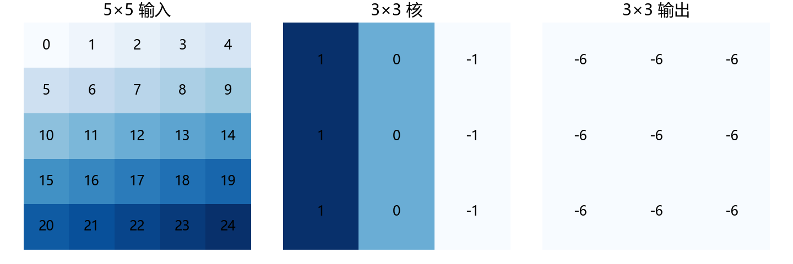
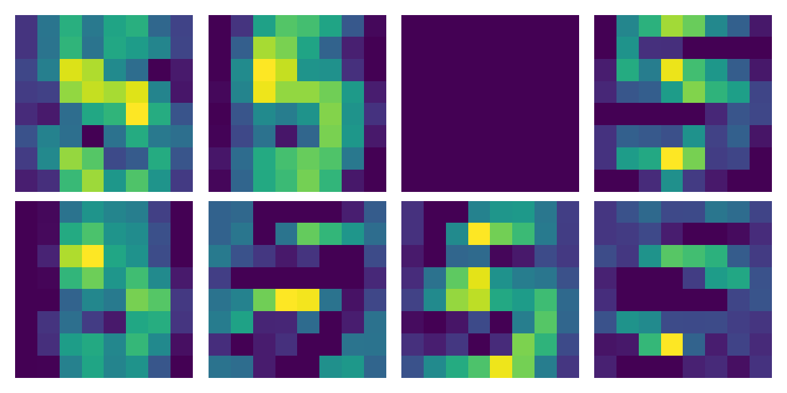
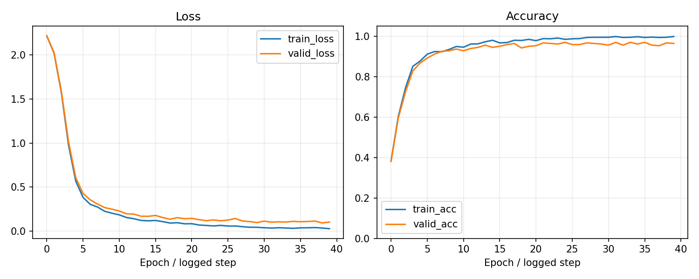

# 第11章 CNN与图像识别

目标：先用NumPy亲手搭出能够训练的CNN，再用PyTorch训练更深的版本，观察特征图，并预测一张自己准备的图片。基础实验不用联网，仍使用8×8 digits。

## 本章内容

先确认能解释 `(N, C, H, W)` 的四个轴，并区分训练集与测试集。卡住时按[进入 CNN 的补读路线](../附录/02-学习路线与前置自测.md#从训练基础进入-cnn)回看；卷积与反向计算由本章逐步建立。

全连接网络将8×8图像展开为64个输入值。卷积网络通过局部连接和权重共享处理二维空间结构。本章先手写单层CNN的正向与反向计算，再使用PyTorch训练两层卷积模型。



继续使用相同digits数据划分。自备图片预测另外检查背景、居中和缩放等预处理要求；公开数据上的测试成绩不能直接代表自备图片的识别效果。

## 11.0 使用NumPy逐步实现CNN

首先计算单个卷积窗口，再实现完整卷积、ReLU、最大池化和全连接分类头。随后推导各层梯度，将反向计算连接起来，并用小批量梯度下降训练真实数字图片。

| 步骤 | 计算内容 | 核对结果 |
| --- | --- | --- |
| 1 | 单个卷积窗口 | 左上角输出为−5 |
| 2 | 完整滑动卷积 | 4×4输入得到3×3输出 |
| 3 | 最大池化 | 输出3，并记录最大值位置 |
| 4 | 全连接分类头 | 72个特征得到10个分数 |
| 5 | 各层反向计算 | 池化梯度返回最大值位置，卷积重叠贡献累加 |
| 6 | 参数更新与训练 | 损失下降，保存并重新加载模型 |

手写模型先采用单层卷积、不补边的结构。后续PyTorch实验再介绍多层卷积、padding和迁移学习。

### 11.0.1 单个卷积窗口

单个输出的公式先放在这里：

```math
y=\sum_{u,v} x_{u,v}k_{u,v}+b.
```

这里的$`x`$是窗口中的像素，$`k`$是同样大小的卷积核，$`b`$是偏置。求和符号表示“把每一对相乘的结果加起来”，没有隐藏的新运算。



```python
import numpy as np
small_image = np.arange(1, 17, dtype=float).reshape(4, 4)
small_kernel = np.array([[1., 0.], [0., -1.]])
first_window = small_image[:2, :2]
first_answer = np.sum(first_window * small_kernel)
print(first_answer)  # -5.0
assert first_answer == -5
```

展开就是$`1\times1+2\times0+5\times0+6\times(-1)=-5`$。卷积输出可以为负数，它表示该窗口与当前卷积核的计算结果；它不是分类概率。

### 11.0.2 滑动窗口与权重共享

```python
small_output = np.empty((3, 3))
for row in range(3):
    for col in range(3):
        window = small_image[row:row+2, col:col+2]
        small_output[row, col] = np.sum(window * small_kernel)
print(small_output)
assert np.all(small_output == -5)
```

输出是3×3、每个数都是−5。为什么不是4×4？最后一个完整窗口从第2行、第2列开始；再往右就越界了。没有补边、步长为1时，输出宽度是$`W-K+1`$。这里$`4-2+1=3`$。

卷积核的数值在移动时没有变，这就是**权重共享**。把同一套参数用在多个位置，能减少参数量；它不保证模型对任意平移、旋转都完全不敏感。

正式数据有批量和通道，需要把上面的运算推广。完整脚本的`conv_forward`仍然逐个空间位置取窗口，只用`einsum`一次算完批量和输出通道：

```math
Y_{n,f,i,j}=b_f+\sum_{c,u,v}X_{n,c,i+u,j+v}K_{f,c,u,v}.
```

$`n`$选哪张图，$`f`$选哪个卷积核，$`c`$遍历输入通道。`np.einsum("ncuv,fcuv->nf", patch, weight)`与这个求和一一对应；被消去的是`c,u,v`，保留的是`n,f`。它是NumPy求和工具，没有替我们计算梯度。

### 11.0.3 ReLU与最大池化

ReLU是$`\max(z,0)`$。正数照常通过，负数变成0。最大池化则在一个小区域中选最大值。输出仅保留当前窗口中的最大数值。

```python
pool_window = np.array([[1., 3.], [2., 0.]])
winner = int(pool_window.argmax())
pooled_value = pool_window.max()
print(pooled_value, winner)  # 3.0 1
assert (pooled_value, winner) == (3, 1)
```

`argmax`按行展开后编号：0、1、2、3。最大值位于展开索引1，即右上角。反向传播需要该索引，才能将梯度返回对应的输入位置。遇到并列最大值，本实现选择第一个，避免位置规则含糊；这种点上的数学导数并不唯一。

### 11.0.4 分类头与交叉熵

我们的手写模型只有一层卷积：

```text
输入图片       (B, 1, 8, 8)
8个3×3卷积核   (B, 8, 6, 6)   不补边，步长1
ReLU           (B, 8, 6, 6)
2×2最大池化    (B, 8, 3, 3)   步长2
展开           (B, 72)        8×3×3=72
全连接         (B, 10)        数字0～9各一个logit
```

这次不是72个数字类别：72是特征数量，10才是类别数量。第9章的矩阵乘法可以直接接上来：`logits = flat @ weight + bias`，权重形状为`(72,10)`。

随后使用第10章的Softmax与交叉熵。假设正确类别是3，梯度告诉我们如何调整十个分数：

```math
\frac{\partial L}{\partial z_{n,j}}=
\frac{p_{n,j}-\mathbf{1}[j=y_n]}{B}.
```

该梯度由Softmax与交叉熵的组合求导得到。$`p`$是Softmax概率，正确类别的指示量为1，其余为0；$`B`$是批量数。除以$`B`$对应批量平均损失。完整实现先减每行最大logit，再取指数，避免直接指数运算溢出。

### 11.0.5 各层反向传播

反向传播计算**损失对每个中间量及参数的导数**。各层按前向计算的逆序应用链式法则；最终按“参数减去学习率乘梯度”更新参数。

全连接层先用第9章已有结果：$`dW=H^T dZ`$，$`dH=dZ W^T`$。`reshape`只改变排列视图，反向时恢复池化输出的形状即可。



池化输出如果收到梯度7，四个输入中只有刚才的最大值位置收到7：

```python
pool_input_gradient = np.zeros(4)
pool_input_gradient[winner] = 7
pool_input_gradient = pool_input_gradient.reshape(2, 2)
print(pool_input_gradient)  # [[0. 7.] [0. 0.]]
assert pool_input_gradient[0, 1] == 7
```

ReLU接着用`dz = da * (z > 0)`。正输入保留上游梯度，负输入挡住；在0点，本实现选0作为计算约定。

最后来到卷积。只看一个窗口，若上游梯度是$`g`$：

```math
\frac{\partial L}{\partial k_{u,v}}=g x_{u,v},\qquad
\frac{\partial L}{\partial x_{u,v}}=g k_{u,v},\qquad
\frac{\partial L}{\partial b}=g.
```

推导从单个窗口中的乘法开始：$`y=xk`$对$`k`$求导得到$`x`$，再乘损失对$`y`$的导数$`g`$。对像素求导则得到$`k`$。加法对偏置的导数是1。

滑过所有窗口后，**共享权重的梯度要相加，被多个窗口使用的像素梯度也要相加**。这里最容易写错的是把`+=`写成`=`，覆盖先前窗口的贡献。我们用一个能手算的检查核对梯度累加：

```python
overlap_gradient = np.zeros((3, 3))
for row in range(2):
    for col in range(2):
        overlap_gradient[row:row+2, col:col+2] += np.ones((2, 2))
assert np.array_equal(overlap_gradient, [[1, 2, 1], [2, 4, 2], [1, 2, 1]])
```

中间像素参与四个窗口，所以收到四份贡献。完整脚本的`conv_backward`正是在做这件事，并跨批量累加卷积核梯度。平均损失已经在`dlogits`除过批量数，后面别再除一次。

### 11.0.6 参数更新与完整训练

从工作区根目录运行。环境仍是conda的`handmade-ml`，不用新增库：

```powershell
python script/part03/11_numpy_cnn.py --check-only
python script/part03/11_numpy_cnn.py
```

第一条先检查导数；第二条检查后训练60轮。核心训练过程就是：取一批图片 → 前向 → 计算损失 → 手写反向 → 更新所有参数。源码中的更新为`p[name] -= 0.08 * grads[name]`，没有`loss.backward()`、`Conv2d`或框架优化器参与训练。

请按这个顺序读[完整手写代码](../script/part03/11_numpy_cnn.py)：`conv_forward` → `pool_forward` → `initialize`与`forward` → `pool_backward`与`conv_backward` → `loss_and_gradient` → `main`。每个函数只负责一件事。先对照本节数值检查，再看多通道求和，再阅读完整训练循环。

梯度检查包含两种证据：随机抽取参数与输入位置做中心差分；再把所有参数和输入梯度与同结构的PyTorch运算比较。PyTorch只充当核对工具。随机连续输入避开ReLU折点与池化并列值；这不意味着所有不光滑位置都有唯一导数。



本机这次运行：最佳轮次为58，独立测试准确率为96.39%；中心差分最大绝对误差约为4.13×10⁻¹¹，全部梯度与PyTorch参考的最大差异约为8.88×10⁻¹⁶。这些是一次固定划分实验的结果，不是换图片后的准确率保证。

模型根据验证损失选最佳轮次，测试集只在选完后评价。模型保存到`outputs/part03/11_numpy_best.npz`，报告在`outputs/part03/11_numpy_report.json`；重新加载后的输出必须与保存前完全一致。报告同时留下梯度误差、曲线、划分大小和测试混淆矩阵。

至此完成了可训练CNN的各层正向与反向计算。后续使用PyTorch实现更深的结构，并学习模型管理。两个版本结构不同，成绩不能只归因于框架；整合演示仍使用后面训练的PyTorch模型。

### 11.0.7 随堂练习

1. 把11.0.1示例中卷积核右下角的−1改成1，重新手算左上输出，再运行核对。
2. 说明重叠梯度图中，角落为什么是1、中心为什么是4。
3. 找到`loss_and_gradient`中除以批量数的位置，解释为什么卷积反向不再除一次。

第三项可以通过两个样本的平均损失展开：先分别求导，再对导数取平均，并与代码中的批量系数核对。

## 11.1 像素、通道与NCHW

灰度图的每个像素一个数；RGB图三个通道。PyTorch图像批量通常是$`(N,C,H,W)`$：批量数、通道、高、宽。本章输入$`(B,1,8,8)`$，像素除以16到0～1。

```python
from sklearn.datasets import load_digits
import torch
data = load_digits()
x = torch.tensor(data.images[:, None] / 16, dtype=torch.float32)
print(x.shape)  # (1797, 1, 8, 8)
```

`[:,None]`添加通道轴。把RGB的HWC数组转成CHW要交换轴，单纯reshape会打乱像素和通道对应关系。

### 通道不是“图片的数量”

64张灰度图片是`(64,1,8,8)`；64张RGB图片通常是`(64,3,H,W)`。通道记录同一个空间位置的不同数值来源，批量轴记录不同图片。把这两个轴弄反，卷积层看到的就不是你想表达的内容。

本章每个位置只有灰度强度，不提供颜色或真实纸张信息。用公开数字图片模拟图片编号，是为了先学习图像模型，不意味着模型已经学过拍摄、透视、光照与整张图片定位。

这也是后面自备图预测要求“单个数字、居中”的原因：当前实验的任务是识别已经裁好的编号图，而不是从整张照片中找出编号。

## 11.2 卷积窗口怎样移动

先给单通道计算：

```math
Y_{i,j}=\sum_{u=0}^{K_h-1}\sum_{v=0}^{K_w-1}K_{u,v}X_{i+u,j+v}+b.
```

窗口内逐项相乘，再求和，得到一个输出位置。严格术语中，此处不翻转核，是互相关；深度学习库通常将它称为卷积。



图中左上窗口为`[[0,1,2],[5,6,7],[10,11,12]]`，核每行`[1,0,-1]`，结果$`(0-2)+(5-7)+(10-12)=-6`$。窗口右移重复同样计算。

### 核不自带“识别笔画”的答案

图中核的数值是人为设置的，目的是让你手算一格输出。正式CNN的核从初始化开始，通过损失与反向传播更新；我们没有先告诉它某个核是“竖线检测器”。

对同一张数字图片，窗口向右和向下移动，重复使用同一组权重。输出位置表示对应局部区域的响应。卷积后ReLU把负响应截成0，接下来另一层再组合这些局部结果。

```python
import torch
image_numbers = torch.arange(25, dtype=torch.float32).reshape(1, 1, 5, 5)
edge_kernel = torch.tensor([[1., 0., -1.]] * 3).reshape(1, 1, 3, 3)
window_output = torch.nn.functional.conv2d(image_numbers, edge_kernel)
assert window_output.shape == (1, 1, 3, 3)
assert torch.all(window_output == -6)
```

手算、图和库计算得到相同结果后，再看正式模型，会更容易区分结构规则与学出来的数值。

## 11.3 多通道、多个核与参数共享

一个输出通道的核会读取所有输入通道，分别做局部计算后求和。权重形状是$`(C_{out},C_{in},K_h,K_w)`$，参数总数$`C_{out}(C_{in}K_hK_w+1)`$（有偏置时）。

同一个核在不同位置重复使用，叫参数共享。`Conv2d(1,8,3)`有$`8(1\times3\times3+1)=80`$个参数。8个输出通道对应8组核，训练会调整这些核，不是预先手工指定“横线”“竖线”。

### 两层卷积的通道含义不同

第一层从1个灰度通道产生8个通道。第二层从这8个特征通道产生16个通道；一个第二层核要读取8个输入通道，而不是只处理某一张灰度图。

第二层参数量为$`16(8\times3\times3+1)=1168`$。每个输出通道有一组8×3×3权重和一个偏置，它在所有空间位置共享。共享减少参数，也把“同一种局部模式在不同位置仍有用”这个假设写进结构。

这种结构通常具有有用的平移相关性质，但池化、填充、边界和最终分类头都会影响实际行为。不要把“卷积”简单理解为自动识别任意位置、任意旋转的数字。

## 11.4 输出尺寸、步幅、填充与膨胀

```math
H_{out}=\left\lfloor\frac{H+2P-D(K-1)-1}{S}+1\right\rfloor.
```

$`H`$是输入高度、$`K`$核大小、$`P`$两侧填充、$`S`$步幅、$`D`$膨胀率；宽度同样计算。取$`H=8,K=3,P=1,S=1,D=1`$，输出仍是8；若$`P=0`$则为6。

填充让边界也参与更多窗口，步幅控制移动间隔，膨胀在核元素之间增加间隔。先熟悉$`D=1`$，再把膨胀看成有效核尺寸$`D(K-1)+1`$。

### 不靠猜测得到下一层形状

先把有效核大小算为$`K_{eff}=D(K-1)+1`$，输入加两侧填充后是$`H+2P`$。窗口起点每次移动$`S`$，能放下的数量是$`\lfloor(H+2P-K_{eff})/S\rfloor+1`$，展开后就是上面的公式。

取8×8输入、3×3核、不填充、步幅2，输出为$`\lfloor(8-3)/2\rfloor+1=3`$，不是“8除以2所以是4”。步幅与核占据的空间需要一起考虑。

正式网络每层3×3卷积都填充1，保持当前空间大小；池化再减半。这样最后能确定展平有64个数，分类头的输入维度才不是试出来的。

## 11.5 池化与感受野

2×2最大池化取每个窗口最大值，默认步幅2，使8×8变4×4。池化通常没有可训练参数。感受野是某层输出理论上依赖的原始输入区域；多层局部操作会扩大它。

一维下可递推：$`r_{new}=r_{old}+(K-1)D j_{old}`$，$`j_{new}=j_{old}S`$，初始$`r=j=1`$。本章两层3×3卷积加两次2×2池化，理论感受野最终10，大于8×8输入，边界部分来自填充。理论范围不代表每个像素贡献相等。

### 用递推看感受野怎样长大

从$`r=1,j=1`$开始：3×3卷积后$`r=3,j=1`$；2×2、步幅2池化后$`r=4,j=2`$；第二层3×3卷积后$`r=8,j=2`$；第二次池化后$`r=10,j=4`$。

因此本章这个具体网络最终理论感受野是10，而不是把每层大小简单相乘。它大于8×8输入，边界的一部分来自填充。感受野描述可能依赖的区域，实际有效贡献还受权重和激活影响。

最大池化在反向中把梯度送回窗口里被选中的最大值位置；若多个窗口重叠读到同一输入，其梯度贡献需要累加。这与第9章“一个值被多条路径使用就累加梯度”是同一原则。

## 11.6 训练一个小CNN

网络路线：$`(B,1,8,8)`$→卷积$`(B,8,8,8)`$→池化$`(B,8,4,4)`$→卷积$`(B,16,4,4)`$→池化$`(B,16,2,2)`$→展平$`(B,64)`$→10个logit。

```python
from torch import nn
net = nn.Sequential(
    nn.Conv2d(1, 8, 3, padding=1), nn.ReLU(), nn.MaxPool2d(2),
    nn.Conv2d(8, 16, 3, padding=1), nn.ReLU(), nn.MaxPool2d(2),
    nn.Flatten(), nn.Linear(64, 10))
```

训练过程沿用第10章：交叉熵、AdamW、固定验证集、保存验证损失最佳权重。先保证形状正确，再比较性能。小数据上CNN不一定胜过第8章逻辑回归，报告实际结果即可。

### 在训练前走一次形状检查

```python
import torch
with torch.no_grad():
    trial_logits = net(torch.zeros(2, 1, 8, 8))
assert trial_logits.shape == (2, 10)
```

这两张全零输入只是检查网络是否能接通，不是模型效果测试。接着才将真实图片送入训练循环，使用真实编号计算交叉熵。

本章固定40轮，按验证损失恢复最佳参数。和第10章MLP相比，网络结构与训练轮数都改变了；测试结果可以作教学对照，不应当作只改变卷积这一项的严格架构结论。

## 11.7 数据增强与错误分析

增强是训练时随机变换输入，例如轻微平移。变换必须尽量保留标签语义：数字6旋转180度可能近似9，不能无条件使用。

基础脚本未加随机增强，便于复现。建议扩展时只在训练集添加轻微平移，保持验证与测试固定，比较验证结果。8×8图很小，过强裁剪可能直接删除笔画。

错误分析看混淆矩阵与误判图，区分笔画模糊、样本风格和处理错误。不要只挑正确图片展示。

### 增强不是把错误答案混进训练

若图片轻微向右偏移，编号通常不变，可以考虑平移增强；若把6翻成9，标签可能应该改变。增强在代码上很方便，但它背后的关键判断是“这个变换是否保留任务答案”。

基础脚本先不加入随机增强，让读者观察固定路径。扩展时只增强训练集，验证与测试仍保持原图；否则两次测试不在同一组输入上，比较会混入另一个变化。

若模型常混淆3和8，可以查看是不是缺失闭合笔画，而不是直接提高所有增强强度。对8×8图，一个像素的变化已经很明显。

## 11.8 特征图如何阅读

参考脚本取第一层卷积和ReLU输出，画8个通道。颜色表示当前图片在各空间位置的激活强弱。它是中间数值，不是“模型看到的真实图像”，也不能仅凭一幅热图断言某个通道永远识别某种笔画。



想进一步比较，可对多个数字观察同一通道，保持颜色尺度一致。仅展示一张图时，主要检查形状和数值是否合理。

### 一个通道整幅暗色意味着什么

某张图片在某个通道几乎没有ReLU激活，是这张输入下该通道的结果；不能只凭它断言这个通道永久失效。换一张图片，它可能出现不同响应。

当前图每个通道单独着色，适合观察空间模式，不适合直接比较“谁贡献最大”。若比较数值幅度，应统一色条范围并检查原始数组；后续分类头也会对这些数重新加权。

可以对同一张数字图片进行平移，观察同一通道的响应，但仍需完整的预测与误差证据判断鲁棒性。特征图可视化不能代替定量评价。

## 11.9 残差连接与迁移学习

残差形式先给出：$`y=x+F(x)`$。它为信号与梯度提供直接路径；相加两边必须同形状，不一致时需要投影。ResNet把它用于较深卷积网络。

迁移学习是从已学好的参数出发完成新任务。附加脚本使用ImageNet预训练ResNet18，冻结骨干并训练新的10类线性头。使用官方`weights.transforms()`统一缩放、裁剪和标准化；灰度图先转RGB。官方权重约44.7 MB，首次运行会联网下载。[模型与预处理说明](https://docs.pytorch.org/vision/stable/models/generated/torchvision.models.resnet18.html)

```powershell
python script/part03/11_transfer_learning.py
```

8×8数字放大到224×224不会增加原始信息，这只是展示迁移学习的流程；不要预设它比小CNN更好。保存的新头需要相同骨干权重和预处理才能用于推理。

### 冻结骨干与重新训练分类头

ImageNet模型原来的1000类输出与图片编号不匹配，附加脚本把原分类层换成Identity，抽取512维特征，再训练一个512→10的线性头。骨干使用eval并在no_grad中计算，不更新预训练参数。

训练头的梯度不需要回到原始图像，因为特征已固定。实际微调若希望改变骨干，就不能在这一段切断梯度；还要重新考虑学习率与数据量。

当前任务图像很小，放大不会还原不存在的笔画。迁移学习展示的是复用参数的工程路线，并不保证当前数据上的效果优于小CNN。

## 11.10 自备图片与预测

准备黑底白字、居中、单个数字的图片。程序转灰度、缩放到8×8、除以255。训练数据原本0～16，除以16；两者都映射到0～1，但字体、边缘与留白仍可能不同。

```powershell
python script/part03/11_cnn.py --image outputs/part03/11_example_digit.png
```

先用脚本导出的样例检查流程，再换自己的图片。如果是白底黑字，应先反色，否则背景分布与训练数据相反。模型即使面对猫的图片也会输出0～9之一，它没有自动拒绝未知对象的机制。

### 先排查输入，再解释模型

看自己图片转成灰度和缩到8×8后的样子：背景是黑还是白，数字占多大范围，是否被裁掉，是否连成一团。训练图像里的0是暗背景，16是亮笔画；因此推理把0～255除以255对应到同样方向。

脚本导出的样例经过放大后再缩回，也可能与原始图像有细小差别，因为重采样会平滑边缘。它是检查自备图路径的示例，不保证每张任意图片都识别正确。

如果输入包含多行文字的整张图片，当前程序仍会把整图缩成8×8，不符合单个数字分类的输入要求。定位编号和裁剪区域属于后续能力，当前代码没有实现。

## 11.11 选读：卷积与矩阵乘法的联系

把每个滑动窗口展开成一行，排列成矩阵$`U`$；把核展开成矩阵$`W`$，则输出可以通过$`UW`$计算，再还原空间形状。这种展开常叫im2col，是理解后面算子开发的入口，实际库不一定显式保存这张大矩阵。

反向时核梯度来自窗口与输出梯度的乘积；输入像素可能被多个窗口读取，其梯度要累加，不能直接覆盖。当前阶段不要求手写高效卷积。

### 为什么这节会通向算子开发

卷积看起来在滑窗口，内部却可以转成大量乘加。im2col把每个窗口放成行，方便调用矩阵乘法；代价是重复存储重叠像素。因此数学等价的两种表达，并不意味着占用相同内存或同样快。

后面的NVIDIA算子分支会关心访存、分块与并行。本章先留下一个连接点：你已经知道卷积究竟在算什么，未来优化时才知道要保留什么结果。

反向还会遇到重叠贡献累加，这不仅是导数问题，也影响并行实现。当前阶段理解依赖和形状即可，不要求提前掌握CUDA。

## 11.12 章末产出：图像分类器与特征图

```powershell
python script/part03/11_cnn.py
```

产出最佳权重、训练曲线、8通道特征图、可供推理的样例图片和测试报告。验收：能手算输出尺寸与参数量；权重重新加载后预测一致；能用同一预处理路径预测图片；能解释自备图片错误为何未必意味着训练失败。



**检查：**增加输出通道会使图像更宽吗？答案：不会；通道数与空间宽度是不同的轴。空间尺寸由核、步幅、填充和膨胀决定。

### 图像模块交付之后，还缺少文字含义

训练完成后，可以加载CNN，对已裁剪的单个数字图片进行分类。该模型的输出仅表示预测的数字类别。

保留模型权重、输入约定、验证选择规则和测试报告。后面的整合演示会直接加载`11_best.pt`，可以直接复用本章保存的模型。

下一章转向文本分类，比较TF-IDF特征与按顺序处理字符的GRU。任务与输入发生变化，训练、验证和测试的划分原则仍然适用。
### 补充练习与验收

先独立完成[本章两道练习](../assets/practice/part03.md#第11章)，再核对参考答案和本章验收证据。记录自己的输入、结果与边界案例，不要求复制作者的实验数值。

[上一章](10-PyTorch训练与模型管理.md) · [返回目录](README.md) · [下一章](12-NLP与序列建模.md)
