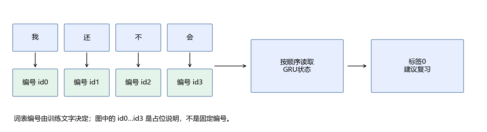
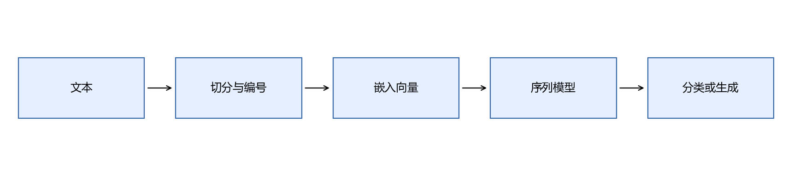

# 第12章 NLP与序列建模

目标：让文字进入数值模型，比较TF-IDF和序列模型，理解下一个token预测。章末得到学习反馈分类器、简单文本生成器，并可扩展到真实短信分类。需要第6章条件概率和第7章序列概念。

## 本章内容

先确认能用字典把符号映射成编号，并区分分类输出与序列输出，参见[进入 NLP 的补读路线](../附录/02-学习路线与前置自测.md#从图像进入-nlp)。图像分类的评价经验可以复用，但文字需要重新编码，不能原样输入 CNN。

本章使用少量中文学习反馈句进行文本分类，标签区分“自述已理解”和“建议复习”。例如“这道题我已经理解”与“这道题我还没有理解”属于不同类别。标签描述句子表达的状态，不测量实际解题能力。



先以TF-IDF建立基线，再使用GRU按顺序处理字符，最后运行简单字符生成器。12条训练句只用于展示流程；可选UCI短信实验用于练习真实文本数据处理与评价。

## 12.1 NLP的任务与数据边界

自然语言处理（NLP）处理文本或语言相关数据。分类给整段文字一个标签，序列标注给各位置标签，翻译把一个序列转换成另一序列，语言模型预测下一个token。

本章离线数据是明确写在脚本里的少量中文学习反馈句，只用于检查流程；真实数据扩展使用UCI英文短信ham/spam分类。中文教学准确率不能代表真实产品效果，也不能与短信数据成绩直接比较。

### 分类输出不是人的知识水平

我们给“这道题我已经理解”标1，给“这道题我还没有理解”标0。标签表示句子里的自述，不是对答题能力的客观检验。即使模型分类完全正确，也不能据此给人打分。

编号和反馈分别来自图像与文字，当前训练没有为每张真实数字图配真实学习反馈；最后演示只是把两个独立输出放在同一条记录里，不是图文联合训练。

当项目从练习走向实际使用，需要重新收集任务数据、定义标注方式，并在新的独立集合上验证。这里先把可以运行的最小流程建立起来。

## 12.2 清洗、切分、词表与特殊符号



token是模型处理的最小离散单位，可以是字、词或子词，不等于“一个汉字”。离线示例按字符切分，因此“我还不会”变成4个token。词表把token映射到编号，编号大小本身没有语义距离。

只用训练文字建立词表。`<PAD>=0`补齐批次，`<UNK>=1`表示未登录token；生成常用`<BOS>`和`<EOS>`表示开始与结束。不要把编号0同时用作普通字和PAD。

清洗不是越多越好。删除标点可能丢失情绪，统一大小写有时合理，有时会丢失实体信息。保存预处理约定，并在预测时使用相同规则。

### 一句“我还不会”如何编号

按字符切分后有4个token：我、还、不、会。训练词表为每个字符分配一个整数，编号可以任意，只要训练与预测始终使用同一映射。编号20并不比编号5“更难”。

遇到训练中没有的字，映射到UNK；补齐批次长度时用PAD。这两种情况不同：UNK仍是一条真实输入信息，只是内容未知；PAD表示这个位置根本没有文字。

我们的词表按训练字符排序生成，便于复现。词表必须和权重一起保存：如果明天重新排序并分配不同编号，同一个编号就会读取错误嵌入，模型却不会自动发现。

## 12.3 子词切分与BPE

BPE的基本过程：从较小单位开始，统计训练语料中相邻符号对，合并最频繁的一对，再重复到预算。比如`l o w`、`l o w e r`中`l o`和`lo w`逐步合并，得到可复用子词。

它有助于在词表大小与未知词处理之间折中。实际tokenizer还涉及字节编码、空白标记和特殊token约定。本章按字符实现基础实验，不把它叫BPE；未来使用大模型时必须加载模型配套tokenizer。

### 字符、词与子词各有什么取舍

字符切分词表较小，中文例子直观，但可能把一个完整词拆散；按词切分能保留词级单位，却需要处理分词与未登录词；子词把常见片段合并，尝试兼顾词表规模与复用。

BPE的合并依赖训练语料。相同字符串经不同tokenizer处理，编号和长度都可能不同。因此后面加载大模型时，模型权重和tokenizer必须配套；不能用本章字符词表直接调用它。

这里只用一个小例子解释机制，不让读者在尚未走通文本分类前先实现完整BPE训练器。

## 12.4 词袋、TF-IDF与分类基线

先给一种平滑定义：

```math
idf(t)=\log\frac{1+N}{1+df(t)}+1,\quad tfidf(t,d)=tf(t,d)\,idf(t).
```

$`N`$是训练文档数，$`df(t)`$是包含该token的文档数。一个词出现于几乎所有文档，辨别力往往较弱；稀少词会得到较大IDF。不同库的TF、平滑和归一化约定不同；scikit-learn默认还进行L2行归一化。

```python
from sklearn.pipeline import make_pipeline
from sklearn.feature_extraction.text import TfidfVectorizer
from sklearn.linear_model import LogisticRegression
model = make_pipeline(
    TfidfVectorizer(analyzer="char", ngram_range=(1, 2)),
    LogisticRegression())
model.fit(["公式明白我会计算", "公式不懂需要复习"], [1, 0])
print(model.predict(["公式明白我会了"]))
```

字符二元组是相邻两个字符，如“不会”。它能保留一点局部顺序，但词袋整体不保留完整序列关系。真实短信脚本使用英文词级1～2元组。词表与IDF必须只拟合训练集。

### “会”和“不会”给词袋出了什么难题

只统计单字时，两句都包含“会”，区别还依赖“不”的出现和与其他词的组合。字符二元组引入“不会”，能保留一部分局部关系；但词袋仍会丢掉完整顺序，遇到更复杂否定句可能失败。

若训练文档共4篇，“会”出现在3篇，则$`idf=\log(5/4)+1\approx1.223`$；“困惑”只在1篇出现，则$`idf=\log(5/2)+1\approx1.916`$。TF-IDF提高稀少片段权重，不代表它自动理解片段语义。

本章中文基线与GRU读相同训练句、评价相同测试句。神经模型没有因为名字复杂就天然比基线好；我们会保留两者实际结果。

## 12.5 N-gram语言模型与平滑

```math
P(c_t\mid c_{t-1})=\frac{count(c_{t-1},c_t)}{\sum_v count(c_{t-1},v)}.
```

字符bigram只看前一个字符。假设“学”后“会”出现3次，“习”出现1次，则下一字符为“会”的概率3/4；这是假设的手算频数，不是脚本语料统计。它不保存长距离含义，但可直观看到条件概率怎样生成文本。

加一平滑写成$`(count(a,b)+1)/(count(a)+|V|)`$，避免未见组合概率为0。本章生成脚本从已见后继中采样，**没有对整个词表做加一平滑**；若用于未见文本的困惑度评价，需要添加平滑并统一未知token处理。

### 让计数模型生成一次

从开始符号出发，统计训练句里下一字符的频数，再采样。例如“我”后面可能接“已”“还”“会”等，采样后再按选中的字符继续。它只记得最近一个字符，所以不同句子的片段可能拼在一起。

如果它生成了“我已经懂了”，可能只是重现常见训练片段；如果生成矛盾句，也符合这个有限记忆模型的能力边界。生成结果仅用于观察字符概率模型，不用于真实学习建议。

用固定随机种子是为了复现采样过程。换种子会换输出，不等于模型重新学到了知识。若想评价未见句子的概率，还要面对未见字符与未见组合，才需要平滑。

## 12.6 下一个token预测、交叉熵与困惑度

语言模型把联合概率分解为：

```math
\begin{aligned}
P(c_1,\ldots,c_T)&=\prod_{t=1}^T P(c_t\mid c_{<t}),\\
L&=-\frac1T\sum_t\log P(c_t\mid c_{<t}),\\
PPL&=e^L.
\end{aligned}
```

先给出目标，再解释：每个位置预测真实下一个token；取负对数平均就是交叉熵；指数后得到困惑度。若每步真实token都分到1/4概率，$`L=\log4`$，PPL=4。

比较PPL需要相同tokenizer、评价文本、掩码与计数方式；不同切分粒度的PPL不能简单横比。文字看起来流畅也不等于内容正确。

### 同样用交叉熵，预测对象却不同

反馈分类对一整句话输出两个类别分数，只计算一个标签损失；语言模型对多个位置分别输出词表分数，计算一系列下一个token损失。这是两个训练目标，不能因为都叫交叉熵就当作同一个模型。

生成“我会了”时，模型逐步估计“我”之后哪个字符、“我会”之后哪个字符，再预测结束符。训练时知道真实后继，推理时必须使用自己刚刚选出的字符，错误可能继续影响后续。

这也是第13章要同时评价教师强制损失和自由生成结果的原因。我们关心的是完整使用过程，不只是已给出真实历史时的局部成绩。

## 12.7 Embedding把编号映射为向量

```math
E\in\mathbb R^{|V|\times d},\quad h_t=E[id_t].
```

这等价于one-hot向量乘嵌入矩阵，但实际通过索引读取，无需生成大one-hot矩阵。`nn.Embedding(vocab_size,16)`对每个编号返回16维向量，参数可随训练调整。

PAD设置`padding_idx=0`，避免这个嵌入行被普通反向梯度更新。Embedding只提供表示，是否捕获有用关系取决于数据和训练目标。

### 查表以后，训练改变了什么

假设“会”的编号是某个$`i`$，Embedding返回第$`i`$行16个数。分类损失的梯度通过GRU传回这16个数，再修改嵌入参数。训练前随机向量没有预设“会”和“不懂”的语义关系。

```python
import torch
lookup = torch.nn.Embedding(6, 3, padding_idx=0)
toy_ids = torch.tensor([[2, 4, 0]], dtype=torch.long)
toy_vectors = lookup(toy_ids)
assert toy_vectors.shape == (1, 3, 3)
assert torch.all(toy_vectors[0, 2] == 0)
```

例子里两个3分别是序列长度与向量维度；它们刚好相等，含义不同。PAD向量初始为0，但仅靠这个0向量不能保证RNN不更新状态，所以还需要真实长度处理。

## 12.8 选读：Word2Vec为何学习词向量

Skip-gram用中心词预测上下文，CBOW用上下文预测中心词。它们使常出现在相似上下文的词得到某种相似表示。负采样用若干负例近似训练目标，减少对完整词表计算的代价。

“词向量能做类比”是部分数据和模型中的观察，并不是每个词向量都满足可靠的语义算术。本章分类器的嵌入从随机初始化训练，不是加载Word2Vec。

### 预训练表示与当前教学表示

Word2Vec可以先在大量上下文上训练词向量，再供下游任务使用；当前GRU的字符嵌入只从12条训练句学习，数据和目标都很有限，不能预设它已经建立广泛语言知识。

如果换成预训练嵌入，还要核对词表、维度、未知词与是否继续更新。得到一个向量文件，不等于能直接接到任意文本模型。

这节作为选读，是为了让你以后看到“预训练”时知道它预先学了什么，而不是只把它理解成下载一个大文件。

## 12.9 变长文本、Padding与长度

同一批句子长度不同，补到批次最长长度，形成$`(B,T)`$编号数组。补齐位置不应成为有效内容。分类用实际长度确定最后状态；生成损失用`ignore_index`排除PAD。

本章GRU使用`pack_padded_sequence`，显式传入真实长度；这样模型的最后状态来自实际句子末尾，不是补齐后的末尾。简单取`output[:, -1]`在变长批次中经常取到PAD位置。

### 最后一个位置不一定是句子末尾

“我会了”3个字符，“我还不会”4个字符，批量补齐后第一句第四格是PAD。若直接取所有句子的最后位置，第一句就拿到了处理PAD后的状态，而不是“了”之后的状态。

GRU的状态即使输入零向量，也可能因偏置和历史状态发生变化；因此`padding_idx=0`与`pack_padded_sequence`解决的是两件事。参考实现记录长度，再将有效序列打包交给GRU。

生成模型的PAD损失掩码也只决定哪些位置参与目标；它不自动屏蔽注意力读取PAD。第13章会把“读取掩码”和“损失掩码”进一步分开。

## 12.10 RNN如何传递历史与梯度

```math
h_t=\tanh(x_tW_x+h_{t-1}W_h+b).
```

每步读取当前输入$`x_t`$，结合上一状态$`h_{t-1}`$，输出新状态。分类可以用最后状态接线性头。时间反向传播沿多步传递梯度，重复乘局部导数与权重，可能衰减或增大，形成梯度消失与爆炸。

梯度裁剪限制一次更新的梯度范数，能缓解爆炸，不能自动解决所有长期依赖。参考实验使用GRU——一种门控RNN，不是上式的普通tanh RNN。

### 一字一字读取怎样保留顺序

读“我还不会”时，每个字符的向量更新同一个隐藏状态。最后状态包含过去输入在模型中的组合表示，再送入2类线性头。它不是把四个字简单求平均。

将RNN沿时间展开，就是同一个模块被重复使用，权重在每步共享。反向从最终分类损失沿这些重复步骤退回，同一权重收到各时间位置的梯度贡献并累加。

若多步局部导数反复偏小，早期字符的信号可能难以传回；偏大则可能爆炸。门控和裁剪提供工具，实际是否保留有用信息仍需验证。

## 12.11 LSTM的门控逐步组合

先说目标：单元状态$`c_t`$保留记忆，隐藏状态$`h_t`$提供当前输出。门的数值0～1控制信息保留程度。

先组合上一状态与输入$`u_t=[h_{t-1},x_t]`$；再分别算遗忘门$`f_t=\sigma(u_tW_f+b_f)`$、输入门$`i_t=\sigma(u_tW_i+b_i)`$、候选记忆$`g_t=\tanh(u_tW_g+b_g)`$；最后组合

```math
c_t=f_t\odot c_{t-1}+i_t\odot g_t,\quad
o_t=\sigma(u_tW_o+b_o),\quad h_t=o_t\odot\tanh(c_t).
```

遗忘门决定旧记忆保留多少，输入门控制新记忆写入，输出门控制对外暴露。先跟一维数值：旧记忆2、遗忘门0.5、输入门0.2、候选0.5，新记忆1.1。门控提供更易传播信息的路径，但不保证无限记忆。

本章实际用的GRU没有独立的$`c_t`$，主要使用重置门和更新门。重置门影响旧状态参与候选状态的程度；在PyTorch的约定中，更新门$`z_t`$组合为$`h_t=(1-z_t)\odot n_t+z_t\odot h_{t-1}`$，其中$`n_t`$是候选状态。$`z_t`$接近1时偏向保留旧状态，接近0时偏向新候选。它与LSTM都用门控制信息，但不是把LSTM公式直接换个名称。

### 门的公式如何变成可追踪的动作

不要把门看成另一个标签分类器。它对每个状态分量输出0～1数值，分别决定保留、写入与暴露多少；不同分量可以有不同门值。

LSTM先更新记忆$`c_t`$，再计算对外隐藏状态$`h_t`$；GRU合并了这两类状态，只保留隐藏状态。参考脚本用GRU是为了保持小实验紧凑，但词表、变长处理与分类流程也可以迁移到LSTM。

如果实际换成LSTM，返回的最后状态是`(h_n,c_n)`，不能把它当作GRU的一个张量直接传给线性头。框架接口与数学结构需要一起核对。

## 12.12 Seq2Seq与注意力的由来

编码器读源序列，解码器生成目标序列。仅把全部输入压进最后一个状态，对长序列可能困难；注意力让解码每一步读取源序列多个位置的加权组合。

先计算当前解码状态与各源状态的匹配分数，再Softmax成权重，再求加权和。这三个步骤在第13章会展开为Q、K、V和矩阵公式。当前先抓住目的：每一步按需要读取不同位置的信息。

### 从最后状态走向按需读取

如果反馈很长，只有最后状态供分类或生成使用，所有信息都需要经过同一条历史传递路径。注意力允许当前步骤重新对多个源位置做加权读取，不必让所有需要的信息都完全挤在最后一格。

例如生成某个复核编号时，当前查询需要在原始编号序列中找到相关位置；各位置提供自己的匹配表示与内容表示。这会在下一章写成Q、K、V，但现在先理解“计算权重，再取加权和”。

参考GRU分类器本身没有额外注意力层，这节是结构过渡，不是对现有代码隐藏功能的描述。

## 12.13 选读：HMM与序列标注

隐马尔可夫模型把标签视作隐藏状态，以转移概率描述状态之间的变化，以发射概率描述状态生成观察。Viterbi通过动态规划找到最可能的状态路径，连接第7章的状态与递推。

它与神经网络的隐藏状态不是同一个概念。这里只建立术语联系，完整概率推导与实现不作为进入Transformer的前提。

### 动态规划与神经状态不要混为一谈

HMM中的隐藏状态通常是离散标签，例如某个词属于哪种词性；RNN隐藏状态是一组连续数值。前者使用概率转移与动态规划，后者通过神经计算与梯度学习。

它们都处理序列，也都能使用第7章关于状态与递推的思路，但实现方式和假设不同。这里保留这个对照，让后来看到序列算法时有一张地图。

## 12.14 章末产出：文本分类与简单生成

```powershell
python script/part03/12_text.py
python script/part03/12_real_sms.py
```

第一条离线运行，产出中文学习反馈的TF-IDF与GRU对照报告、词表与模型，以及字符bigram生成句。数据只有12条训练、2条验证、4条测试；即使全部正确也不能证明真实泛化能力。划分直接在脚本中列明，词表仅取训练句，生成句可能重复训练片段。

第二条是可选联网实验：首次下载并缓存UCI短信，后续离线读取缓存。先统一空白与大小写，再去重；同一规范化文字若标签冲突则删除，避免重复短信跨集合。只用验证集选择`C`，最终报告ham/spam的精确率、召回率和F1，保存完整流水线。下载失败会报错，不会悄悄换成教学句。[UCI数据与CC BY 4.0许可](https://archive.ics.uci.edu/dataset/228/sms+spam+collection)

验收：PAD与UNK不同；词表不读取测试文本；加载GRU后预测相同；能说明TF-IDF、GRU和bigram各保留了哪些信息；真实短信报告包含spam召回率而非只有总体准确率。

**检查：**把测试集中新字加入词表后重新训练能否保留原测试评价？答案：不能再把它当完全独立的测试；词表已受其影响，应重新建立评价边界。

### 教学文本实验与真实数据扩展

离线脚本现在使用学习反馈句，标签0表示“建议复习”，标签1表示“自述已理解”。报告增加逐条测试文本、真实标签与预测，方便找出它是否被“不”“还”等词误导。

UCI短信扩展是更大、真实、类别不平衡的数据练习，不是中文教学反馈的数据替代品。它检验真实数据上的清洗、去重、验证选择与类别指标流程，不能证明中文反馈模块可靠。

当前反馈小模型可以参与最后的命令行演示，但只作为教学模块。下一章让编号串进入Transformer，重点练习目标格式和生成过程。

[上一章](11-CNN与图像识别.md) · [返回目录](README.md) · [下一章](13-注意力与Transformer.md)
