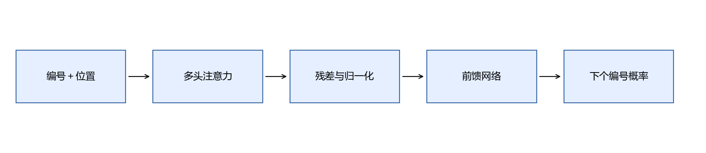
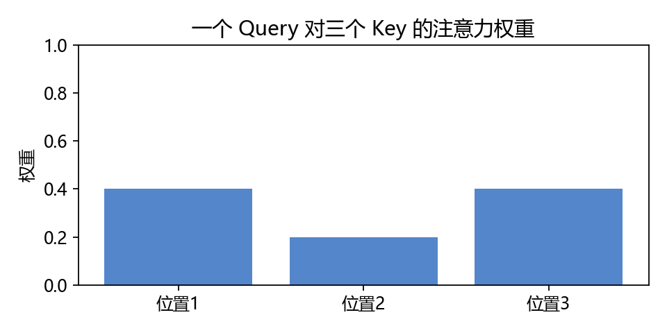
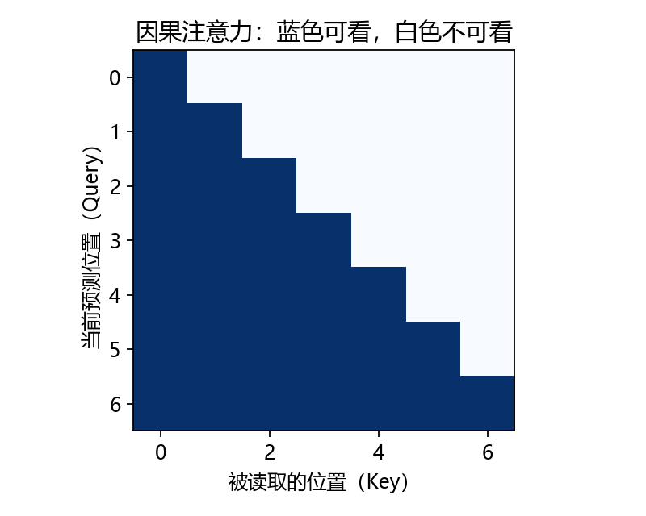
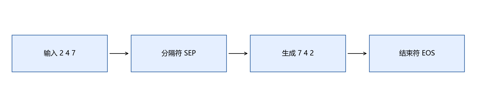
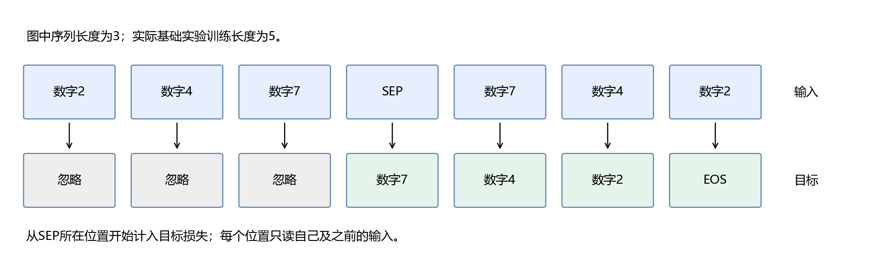
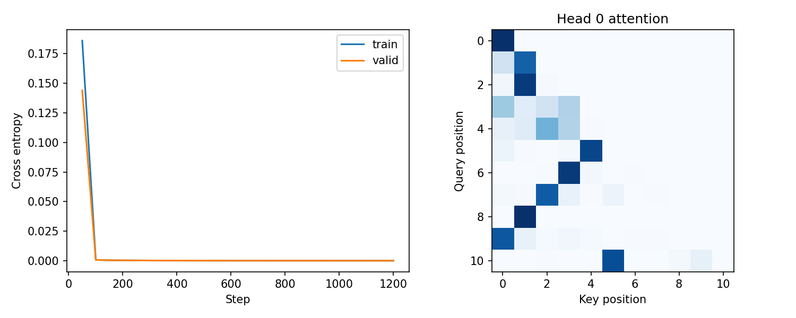

# 第13章 注意力与Transformer

目标：从“按匹配程度读信息”理解注意力，掌握形状和掩码，训练一个小型因果Transformer并自由生成。这个实验只学习数字符号倒序，不是训练通用语言大模型；它让生成模型的关键流程在CPU上可观察。

## 本章内容

本章训练小型因果Transformer，将数字序列“2、4、7、9、1”转换为“1、9、7、4、2”。实际倒序可以直接使用Python的`reversed`；这里选择答案明确的任务，用于检查注意力、目标错位、因果掩码和逐步生成的实现。

模型仅处理数字符号，不生成数学解答。评价分别检查训练长度与其他长度上的完整序列正确率，并确认生成过程没有使用未来答案。最后提供图像分类、文本分类与倒序生成的统一演示入口。

## 13.1 先看模型的完整路线



离散编号先变成嵌入向量，再加位置表示。每个块通过注意力读取其他位置，经残差、归一化与前馈网络变换；最后线性层输出词表每个编号的logit。

本章实现一个单层、4头、32维、pre-LN的因果模型，不逐层复制原论文所有配置。暂时记住各模块的职责，下面逐项展开。

### 哪些模块解决读取，哪些模块解决输出

Embedding解决离散编号怎样进入向量计算，位置嵌入说明它出现在第几格，注意力决定当前格读取哪些其他格，前馈网络变换每个位置的特征，输出层给词表各编号打分。

完整倒序任务的训练信号从输出层开始，反向经过所有模块，更新能影响损失的参数。不是先训练一个固定的注意力规则，再让另一层独立“翻译”。

先知道整个路线，我们下面讨论单个模块时就能回答它位于哪里、输入是什么、输出给谁。这样公式不会成为孤立名词。

## 13.2 一个Query读取多个位置

Query（Q）是当前用于匹配的向量，Key（K）是各位置用于被匹配的向量，Value（V）是各位置提供的内容。它们是训练得到的数值表示，不必真的对应一个自然语言问题或词典键。

先算$`q\cdot k_i`$判断匹配程度，再对分数Softmax成权重$`\alpha_i`$，最后取$`\sum_i\alpha_i v_i`$。若两个位置权重0.75和0.25，Value为$`(2,0)`$、$`(0,4)`$，读取结果是$`(1.5,1)`$。



权重归一化后总和1，但输出是向量，不是一个“最终答案概率”。Value可以含负数，输出也可能为负。

图中的数值可以自己复算：$`q=(1,0)`$，三个Key为$`(1,0),(0,1),(1,1)`$，$`d_k=2`$。缩放后的分数约$`(0.707,0,0.707)`$；取指数后归一化，权重约$`(0.401,0.198,0.401)`$。接着用这三个权重乘各Value向量再相加，就得到当前查询的输出。

### “读哪一格”与“拿走什么内容”

在图片序列中，某一步可能需要关注原始最后一个编号。Query与Key负责形成匹配权重，Value提供被读出的向量内容；三者职责分开，便于模型把匹配空间与内容空间分别学习。

但小模型是否真的按人类预设方式找到最后位置，要由训练结果和实验检查判断。我们不能在训练前就给每个头写好语义名称，然后把任何热图解释成该名称。

把注意力看成可微的加权读取，有助于连接第5章的矩阵乘法与第6章的Softmax归一化；它仍然是具体数值运算，不是一个自动理解器。

## 13.3 缩放点积注意力：组合出矩阵公式

将多个Query排成$`Q(T_q,d_k)`$，多个Key排成$`K(T_k,d_k)`$，Value为$`V(T_k,d_v)`$。先相乘得到各查询与各位置的分数$`(T_q,T_k)`$，再缩放、归一化、读取：

```math
Attention(Q,K,V)=softmax\left(\frac{QK^T}{\sqrt{d_k}}+M\right)V.
```

Softmax沿Key轴执行，即每个查询独立得到一行权重。$`M`$对可见位置取0，对屏蔽位置取$`-\infty`$；屏蔽后其指数为0。批量计算在前面再加$`B`$轴。

为什么除$`\sqrt{d_k}`$：若Q、K各分量独立、零均值、单位方差，点积方差随$`d_k`$增加，缩放可让量级更稳定。这是动机分析，实际训练表示不必严格满足这些假设。

### 用小数组把每个轴算出来

```python
import numpy as np
queries = np.array([[1., 0.]])            # (1, 2)
keys = np.array([[1., 0.], [0., 1.], [1., 1.]])
values = np.array([[2., 0.], [0., 4.], [1., 1.]])
match = queries @ keys.T / np.sqrt(2)     # (1, 3)
weights = np.exp(match - match.max(axis=1, keepdims=True))
weights /= weights.sum(axis=1, keepdims=True)
read_value = weights @ values            # (1, 2)
assert np.allclose(weights.sum(axis=1), 1)
print(weights, read_value)
```

每个查询需要与每个Key匹配，所以Key轴出现在分数矩阵的列。若不转置K，形状就无法表达这层关系。Value与Key的数量相同，因为每个可读取位置既有地址式表示，也有内容表示。

加入掩码时先屏蔽分数，再Softmax；不要先归一化再把部分权重直接改成0，否则剩下权重未必总和为1。

## 13.4 Q、K、V从哪里来

自注意力中三者从同一序列表示$`X`$分别投影：$`Q=XW_Q,K=XW_K,V=XW_V`$。相同来源并不意味着三个矩阵相等，因为投影参数不同。

交叉注意力中，Q来自当前目标序列，K与V来自源序列或另一信息源，因此查询长度与被读取长度可以不同。生成模型的KV cache缓存过去Key/Value以减少重复计算，后面部署部分再讲。

### 自注意力为什么可以从同一个输入出三种角色

同一个位置表示可以通过三个不同线性投影得到不同用途，就像第9章同一输入像素可以参与多个隐藏单元。Q、K、V不是三份外部标注，而是网络中的三个可学习变换。

本章采用自注意力：源编号、SEP与已经出现的目标编号都位于同一条输入串里。因果掩码决定当前格可读的范围。Encoder-Decoder的交叉注意力则把查询与源序列明确分开，后文再比较。

KV cache与注意力公式不矛盾，只是在生成时保存已经计算过的Key与Value。本章为便于观察，每次生成重新计算完整前缀，没有实现cache。

## 13.5 多头注意力与维度

将$`d_{model}`$分成$`h`$个头，每头维度$`d_k=d_{model}/h`$。本章32维、4头，每头8维：输入$`(B,T,32)`$，每头分数$`(B,T,T)`$，各头输出拼接回$`(B,T,32)`$，再做输出投影。

不同头有独立投影子空间，但不保证每头都学到清晰可命名的职责。多头不是把同一权重计算重复4次，也不是4个模型投票。

### 为什么头数必须和维度相配

32维分成4头得到每头8维；在批量32、长度11时，权重形状为`(32,4,11,11)`。第一项是不同样本，第二项是不同头，最后两项是查询位置与Key位置。

`batch_first=True`只说明模块输入形状是`(B,T,D)`，不把头轴删除。读取权重时设置`average_attn_weights=False`才能分别观察各头，否则得到的是平均权重。

增加头数不一定增加有用能力，因为固定32维时每头空间变小。先理解分拆与拼接，再用验证集决定配置。

## 13.6 为什么需要位置表示

仅按内容匹配的注意力缺少明确顺序信息。给每个位置加可学习向量或确定性位置编码，可使相同token出现在不同位置时具有不同表示。

经典正弦形式为$`PE(pos,2i)=\sin(pos/10000^{2i/d})`$，$`PE(pos,2i+1)=\cos(pos/10000^{2i/d})`$。本章代码用可学习位置嵌入，最大长度40。没有训练过的位置编号可能无法泛化；最大长度足够不等于长序列能力可靠。RoPE等设计留到大模型部分。

### 位置与内容共同进入模型

同一个数字2出现在第1张图片和第5张图片时，token嵌入相同，位置嵌入不同，两者相加形成不同输入表示。倒序任务明显依赖顺序，因此位置信息特别容易观察。

学习位置嵌入只在训练覆盖的位置上收到相关梯度。设置40格只是允许接口接收那么长的序列，不会自动训练所有长度。第14节的变长测试就是专门检查这个差异。

正弦编码允许定义任意位置向量，也不能单凭它保证长度泛化；模型其他部分仍可能只适应训练时的布局。

## 13.7 残差、LayerNorm与前馈网络

LayerNorm在每个token的特征维上计算均值和方差：

```math
LN(x)=\gamma\odot\frac{x-\mu}{\sqrt{\sigma^2+\epsilon}}+\beta.
```

它不是跨整个批次做统计的BatchNorm。前馈网络对各位置独立使用共享参数，本章为32→64→32，中间GELU。pre-LN块依次为$`x'=x+Attention(LN(x))`$，$`x''=x'+FFN(LN(x'))`$。

残差让输入可沿直接路径传递；归一化调整尺度；前馈层进行特征变换。它们职责不同。参考网络没有末尾额外LayerNorm，也没有Dropout，这是教学规模的明确简化。

### 把一层块展开成可以跟踪的两步

先把$`x`$归一化，送入注意力得到一个32维更新，加回原$`x`$；再把新的$`x`$归一化，送入32→64→32前馈网络，得到另一份更新并加回。输出形状始终保持`(B,T,32)`。

LayerNorm的$`\gamma`$与$`\beta`$是可训练缩放和偏移，不是每张图片独立的一套参数；均值与方差则在当前token的32个特征上算。它不需要像StandardScaler那样先在训练集估计固定均值。

两种归一化都叫“归一化”，但对象和使用位置不同。把第8章的统计预处理与网络内部LayerNorm区分开，才能理解推理时哪些量来自训练保存，哪些量来自当前输入。

## 13.8 因果掩码与Padding掩码



第$`t`$个位置预测下一个token时，只能读取当前位置及之前的位置，否则会使用未来目标信息。因果掩码屏蔽上三角未来位置；PAD掩码屏蔽批次里不存在的内容，二者用途不同。

```python
import torch
length = 5
mask = torch.ones(length, length, dtype=torch.bool).triu(1)
```

对`nn.MultiheadAttention`，布尔掩码中`True`表示**禁止读取**。某些其他API的布尔含义不同，例如`scaled_dot_product_attention`的布尔`True`表示允许参与，不能直接照搬。[MultiheadAttention文档](https://docs.pytorch.org/docs/stable/generated/torch.nn.MultiheadAttention.html)

本章倒序实验所有训练序列等长，不需要批内PAD掩码；变长任务还需构造`key_padding_mask`并忽略PAD标签损失。不要让一个查询的所有Key都被屏蔽，Softmax可能产生未定义结果。

### 三种掩码不要互相替代

因果掩码决定当前查询不能读未来；Padding掩码决定哪些输入位置没有真实内容；损失掩码决定哪些目标位置不计入训练目标。即使忽略未来目标的损失，也不能代替因果掩码，因为当前有效位置仍可能读到未来答案。

本章训练序列等长，所以没有批内PAD输入；PAD编号仍保留在词表中，方便未来扩展。上三角布尔掩码传给MultiheadAttention时，True表示禁止读取。

数值检查有两项：未来权重应为0；同一前缀单独运行与放在长序列前部运行的输出应一致。这两项都通过，才更有把握说当前实现没有从后面的token偷读信息。

## 13.9 Encoder、Decoder与交叉注意力

Encoder通常允许双向读取，用于理解完整输入；Decoder自注意力使用因果掩码，用于逐步生成；Encoder-Decoder还通过交叉注意力读取编码后的源序列。

本章把源序列和目标序列放在同一串中，使用decoder风格的因果自注意力，不含单独Encoder和交叉注意力。BERT类模型和GPT类模型的训练目标与可见信息不同；不能因为都用Transformer就认为使用方法完全相同。

### 为什么这里只有一条串

原始编号位于SEP之前，目标倒序位于SEP之后。训练和生成都用同一个因果网络，因此代码短，能把重心放在序列格式与掩码上。

这种安排意味着源序列部分也使用因果可见范围；SEP和后续目标位置能够读取完整源前缀。单独Encoder则可以对源位置双向编码，再供Decoder通过交叉注意力读取。两种结构不是同一份代码换个名字。

以后看到大模型“decoder-only”，可以先问输入串怎样组织、哪些位置可见、损失算在哪些目标上。这些问题比先背模型家族名称更容易连接当前实验。

## 13.10 微型模型与倒序任务



图片数字0～9分别映射到token 1～10，PAD=0，SEP=11，EOS=12，预留词表总大小16。图片数字`[2,4,7,9,1]`的训练样本token是`[3,5,8,10,2,SEP,2,10,8,5,3,EOS]`。模型读取前缀后生成倒序token，再结束。

样本由固定随机数生成器产生；训练、验证、测试分别用不同随机流。空间有限，随机流独立不保证每个完整序列从不重复，所以它是受控任务评价，不是现实语言泛化证据。

### 图片数字与token编号有一层映射

为了把0留给PAD，图片数字$`d\in\{0,\ldots,9\}`$映射成token编号$`d+1`$。所以token 3表示图片数字2，token 10表示图片数字9。SEP=11、EOS=12不是普通数字，不能减1后当作图片编号。

例如图片“2 4 7 9 1”实际源token是“3 5 8 10 2”；目标为“2 10 8 5 3 EOS”。脚本原有1～10符号采样正好对应这十个数字，报告现在同时给token与解码后的数字，减少误读。

词表大小16中有几个预留编号，没有当作正常答案训练。如果自由生成它们，应该算错误，而不是悄悄删掉后宣称成功。整串评价比较完整token及EOS，保留这一约束。

## 13.11 教师强制、错位标签与损失掩码

输入取完整序列去掉最后一项，标签取完整序列去掉第一项，使每个位置预测下一项。长度为$`k`$的源序列中，标签前$`k`$项对应源内容和SEP，设为`-100`，不计入目标生成损失；从SEP所在输入位置开始，预测第一个倒序符号。

```python
full = torch.tensor([[3, 5, 8, 11, 8, 5, 3, 12]])
inputs = full[:, :-1]
labels = full[:, 1:].clone()
labels[:, :3] = -100
print(inputs)  # token 3 5 8 SEP 8 5 3，对应图片数字2 4 7 SEP 7 4 2
print(labels)  # 忽略 忽略 忽略 token 8 5 3 EOS
```

训练时提供真实历史目标，叫教师强制；因果掩码保证不能读未来目标。只评价教师强制下准确率，无法说明自由生成是否成功。

### 按位置表查清错位关系



图中用3张图片方便看清：输入的SEP位置负责预测第一个倒序数字7；真实7所在位置预测4；真实4所在位置预测2；真实2所在位置预测EOS。前面的原始输入不是要求模型复述的目标，因此对应标签设为忽略。

若$`k=3`$，标签前3格忽略；若基础训练$`k=5`$，前5格忽略。不要把SEP所在输入位置也忽略掉，否则第一个目标token就没有正确学习信号。

训练能并行算所有位置，是因为真实历史已提供且掩码固定；生成没有真实目标，必须一步步追加自己的输出。这解释了Transformer训练并行与推理逐步之间的差别。

## 13.12 自回归生成与独立评价

从`源序列+SEP`开始，取最后位置logit，argmax选一个编号，追加到输入，再重复。这叫贪心自回归生成；采样、温度和top-p留到大模型部分。

本章为受控评价固定生成$`k+1`$步，最后一步也必须正确输出EOS。真实可变长生成通常遇EOS停止，并设最大步数以避免无限循环。报告token准确率，也报告整串完全正确率：局部正确不代表整串成功。

### 逐步生成与结束条件

第一步只有源数字和SEP；第二步输入增加刚预测的第一个倒序数字；第三步再增加第二个。每次只读取最后位置的logit，因为它对应“当前前缀之后应是什么”。

一个位置出错，会把错误token作为后续历史。这是自由生成比教师强制更难的原因之一。参考实现选择最大分数，避免采样随机性，让基础实验可复现。

完整正确率要求所有倒序编号及EOS都正确。只看token准确率可能掩盖“每条都错一个位置”；只展示一个成功例子，也可能掩盖大多数失败。

## 13.13 注意力图能告诉我们什么

脚本绘制某个样本第一头的权重。首先检查未来位置权重为0；再观察模型读哪些位置。注意力权重只是其中一层一头的读取模式，后续投影、残差与其他头还会改变输出，因此不能直接当作完整因果解释。

代码还检查“同一前缀单独运行”与“放在较长序列前部运行”的logit一致，用数值证据检测未来泄漏。图看起来像三角形只是第一步，不能代替这一检查。

### 一张注意力图的解释范围

图中行是当前查询，列是它读取的位置；蓝色越深表示这个头的权重越大。不同头、不同层以及残差路径都会参与结果，所以不能把一条深蓝线直接命名成“模型理解了倒序”。

我们首先使用图检查结构性约束：未来区域是否为零，权重形状是否符合预期。真正的任务检查仍是自由生成是否等于完整目标。

若想进一步研究，应该比较多个样本、多个头并设计干预实验，而不是只挑最像人类预期的热图。本章保留图作为观察窗口，不当作最终解释。

## 13.14 长度泛化、失败与通往大模型

训练长度5，测试分别取5、3、7。较短或较长序列可能明显失败，因为SEP和目标位置信息改变了。固定长度任务成功不能证明模型学会通用倒序算法；应报告实际自由生成结果。

进入大模型阶段仍要补：真实tokenizer与大规模语料、预训练与指令微调、上下文长度、采样与停止、量化与KV cache、部署接口与评价。这里已经掌握的数据边界、logit、掩码和保存流程会直接复用。

### 固定任务成功后，故意改变条件

本机这一轮长度5的128条自由生成测试，整串正确率为100%；长度3和7的整串正确率都为0。较短序列并不一定更容易，因为SEP位置和目标布局已经不同；同一个小模型明显依赖训练时的安排。

这个结果说明：在长度5上生成正确，与掌握任意长度倒序，是不同的能力。若要改进，可在训练中覆盖多种长度，添加PAD读取/损失掩码，再用新的独立测试比较；当前版本尚未做这个扩展。

规模更大也不会自动消除所有评价问题。进入大模型与部署时，我们仍要把实际任务、输入分布、生成配置和独立评价明确写出来。

## 13.15 章末产出：可生成的小型Transformer

```powershell
python script/part03/13_transformer.py
```

脚本运行1200个更新步骤，按固定验证交叉熵保存最佳权重，输出权重与结构配置、训练曲线、注意力图、三种长度的生成指标和输入/目标/实际输出示例。重新加载后自由生成结果应相同。



左图是交叉熵，右图横轴是Key位置、纵轴是Query位置。未来位置应保持白色；某个可见位置权重很高，不等于它单独决定了最终答案。

验收：能画出QK乘法的形状；未来权重为0；前缀一致性检查通过；重新加载生成相同；同时报告整串与token正确率，并诚实分析长度变化的失败。

**检查：**训练损失很低，生成却差，先看哪里？答案：先检查输入标签是否错位、生成前缀与训练格式是否一致、掩码是否正确，再看教师强制与自由生成差异以及数据分布。

### 运行三个模型的统一演示

先运行本部分各基础脚本，生成CNN、反馈GRU和Transformer权重，再运行：

```powershell
python script/part03/learning_card_demo.py --image outputs/part03/11_example_digit.png --feedback "这道题不懂需要复习" --digits 2 4 7 9 1
```

结果保存为`outputs/part03/learning_card_demo.json`，同时显示图片预测编号、反馈分类、未知字数量、倒序生成与是否连EOS完全正确。自备图的输入要求仍沿用第11章；反馈小模型仍只有12条训练句，不能据演示自动评价学习者。

命令里的图片和编号串是分别提供的，当前程序不会把一组照片自动识别成序列。三个模型也没有联合训练。这是将已有模块装配到同一入口的教学演示，让你能看清前面章节留下了哪些文件、约定和接口。

从第8章确定评价，到第9章算清梯度，第10章保存训练成果，第11章读取图像，第12章读取反馈，第13章按格式生成，我们完成的是一条可检查的学习路径。第四部分会继续讨论如何调用和部署已经训练好的大模型，而不会把这个微型实验误称为通用大模型。

[上一章](12-NLP与序列建模.md) · [返回目录](README.md)
