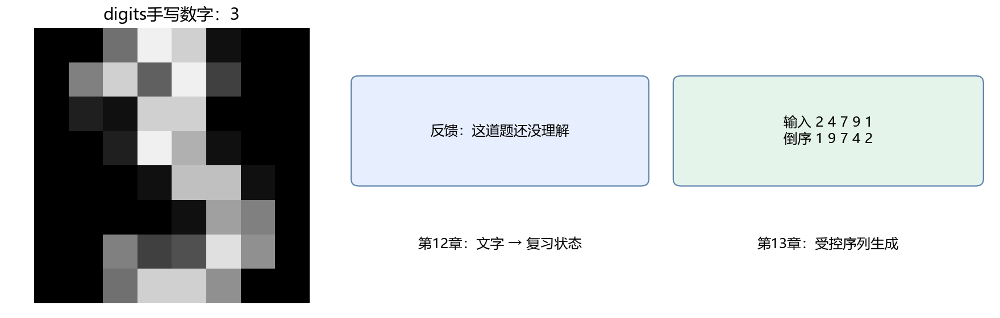

# 第三部分：机器学习与深度学习

本部分在Python、微积分、线性代数与概率基础上，介绍模型评价、神经网络训练、CNN、NLP与Transformer。数字分类贯穿第8～11章，第12章转向文本分类，第13章以数字倒序任务介绍序列生成。



数字图片来自digits数据集，中文文本使用明确列出的教学句子，倒序数据由随机数字生成。各章保留手算例子、公式推导、完整脚本与验收要求。最后的命令行演示分别加载三个模型，不进行联合训练。

## 章节安排

| 章节 | 学习内容 | 本章产出 |
| --- | --- | --- |
| [8 机器学习任务与模型评价](08-机器学习任务与模型评价.md) | 怎样确认编号读对了，而不是记住训练图片 | 基线、独立划分、可加载分类器与评价 |
| [9 模型如何学习与神经网络](09-模型如何学习与神经网络.md) | 3与8读错以后，参数为什么会改变 | NumPy 3/8分类器、逐层推导与梯度检查 |
| [10 PyTorch训练与模型管理](10-PyTorch训练与模型管理.md) | 恢复十类任务，并跨天继续使用 | 自动求导、最佳权重、训练检查点与曲线 |
| [11 CNN与图像识别](11-CNN与图像识别.md) | 怎样利用相邻笔画并读自备图 | NumPy手写CNN、梯度核对、特征图与图片预测 |
| [12 NLP与序列建模](12-NLP与序列建模.md) | “会了”和“还不会”怎样进入模型 | TF-IDF与GRU对照、词表、字符生成 |
| [13 注意力与Transformer](13-注意力与Transformer.md) | 怎样按格式生成复核编号并检查失败 | 因果模型、自由生成与整合演示 |

第9章双月数据是用于画二维边界的辅助实验台，不是从图像提取的真实坐标。真实短信与预训练ResNet作为可选扩展，分别练习真实文本评价与迁移学习，不替代基础实验。

## 怎样读公式与代码

局部公式先给目标、符号与数值例子，再推导；反向传播、门控与注意力沿计算顺序组合。先问输入是什么、输出给谁、每个轴表示什么，再跟踪一张图片或一条文本。

初读优先走主线，决策树、Word2Vec、HMM、im2col和迁移学习可以回头再读，不作为下一章门槛。每章有学习目标、手算与形状练习、完整参考脚本、产出和验收。

章内短例子有的共享前面的变量，请按章节顺序运行；完整脚本可以独立运行。向AI提问时可以贴具体形状、当前公式与报错，要求只展开卡住的一步；理解后自己改一个数字核对。

## 环境与基础实验

各部分使用的 Python 环境及统一检查入口见[环境准备与复现](../附录/01-环境准备与复现.md)。安装本部分依赖后，可先运行 `python tools/check_environment.py --profile ml`，再开始实验。

统一使用conda + VS Code。第三部分建立独立`handmade-ml`环境，前两部分继续使用base。安装、镜像与CPU版本见[第10章环境设置](10-PyTorch训练与模型管理.md#101-使用conda与vs-code建立独立环境)。按顺序完成安装，选择同名解释器，再打开工作区根目录终端。

```powershell
conda activate handmade-ml
python script/part03/08_sklearn_task.py
python script/part03/09_numpy_network.py
python script/part03/10_torch_training.py
python script/part03/11_numpy_cnn.py
python script/part03/11_cnn.py
python script/part03/12_text.py
python script/part03/13_transformer.py
```

基础实验全部可用CPU，无需下载数据或预训练权重。脚本在`script/part03/`，模型和报告在`outputs/part03/`，正文引用图片统一在根目录`images/`。

## 把三个模块接到同一个演示

基础脚本运行后，加载已经保存的CNN、反馈GRU与Transformer：

```powershell
python script/part03/learning_card_demo.py --image outputs/part03/11_example_digit.png --feedback "这道题不懂需要复习" --digits 2 4 7 9 1
```

输出包含图片预测、反馈状态、未知字数、生成token、解码编号和完整正确性。图片与编号串是分别提供的，程序没有自动识别一组照片或整张图片上的文字；三个模块没有图文联合训练。

换自己的图片前，先按第11章准备黑底白字、居中的单个数字。反馈只有12条训练句，“自述已理解”只是句子分类，不是实际学习能力测量。

## 插图与核验

```powershell
python tools/draw_part03.py
python tools/draw_part03_story.py
python tools/draw_handwritten_cnn.py
python tools/verify_part03.py
python tools/review_markdown.py
```

前三条生成插图；核验工具运行基础实验、短例子、加载检查与整合演示，再把实验图复制到`images/`。只修改正文时可用`python tools/verify_part03.py --check-only`复查现有产出，避免重新训练。

最后一条检查Markdown结构并生成`outputs/review/`下的本地审阅页。VS Code可用`Ctrl+Shift+V`直接预览。本地审阅样式与GitHub可能有差异，不能代替GitHub页面检查。

只在需要生成HTML审阅页时安装两个附加依赖；课程实验不需要它们：

```powershell
python -m pip install markdown-it-py==3.0.0 mdit-py-plugins==0.4.2 -i https://pypi.tuna.tsinghua.edu.cn/simple
```

首次生成审阅页还会下载MathJax脚本，缓存后可离线使用。正文公式使用GitHub支持的`math`块与受保护的行内公式写法，表格前保留空行。[GitHub公式写法](https://docs.github.com/en/get-started/writing-on-github/working-with-advanced-formatting/writing-mathematical-expressions) · [GitHub表格写法](https://docs.github.com/en/get-started/writing-on-github/working-with-advanced-formatting/organizing-information-with-tables)

## 可选真实数据与迁移学习

```powershell
python script/part03/12_real_sms.py
python script/part03/11_transfer_learning.py
```

首次联网下载，后续使用缓存。短信保存在`data/part03/`并附来源和许可，ResNet缓存由torch管理；失败会报错，不会换成教学句子。[UCI短信数据](https://archive.ics.uci.edu/dataset/228/sms+spam+collection) · [官方ResNet18](https://docs.pytorch.org/vision/stable/models/generated/torchvision.models.resnet18.html)

完整基础与扩展核验可直接运行`python tools/verify_part03.py --extras`，不必先重复运行上面两条。

## 怎样看待本次实验成绩

MLP与CNN测试准确率约96.4%和96.1%；结构、轮数等也不同，没有多种子显著性比较，不能凭差异宣称谁更好。手写与自动求导最大差约`6.9e-18`，说明该数值检查通过，不保证所有未来代码都正确。

真实短信去重后5159条，测试spam召回率约93.0%、F1约92.2%。中文小数据分数只检查教学实现。倒序模型训练长度5的测试整串正确率100%，长度3与7均为0：固定布局成功不代表学会通用倒序算法。

本机使用Windows、Python 3.12.15、NumPy 1.26.4、Matplotlib 3.8.4、scikit-learn 1.5.2、PyTorch 2.5.1+cpu与torchvision 0.20.1+cpu。依赖见`outputs/part03/requirements-verified.txt`，实际成绩见各章JSON，检查记录见`verification.json`。

正文包含手算、逐步推导与接口说明。程序核验和读者理解是不同证据，阅读体验仍需试读反馈。第四部分将沿用输入、推理与评价基础，进入大模型与部署。

## 阅读方法与参考

阅读时先确认输入、输出和数组形状，再代入数值检查公式。局部公式先给定义和例子，组合计算按依赖顺序展开。代码示例按章节顺序运行，完整脚本可独立执行。

第11章依次实现单窗口卷积、滑动卷积、池化、分类头、各层反向传播和参数更新。梯度先通过中心差分检查，再与同结构PyTorch结果对照，训练结果通过独立验证集与测试集评价。

教学步骤参考Tariq Rashid的《Python神经网络编程》（Make Your Own Neural Network）。该书手写的是全连接网络；本教程自行实现NumPy CNN，并提供原创插图和数值核对。
