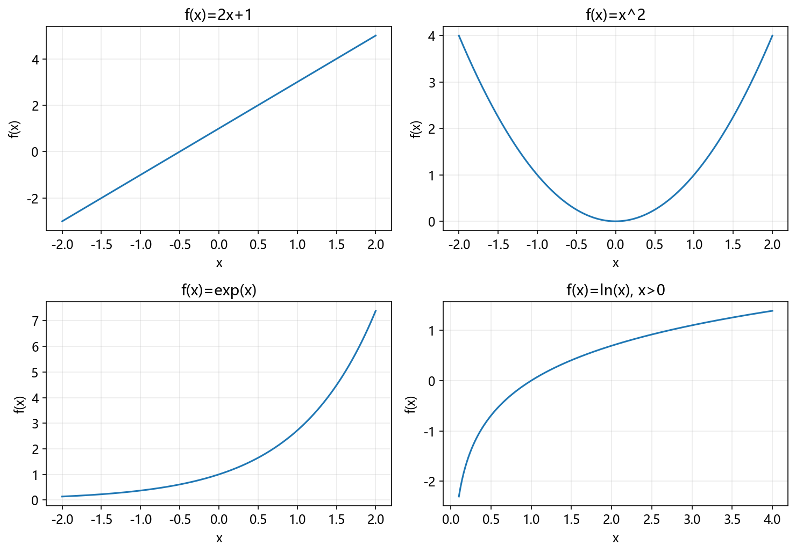
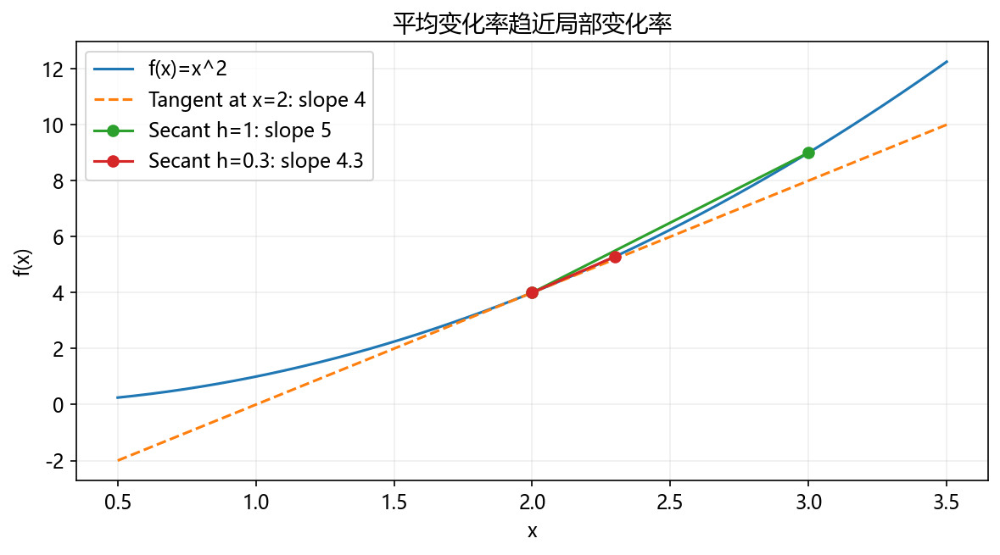
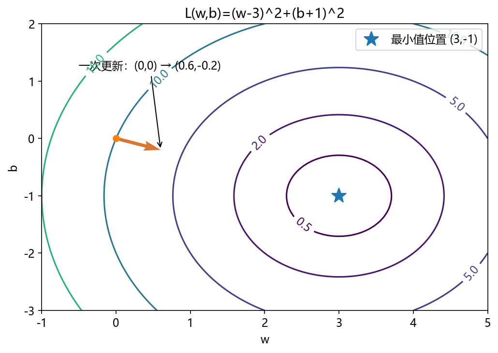
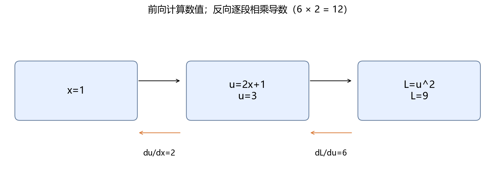
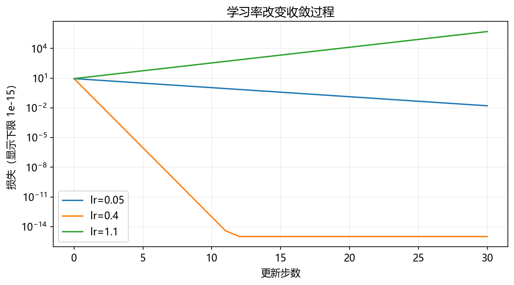
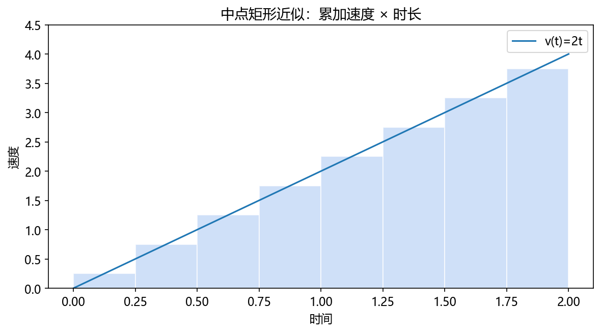

# 第 4 章：函数与微积分入门

你已经会用函数处理数字。这一章解释：输入改变时，输出怎样改变？怎样找出让输出最小的输入？它们分别通向导数和优化，是以后理解“模型怎样学习”的基础。

**先修：** Python 函数与循环、NumPy 数组、折线图。暂时不需要矩阵求导。

## 4.1 读公式：名字、运算与索引

数学函数 `f(x)` 表示输入 x 对应的输出，类似 Python 的 `f(x)`。公式里的字母通常是数字或待求的量，并非新的语法。

| 符号 | 读法 | 具体例子 |
|---|---|---|
| `x²` | x 的平方 | x=3 时为 9，Python 写 x ** 2 |
| `xᵢ` | 第 i 个 x | 一批数据里的某个值 |
| `Σᵢ₌₁ⁿ xᵢ` | 从第 1 项加到第 n 项 | 2+4+6=12 |
| `|x|` | 绝对值 | |-3|=3 |
| `≈` | 近似相等 | 小数或数值计算的近似结果 |
| `∈` | 属于 | x∈{1,2} 表示 x 是 1 或 2 |

数学索引经常从 1 开始，Python 通常从 0 开始。对应数据时要明确编号。

```python
values = [2, 4, 6]
mean = sum(values) / len(values)
print(mean)  # 4.0，对应 (1/n)Σ xᵢ
```

**随堂检查：** `(1/3)Σᵢ₌₁³ xᵢ²` 与 `((1/3)Σᵢ₌₁³ xᵢ)²` 对 x=[1,2,3] 是否相等？前者为 14/3，后者为 4。括号与运算顺序不能忽略。

## 4.2 函数、坐标与定义域

先看 `f(x)=2x+1`。x 是输入，f(x) 是输出；x=3 时输出 7。画图时把输入放在横轴，输出放在纵轴。

```python
def f(x):
    return 2 * x + 1

for x in [0, 1, 2, 3]:
    print(x, f(x))
```

输出 `(0,1)、(1,3)、(2,5)、(3,7)`，每对值占一行。函数不一定是直线，例如 `g(x)=x²`；x 从 -2 到 2，输出先下降再上升。



定义域是允许的输入集合。`1/x` 不允许 x=0；实数范围内 `log(x)` 只允许 x>0。函数值很大或很小也可能超出计算机的表示范围。

## 4.3 幂、指数与对数

幂 `x²` 把输入放在底数，指数 `2ˣ` 把输入放在指数。指数增长会越来越快，例如 1、2、4、8、16。

自然指数写成 `eˣ`，其中 e≈2.718。自然对数 `ln(x)` 是它的反函数：`ln(eˣ)=x`。Python 的 `math.log` 与 NumPy 的 `np.log` 默认是自然对数。

```python
import numpy as np

print(np.exp(0))  # 1.0
assert np.isclose(np.log(np.exp(2)), 2)
assert np.isclose(np.log(2 * 3), np.log(2) + np.log(3))
print("对数性质核验通过")
```

对正数 a、b，有 `ln(ab)=ln(a)+ln(b)`。这让很多小概率相乘可以转成对数相加，后面的概率章会用到。不是所有运算都能这样改写：`ln(a+b)` 通常不等于 `ln(a)+ln(b)`。

## 4.4 从平均变化率到极限

走路 10 秒前进 20 米，平均速度是 20/10=2 米/秒。函数的平均变化率也一样：

```math
\frac{f(x+h)-f(x)}{h}
```

这里 h 是输入变化量，分子是输出变化量。对 `f(x)=x²`，从 x=2 到 x=3，变化率是 `(9-4)/(3-2)=5`。

如果想知道“就在 x=2 附近”的变化，取更小的 h：

```python
def f(x):
    return x ** 2

for h in [1, 0.1, 0.01, 0.001]:
    print(h, round((f(2 + h) - f(2)) / h, 6))
```

对应变化率为 5、4.1、4.01、4.001，趋近 4。**极限**描述靠近某个位置时的趋势；这里不是把 h=0 直接代入除法，而是观察 h 趋近 0 的结果。

## 4.5 导数：某一点附近的变化率

导数写成 `f′(x)` 或 `df/dx`。当极限存在时：

```math
f'(x)=\lim_{h\to0}\frac{f(x+h)-f(x)}h
```

对平方函数，展开分子：`(x+h)²-x²=2xh+h²`；除以 h 得 `2x+h`；h 趋近 0，结果是 `2x`。所以 `f′(2)=4`。



导数正表示附近随 x 增大而上升，负表示下降，绝对值大表示变化快。导数是局部描述：在 x=2 附近，`f(2+0.01)≈f(2)+4×0.01=4.04`，实际为 4.0401。

| 函数 | 导数 | 备注 |
|---|---|---|
| 常数 c | 0 | 输入改变不影响输出 |
| ax+b | a | 斜率固定 |
| x² | 2x | 随位置变化 |
| xⁿ | nxⁿ⁻¹ | 使用时确认函数定义域 |
| eˣ | eˣ | 自然指数 |
| ln(x) | 1/x | x>0 |

相加可分别求导，乘常数可把常数保留；乘两个函数要用乘积规则 `(uv)′=u′v+uv′`，不是 `u′v′`。

**随堂检查：** `f(x)=3x²+2x+1` 在 x=2 的导数？`6x+2=14`。

## 4.6 数值求导与误差

没有解析导数时，可以在左右两侧各取一个点：

```math
f'(x)\approx\frac{f(x+h)-f(x-h)}{2h}
```

这叫中心差分。对于足够光滑的函数，截断误差通常随 h² 缩小；但 h 过小也会因浮点舍入与相减造成误差，不能越小越好。

```python
import numpy as np

def f(x):
    return np.exp(x)

def numerical_derivative(fn, x, h=1e-5):
    return (fn(x + h) - fn(x - h)) / (2 * h)

estimate = numerical_derivative(f, 1.0)
exact = np.exp(1.0)
print(round(estimate, 6))  # 2.718282
assert np.isclose(estimate, exact, rtol=1e-7)
```

以后手写反向传播时，可以用数值导数与手算梯度互相核对。本例函数可导；绝对值函数在 0 点左右斜率不同，中心差分得到 0 不能证明该点可导。

## 4.7 偏导数与梯度：多个输入怎样改变

考虑 `L(w,b)=(w-3)²+(b+1)²`，两个输入共同决定输出。对 w 求导时先把 b 固定，叫偏导数；对 b 求导时把 w 固定。

```math
\frac{\partial L}{\partial w}=2(w-3),\qquad\frac{\partial L}{\partial b}=2(b+1)
```

把偏导数按输入顺序组成向量，就是梯度 `∇L`。w=0、b=0 时梯度为 `[-6,2]`。



可以先理解成“w 增加一点，L 倾向下降；b 增加一点，L 倾向上升”。对于光滑函数，梯度在通常的欧氏距离约束下指向局部增长最快的方向；想下降就朝相反方向小步走。

```python
import numpy as np

def loss(parameters):
    w, b = parameters
    return (w - 3) ** 2 + (b + 1) ** 2

def grad(parameters):
    w, b = parameters
    return np.array([2 * (w - 3), 2 * (b + 1)])

parameters = np.array([0.0, 0.0])
updated = parameters - 0.1 * grad(parameters)
print(updated)  # [0.6 -0.2]
assert loss(updated) < loss(parameters)
```

## 4.8 链式法则与计算图

函数可以套函数：`u=2x+1`，`L=u²`。输出怎样随 x 变化，需要连接两段变化率：

```math
\frac{dL}{dx}=\frac{dL}{du}\frac{du}{dx}=2u\times2
```

在 x=1 时，u=3，最终导数是 12。不是只对外面的平方求导。



```python
import numpy as np

x = 1.0
u = 2 * x + 1
analytic = 2 * u * 2
def loss(x):
    return (2 * x + 1) ** 2
h = 1e-5
numerical = (loss(x + h) - loss(x - h)) / (2 * h)
print(analytic)  # 12.0
assert np.isclose(analytic, numerical)
```

计算图把每次操作画成节点，先计算中间值，再从输出向输入逐段传递导数。如果同一个输入沿多条路径影响输出，各路径贡献需要相加，例如 `L=x²+x` 的导数是 `2x+1`。神经网络的反向传播就是把这件事推广到大量操作。

## 4.9 梯度下降与学习率

对于单变量函数 `L(w)=(w-3)²`，导数为 `2(w-3)`。更新公式：

```math
w_{新}=w_{旧}-\eta\,L'(w_{旧})
```

η 是学习率，表示每次按导数走多大一步。w=0、η=0.1 时，第一次变成 0-0.1×(-6)=0.6。

```python
w = 0.0
lr = 0.1
for step in range(5):
    gradient = 2 * (w - 3)
    w = w - lr * gradient
    print(step + 1, round(w, 4), round((w - 3) ** 2, 4))
```

w 依次为 0.6、1.08、1.464、1.7712、2.017，损失逐渐下降。



对这个函数，误差更新为 `w新-3=(1-2η)(w旧-3)`。因此 `0<η<1` 时误差逐渐缩小；η=1 时往返振荡；η>1 时误差扩大。这是本例的结论，不是所有函数的通用学习率范围。

导数为 0 不一定是最小值，例如 `-x²` 在 0 的导数也是 0，但那里是最大值。复杂模型也不保证梯度下降找到全局最优。

## 4.10 积分：把小贡献累积起来

速度随时间变化时，总路程来自每段时间的“速度×时长”的累积。定积分可理解为把这些小贡献求和后，逐步细分得到的极限。

例如速度 `v(t)=2t`，从 t=0 到 t=2 的路程对应曲线下方三角形面积：底 2、高 4，面积 4。



```python
import numpy as np

n = 1000
dt = 2 / n
midpoints = (np.arange(n) + 0.5) * dt
distance = np.sum(2 * midpoints * dt)
print(round(distance, 6))  # 4.0
assert np.isclose(distance, 4)
```

这里用每小段的中点速度乘 dt。连续概率密度的总概率也用积分计算，概率章会连接这个概念。一般定积分是带符号的累积，不总是几何面积；本例速度非负。

在适当的连续性条件下，积分与求导相联系：若 `F′(x)=f(x)`，则从 a 到 b 的定积分为 `F(b)-F(a)`。本例 `F(t)=t²`，结果 `2²-0²=4`。

## 4.11 章末产出：函数变化与梯度下降实验

**任务：** 比较学习率 0.05、0.4、1.1 对 `L(w)=(w-3)²` 的影响；保存损失图与数值记录；用中心差分核验导数。

在项目根目录执行 `python script/part02/04_calculus.py`。参考脚本写入：

- `outputs/part02/04-calculus.json`：三种学习率的参数与损失记录、求导误差。
- `outputs/part02/04-learning-rates.png`：损失对比图。

**验收：** 能手算第一次更新；说明小学习率收敛较慢、0.4 更快、1.1 发散；数值导数与解析导数最大差异小于 1e-6。再把目标点 3 改成 5，调整对应导数和最优值，检查曲线是否符合预期。

这些实验检查的是简单光滑函数上的机制，不能直接当作实际神经网络性能结论。

## 4.12 自检与下一章

| 问题 | 答案 |
|---|---|
| 平均变化率与导数有何不同？ | 前者跨一段区间，后者是局部极限。 |
| 偏导数求导时怎样处理其他输入？ | 固定其他输入。 |
| 梯度下降为什么减梯度？ | 小步向局部下降方向移动。 |
| 学习率越大是否越好？ | 可能振荡或发散。 |
| 链式法则为什么要乘各段导数？ | 输入影响沿中间变量逐段传递。 |
### 补充练习与验收

先独立完成[本章两道练习](../assets/practice/part02.md#第04章)，再核对参考答案和本章验收证据。记录自己的输入、结果与边界案例，不要求复制作者的实验数值。

[本部分目录](README.md) · [下一章：线性代数与向量计算](05-线性代数与向量计算.md)
