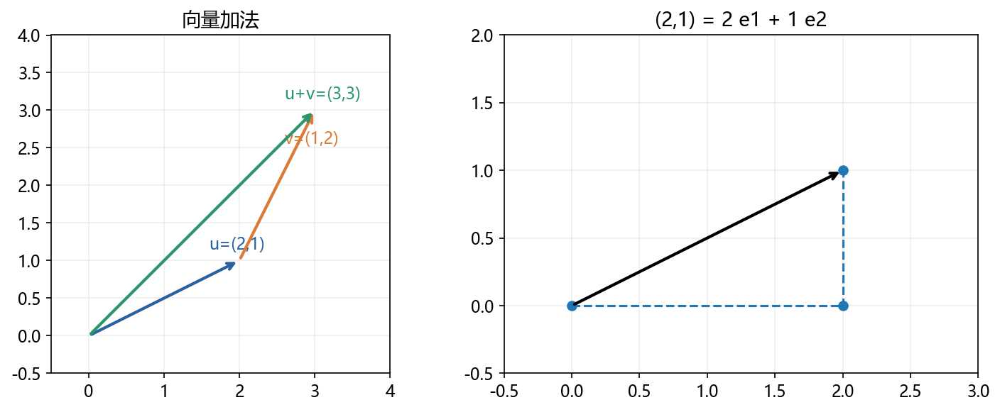
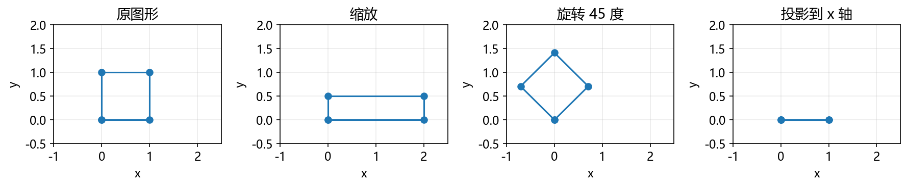
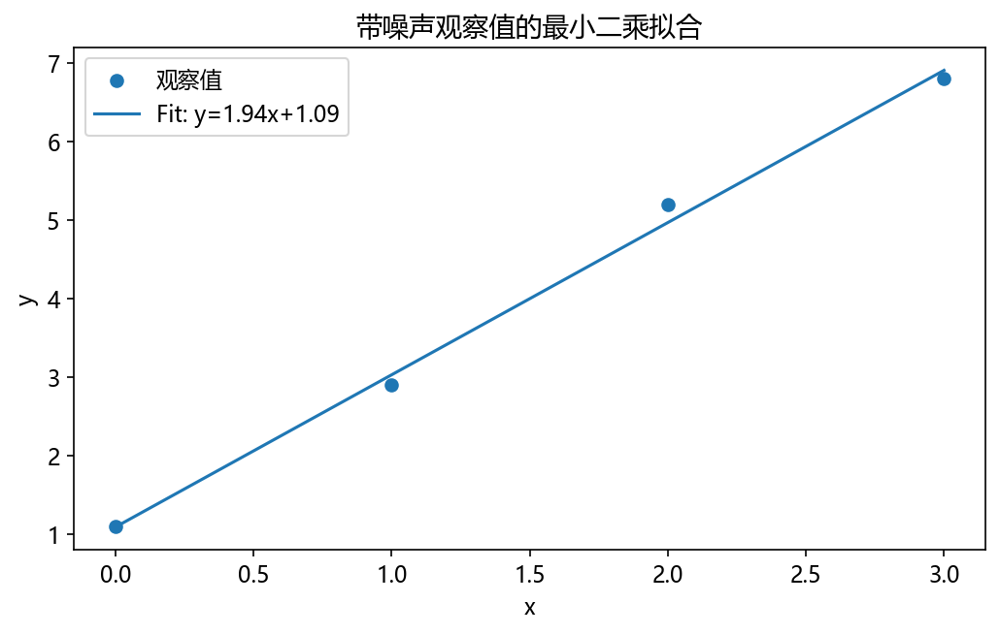

# 第 5 章：线性代数与向量计算

上一章学习一个或多个输入怎样影响输出。这一章把多维数据看成向量，理解矩阵怎样组合、变换这些数据。它连接机器学习的特征、线性层和文本向量。

**先修：** NumPy 的 shape、索引、广播、`*` 与 `@`。本章先在二维空间建立直觉，再写通用形状。

## 5.1 标量、向量、矩阵与张量

一个数字是标量；按顺序排列的一组数字是向量；二维数字表是矩阵。张量在本书的数组计算语境中表示带若干轴的多维数值数据，也包含低维情况。

例如一个人的两科成绩 `[80,90]` 是向量，三个人的成绩表是矩阵。

```python
import numpy as np

scalar = np.array(3.0)
vector = np.array([80, 90])
matrix = np.array([[80, 90], [60, 70], [100, 80]])
print(scalar.shape, vector.shape, matrix.shape)  # () (2,) (3, 2)
```

先确认每个位置是什么意思，再看形状。shape 相同不代表含义相同：身高体重和语文数学虽然都是两列，不能随意交换。

## 5.2 向量加法与缩放

二维向量可以画成从原点指向某个位置的箭头，例如 `[2,1]` 表示横向 2、纵向 1。



```python
import numpy as np

u = np.array([2.0, 1.0])
v = np.array([1.0, 2.0])
print(u + v)  # [3. 3.]
print(2 * u)  # [4. 2.]
print(0.5 * u - v)  # [0. -1.5]
```

线性组合指给向量乘系数后相加。二维标准基向量 `e₁=[1,0]`、`e₂=[0,1]`，任意 `[a,b]` 都可写成 `a e₁+b e₂`。

如果两个向量只是同一方向的不同倍数，它们只能组合出一条线；如果方向独立，则可以覆盖整个二维平面。这是后面理解“秩”的起点。

## 5.3 长度、点积与相似度

向量 `[3,4]` 的欧氏长度为 `√(3²+4²)=5`，写成 `||v||`。点积把对应元素相乘后求和：`u·v=Σuᵢvᵢ`。

```python
import numpy as np

u = np.array([3.0, 4.0])
v = np.array([1.0, 0.0])
print(np.linalg.norm(u))  # 5.0
print(u @ v)             # 3.0
cosine = (u @ v) / (np.linalg.norm(u) * np.linalg.norm(v))
print(cosine)            # 0.6
```

对非零向量，点积满足 `u·v=||u||||v||cosθ`。余弦相似度比较方向，取值在 [-1,1]：同向为 1，垂直为 0，反向为 -1。零向量没有定义好的方向，因此不能直接计算余弦。

用“学习时间、阅读量”表示两个人时，相似方向可以反映比例近似；但必须先考虑单位和尺度。这里不是说任意两个数字的夹角都有实际意义。

## 5.4 矩阵乘法是怎样组合数据的

下面统一数学约定：用列向量 x 表示一个输入，变换写成 `y=Ax`。NumPy 的一维数组可以在计算中承担向量角色，先用 shape 说明清楚。

```python
import numpy as np

a = np.array([[2.0, 0.0], [0.0, 0.5]])
x = np.array([1.0, 2.0])
y = a @ x
print(y)  # [2. 1.]
```

A 的每一行与 x 点积，得到一个输出。这个 A 把横坐标放大两倍、纵坐标缩小一半。



矩阵的每一列告诉你一个标准基向量被送到哪里。要验证线性，可看 `A(u+v)=Au+Av` 和 `A(cu)=cAu`，即保持加法与缩放关系。

```python
import numpy as np

a = np.array([[2., 1.], [0., 1.]])
u, v = np.array([1., 2.]), np.array([3., -1.])
assert np.allclose(a @ (u + v), a @ u + a @ v)
assert np.allclose(a @ (3 * u), 3 * (a @ u))
print("线性性质核验通过")
```

加上固定偏置的 `Ax+b` 通常称仿射变换，b≠0 时不再满足上面的线性关系。神经网络中的 Linear 层常包含这个偏置。

## 5.5 批量数据、转置与形状核验

机器学习常把每个样本放在一行，数据 `X` 的形状为 `(n,d)`，n 是样本数、d 是特征数。为了得到每个样本的 k 个输出，可写：

$$Y=XW+b,\quad X:(n,d),\ W:(d,k),\ b:(k,)$$

```python
import numpy as np

x = np.array([[1., 2.], [3., 4.], [5., 6.]])
w = np.array([[2., -1.], [1., 0.]])
b = np.array([0.5, 1.])
y = x @ w + b
print(y.shape)  # (3, 2)
print(y[0])     # [4.5 0.]
```

这是按行存放样本后的约定，不是与列向量公式矛盾。框架可能把权重存成 `(k,d)`，前向就写 `X @ W.T + b`，阅读时先看存储形状。

二维转置 `.T` 交换行列，并满足 `(AB)ᵀ=BᵀAᵀ`，顺序要反过来。矩阵乘法一般不能交换：AB 和 BA 可能不同，甚至一方没有定义。

## 5.6 线性方程组：找出未知量

两个条件：`2x+y=5`、`x-y=1`。把系数放在矩阵里，未知量放进向量，写成 `Az=b`。

```python
import numpy as np

a = np.array([[2., 1.], [1., -1.]])
b = np.array([5., 1.])
z = np.linalg.solve(a, b)
print(z)  # [2. 1.]
assert np.allclose(a @ z, b)
```

solve 用来求解这里的可逆方阵系统。方程可能无解、有唯一解或有很多解；不能看到一组系数就默认能求唯一解。

## 5.7 逆矩阵、秩与信息丢失

逆矩阵相当于撤销一个可逆变换：`A⁻¹A=I`，I 是单位矩阵。不是把每个元素取倒数。

如果变换把二维平面压到一条线，不同输入可能得到同一输出，无法唯一恢复。矩阵的秩描述独立列的数量，也描述它能保留多少独立方向。

```python
import numpy as np

full = np.array([[2., 0.], [0., 1.]])
collapsed = np.array([[1., 2.], [2., 4.]])
print(np.linalg.matrix_rank(full))       # 2
print(np.linalg.matrix_rank(collapsed))  # 1
assert np.allclose(np.linalg.inv(full) @ full, np.eye(2))
```

collapsed 的第二列是第一列的两倍，不能提供新的方向。数值库判断秩时有容差；非常接近相关的列可能使问题对小扰动敏感。

求解方程组优先用 solve，而不是先显式求逆再乘；矩形数据拟合可以用下一节的 lstsq。

## 5.8 最小二乘：数据不完全落在直线上

假设观察 `(x,y)`，用 `y≈wx+b` 拟合。通常没有一条直线穿过所有带噪声的数据，所以最小化误差平方和：

$$\sum_i(wx_i+b-y_i)^2$$

平方使正负误差不会抵消，也让大误差受到更大惩罚。把 x 和常数 1 放在两列，参数向量是 `[w,b]`。

```python
import numpy as np

x = np.array([0., 1., 2., 3.])
y = np.array([1.1, 2.9, 5.2, 6.8])
design = np.column_stack([x, np.ones_like(x)])
parameters, _, _, _ = np.linalg.lstsq(design, y, rcond=None)
prediction = design @ parameters
print(np.round(parameters, 3))  # [1.94 1.09]
mse = np.mean((prediction - y) ** 2)
assert mse < np.mean((y.mean() - y) ** 2)
```



下划线表示暂时不用的返回值。这里用 lstsq 避免要求你先掌握求逆公式；下一部分会把“拟合参数”连接到线性回归与梯度下降。

## 5.9 特征值与特征向量〔选修〕

有些方向经过矩阵变换后仍沿原来的直线，只被缩放或反向。若非零向量 v 满足 `Av=λv`，v 是特征向量，λ 是对应特征值。

```python
import numpy as np

a = np.array([[2., 0.], [0., 3.]])
v = np.array([1., 0.])
assert np.allclose(a @ v, 2 * v)
print(np.linalg.eigvalsh(a))  # [2. 3.]，本例是实对称矩阵
```

一般矩阵不保证有足够多的实特征向量；不要把这个简单例子推广到所有矩阵。这里先理解“某些方向的变化可以用一个倍数描述”，以后再用于理解方差、优化和系统稳定性。

## 5.10 低秩近似与降维〔选修〕

如果数据中很多方向重复，可以用较少方向近似表示。SVD 将矩阵拆成 `A=UΣVᵀ`；保留前 r 个较大的奇异值和对应方向，得到秩至多为 r 的近似。

```python
import numpy as np

a = np.array([[1., 2., 3.], [2., 4., 6.], [3., 6., 9.]])
u, s, vt = np.linalg.svd(a, full_matrices=False)
rank_one = (u[:, :1] * s[:1]) @ vt[:1, :]
assert np.allclose(rank_one, a)
print(np.linalg.matrix_rank(a))  # 1
```

本例本来就只有一个独立方向，所以秩 1 可以恢复；实际数据可能只能近似恢复。LoRA 后面会用两个小矩阵的乘积表达低秩权重更新，并不是说任意模型权重都能无损压缩。

## 5.11 章末产出：相似度检索与线性变换实验

**任务：** 为四条小记录构造三维特征，用余弦相似度选最接近查询的记录；画出二维图形在缩放、旋转、投影后的样子；比较秩 1、秩 2 近似误差。

运行 `python script/part02/05_linear_algebra.py`，生成：

- `outputs/part02/05-linear-algebra.json`：检索排名、矩阵秩和低秩误差。
- `outputs/part02/05-transforms.png`：变换对比。

**验收：** 能手算一个点积，说明零向量为什么不能直接算余弦；说明投影后为什么不能唯一恢复；秩 2 近似误差不高于秩 1。再改变查询方向，观察排名变化。

这些特征是人为设计的，说明的是向量检索计算流程，不等于训练出来的语义搜索。

## 5.12 自检

| 问题 | 答案 |
|---|---|
| 向量点积怎样计算？ | 对应元素相乘，再求和。 |
| 余弦相似度关注长度还是方向？ | 方向；输入必须非零。 |
| 矩阵乘法能交换顺序吗？ | 一般不能。 |
| 秩不足会怎样？ | 独立方向不足，可能丢失可恢复信息。 |
| 拟合有噪声数据为什么用最小二乘？ | 通常无法精确满足全部方程，改为最小化平方误差。 |

[上一章](04-函数与微积分入门.md) · [本部分目录](README.md) · [下一章：概率、统计与信息量](06-概率统计与信息量.md)
