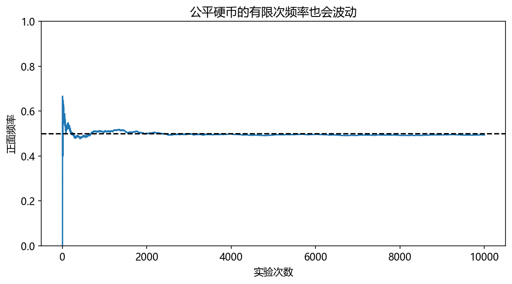
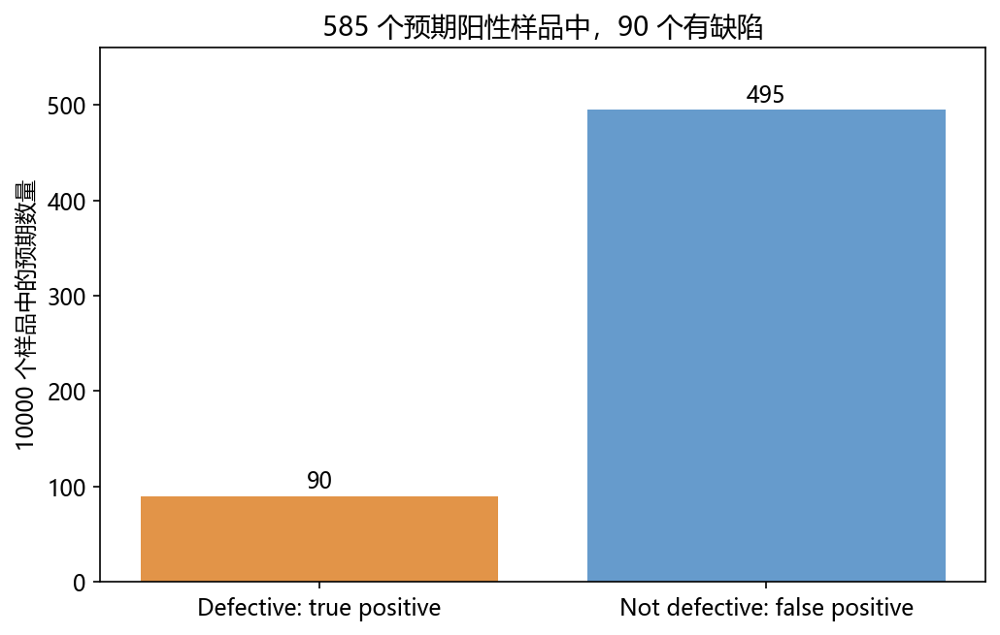
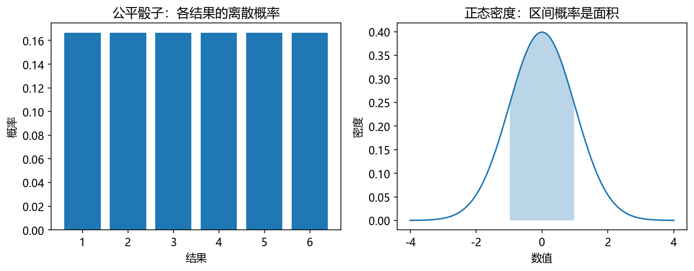
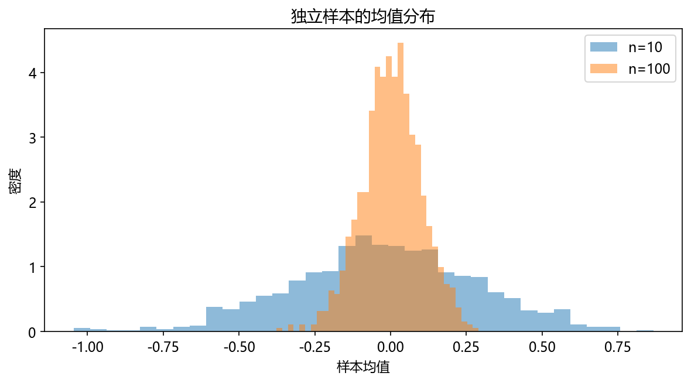
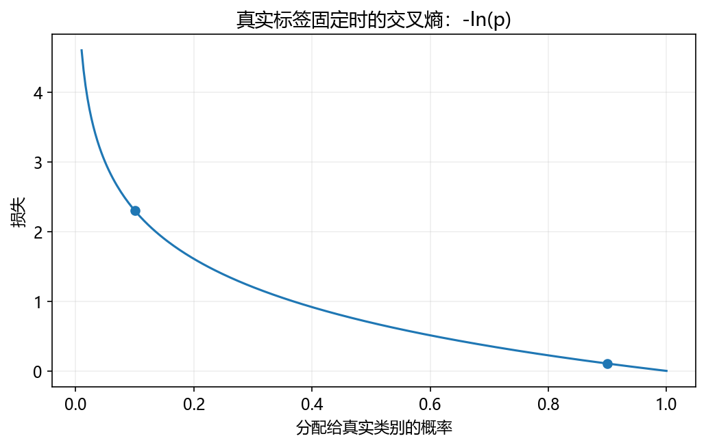

# 第 6 章：概率、统计与信息量

模型经常给出“这个类别的概率”，训练时又会看到交叉熵。这一章从抛硬币和计数开始，逐步连接条件概率、统计估计与预测信息量。

**先修：** 循环、NumPy 均值与随机数，第 4 章的指数、对数和积分直觉。不需要先掌握概率分布的专业术语。

## 6.1 事件、样本空间与概率

一次掷骰子的可能结果是 `{1,2,3,4,5,6}`，称样本空间。事件是其中一组结果，例如“偶数”对应 `{2,4,6}`。

若骰子公平，六个结果等可能，则偶数概率为 3/6=1/2。概率在 [0,1] 之间：0 表示零概率，1 表示必然事件的概率。连续变量里零概率事件不一定是不可能的，后面会说明。

```python
outcomes = set(range(1, 7))
even = {2, 4, 6}
print(len(even) / len(outcomes))  # 0.5
```

“有利结果数/总结果数”只适用于有限且各结果等可能的情况，不适用于任何随机问题。

互斥事件不能同时发生，例如骰子为 1 和为 2；其并集概率直接相加。一般情况要减去重叠：`P(A∪B)=P(A)+P(B)-P(A∩B)`。

## 6.2 频率与概率：多次实验看到什么

概率是模型中的量；频率是有限次实验观察到的比例。公平硬币也可能连续几次正面，不要求每两次恰好一正一反。

```python
import numpy as np

rng = np.random.default_rng(42)
heads = rng.integers(0, 2, size=10000)
frequency = np.cumsum(heads) / np.arange(1, len(heads) + 1)
print(round(float(frequency[-1]), 3))
assert abs(frequency[-1] - 0.5) < 0.03
```



对于独立同分布、具有相应期望的实验，大数定律说明样本平均会以适当意义靠近期望。频率不会保证单调靠近 0.5，也不是“前面正面多，后面必须补反面”。

## 6.3 条件概率与独立性

条件概率 `P(A|B)` 表示已知 B 发生时 A 的概率。当 P(B)>0：

```math
P(A|B)=\frac{P(A\cap B)}{P(B)}
```

公平骰子已知为偶数，则只在 `{2,4,6}` 中判断。大于 3 的结果有 `{4,6}`，条件概率为 2/3；没有这个条件时，大于 3 的概率为 1/2。

```python
even = {2, 4, 6}
greater_than_three = {4, 5, 6}
print(len(even & greater_than_three) / len(even))  # 0.666...
```

两个事件独立时 `P(A∩B)=P(A)P(B)`，也就是知道一个不改变另一个的概率。互斥不等于独立：两个有正概率的互斥事件知道一个发生后，另一个就不能发生。

以后语言模型中的 `P(下一个词|前文)` 是条件概率，前文改变了候选词的分布。

## 6.4 贝叶斯公式：把条件方向反过来

假设某种缺陷比例为 1%，检测对有缺陷样品的阳性率为 90%，对无缺陷样品的误报率为 5%。检测阳性后，真的有缺陷的概率不是 90%。

想象 10000 个样品：100 个有缺陷，预期 90 个阳性；9900 个无缺陷，预期 495 个误报。阳性里有缺陷的比例为 `90/(90+495)≈15.38%`。



```math
P(D|+) = \frac{P(+|D)P(D)}{P(+|D)P(D)+P(+|\neg D)P(\neg D)}
```

```python
prevalence = 0.01
sensitivity = 0.90
false_positive = 0.05
positive = sensitivity * prevalence + false_positive * (1 - prevalence)
posterior = sensitivity * prevalence / positive
print(round(posterior, 4))  # 0.1538
```

D 是有缺陷，`¬D` 是无缺陷。先验是观察检测前的缺陷概率，后验是看见阳性后的概率。这是人为假设的计算示例，不是具体产品或医疗检测的参数。

## 6.5 随机变量与常见分布

随机变量把随机结果对应成数值。硬币正面记为 1、反面记为 0，是取两个值的随机变量。

| 分布 | 描述 | 例子 |
|---|---|---|
| 伯努利 | 一次 0/1 结果 | 是否正面 |
| 二项 | 固定次数独立伯努利实验的成功数 | 10 次中正面次数 |
| 离散均匀 | 有限结果等可能 | 公平骰子 |
| 正态 | 中间较集中、两边较少的连续模型 | 某些测量误差的近似 |



离散变量在每个值上有概率，概率相加为 1。连续变量用**密度**描述，区间概率是密度曲线下的积分；密度高度不是点概率，也可能大于 1。通常的连续密度模型中，一个精确点的概率为 0，区间仍有正概率。

```python
import numpy as np

rng = np.random.default_rng(7)
normal = rng.normal(loc=0, scale=1, size=10000)
within_one = np.mean((normal >= -1) & (normal <= 1))
print(round(float(within_one), 3))  # 接近 0.68，不要求固定小数
assert 0.64 < within_one < 0.72
```

不是所有数据都正态分布，要结合来源与图形判断。调用生成器模拟正态数据，并不能证明真实数据服从正态分布。

## 6.6 期望、方差与标准差

离散变量的期望是按概率加权的平均：`E[X]=ΣxP(X=x)`。公平骰子的期望是 `(1+2+3+4+5+6)/6=3.5`，虽然单次不可能掷出 3.5。

方差描述围绕期望的平方偏离：`Var(X)=E[(X-E[X])²]`。标准差是方差的平方根，单位与原数值一致。

```python
import numpy as np

values = np.arange(1, 7, dtype=float)
probabilities = np.full(6, 1 / 6)
mean = np.sum(values * probabilities)
variance = np.sum((values - mean) ** 2 * probabilities)
print(mean)  # 3.5
print(round(float(variance), 6))  # 2.916667
print(round(float(np.sqrt(variance)), 6))  # 1.707825
```

在样本统计中，NumPy var 默认除以 n；若用样本估计总体方差，在独立同分布等条件下，`var(ddof=1)` 除以 n-1，得到常见的无偏样本方差估计。先说明自己算的是给定数据的描述量，还是总体的估计量。

## 6.7 抽样、估计与不确定性

只看到一小批数据时，样本均值不一定等于总体期望。多取几批同样大小的样本，可以看到均值本身也会变化。

```python
import numpy as np

rng = np.random.default_rng(10)
small = rng.normal(size=(1000, 10)).mean(axis=1)
large = rng.normal(size=(1000, 100)).mean(axis=1)
print(round(float(small.std()), 3), round(float(large.std()), 3))
assert large.std() < small.std()
```

这比较的是 1000 批样本均值的波动。本例独立样本的均值标准差随 `1/√n` 缩小；样本更多并不保证消除抽样偏差，例如只调查同一类人。



以后评估分类模型，不能只报告某一次测试准确率，还需要关注样本量、类别比例和数据是否代表实际使用场景。

## 6.8 似然与最大似然估计

概率通常是“参数已知，观察什么数据”。似然则是“数据已见，哪个参数更能解释它”，把同一个表达式视为参数的函数；它不是参数本身的概率分布。

10 次硬币中 7 次正面、3 次反面，设正面概率为 p。对这组独立观察的序列：

```math
L(p)=p^7(1-p)^3
```

取对数为 `7ln(p)+3ln(1-p)`；求导并令其为 0，可得 p=0.7。这里既用到了第 4 章的对数，也用到了求导。

```python
import numpy as np

candidates = np.linspace(0.01, 0.99, 99)
log_likelihood = 7 * np.log(candidates) + 3 * np.log(1 - candidates)
best = candidates[np.argmax(log_likelihood)]
print(round(float(best), 2))  # 0.7
```

若只关心正面次数，二项分布还包含组合系数；它不依赖 p，因此不影响这里的最大值位置。小样本估计可能过于极端，后面 n-gram 平滑会再次遇到这个问题。

## 6.9 信息量与熵

少见事件发生时更出人意料。用 `I(x)=-ln P(x)` 描述信息量：概率 1 时为 0，概率越小越大。这里自然对数的单位为 nat；使用 log₂ 时单位为 bit。

熵是平均信息量：

```math
H(P)=-\sum_i p_i\ln p_i
```

```python
import numpy as np

def entropy(p):
    p = np.asarray(p, dtype=float)
    positive = p > 0
    return float(-np.sum(p[positive] * np.log(p[positive])))

print(round(entropy([0.5, 0.5]), 6))  # 0.693147
print(round(entropy([0.9, 0.1]), 6))  # 0.325083
print(entropy([1.0, 0.0]))            # -0.0，数值意义为 0
```

每个分布先满足非负且总和为 1。0ln0 在熵中按极限约定为 0，所以跳过零项。对固定类别数，均匀分布熵最大；某一类几乎确定时熵较低。

## 6.10 交叉熵与 KL 散度

P 是真实分布，Q 是预测分布。交叉熵是用 Q 的信息量评价 P：

```math
H(P,Q)=-\sum_i p_i\ln q_i
```

若真实标签为第 0 类，P=[1,0]，交叉熵就是 `-ln q₀`。预测给正确类别 0.9，比给它 0.1 的损失小。

```python
import numpy as np

good = -np.log(0.9)
bad = -np.log(0.1)
print(round(float(good), 6), round(float(bad), 6))  # 0.105361 2.302585
assert good < bad

p = np.array([0.8, 0.2])
q = np.array([0.6, 0.4])
h_p = -np.sum(p * np.log(p))
cross_entropy = -np.sum(p * np.log(q))
kl = np.sum(p * np.log(p / q))
assert np.isclose(cross_entropy, h_p + kl)
assert kl >= 0
```

KL 散度为 `Σpᵢln(pᵢ/qᵢ)`，满足 `H(P,Q)=H(P)+KL(P||Q)`。它一般不对称，不是普通几何距离；若 P 某处为正而 Q 为 0，该项为无穷大。



训练分类模型时，希望提高正确类别的概率，从而降低损失。真实任务还需要用独立数据评估泛化能力，不能只看训练交叉熵。

## 6.11 从计数到文本概率与困惑度

先用三个 token 的小词表。训练文本中“猫”出现两次，“狗”和“鸟”各一次，计数归一化得到概率 `[0.5,0.25,0.25]`。

```python
from collections import Counter
import numpy as np

tokens = ["猫", "狗", "猫", "鸟"]
counts = Counter(tokens)
probabilities = {token: count / len(tokens) for token, count in counts.items()}
test = ["猫", "狗"]
mean_loss = -np.mean([np.log(probabilities[token]) for token in test])
perplexity = np.exp(mean_loss)
print(round(float(mean_loss), 6))  # 1.039721
print(round(float(perplexity), 6))  # 2.828427
```

困惑度是自然对数下平均负对数概率的指数。这个例子没有利用前文，是最简单的 unigram；后面的语言模型会预测条件概率。比较困惑度时，要保持测试集和分词方式一致。

未见 token 概率为 0，直接出现无穷损失。可为固定词表的每个词计数加一个小正数再归一化，称平滑；词表外的词还需未知词策略。平滑不是无条件提高所有测试结果。

## 6.12 章末产出：概率模拟与文本信息量实验

运行 `python script/part02/06_probability.py`，保存硬币累计频率图、贝叶斯结果、熵与文本困惑度：

- `outputs/part02/06-probability.json`
- `outputs/part02/06-frequency.png`

**验收：** 能手算阳性后验概率；说明均匀分布熵为什么较大；解释未见词为何产生问题；给出固定词表平滑前后测试困惑度。改变样本数或种子，不要求每次频率精确为 0.5。

## 6.13 自检

| 问题 | 答案 |
|---|---|
| P(A|B) 与 P(B|A) 一样吗？ | 通常不一样。 |
| 互斥是否等于独立？ | 不是。 |
| 连续密度高度是点概率吗？ | 不是，区间概率通过积分得到。 |
| 期望必须是可出现的单次值吗？ | 不必，如骰子期望 3.5。 |
| 似然是参数的概率吗？ | 不是；固定数据，把表达式视为参数函数。 |
| 交叉熵何时大？ | 对真实会发生的结果，预测概率给得小。 |
### 补充练习与验收

先独立完成[本章两道练习](../assets/practice/part02.md#第06章)，再核对参考答案和本章验收证据。记录自己的输入、结果与边界案例，不要求复制作者的实验数值。

[上一章](05-线性代数与向量计算.md) · [本部分目录](README.md) · [下一章：离散数学与算法思维](07-离散数学与算法思维.md)
