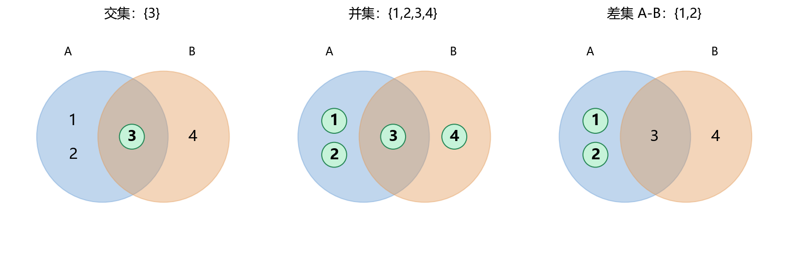
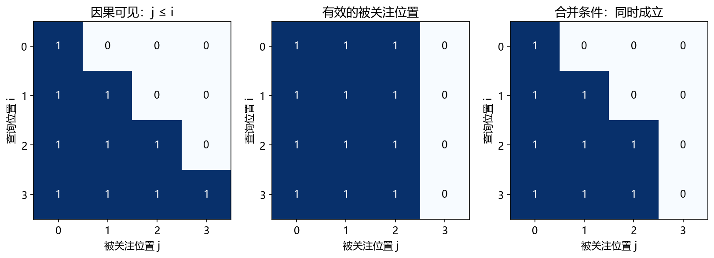
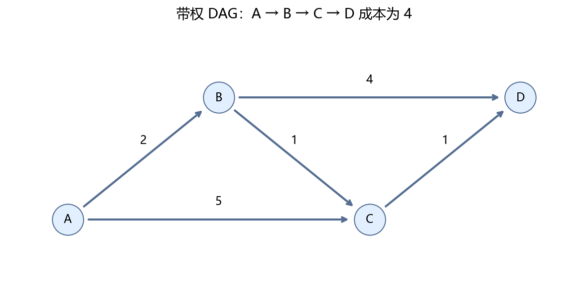
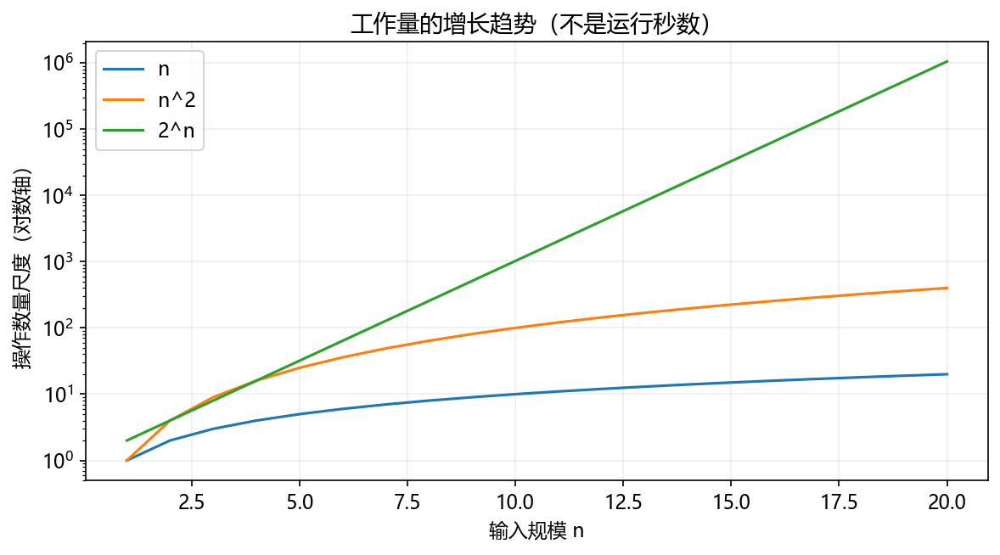

# 第 7 章：离散数学与算法思维

前面几章主要研究数值大小与变化。这一章研究集合、逻辑、关系、连接与分步骤决策。它帮助你理解过滤条件、注意力掩码、计算图、序列解码和 Agent 的任务流程。

**先修：** Python 集合、字典、循环和函数，NumPy 布尔数组。图论和动态规划从小例子开始。

## 7.1 集合、交集与并集

集合是没有重复元素的一组对象。A={1,2,3}、B={3,4}，交集是两者共同元素，并集是任一集合包含的元素，差集是 A 有而 B 没有的元素。

```python
a, b = {1, 2, 3}, {3, 4}
assert a & b == {3}
assert a | b == {1, 2, 3, 4}
assert a - b == {1, 2}
print({1, 2}.issubset(a))  # True
```



输出顺序没有保证。自然语言里“至少满足一个条件”对应并集，“同时满足两个”对应交集。全体关注对象称全集；补集需要明确全集后才有意义。

## 7.2 关系与映射

关系可以表示对象之间的联系，例如“学生选了课程”对应学生与课程的一组配对。一个学生可选多门课，一门课可有多个学生。

映射要求定义域里的每个输入恰有一个输出，例如学号对应学生姓名。不同输入可以对应相同输出，不能因此断定映射不成立。

```python
student_to_class = {"001": "A班", "002": "A班", "003": "B班"}
print(student_to_class["002"])  # A班
```

这是多对一映射。一对一称单射；覆盖目标集合的每个元素称满射；同时满足称双射。这里先理解查表与对应关系，避免把“函数一定是一对一”当作默认。

## 7.3 命题、逻辑与真值表

命题是能判断真假的陈述。P 可以表示“成绩及格”，Q 表示“作业完成”。`P and Q` 要两者成立，`P or Q` 是至少一个成立，`not P` 取反。

| P | Q | P and Q | P or Q |
|---|---|---|---|
| False | False | False | False |
| False | True | False | True |
| True | False | False | True |
| True | True | True | True |

“P 蕴含 Q”在命题逻辑中表示 `not P or Q`，只有 P 真而 Q 假时为假。它表达逻辑约束，不自动表达因果。

德摩根律：`not(P and Q)=(not P) or (not Q)`。

```python
for p in [False, True]:
    for q in [False, True]:
        assert (not (p and q)) == ((not p) or (not q))
print("4 种组合均通过")
```

**随堂检查：** “不是同时满足两项”是否等于“两项都不满足”？不是；只要有一项不满足就符合前者。

## 7.4 布尔逻辑怎样变成掩码

设序列有 4 个位置，位置 i 只能看到编号不大于 i 的位置，形成下三角布尔矩阵。这是因果掩码的简单形式。

```python
import numpy as np

length = 4
i = np.arange(length)[:, None]
j = np.arange(length)[None, :]
causal = j <= i
valid = np.array([True, True, True, False])
combined = causal & valid[None, :]
print(combined.astype(int))
assert not combined[:, 3].any()
```



行表示“谁在查询”，列表示“看谁”。`&` 在每个位置合并条件。这里约定 True=可见；实际框架有的 API 用 True 表示屏蔽，因此不能盲目照搬布尔值含义。

## 7.5 排列、组合与计数

3 个不同对象中取 2 个，若有顺序，AB 与 BA 不同，共 3×2=6 种；若无顺序，AB 与 BA 相同，共 3 种。

阶乘 `n!=n(n-1)…1`，约定 0!=1。不放回、有序选择为 `n!/(n-k)!`；无序选择为组合数 `C(n,k)=n!/[k!(n-k)!]`。

```python
import math
from itertools import permutations, combinations

items = ["A", "B", "C"]
print(len(list(permutations(items, 2))))  # 6
print(len(list(combinations(items, 2))))  # 3
print(math.comb(3, 2))  # 3
```

若每一步都能重复选 n 种对象，长度 k 的序列共有 nᵏ 种。这解释了为什么枚举词序列、状态序列可能迅速变得不可行。

## 7.6 递归与递推

递推用前面的结果计算后面的结果，例如“走到第 n 阶的方法数”可以由更小阶数得到。递归是函数调用自身的编程方式，两者相关但不是同一概念。

每次可走 1 或 2 阶，最后一步要么从 n-1 走 1 阶，要么从 n-2 走 2 阶：`ways(n)=ways(n-1)+ways(n-2)`。

```python
def ways(n):
    if n < 0:
        raise ValueError("阶数不能为负")
    if n <= 1:
        return 1
    return ways(n - 1) + ways(n - 2)

print(ways(4))  # 5
```

ways(0)=1 表示“不走任何一步”是一种完成方式。递归需要结束条件；直接递归会多次重算同一个值。较大输入时要改用缓存或迭代，不能无限往深处调用。

## 7.7 图、树与有向无环图

图由节点和边组成。节点可以是城市、变量或任务；边可以是道路、依赖或数据流。边有方向的是有向图，有成本的是带权图。



树是连通且无环的无向图；根树指定一个根后，可以讨论父节点与子节点。有向无环图简称 DAG，不存在沿箭头走回自身的环，但一个节点可以有多个前驱，不一定是树。

Python 可以用邻接表记录“每个节点连到谁”：

```python
graph = {"A": ["B", "C"], "B": ["D"], "C": ["D"], "D": []}
print(graph["A"])  # ['B', 'C']
```

计算图可以用边表示变量之间的依赖；拓扑顺序要求前驱先于后继，适合安排 DAG 中的计算。存在环的图不能这样排出完整顺序。

## 7.8 搜索：广度优先与深度优先

广度优先搜索 BFS 先看距离起点 1 条边的节点，再看 2 条边的节点。使用队列：先进入的先处理。

```python
from collections import deque

graph = {"A": ["B", "C"], "B": ["D"], "C": ["D"], "D": []}
queue = deque(["A"])
parent = {"A": None}
while queue:
    node = queue.popleft()
    for neighbor in graph[node]:
        if neighbor not in parent:
            parent[neighbor] = node
            queue.append(neighbor)
path, node = [], "D"
while node is not None:
    path.append(node)
    node = parent[node]
print(list(reversed(path)))  # ['A', 'B', 'D']
```

parent 同时记录已访问状态与回溯路径，避免在有环图中反复访问。BFS 找到的是无权图的最少边数路径；边权不同不能据此保证总成本最低。

深度优先搜索 DFS 先沿一条分支深入，再回头处理其他分支，通常用栈或递归；可用于遍历、检测某些结构，但也不自动保证最短路。

## 7.9 动态规划：保存子问题结果

动态规划把问题拆成状态，使用已经算过的子问题结果，避免重复计算。先把阶梯问题改成表格：

```python
n = 6
dp = [0] * (n + 1)
dp[0] = 1
dp[1] = 1
for step in range(2, n + 1):
    dp[step] = dp[step - 1] + dp[step - 2]
print(dp)  # [1, 1, 2, 3, 5, 8, 13]
```

状态是“走到第 step 阶的方法数”；转移是相加；初始状态是 0 阶和 1 阶。顺序从小到大保证需要的结果已经存在。

这不要求记住专用模板，而是先回答：一个状态代表什么、结果依赖哪些更小状态、哪些情况已经知道、如何按顺序计算。

## 7.10 带权 DAG 的最优决策

从 A 到 D，有 `A→B` 成本 2，`A→C` 成本 5，`B→C` 成本 1，`B→D` 成本 4，`C→D` 成本 1。

最优路径是 A→B→C→D，总成本 4。虽然 A→B→D 只有两条边，但成本为 6。

```python
graph = {"A": [("B", 2), ("C", 5)], "B": [("C", 1), ("D", 4)], "C": [("D", 1)], "D": []}
order = ["A", "B", "C", "D"]  # 本例已知的拓扑顺序
distance = {node: float("inf") for node in graph}
distance["A"] = 0
parent = {"A": None}
for node in order:
    for neighbor, cost in graph[node]:
        candidate = distance[node] + cost
        if candidate < distance[neighbor]:
            distance[neighbor] = candidate
            parent[neighbor] = node
assert distance["D"] == 4
print(distance)  # {'A': 0, 'B': 2, 'C': 3, 'D': 4}
```

这个算法依赖 DAG 与正确的拓扑顺序，不能给任意图随手列个节点顺序就使用。序列解码中的 Viterbi 会用类似的“到某个状态的最优得分＋转移”思想。

## 7.11 时间复杂度与空间复杂度

复杂度描述输入增长时，主要工作量或存储量怎样增长。O(n) 近似线性，O(n²) 近似平方，O(2ⁿ) 随输入迅速增长。



遍历 n 个数一次是 O(n)；比较每对元素常是 O(n²)；直接枚举所有二元选择序列是 O(2ⁿ)。这描述增长趋势，不是精确秒数；常数、硬件、数据布局也影响实际耗时。

BFS 使用邻接表且访问判断均摊常数时间时为 O(V+E)，V 是节点数，E 是边数。阶梯 DP 存整张表为 O(n) 空间，只保留前两个值时可降为 O(1) 空间。

```python
def ways_iterative(n):
    if n < 0:
        raise ValueError("阶数不能为负")
    previous, current = 1, 1
    for _ in range(n):
        previous, current = current, previous + current
    return previous

assert ways_iterative(0) == 1
assert ways_iterative(6) == 13
print("边界和递推结果通过")
```

这里的 O(n) 计数先把整数加法视作基本操作；极大整数的位数增长还会增加实际计算成本。入门时先理解结构带来的差异。

## 7.12 章末产出：路径搜索与最优决策

运行 `python script/part02/07_discrete.py`，生成：

- `outputs/part02/07-discrete.json`：BFS 最少边路径、带权最小成本路径、阶梯 DP 结果。
- `outputs/part02/07-graph.png`：带成本的有向图。

**验收：** BFS 路径为两条边，带权最优路径成本为 4；能解释两者为什么不同；0、1、6 阶的方法数分别为 1、1、13。把 B→D 成本改成 1 后，最优路径应变成 A→B→D，总成本 3。

## 7.13 第二部分自检与下一阶段

| 已学内容 | 后续用途 |
|---|---|
| 导数、梯度、链式法则 | 训练参数与反向传播 |
| 向量、矩阵、低秩 | 线性层、Embedding、LoRA |
| 条件概率、交叉熵、估计 | 分类、文本预测、评估 |
| 集合、布尔逻辑 | 数据筛选、掩码 |
| 图、递推、动态规划 | 计算依赖、序列解码、任务流程 |

现在不需要默写所有公式。能用具体数值解释导数、点积、条件概率与状态转移，就具备继续进入机器学习的基础。卡住时先回到对应的小例子，再考虑让 AI 逐步解释。

[上一章](06-概率统计与信息量.md) · [本部分目录](README.md) · [项目目录](../README.md)
