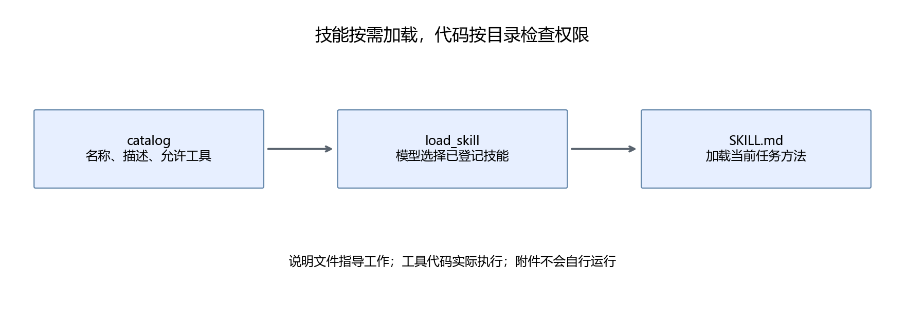

# 第23章 Skills：让任务方法可以复用

用户要求解释、出题和批改时，需要不同的工作方法。如果全部写进一段很长的总提示，规则会混在一起，也容易在每次请求时加载不需要的内容。技能把一种任务的方法整理成独立文件，再按任务加载。

## 23.1 先区分技能与工具

search 是工具，负责执行一次检索。explain 是技能，说明什么时候搜索、怎样阅读结果、怎样组织解释、什么时候说明资料不足。

一个技能可以使用多个工具，同一个工具也可以服务多个技能。例如 explain 和 practice 都可以使用 search；前者检索后讲解，后者检索后提供题目。

技能也可以没有独立可执行脚本。如果只需要一套文字工作方法，一个 SKILL.md 已经可以表达。本项目的加载器读这个文件，再把内容加入模型输入。

## 23.2 一个最小技能的结构

正文先看简化结构：

```markdown
# explain：查询与解释

## 何时使用
用户询问教程中的概念。

## 输入
一个明确问题。

## 步骤
检索；读取资料；给直接答案和短例子；列出处。

## 输出
解释和资料 ID。

## 工具
search。
```

这几项分别回答“选不选它”“需要什么”“怎么做”“做到什么程度”“能调用什么”。完整文件在[explain/SKILL.md](../assets/part05/skills/explain/SKILL.md)，批改方法在[review/SKILL.md](../assets/part05/skills/review/SKILL.md)。

技能需要具体失败处理。例如题号缺失时先提问，题库不覆盖时说明缺少题目，不能只写顺利情况下的步骤。

## 23.3 目录与发现过程

```text
skills/
  catalog.json
  explain/SKILL.md
  practice/SKILL.md
  review/SKILL.md
```

catalog.json 保存名字、短描述和允许工具。加载前只需要这些简短信息；模型提出 load_skill 后，程序读取对应全文。



本项目的模型输入有工具说明和固定三个技能名，因此可以选择 explain、practice 或 review。增加技能时，需要同步目录、catalog 和模型工具说明中的技能候选；这些位置都应由维护者修改。

当前实现把加载后的技能放入后续请求，不把全部技能全文永久放在总提示。这个做法常称为**按需加载**：先读取目录摘要，再读取要执行的方法。

## 23.4 技能如何进入上下文

load_skill 执行两件事：把 state["skill"] 改为登记名字，返回该技能的说明。后面的请求根据这个状态继续装入技能说明；toolbox 则从 catalog 读取允许工具。

模型读到技能说明，不代表工具权限就由说明文字决定。即使 SKILL.md 不小心写了“调用 shell”，catalog 仍没有 shell，代码不会执行它。修改技能与修改工具权限是两个需要审阅的动作。

实际输入会携带当前技能、最近两条事件、累积的资料与评分。最近事件里可能还出现一份技能说明，初版为保持代码直观，允许这部分重复。遇到上下文压力时可以去掉重复内容，但应保留需要继续工作的结果。

## 23.5 如何编写可用的步骤

“完成出题任务”太抽象。practice 的步骤应说明：先确定主题，调用 quiz，输出题号和题干，不提前给标准答案，告诉用户如何提交回答。

“认真批改”也太抽象。review 的步骤是：提取题号和答案，调用 grade，读工具反馈，检查是否可以 record，再报告对错和保存状态。

**技能步骤应能映射到动作或输出检查。** 不是每句话都需要一个工具，但读者应该看得出步骤如何执行，失败怎样识别。

示例不要只覆盖成功情况。review 可以添加“用户仅说‘帮我批改’时，请补充题号和答案”；practice 可以添加“没有这个主题的题库时，先说明范围”。这能减少模型胡乱补参数。

## 23.6 技能组合与工作流

解释后出题需要先 explain，再 practice。模型可以通过第二次 load_skill 切换，已检索证据仍保留在任务状态中。

这里需要区分两种设计：

| 设计 | 顺序由谁决定 | 适合情形 |
|---|---|---|
| 固定工作流 | 程序明确规定解释→出题 | 顺序稳定、验收严格 |
| Agent 动作选择 | 模型依据结果决定下一步 | 输入和下一步存在变化 |

二者可以结合。固定学习流程可以规定哪些阶段必须发生，各阶段内部仍让模型选择查询词和说明方式。复杂应用没有必要把每一步都交给模型自由规划。

本项目先保留模型动作选择，方便观察遗漏或重复。第27章评价失败后，应按证据考虑是否加入固定阶段，而不是把任何失败都解释成“需要更强的提示”。

## 23.7 给自己的 Agent 增加技能

假设增加“复习计划”：输入最近错题，输出按主题分组的复习建议。先回答四个问题：需要哪些记录？现有 progress 是否够用？是否只是输出建议？如何检查建议引用了真实错题？

如果 progress 已经满足读取需求，新技能可能只需要新的说明文件和目录登记。如果需要读更多记录，则先扩展工具接口和测试，再写技能。

扩展后的技能正文保持短而明确。较长的输出模板、示例报告和参考资料可以放在技能子目录里，由加载器按需读取；本项目初版只加载 SKILL.md，没有自动读取任意附件的能力。

## 23.8 本章产出

完成三个技能目录和加载动作，能解释 catalog 与 SKILL.md 的分工。阅读[practice 完整文件](../assets/part05/skills/practice/SKILL.md)，把其中一个步骤映射到对应的工具调用。

自行设计一个新技能，只写何时使用、输入、步骤、输出、工具和失败处理，不急着增加工具。检查它是否重复已有技能，是否依赖当前不存在的能力。

[上一章](22-Rules规则与执行边界.md) · [下一章：Knowledge](24-Knowledge读取检索与引用.md)
