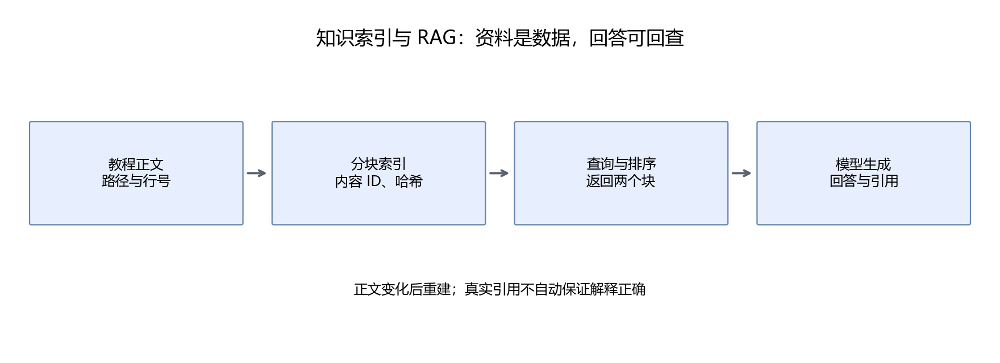
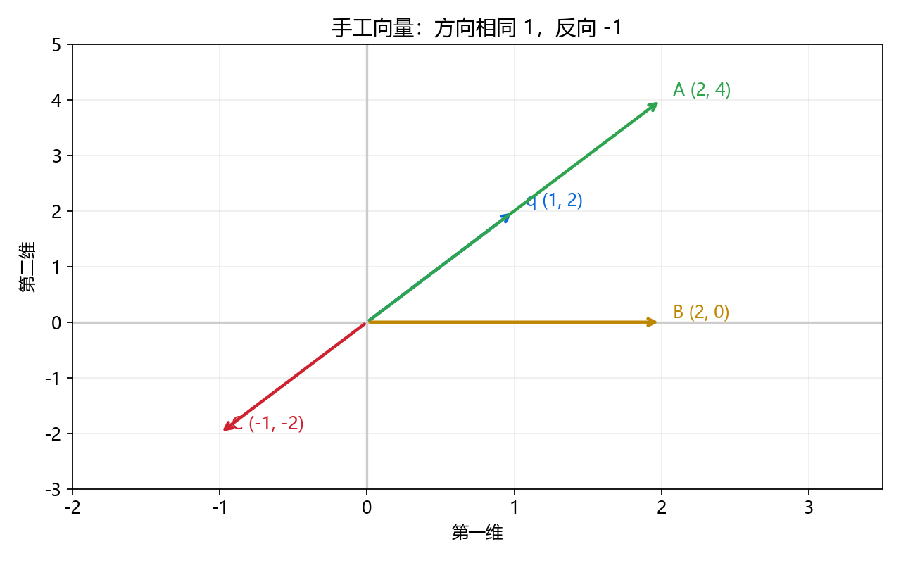
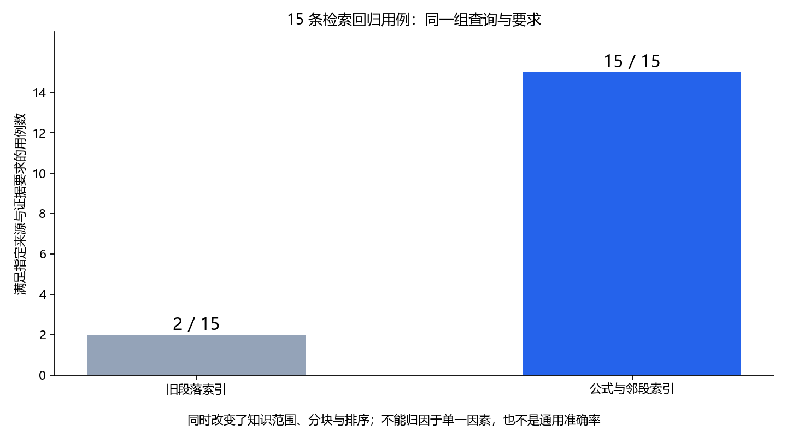

# 第24章 Knowledge：读取、检索与引用

这一章让助手实际查阅六个部分及学习附录。先实现可以解释每个分数来源的关键词检索，再学习向量与语义检索。默认项目不新增嵌入模型下载，完整语义检索脚本作为可选扩展保留。

## 24.1 先给出检索增强生成的流程

```text
教程文件 → 分块与来源 → 建索引
用户问题 → 检索相关块 → 放入上下文 → 模型回答与引用
```

检索增强生成的目的，是让模型在回答当前问题时得到相关外部资料。教程更新后重建索引即可，不需要重新训练语言模型。



模型可能知道梯度下降，但如果任务要求解释“本教程中的梯度下降”，仍然应查询教程。模型已有知识与项目指定来源不是同一个概念。

## 24.2 为什么要分块

把全部教程放进一次请求，会增加 token 数、延迟和干扰。分块把长文档变成较小单元，检索时只返回相关内容。

默认索引六个部分的35章与4份学习附录，不索引 README、运行报告、规则或技能附件。知识覆盖和题库覆盖是两件事：能检索算子章节，不表示评分工具已经有该章练习题。

knowledge.py 在同一个标题内，把相邻段落组合成目标约700字符的块，并保留最多约200字符的短邻段重叠。数学围栏和纯文本流程图作为完整单元保留；Python、JSON、Bash 等代码围栏及图片不进入默认索引。长单元不强行截断，所以700是组合目标，不是保证每块都不超过的硬上限。

这里计算的是字符，不是 token。中文字符与 token 不能按固定比例严格换算；模型上下文是否足够，以服务实际 token 计数为准。一次仍返回两个块，排序后避免两个结果都来自同文件的同一小节。

例如第4章的梯度下降小节，目标是一起返回更新公式、学习率符号与步长解释。旧版跳过数学围栏，又把短解释拆成不同结果，引用虽然存在，模型却看不到完整关系。新块提供更完整的证据，但仍可能因标题边界或长段落失去条件；需要检索验收来发现。

## 24.3 给每块保留来源

```json
{
  "id": "内容哈希的前12位",
  "source": "第三部分-机器学习与深度学习/09-模型如何学习与神经网络.md",
  "heading": "该段落所在标题",
  "line": 120,
  "end_line": 135,
  "segments": [{"line": 120, "end_line": 125}, {"line": 129, "end_line": 135}],
  "text": "索引中的原文"
}
```

这里是字段示意，行号应以实际索引为准。source 保存仓库相对路径，line 与 end_line 给出覆盖范围；segments 逐段保留原始行范围。范围中可能夹着未索引的代码，精确还原时按 segments 取原文，再用空行连接。核验工具会检查还原结果与 text 一致。

ID 根据路径、标题和片段内容计算。原文改变后 ID 可能改变；它用于标识当前版本的证据，不是跨所有版本永久不变的章节编号。

索引还保存格式版本与每个源文件的 SHA-256。加载时检查文件集合和哈希；新增、删除或修改知识文件，都会要求重建。旧版索引也会被拒绝。这样能避免助手引用旧内容，却给出已变化的文件位置。

```powershell
python script/part05/index_course.py
```

## 24.4 关键词检索怎样打分

先看实际采用的公式：

```math
s(q,d)=\frac{\sum_{t\in q\cap d}(1+\ln c(t,d))\ln\left(1+\frac{N}{1+df(t)}\right)}{\sqrt{|d|}}
```

q 是查询词集合，d 是文档块；c(t,d) 是词在块中的次数；df(t) 是包含这个词的块数；N 是总块数；|d| 是块中的词元总数。代码还为包含完整查询字符串的块加 2 分。

这个分数是本项目的简明词频基线，没有使用标准 BM25 的完整公式，也不是学习出来的语义向量。它体现三个直觉：查询词出现才加分，频繁出现的通用词贡献较小，长段落不会仅凭词多就无限占优。

实际排序前还检查查询词元至少有一半出现在块里，减少偶然命中。这个阈值是基线选择，可能漏掉同义表达；应根据检索用例调整，而不是认为50%普遍最佳。

假设 N=100，某词只出现在 4 个块中，在当前块出现 2 次，块长度为 25。该词贡献为：

```math
\frac{(1+\ln 2)\ln(1+100/5)}{\sqrt{25}}\approx 1.031
```

在这个基础分数上，完整短语出现在正文或标题中加2分，出现在当前标题再加2分，出现在章节大标题加0.75分。章节开场与“产出、自测、随堂”等导航小节再降权，减少只列出术语的段落挤到定义前面。匹配时忽略空白，并显式把“KV缓存”和“KV Cache”对应起来；含“KV缓存”或“KV Cache”的长查询也收敛到这一术语；GPU/CPU与其他词组合时移除平台词，英语查询去掉少量连接词。这些都是小范围词法规则，不是语义理解。

这些权重是可检查的工程选择，不是数学定理。扩展知识范围后，检索示例中的“梯度下降”曾比真实定义排得更靠前，说明只扩容会带来新的干扰；标题权重与导航降权需要用同一组查询核验。

读者可以用 math.log 逐项验证基础分数。分数用来排序，不是正确率或概率；两个块分数接近，也不代表它们同样支持答案。

## 24.5 中文怎样变成词元

默认不依赖中文分词库，把连续中文拆为相邻二字片段。例如“梯度下降”得到“梯度”“度下”“下降”。英文按单词提取。

```python
run = "梯度下降"
tokens = [run[i:i+2] for i in range(len(run)-1)]
assert tokens == ["梯度", "度下", "下降"]
```

这能匹配常用术语，但不理解同义词。用户问“每一步走多远”，可能找不到“学习率”。长查询还可能因为几个无关的公共字词返回弱相关段落。

因此不能把“有搜索结果”自动当成“已经找到答案”。当前已有匹配比例、相邻段落组合与标题权重，仍没有通用同义词改写或学习式重排；模型需要核对资料是否真的支持用户的问题。

## 24.6 向量检索先从余弦相似度开始

第二部分已经学过点积。向量夹角的余弦为：

```math
\cos(q,d)=\frac{q\cdot d}{\|q\|\|d\|}
```

q=[1,2]，A=[2,4] 时方向一致，分数为 1；B=[2,0] 得到约 0.447；C=[-1,-2] 得到 -1。分数比较方向，不直接比较向量长度。



运行[24_vector_demo.py](../script/part05/24_vector_demo.py)核对。这里的向量由我们手工指定，只说明数学计算，不声称向量表示了真实文本含义。

零向量的余弦在数学上没有定义。示例函数遇到零范数时约定返回0作为检索分数，避免除零；这个程序约定不应解释成零向量具有某个确定夹角。

**嵌入（embedding）** 是把文本映射到向量的表示。语义检索需要用适合检索的训练模型编码问题和段落；模型训练得好，相关文本的向量才可能比较接近。随意用字符编码或词频向量，不能直接称为理解语义。

## 24.7 可选的真实嵌入检索

[semantic_search.py](../script/part05/semantic_search.py)接受已有本地 Sentence Transformers 模型：

```powershell
python script/part05/semantic_search.py --model-path "G:\models\你的嵌入模型" --build
python script/part05/semantic_search.py --model-path "G:\models\你的嵌入模型" --query "更新参数时步子太大怎么办"
```

脚本使用 encode_document 和 encode_query，把向量归一化，再用矩阵乘法计算相似度；这是[Sentence Transformers 官方语义检索示例](https://www.sbert.net/examples/sentence_transformer/applications/semantic-search/README.html)使用的基本思路。安装说明见运行指南。

本机没有在本部分指定并验证一个完整的本地嵌入模型，因此这个扩展只检查代码结构，没有报告真实语义检索成功率。默认 Agent 仍使用关键词方法；要接入新检索，只需让 search 保持同样的来源字段与返回结构。

脚本会对模型文件和课程索引计算哈希；模型或正文变化后必须重建向量。向量维度相同也不表示两个模型的向量空间相同，不能把旧文档向量与新模型查询向量直接比较。

## 24.8 引用检查能保证什么

finish 提交的 citations 必须来自本任务的 evidence。程序将这些 ID 转换为真实文件、标题和原文，用户能回查。

模型输入中每块原文只放在 evidence 一次，最近动作结果只保留检索 ID，避免同一原文又在 observation 中重复占用上下文。完整任务状态仍保存全部检索结果；当前模型提示只提供最近两个证据块，跨多主题比较还需要专门设计证据预算。

这保证引用标识存在，不能保证每个结论都受该段落支持。严格的评价还要检查是否引用错段、是否省略公式条件、是否把演示结果推广成一般结论。

## 24.9 本章产出

建立课程索引并检索“梯度下降”“条件概率”“KV缓存”。核对结果的来源、标题、原文和行号。运行手工向量实验，说明它与真实语义检索的区别。

再选一个同义表达，比较它与原术语的检索结果，记录基线的局限。检索失败案例是下一次改进的依据。

运行 `python tools/verify_part05_retrieval.py`，查看[检索用例](../data/part05/retrieval_cases.json)与[改进后报告](../outputs/part05/24_retrieval_after.json)。15条查询（包括真实模型产生的三个搜索词）分别检查预期来源、必要公式或条件、知识外问题无结果；另核对全部数学围栏和原始行范围。它们是本项目的回归用例，不是通用检索准确率。



这15条用例中，旧版满足2条、新版满足15条。这里同时改变了知识范围、分块和排序，不能把变化都归因于保留公式，更不能把15/15解释成用户提问的普遍成功率。图的源码为[draw_part05_retrieval.py](../tools/draw_part05_retrieval.py)。
### 补充练习与验收

先独立完成[本章两道练习](../assets/practice/part05.md#第24章)，再核对参考答案和本章验收证据。记录自己的输入、结果与边界案例，不要求复制作者的实验数值。

[上一章](23-Skills让任务方法可以复用.md) · [下一章：状态与记忆](25-状态记忆与多步骤任务.md)
