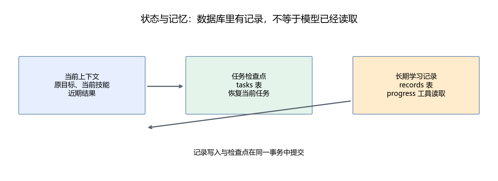

# 第25章 状态、记忆与多步骤任务

模型服务本身不会替我们的应用保存学习进度。Agent 要持续完成任务，需要代码管理当前发生了什么；任务结束后，还需要区分哪些信息值得长期保存。

## 25.1 先看实际任务状态

若嵌套字典、浅复制与深复制还不熟，先看[工程 Python 附录第1节](../附录/03-读懂后续工程代码.md#1-嵌套数据与复制一次修改影响哪里)。数据库事务与内存修改的区别见该附录第5节；下面会把两层状态连接起来。

```text
task           当前任务 ID
learner        当前学习者 ID
request        原始任务
allow_record   调用端授予的记录权限
skill          当前技能
step/status    当前步数和运行状态
evidence       本任务检索结果
quizzes        本任务取出的题号与题干
grades         本任务确定的评分
recorded       本任务已经保存的题号
events         外部动作、结果和错误
```

这些字段回答不同问题。evidence 用来检查引用，grades 防止模型捏造评分，recorded 用来识别重复保存，events 用来诊断失败。

给状态明确字段，比把全部事件拼成一段长聊天更容易检查。比如“还没评分就请求保存”，不需要再让另一个模型判定，查 grades 即可。

## 25.2 上下文与记忆的区别

**上下文** 是某次模型请求里能看到的信息。**任务状态** 是程序保存的当前工作数据。**长期记录** 是任务结束后仍保留、后续任务可以查询的信息。

这三者可以交叉，但不是一回事。本项目把任务状态存入 tasks 表，把确定的练习反馈存入 records 表；每次模型调用只装入当前任务的必要部分。



记录存在数据库里，不代表模型已经读取它。用户问最近错题时，模型需要调用 progress；工具只查询当前 learner 最近五条记录。

当前 learner 只是本地应用中的分组标识，不是身份认证。API 也没有登录系统，因此只适合单用户本地运行。多人服务必须由认证层确定用户身份，不能直接信任请求里任意传入的 learner。

## 25.3 为什么使用 SQLite

SQLite 是 Python 标准库可以访问的本地数据库，无需另起一个数据库服务。学习阶段可以看到表、主键和事务，同时保持环境简单。

```sql
CREATE TABLE tasks (
    id TEXT PRIMARY KEY,
    learner TEXT NOT NULL,
    state TEXT NOT NULL
);
```

state 字段保存 JSON。练习记录另建表，保存 task、step、learner、question、correct 和 feedback。SQL 参数使用 ? 占位符传递，不把用户文本直接拼进 SQL。

with connection 管理提交与回滚，但不会自动关闭连接；入口用 finally 调用 close。[Python sqlite3 文档](https://docs.python.org/3/library/sqlite3.html)解释了连接上下文管理器的行为。

## 25.4 检查点怎样让任务恢复

每次工具执行成功后，程序提交新状态。主动暂停可以指定：

```powershell
python script/part05/cli.py "请解释梯度下降并给出处" --stop-after 2
```

输出 task ID 后，用同一学习者恢复：

```powershell
python script/part05/cli.py --resume "上一次输出的任务ID" --learner demo
```

恢复从数据库最后提交的状态开始。--stop-after 是停在正常检查点的教学入口；意外断电也只能恢复到最后已提交检查点。

恢复不会重新赋予写权限。一个原来没有 allow_record 的任务，不能通过恢复命令偷偷改成有权限；新需求应创建新任务。

done、failed、exhausted 状态的任务不会自动继续调用模型。失败后先检查记录，需要重试时创建新任务或显式设计重试策略。

## 25.5 写入与检查点必须一起提交

假设 record 已保存错题，但程序在保存任务状态前崩溃。恢复后如果不知道已经保存，可能再写一次。

本项目在同一个 SQLite 事务里完成工具写入和任务检查点：

```python
with store.db:
    observation = tools.execute(name, args, candidate)
    candidate["events"].append(event)
    store.checkpoint(candidate)
```

它们要么一起提交，要么一起回滚。record 还检查当前任务已经保存的题号，records 表使用 (task,step) 复合主键。这些检查减少重复写入。

**幂等性（idempotency）** 指同一操作重复执行时不产生额外影响。这里的“同任务同题号不重复保存”是一种有限范围的幂等设计。用户重新创建一个任务再次答同一题，可以产生新的学习记录，因为那是新的一次练习。

这个事务保证只适用于当前本地 SQLite 写入。以后工具发邮件、调支付或写外部系统，数据库事务无法回滚远端行为，需要外部幂等键、操作回执和更完整的恢复设计。

## 25.6 多步骤任务与计划

“解释梯度下降后出两题”有至少两个阶段：查资料并解释，读取题库并出题。模型可以选择动作，但原始任务必须始终保留，防止工具结果覆盖目标。

一个简单计划可以写成：

```text
阶段一：取到相关知识
阶段二：取到两道练习
阶段三：给解释、来源与题干
```

初版没有单独的可执行计划表，它保留 request 和已完成事实，由模型继续选择。这个设计适合展示循环，但复合任务可能提前 finish。需要更可靠的工作流时，在代码中增加阶段状态与终止条件，而不是只让模型口头列计划。

完整学习演示采用固定的四阶段工作流，每阶段通过 required_tools 指定必需操作。查询学习记录必须真的调用 progress，批改保存必须完成 grade 和 record。循环仍由模型选择技能和参数，代码检查阶段是否完成；这是固定工作流与 Agent 决策的组合。

CLI 可以明确指定验收要求，例如 `--require-tool progress`。这个参数来自调用者，不能授予新的工具权限；不满足要求的任务不能 finish。恢复时沿用已经保存的要求。

“执行计划”不等于要求模型展示内部推理。记录任务步骤、工具请求和结果已经足够检查进展。

## 25.7 控制上下文和成本

完整数据库记录可能很长，但每次请求只使用最近两条事件、当前技能、最近两条证据以及简短评分。日志与当前输入分开，既保留诊断信息，也避免把全部历史重复发送。

当前实现对普通短任务足够，但多个技能连续切换、累积许多题目或长资料仍可能超出上下文。HTTP 400 会作为模型调用失败保存；下一步应加入实际 token 预算和更明确的压缩策略。

压缩时优先保留原始目标、权限、未完成事项和可验证结果。模型生成的摘要可能遗漏信息，不能用摘要覆盖授权字段或原始评分。

## 25.8 本章产出

完成一次暂停与恢复，比较恢复前后 task、step 和 evidence。再运行核验脚本，查看“重复保存不新增记录”和“事务失败后无残留写入”的检查。

写出新增外部工具的恢复问题：如果远端已经执行但本地还没拿到结果，如何识别？这能帮助读者把本地项目经验迁移到真正有副作用的 Agent。
### 补充练习与验收

先独立完成[本章两道练习](../assets/practice/part05.md#第25章)，再核对参考答案和本章验收证据。记录自己的输入、结果与边界案例，不要求复制作者的实验数值。

[上一章](24-Knowledge读取检索与引用.md) · [下一章：组装完整 Agent](26-组装完整课程学习助手.md)
