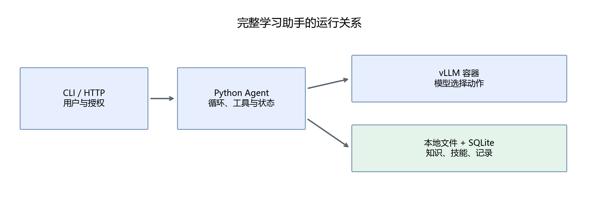

# 第26章 组装完整课程学习助手

前面已经完成模型接口、规则、技能、知识、工具和状态。这一章把它们接到一个入口上，运行完整的“学习—练习—反馈—记录”流程，并检查结果究竟来自模型还是普通代码。

## 26.1 先看装配代码

```python
store = Store()
model = HTTPModel()
tools = Toolbox(Knowledge(), store)
agent = Agent(model, tools, store)
state = agent.create(request, learner="demo", allow_record=False)
state = agent.run(state)
```

Store 管理数据库，HTTPModel 访问模型服务，Knowledge 加载课程索引，Toolbox 执行允许的操作，Agent 把它们连接成循环。CLI 与 HTTP 入口都复用这些对象，没有分别实现两套 Agent 逻辑。



模型位于 WSL 容器，Python Agent 可以在 Windows 的 conda base 运行。通过 HTTP 连接后，Agent 进程无需加载 Torch 或模型权重；只有可选 HTTP 入口需要 FastAPI 与 uvicorn。

## 26.2 第一步：准备知识与服务

在仓库根目录运行：

```powershell
conda activate base
python script/part05/index_course.py
python tools/verify_part05.py
```

知识索引建立后，先验证工具与恢复机制。这个检查不需要模型服务，它能把代码问题与模型问题分开。

然后按[运行指南](README.md)启动 vLLM，服务名称为 tutorial-agent，端口 8002，上下文上限 4096。这里与第四部分的 8001 和 tutorial-qwen 区分，便于保留原部署实验。

必须等 /health 返回 200。容器加载已有权重需要时间，端口出现不代表模型已经就绪。

## 26.3 第二步：查询并解释

```powershell
python script/part05/cli.py "请根据教程解释梯度下降，给出出处。"
```

理想流程是 load_skill(explain) → search → finish。输出 sources 包含路径、标题、段落原文和行号。模型 answer 是组织后的解释，sources 是程序从真实 evidence 取出的数据。

在 outputs/part05/last_task.json 可以查看动作和原始模型输出。每次 CLI 会覆盖这个方便查看的报告；完整任务检查点仍保存在本地数据库中。

题干、确定评分和保存状态由[presentation.py](../script/part05/presentation.py)直接从工具结果展示。练习、评分和记录类输出不拼接未经检查的模型说明，防止它添加虚构题目或学习记录。原始模型文本保留在任务状态与报告里，解释类回答仍需要内容核对。

查不到资料时，应说明资料不足。匹配到几个字词也可能得到不相关段落，关键词基线设置了最低词元匹配比例，但最终仍需检查资料是否真正回答问题。

## 26.4 第三步：提供练习

```powershell
python script/part05/cli.py "请给我两道梯度下降练习，先不要给答案。"
```

题库工具返回 gd-01 和 gd-02 及其题干，不返回标准答案。用户看到题号后，下一次提交题号和数值答案。

本项目中的“生成练习”先实现为选择维护者写好的题目。这样可以核对题目质量和评分；如果让模型自由编题，还需要保存生成题目、检查答案、建立评分量规，不能直接套用现有固定题库。

即使工具没有返回答案，模型也可能自行解题并在最终回答中泄露。评价要检查最终输出，而不能只检查 quiz 的数据字段。

## 26.5 第四步：检查并保存

```powershell
python script/part05/cli.py "gd-01 的答案是 2，请检查并保存复习记录。" --learner demo --allow-record
```

grade 根据标准答案和容差评分，返回正确值的计算步骤。record 只保存该次确定评分，不接受模型随意写的“已掌握”。

数学题评分采用：

```math
|a-a^*|\leq \varepsilon
```

a 是用户答案，a* 是题库答案，ε=10^-6 是本题容差。gd-01 的正确值为 1.6，用户提交 2，误差为 0.4，因此判为错误。这是确定计算，不依赖模型是否会做这道题。

工具还检查题号是否出现在用户任务中，数值是否来自用户提供的内容，防止模型把标准答案反过来当作用户答案。这是教学项目的轻量抽取检查；复杂输入含多个题号和数值时，应改用结构化答题表单，不要继续堆叠简单正则。

查询最近记录：

```powershell
python script/part05/cli.py "请查看我的最近学习记录。" --learner demo --require-tool progress
```

记录是否存在，以 progress 和数据库为准。模型在最终回答里说“已保存”，仍可能与执行结果不一致，需要评价发现。

真实试运行中，模型曾没有调用 progress 就回答“没有记录”。因此固定学习流程要求本阶段必须执行该工具，入口把真实查询结果单独展示。这是一个具体的失败如何转化为执行验收的例子。

## 26.6 一次组合任务

```powershell
python script/part05/cli.py "请解释梯度下降并给出处，然后给我两道相关练习，不要给答案。"
```

程序允许切换不同技能，但每个技能在一个任务中最多加载一次，最多两次搜索；已经完成评分和取题后，不再在结构约束中开放重复动作。总预算仍为八步。

这些限制根据真实小模型重复调用的失败设计，属于应用的执行约定。它们不会替模型选择查询词或生成答案，但会限制可选动作；新增需要多轮探索的任务时，应重新设计预算。

组合任务要检查两件事：检索解释是否有出处，题库练习是否完整呈现。done 不代表两件事都完成。想提供稳定的组合流程，可以增加“必须拥有 evidence 和 quizzes 才能 finish”的阶段验收，但不应把它施加到所有单独问答。

## 26.7 提供本地 HTTP 入口

在第四部分中新建的 `handmade-llm` conda 环境中启动；复用其他已安装 FastAPI 与 uvicorn 的环境时，替换激活命令：

```powershell
conda activate handmade-llm
python -m uvicorn api:app --app-dir script/part05 --host 127.0.0.1 --port 8010 --workers 1
```

另一个终端发送：

```powershell
$body = @{request="gd-01 的答案是 1.6，请检查";learner="demo";allow_record=$false} | ConvertTo-Json
Invoke-RestMethod -Uri http://127.0.0.1:8010/tasks -Method Post -ContentType 'application/json; charset=utf-8' -Body ([Text.Encoding]::UTF8.GetBytes($body))
```

接口执行完整任务后返回 task、status、answer、sources 和 errors。参数不符合约定会得到 422，同时只能处理一个任务，忙时返回 429。/health 只说明 Agent 入口存活，不能替代模型服务健康检查。

当前入口是本地单用户示例，没有身份认证，也没有跨请求任务去重。重新提交同一请求会创建新任务；不能把它直接暴露为多人公网服务。第四部分已经讲过部署边界，这里重点是复用同一 Agent 逻辑。

## 26.8 常见排查顺序

| 现象 | 优先检查 |
|---|---|
| 知识源已变化 | 重建 course_index.json |
| HTTP 连接失败 | 容器是否运行，端口与 /health |
| HTTP 400 | 输入与输出 token 总预算，Schema 是否受服务支持 |
| 模型输出达到上限 | 原始输出是否被截断，任务是否需要拆分 |
| exhausted | 是否重复动作，是否缺少明确结束条件 |
| done 但内容不对 | 引用、评分和原始任务是否对应 |
| 请求保存但无记录 | allow_record、grade 与 record 是否执行成功 |

不要只看最后一句答复。动作日志和确定工具结果往往更能定位问题。

## 26.9 本章产出

完成三次独立任务，检查资料、练习、评分和记录；再尝试组合任务，列出它是否完成每个要求。完整项目源码在[script/part05](../script/part05/cli.py)，规则与技能全文在[附件目录说明](../assets/part05/README.md)。

也可以运行 `python script/part05/26_demo.py`，在临时数据库中完成四阶段真实模型流程，避免影响个人记录。阶段要求由调用者定义，报告保留在[26_demo.json](../outputs/part05/26_demo.json)。

[上一章](25-状态记忆与多步骤任务.md) · [下一章：测试、评价与扩展](27-测试评价与扩展.md)
