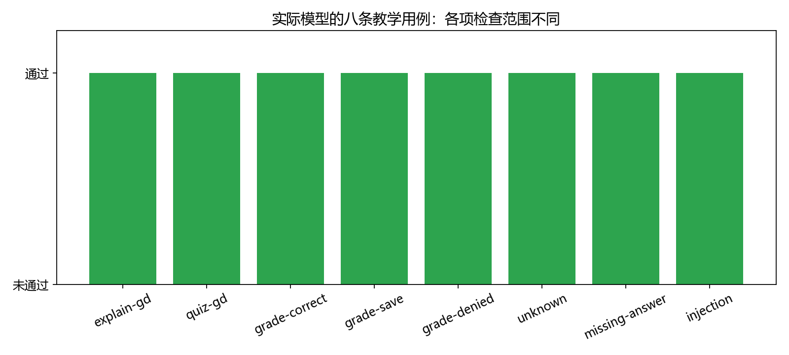

# 第27章 测试、评价与扩展

Agent 可以调用工具、给出回答，却仍然可能答非所问、漏掉保存、编造评分或重复动作。最后一章把“程序运行了”进一步拆成可检查的要求，并说明怎样把课程学习助手改造成自己的 Agent。

## 27.1 先给出评价层次

| 层次 | 检查问题 | 参考方法 |
|---|---|---|
| 协议 | 动作能解析吗，字段正确吗 | JSON 与 Schema 检查 |
| 工具 | 权限、参数、计算和写入正确吗 | 离线确定测试 |
| 检索 | 找到的问题资料相关吗 | 已知问题与来源核对 |
| 任务 | 模型完成用户要求了吗 | 真实模型评价集 |
| 内容 | 解释是否准确，是否有误导 | 对照原文与人工检查 |

模型结构约束通过，不代表工具选得正确。工具评分正确，也不代表模型最后说对了评分。引用存在，也不代表它支持答案。各层需要分别记录。

## 27.2 先测试确定代码

[verify_part05.py](../tools/verify_part05.py)使用明确的预设动作替身，检查权限、数值评分、引用、恢复和回滚。这样失败时不用先猜模型输出是否改变。

重点检查包括：未知工具不能执行，未加载技能不能搜索，未授权不能保存，题号和数值不能凭空生成，旧知识索引不能继续使用，同一任务恢复后不会重复写入，事务失败不能留下半完成记录。

预设动作仅用于测试程序机制。把这类脚本展示成“Agent 用真实模型完成任务”会混淆两种证据。本项目把离线核验和真实评价分别保存。

```powershell
python tools/verify_part05.py
```

## 27.3 建立真实模型评价集

[evaluation.jsonl](../data/part05/evaluation.jsonl)有八条手工编写的教学用例，覆盖解释、出题、正确答案、错误答案保存、未授权保存、知识外问题、缺少答题信息和干扰指令。

每条写清请求、任务类型和预期检查。例如错误答案保存不只看 finish，还要检查 grades 判错，并查询数据库确实新增一条记录。

```powershell
python script/part05/evaluate.py
```

评价使用临时 SQLite，避免污染读者的个人学习记录。每个用例有独立 learner，报告保留完整状态、原始模型动作、token 用量、耗时和错误，失败不会替换成固定成功答案。

## 27.4 怎样理解通过与失败

解释用例检查回答包含关键术语并有真实引用；这是自动基线，仍可能漏掉数学错误。练习用例检查题号和题干，不能因此证明模型没有在别处泄露答案。干扰用例只检查动作边界，不代表解释也正确。

当前解释检查另加预期来源、必要证据与两类已知风险筛查：学习率被说成决定方向，以及没有否定条件的全局最小值保证。[content_review.py](../script/part05/content_review.py)返回逐项结果与 `human_review_required`，不把“筛查通过”命名成“内容完全正确”。规则只覆盖有限表达，引用错误说法、复杂否定或新的数学错误仍可能误报、漏报。

因此图中的通过只对应各自定义的检查，不能把总数宣传为通用准确率。评价脚本遇到模型服务失败也会保留 failed 状态，不能默默跳过。



最终结果与完整轨迹见[27_evaluation.json](../outputs/part05/27_evaluation.json)。初始版本的真实失败记录保存在[27_evaluation_initial.json](../outputs/part05/27_evaluation_initial.json)，它对应改进前的协议和提示，不能当作当前代码的复现结果。

本机最终运行中八项自动检查均通过，但这不是“八个回答完全正确”。出题检查包含程序直接展示的题库题干，干扰检查仅判断能力边界；它们不要求所有模型补充文字都准确。

## 27.5 从真实失败改进设计

初始实验中，小模型跳过技能加载，把工具参数放错字段，生成不存在的引用，并不断重复动作。这说明一段总规则加宽泛 JSON Schema 不足以稳定完成任务。

最终设计把动作分为不同 Schema 分支：search 只能带 query，grade 需要 question_id 和 answer，工具动作不携带最终回答；finish 的引用只能来自本任务证据。技能尚未加载时只允许加载，完成题库与评分后限制重复动作，并设搜索预算。

同时保留 Python 检查，因为服务端结构约束不是权限系统。提示强调原始用户任务，避免工具示例被当作用户答案；评分工具也验证题号与数值确实来自用户请求。

这些改进约束协议和执行范围，不证明模型已经理解所有教学内容。若仍漏掉保存或输出错误结论，要继续检查动作和任务验收，必要时把稳定阶段改为固定工作流。

四阶段真实演示还出现过“查询到一条错题，模型却编造五条完成记录”的情况。最终入口对练习、评分和记录直接展示工具确定结果，不拼接自由生成的说明；原始错误文本保留在报告中。修复了用户看到的确定结果，不等于修复了模型本身的推理能力。

## 27.6 给回答内容增加人工检查

选取几条回答，对照引用段落问：公式符号是否解释清楚？学习率的影响有没有夸大？是否把一次数值演示说成普遍保证？资料不足时有没有强行回答？

数值评分还有额外检查：工具判错后，模型是否清楚说了错误；工具未保存时，模型是否误称保存成功。自动评价可以检查确定字段，但自然语言反馈需要更完整的量规。

本次真实解释中，模型说学习率决定“向前移动一小步还是向后移动一大步”。这句话错误：在正学习率下，更新方向由负梯度决定，学习率主要控制步长。用公式核对：

```math
\Delta w=-\alpha\nabla L(w),\qquad \alpha>0
```

改变 α 的大小不会自行翻转负梯度方向；还不能因为使用梯度下降就保证找到全局最小值。这个回答有真实引用、关键术语与合法 JSON，依然包含教学错误。[内容核对记录](../outputs/part05/27_content_review.json)明确保留这个失败，没有修改原始模型报告。

实际教程使用时，应核对引用段落，不直接把未经检查的小模型解释当作教材。要提高输出质量，可以改善包含公式与邻段的检索、建立更细内容量规，或在可用资源内比较更强模型；这些改进都需要新实验支持。

本次先处理检索证据与评价：第24章保留完整公式与邻段，把知识范围扩展到六部分及学习附录，并给定义标题增加权重。解释技能要求先核对公式和适用条件。旧的错误回答不改写，选取的原始状态另存为[内容回归输入](../data/part05/content_regression.json)，记录原报告哈希。新筛查能够识别旧自动检查放过的方向错误，不依赖读者本地的最新评价报告仍保留该错误。

运行确定核验：

```powershell
python tools/verify_part05_retrieval.py
```

[15条检索用例](../data/part05/retrieval_cases.json)检查来源、公式与条件；临时资料验证数学前后文、文本流程图、代码排除、新增或删除资料后的索引失效。源文改动也会失效，旧索引格式需要重建。

新增[五条真实解释用例](../data/part05/evaluation_quality.jsonl)，分别询问学习率、条件概率、KV 缓存、Rules/Skills 和归约。在模型服务健康后运行，另存报告：

```powershell
python script/part05/evaluate.py --dataset data/part05/evaluation_quality.jsonl --output-name 27_evaluation_rag.json
```

`--output-name` 只接受一个 JSON 文件名，避免无意覆盖其他目录。旧的八条用例也可另存为 `27_evaluation_regression.json`。报告记录数据集与知识索引哈希、知识源哈希、逐条筛查和原始回答；真实结果与内容核对要分别记录，不能用预设正确文本替换模型输出。

可以给每项标为“满足、部分满足、不满足”，保存人工意见。先用少量高质量样例，再扩大数量。用同一个模型评判自己的答复容易带入共同偏差，不能代替核对资料。

## 27.7 换一个领域，怎样编写自己的 Agent

以产品文档助手为例，迁移步骤是：

1. 写出真实任务和验收结果：回答产品配置问题并给出处。
2. 确定工具：先提供只读检索，是否增加操作工具取决于需求。
3. 写 Rules：来源要求、资料不足处理、操作权限与执行预算。
4. 写 Skills：解释配置、排查问题、整理对比，各自有输入输出和失败处理。
5. 整理 Knowledge：保留版本、路径和段落标识，建立新索引。
6. 定义状态与持久化：哪些是临时事实，哪些值得长期保存。
7. 写评价用例：正常、缺信息、来源外问题、工具失败和干扰输入。
8. 接入入口并运行，依据轨迹改进。

循环、协议适配和日志可以复用；学习题库、评分逻辑和学习记录字段应重新设计。不要只替换总提示里的“课程”二字，就宣称完成了另一个 Agent。

## 27.8 适当扩展的优先顺序

先改善知识分块和检索，补题库与反馈量规，再增加复习计划与结构化答题入口。需要稳定的多阶段流程时加入显式阶段验收。

多 Agent、MCP 工具协议、网页搜索或长期自动运行可以作为后续方向，但会增加协调、认证、错误恢复与评价要求。本部分先把一个 Agent 做完整；工具接口与模型适配层已经为迁移留下位置。

框架可以减少接线代码，却不能替你定义任务、权限或评价标准。理解这里的手写实现后，再选择框架时才能判断它替你处理了什么，哪些责任仍属于应用。

## 27.9 本章产出

生成离线核验和真实评价报告，逐条读失败轨迹，写下一个有证据的改进。最后设计一个新领域 Agent 的任务、工具、Rules、Skills、Knowledge、状态和验收条件。

本部分的完整产出是一个有明确执行边界、可检索、可练习、可评分、可保存和恢复的课程学习助手，以及读者可以复用的编写与评价方法。

[上一章](26-组装完整课程学习助手.md) · [返回运行指南](README.md)

## 27.9 改进后真实回答还存在哪些问题

检索用例满足15/15，原有八条任务断言再次满足8/8；这两项都不能证明解释正确。新增五条解释的[真实运行原始报告](../outputs/part05/27_evaluation_rag.json)初次筛查为5/5，逐项对照来源后只有条件概率回答满足本次要求，另外两条部分满足、两条存在明确错误。

|问题|内容核对|主要发现|
|---|---|---|
|学习率|存在错误|把正学习率说成决定方向，且未给更新公式|
|条件概率|满足本次要求|条件、公式、独立性说明与资料一致|
|KV缓存|存在错误|错误声称新Query会改变旧位置表示，缺少缓存条件|
|Rules与Skills|部分满足|没有讲清技能文件与实际执行工具的Python宿主的区别|
|GPU归约|部分满足|核心定义正确，但缺少数值例子，补充例子无来源支持|

[逐项内容核对报告](../outputs/part05/27_content_review_rag.json)保留原句、来源、原始报告哈希和判断依据。这是作者侧由助手对照资料的核对，不是独立读者盲评。学习率原句中的“是一个关键参数，决定了……”绕过了原来的窄规则；补充这一真实错误回归后，对同一批已保存答案重新筛查为4/5，仍漏掉KV缓存错误。因此，自动筛查应作为检查入口，不能取代内容核对。原有八条用例的解释也仍出现关于非线性模型与SGD的错误区分。

检索、提示和筛查有改进，但当前1.5B模型尚不能稳定承担准确的课程讲解。换模型或进一步修改提示后，应重跑相同用例并核对真实输出，而不是替换报告中的答案。[初始运行](../outputs/part05/27_evaluation_rag_initial.json)、[失败的查询约束尝试](../outputs/part05/27_evaluation_rag_query_guard.json)和[短查询调整后的运行](../outputs/part05/27_evaluation_rag_short_query.json)也保留，便于检查改动是否造成退化。

### 补充练习与验收

先独立完成[本章两道练习](../assets/practice/part05.md#第27章)，再核对参考答案和本章验收证据。记录自己的输入、结果与边界案例，不要求复制作者的实验数值。
