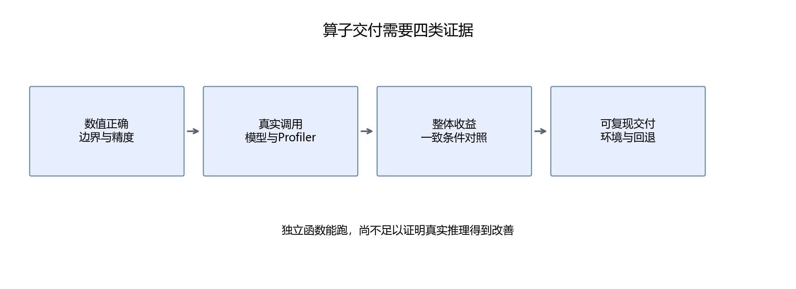
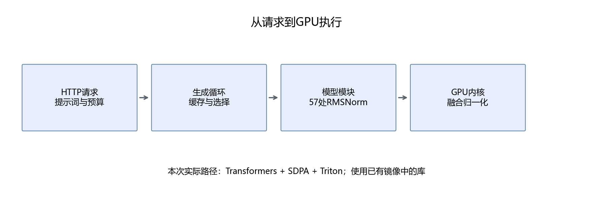

# 第28章 从推理瓶颈到 GPU 执行

第四部分已经部署模型，第五部分展示了 Agent 应用。本部分是另一条独立分支，不要求先完成 Agent：理解模型调用的 GPU 算子，写出自己的实现，把它接回真实推理，再判断是否值得保留。

主线继续使用 Qwen2.5-1.5B-Instruct。最终产出是一个实际使用手写融合 RMSNorm 的本地推理服务，以及正确性、调用轨迹和性能报告。向量加法、归约、Softmax 与矩阵乘法是铺垫，不以“每个算子都跑通”为终点。

## 28.1 先定义一个合格的优化

先做[算子入口自测](../附录/02-学习路线与前置自测.md#7-第六部分入口先能描述要比较的计算)。不会归约形状时回数组基础，收益上限不会算时查[数学速查](../附录/04-数学符号与计算速查.md)第7节；GPU 的线程组织由本章开始讲。

优化需要同时满足三个条件：计算符合约定，目标路径真的调用它，在约定场景中带来有价值的变化。

| 层次 | 需要的证据 |
|---|---|
| 独立算子正确 | 多形状、多精度、边界值对比 |
| 真实接入 | 模型模块替换、实际 GPU kernel 计数 |
| 推理等价 | 相同输入的 logits 误差与生成 ID 对比 |
| 实际收益 | 同一模型、配置与设备上的成对计时 |
| 可以交付 | 默认路径、适用范围、失败回退和关闭方式 |

只比较随机张量速度，还不能证明模型会更快；只把函数改名，也不能证明 GPU 上跑的是新算子。



## 28.2 算子与 kernel 是什么

**算子（operator）** 描述一个计算和接口，例如输入向量，输出归一化结果。**kernel** 是在 GPU 上执行的程序。一个算子可以由多个 kernel 完成，也可以把多个计算融合进一个 kernel。

例如 Python 写 `x.square().mean(...)`，看起来是一行，实际可能触发平方、归约和额外转换等多个 GPU 操作。是否融合取决于框架、执行模式和版本，不能根据 Python 行数判断 kernel 数量。

**融合（fusion）** 把相关计算放在同一个 GPU 程序中，减少中间张量和启动。这里融合 RMSNorm 的平方和、缩放、精度转换与权重乘法。

## 28.3 从生成过程定位候选

第四部分区分 prefill 与 decode：prefill 处理输入前缀，decode 逐步处理新 token。两者形状不同，瓶颈也可能不同。

Qwen 的28层每层有两次 RMSNorm，末尾再有一次，共57个模块。batch=1 的 decode 中，每次归一化只处理1536个隐藏值；数据很少，但要反复启动操作。prefill 则同时处理多个位置，数据量更大。

这个结构给出一个候选，不给出收益保证。第33章会用 profiler 检查实际调用，第34章用成对实验判断是否加速。

我们保留 cuBLAS 做线性层，保留框架 SDPA 做注意力。手写普通 GEMM 用来理解复用，不预设它能胜过成熟库。

## 28.4 GPU 的软件与硬件层次



CPU 提交 GPU 工作，CUDA runtime 与驱动负责连接设备；GPU 以线程、线程块和 grid 组织 kernel。一个 warp 包含32个线程，SM 是 GPU 上承载线程块执行的硬件单元。

“线程块”属于程序组织，“SM”属于硬件；一个线程块不等于一个 SM，也不能假设所有线程块同时运行。CUDA 编程模型要求普通线程块可以独立调度，跨块同步需要专门机制。[NVIDIA 编程模型](https://docs.nvidia.com/cuda/cuda-programming-guide/01-introduction/programming-model.html)给出了正式约定。

寄存器供线程保存局部值，共享内存由块内线程协作使用，L2 由设备共享，显存存放大部分张量。消费级显卡可能使用 GDDR，不能把所有 GPU 显存都称为 HBM，也不能给共享内存和显存设一个普遍固定的速度倍数。

## 28.5 启动开销、计算与访存

一个粗略理解是：总时间包含提交工作、移动数据和执行运算。它们可能重叠，不能简单把三项测量直接相加，但可以帮助选择优化方向。

小张量算子可能受启动和 CPU 提交限制；大矩阵乘法可能受计算、数据复用和库选择影响；大元素操作常关注访存。

一个1536维 FP16 RMSNorm 行，理想情况下读输入、读权重、写输出，逻辑字节数为：

```math
B=1536\times2\times3=9216\ \text{bytes}
```

这不是实际 DRAM 流量：权重可能命中缓存，原始实现也可能产生 FP32 中间张量。多行情况下权重可以复用，更不能简单按每行独立读一次显存估算。

## 28.6 先给出整体加速上限

如果原算子占总耗时比例 f，算子提速为 s，其他部分不变，则：

```math
S=\frac{1}{(1-f)+f/s}
```

这是 Amdahl 定律的简化应用。f=0.12、s=4 时，整体只快约1.099倍；即使这个算子瞬间完成，最大也约1.136倍。

比例必须来自目标路径测量。不能把独立算子快4倍，就写成大模型快4倍；融合还可能改变提交开销，因此实际结果仍要测。

## 28.7 环境先检查，后运行

本机已有 RTX 4060 Ti 16GB，计算能力8.9。复用 WSL2 的两个现成镜像：CUDA devel 用 nvcc 与 Compute Sanitizer，vLLM 镜像提供 GPU PyTorch、Triton 与 Transformers。本部分实际模型实验使用普通 Transformers，没有运行 vLLM 推理引擎。

Windows 仍用 conda 与 VS Code 编辑，GPU 代码在容器执行。完整命令见[运行指南](README.md)。检查脚本输出实际版本，不根据环境名称猜是否支持 CUDA。

```bash
python3 script/part06/28_environment.py
```

没有 GPU 的读者可以先运行成本与索引实验：

```powershell
conda activate base
python script/part06/28_cost_model.py
```

CPU 算术报告与真实 GPU 报告分开，不把模拟结果标为 CUDA 验证。

## 28.8 本章产出

生成环境和成本报告，明确目标：在同一 Qwen FP16、SDPA、KV Cache、贪心路径中，用融合 RMSNorm 替换原模块并测量。先写好成功与失败都要保存哪些结果，再开始写 kernel。
### 补充练习与验收

先独立完成[本章两道练习](../assets/practice/part06.md#第28章)，再核对参考答案和本章验收证据。记录自己的输入、结果与边界案例，不要求复制作者的实验数值。

[下一章：第一个 CUDA 程序](29-第一个CUDA程序与数据布局.md)
