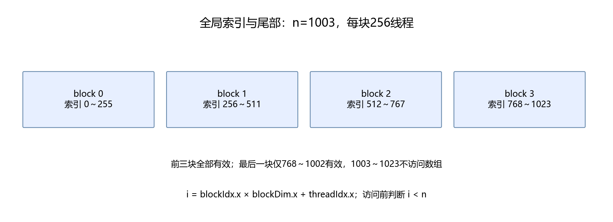

# 第29章 第一个 CUDA 程序与数据布局

这一章写向量加法，建立线程索引、边界、内存和计时的基本概念。完整 CUDA 源码在[vector_add.cu](../assets/part06/cuda/vector_add.cu)，正文先看必要片段。

## 29.1 补齐最少的 C++ 语法

Python 的变量不需要写类型，CUDA C++ 通常需要。例如 `int n` 是整数，`float value` 是单精度浮点数。`const` 表示不能通过该变量修改其值。

`float* a` 是指向浮点数据的指针。可以把 `a[i]` 理解为从 a 所指数组读取第 i 项；指针本身不是数组长度，长度需要单独传入。

`std::vector<float>` 是 CPU 侧动态数组。`cudaMalloc` 分配 GPU 内存，`cudaMemcpy` 搬运数据，`cudaFree` 释放 GPU 内存。CPU 数组地址和设备地址不能混用。

`__global__` 标记可由 CPU 启动、在 GPU 执行的函数；`__device__` 标记 GPU 侧辅助函数。无需先学完整 C++ 体系，再写这个小程序。

## 29.2 先给出索引公式

```math
i=\text{blockIdx.x}\times\text{blockDim.x}+\text{threadIdx.x}
```

blockIdx.x 是当前块编号，blockDim.x 是每块线程数，threadIdx.x 是块内线程编号。例如每块256个线程，块编号2、块内编号7，对应全局编号519。

```cuda
__global__ void add(const float* a, const float* b, float* out, int n) {
    int index = blockIdx.x * blockDim.x + threadIdx.x;
    if (index < n) out[index] = a[index] + b[index];
}
```

一个线程处理一个元素。线程之间不需要互相等待，这是最容易理解的并行任务。



## 29.3 为什么需要尾部检查

总块数是向上取整：

```math
\text{blocks}=\left\lceil\frac{n}{\text{threads}}\right\rceil
```

n=1003、threads=256 时启动4块、1024线程，最后21个线程没有有效元素。if(index<n) 防止越界。

CUDA 测试使用1048579个元素，刻意选不能被256整除的长度。只用整齐尺寸测试，可能把边界错误隐藏起来。

## 29.4 数据布局与连续访问

连续数组相邻元素存放在相邻位置。warp 中相邻线程访问相邻地址，通常有利于合并访存；实际内存事务还受对齐、数据类型、架构和缓存影响，不能固定说“一定合并成两次”或“一定快16倍”。

PyTorch 张量除了形状还有 stride，即沿某一维前进一个位置时地址移动多少元素。转置可以只改变 stride，不复制数据，因此看起来同样大小的张量可能不连续。

```python
import numpy as np
a = np.arange(12).reshape(3, 4)
assert a.flags.c_contiguous
assert not a.T.flags.c_contiguous
```

GPU 算子也要明确布局约定。最初实现只接受连续输入；需要支持其他布局时，应在索引里处理 stride，或明示复制的额外成本。

## 29.5 分配、搬运、启动与检查

```text
准备CPU数组 → 分配GPU内存 → 复制输入
→ 启动kernel → 检查执行 → 复制结果 → 释放内存
```

`add<<<blocks, threads>>>(...)` 是 CUDA 启动语法。CPU 提交工作后通常可以继续执行，GPU 任务异步运行。

`cudaGetLastError()` 检查启动错误，`cudaDeviceSynchronize()` 等待设备并检查异步执行错误。完整程序为每个 CUDA 调用检查返回值，不能编译成功就认定计算正确。

CUDA 源文件里的 CHECK 宏集中处理这些检查。初学时先理解它把错误信息打印并退出，无需把宏机制作为本章主线。

## 29.6 正确性与内存检查

CPU 计算 a+b，GPU 结果逐元素比较。本例真实运行最大误差为0，但这只适用于这里的加法与输入，后面的归约不能普遍要求逐位一致。

使用 Compute Sanitizer 检查越界：

```bash
python3 script/part06/29_cuda_examples.py --arch sm_89 --sanitize
```

脚本还编译后两章的 RMSNorm 与 GEMM，核验日志保存在[29_native_cuda.json](../outputs/part06/29_native_cuda.json)。本机三个示例均报告零内存错误。

架构参数应匹配自己的 GPU，8.9 对应 sm_89。sm_80 是其他设备的目标，不作为所有 NVIDIA 卡的通用默认。

## 29.7 CUDA Event 与有效带宽

Event 标记同一流里的起止位置，等待结束事件后读取间隔。先预热，再重复200次，把总时间除以次数。

```math
BW_{\text{effective}}=\frac{B_{\text{read}}+B_{\text{write}}}{t}
```

向量加法逻辑读两份、写一份数据，FP32 每个元素计12字节。这是[NVIDIA 性能指南](https://docs.nvidia.com/cuda/cuda-c-best-practices-guide/index.html)中的有效带宽计算思路，不等于硬件计数器测到的 DRAM 流量。

重复访问同一组数组可能命中缓存。本机这个小工作集测出很高的有效带宽，不能据此宣称显存硬件突破了标称带宽。要测冷缓存、大工作集或真实模型，应单独设计实验。

Sanitizer 会大幅改变耗时，日志里的时间仅用于检查执行，不能拿来做性能结论。

## 29.8 本章产出

完成真实 CUDA 编译、奇数尾部验证与内存检查。能解释 threadIdx、blockIdx、连续布局、异步执行和 Event 时间。

自行修改 n=1、n=257，保留边界检查再运行。不要用“数组长度刚好整除”规避问题。
### 补充练习与验收

先独立完成[本章两道练习](../assets/practice/part06.md#第29章)，再核对参考答案和本章验收证据。记录自己的输入、结果与边界案例，不要求复制作者的实验数值。

[上一章](28-从推理瓶颈到GPU执行.md) · [下一章：归约与数据复用](30-归约共享内存与矩阵复用.md)
