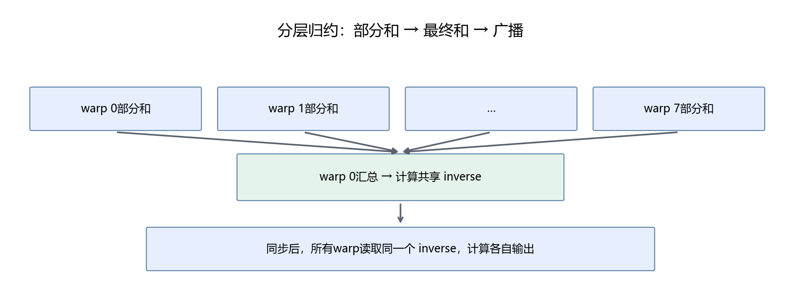
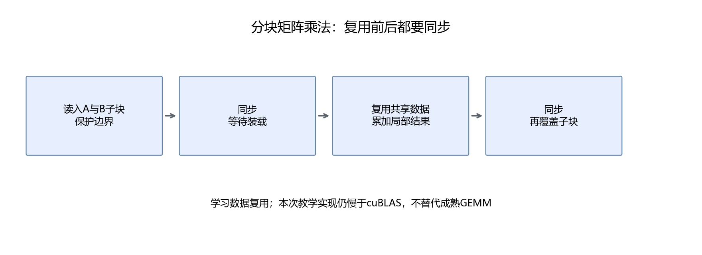

# 第30章 归约、共享内存与矩阵复用

向量加法让每个线程独立算一个结果。RMSNorm 和 Softmax 还需要把一行中的信息合起来，这叫归约。矩阵乘法则需要重复使用同一批输入，这一章把两种协作方式分别讲清楚。

## 30.1 先给出归约目标

```math
s=\sum_{j=0}^{D-1}x_j^2
```

有1536个值时，让一个线程逐个相加可以算对，但缺少并行。可以让256个线程各自负责一部分，再把256个部分和合起来。

```text
线程0：列0、256、512……
线程1：列1、257、513……
……
线程255：列255、511、767……
```

这是跨步循环。它保证所有有效列被处理一次，也能覆盖不是线程数整数倍的宽度。

## 30.2 从树形相加理解并行归约

先看8个数：第一轮相邻两个相加，得到4项；第二轮得到2项；第三轮得到1项。每轮减少一半，深度约为 log₂D。



不同相加顺序可能带来浮点误差，不能因为数学公式相同就要求结果逐位一致。正确性测试需要合理容差，也要保留最大误差。

## 30.3 warp 内交换值

CUDA 的 shuffle 指令允许同一 warp 的线程交换寄存器值。教学代码使用：

```cuda
for (int offset = 16; offset > 0; offset /= 2)
    value += __shfl_down_sync(0xffffffff, value, offset);
```

offset 依次为16、8、4、2、1。最后 lane 0 保存这一 warp 的总和。lane 是 warp 内线程编号0～31。

这里的掩码表示32个线程都参与。本例始终启动完整 warp，并让每个线程走到交换指令；不能把这段代码直接搬到只有部分线程参与的分支里，仍照用完整掩码。

## 30.4 跨 warp 归约需要共享内存

256个线程有8个 warp。每个 warp 的 lane 0 把总和写到 partial[warp]，然后所有线程调用 __syncthreads，确保数据已写好。

接下来 warp 0 用8个有效值和24个零做第二次归约。只让一个线程算出 inverse 后，把它写入共享变量，再调用一次 __syncthreads，所有 warp 才能使用同一个缩放系数。

```text
各线程局部平方和
→ 各warp总和
→ 8个值写入共享内存
→ warp 0算全行总和
→ 写入inverse并同步
→ 所有线程写输出
```

一个容易忽略的错误是：只在第一个 warp 得到总和，其他 warp 却使用自己的旧值。程序可以正常启动，但大部分输出错误。完整[rms_norm.cu](../assets/part06/cuda/rms_norm.cu)明确广播最终 inverse，并测试1537宽度、多行输入和所有输出元素。

## 30.5 RMSNorm 的公式与手算

```math
y_j=\frac{x_j}{\sqrt{\frac{1}{D}\sum_{k=0}^{D-1}x_k^2+\varepsilon}}\gamma_j
```

D 是最后一维宽度，γ 是训练得到的逐元素权重，ε 防止零输入时除零。RMSNorm 不先减均值，和 LayerNorm 的计算不同。

x=[3,4]、γ=[1,1]、ε=10^-6：平方为[9,16]，平均12.5，分母约3.535534，输出约[0.848528,1.131371]。

```python
import numpy as np
x = np.array([3.0, 4.0])
weight = np.ones(2)
y = x / np.sqrt(np.mean(x * x) + 1e-6) * weight
assert np.allclose(y, [0.8485281, 1.1313708], atol=1e-6)
```

归约只是其中一步。要和模型等价，还需要相同的 epsilon、权重、累加精度以及类型转换顺序，下一章会处理。

## 30.6 矩阵乘法怎样复用数据

```math
C_{ij}=\sum_{k=0}^{K-1}A_{ik}B_{kj}
```

计算同一行不同列时反复使用 A 的一行，计算同一列不同输出行时反复使用 B 的一列。朴素实现可能对重复数据反复访问，分块把一小块 A、B 放进共享内存，让块内线程复用。



教学 kernel 使用16×16块。每轮加载两个16×16子块，同步后计算，再同步后加载下一块。第二次同步防止有线程尚未读完数据，就被下一轮覆盖。

尾部位置填零，最后只写有效输出。不能让越界线程提前 return，因为同块其他线程仍需要它参与 __syncthreads。

## 30.7 为什么仍然采用 cuBLAS

完整[matmul.cu](../assets/part06/cuda/matmul.cu)比较朴素实现、分块实现和 cuBLAS。使用 FP32、相同输入，并给出误差与真实时间；还验证23×37乘37×19的非整齐边界。

本机512方阵实验中，分块比朴素快，但仍明显慢于 cuBLAS。报告见[原生 CUDA 实验](../outputs/part06/29_native_cuda.json)。分块只学会一种复用，成熟库还处理寄存器分块、指令调度、硬件矩阵单元和不同形状选择。

**Tensor Core** 是 NVIDIA 的矩阵运算硬件单元；它不是“CUDA线程写了乘法就自动获得的性能”。使用什么数据类型、指令与累加约定需要专门设计。本部分不会把这个 FP32 普通乘法实现包装成 Tensor Core GEMM。

真实 Qwen 的线性层继续使用框架与成熟矩阵库。优化工作也包括识别无需重写的部分。

## 30.8 本章产出

完成 FP32 RMSNorm 的归约与广播验证，读懂共享内存 GEMM 的两次同步。解释为什么“一个线程算出总和”不等于“所有线程拥有总和”，以及为什么教学 GEMM 不替换真实模型线性层。
### 补充练习与验收

先独立完成[本章两道练习](../assets/practice/part06.md#第30章)，再核对参考答案和本章验收证据。记录自己的输入、结果与边界案例，不要求复制作者的实验数值。

[上一章](29-第一个CUDA程序与数据布局.md) · [下一章：Triton融合RMSNorm](31-用Triton实现融合RMSNorm.md)
