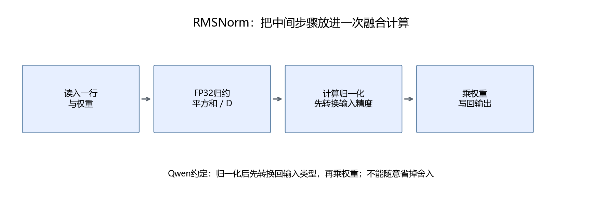
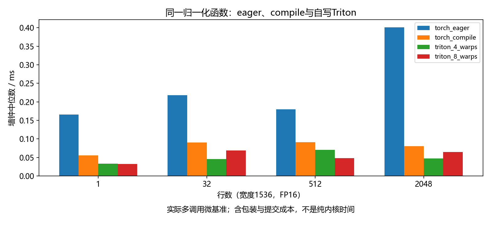

# 第31章 用 Triton 实现融合 RMSNorm

CUDA 让我们理解线程协作。Triton 用接近 Python 的语法描述一组 GPU 数据操作，减少手动管理线程索引和共享内存的代码。这里用它完成真实模型将使用的推理算子。

## 31.1 先看参考计算的精度顺序

Qwen 的参考实现需要按下面顺序理解：

```text
输入FP16 → 转FP32 → 平方、平均、rsqrt与归一化
→ 归一化结果转回FP16 → 乘FP16权重 → FP16输出
```

数学上都是归一化乘权重，但中间是否舍入会改变浮点结果。把所有步骤都保留 FP32，最后才转 FP16，不一定和原模型一样。

参考函数在[common.py](../script/part06/common.py)中，融合实现显式保留乘权重前的转换。CUDA 上一章的 FP32 示例与这里的 FP16 实践各有明确用途。

## 31.2 Triton 的最小概念

`@triton.jit` 让函数在调用时编译为 GPU 程序。`tl` 来自 triton.language，不是普通 NumPy；函数内部的操作描述在 GPU 上执行。

`tl.program_id(0)` 取当前 program 编号；`tl.arange` 生成逻辑索引；`tl.load` 与 `tl.store` 读写设备地址；`tl.sum` 做归约。编译器把这些逻辑操作映射到线程和指令。

不直接写 threadIdx，不代表 GPU 没有线程；不手写同步，不代表代码无需正确的数据依赖。可以对照[Triton 官方归一化教程](https://triton-lang.org/main/getting-started/tutorials/05-layer-norm.html)理解归约映射，本章计算的是 RMSNorm。

## 31.3 一个 program 负责一行

```python
row = tl.program_id(0)
cols = tl.arange(0, BLOCK)
values = tl.load(X + row * D + cols, mask=cols < D, other=0)
```

这是 kernel 内部片段，直接运行请使用[kernels.py](../script/part06/kernels.py)。X 是设备指针，D 是真实列数，BLOCK 是逻辑块宽度。

D=1536 时选 BLOCK=2048，额外512项通过 mask 排除。归约填0，因为0不会改变平方和；Softmax 的填充值不同，下一章会讲。



num_warps 是启动配置，本例比较4与8。它不等于逻辑元素数，不要求“每个线程只处理一项”。具体映射由编译器决定。

## 31.4 融合计算的关键部分

```python
values = values.to(tl.float32)
inverse = tl.rsqrt(tl.sum(values * values, axis=0) / D + EPS)
normalized = (values * inverse).to(Y.dtype.element_ty)
result = normalized.to(tl.float32) * weight.to(tl.float32)
```

读取一行后计算缩放，在 GPU 局部值中使用归一化结果，再写输出，避免原始组合操作的多个中间张量。

这里只说逻辑融合，实际寄存器使用、溢出和访存仍由编译结果与测量确定。列数过大可能带来资源压力，因此当前接口限制最后一维1～8192。

EPS 与 BLOCK 是编译时常量，改变它们可能触发新的编译。第一次调用的编译时间不能算进稳态性能，也不能从首次请求体验里消失；分别记录两种需求。

## 31.5 包装函数要负责什么

Python 包装器检查设备、类型、布局、形状和 epsilon，再分配输出并启动 kernel。本实现支持连续 FP16、BF16、FP32，权重与输入类型一致，输出保持输入形状和类型。

多维输入按最后一维展开成多行，因此 [1,T,1536] 和 [T,1536] 可以使用同一个 kernel。空行数返回空输出，不启动空 grid；零输入仍通过正 epsilon 得到有限结果。

推理算子没有注册反向传播。model.eval() 只改变模块的训练行为，不会关闭梯度；实际调用应放在 torch.inference_mode() 中。对需要梯度的直接调用，包装器明确拒绝，不悄悄丢失梯度。

## 31.6 正确性怎样检查

```bash
python3 script/part06/31_verify_and_benchmark.py
```

测试覆盖三种浮点类型、1与257宽度、1537尾部、真实1536隐藏维度、空行、零输入以及不同尺度。再检查非连续布局和未支持的梯度调用。

误差报告在[31_correctness.json](../outputs/part06/31_correctness.json)。容差随精度选择，BF16 与 FP32 不能用同一个苛刻逐位标准；通过这些样例也不能证明所有输入都正确。

还应关注绝对误差与相对误差的区别：接近零时相对误差可能很大；输出很大时仅用固定绝对误差可能不合理。torch.testing.assert_close 同时使用两者。

## 31.7 与原实现和编译器比较

同一形状比较四条路径：Torch eager、torch.compile 的同一参考函数、Triton 4 warp、Triton 8 warp。全部先预热，再计时。



这里的 torch.compile 仅编译归一化函数，不是编译整个模型。编译器也能融合计算，所以只打败多操作 eager 基线，不能宣称优于所有现有优化。

结果见[31_microbenchmark.json](../outputs/part06/31_microbenchmark.json)，保留多轮数据、Event 与墙钟时间。不同形状最优配置可能不同，不根据一次测试把8 warp写成普遍更好。

## 31.8 本章产出

得到符合 Qwen 类型转换约定的融合算子，完成多形状正确性与多基线比较。下一步还要证明它进入真实模型，局部加速暂不视为整体收益。
### 补充练习与验收

先独立完成[本章两道练习](../assets/practice/part06.md#第31章)，再核对参考答案和本章验收证据。记录自己的输入、结果与边界案例，不要求复制作者的实验数值。

[上一章](30-归约共享内存与矩阵复用.md) · [下一章：有条件地少算](32-Softmax贪心选择与少算一步.md)
