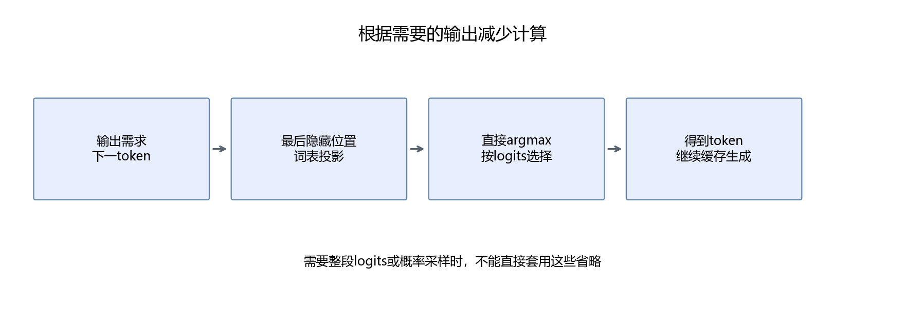

# 32 Softmax、贪心选择与少算一步

前面学习的是把相同计算做得更紧凑。这一章换一个问题：推理真正需要哪些结果？如果最终只需要一个 token，有些中间结果可以省略。先理解原计算，才有资格决定省去什么。

## 32.1 Softmax 的公式与数值稳定性

给定一行分数，Softmax 把它们变成总和为1的非负数：

```math
p_i=\frac{e^{z_i}}{\sum_j e^{z_j}}.
```

例如分数为 `[1, 2, 3]`，指数约为 `[2.718, 7.389, 20.086]`，总和约30.193，结果约为 `[0.090, 0.245, 0.665]`。最大的分数仍然对应最大的概率。

但直接计算大分数的指数会溢出。令这一行最大值为 $`m=\max_j z_j`$，使用：

```math
p_i=\frac{e^{z_i-m}}{\sum_j e^{z_j-m}}.
```

为什么能减去最大值？分子与分母同时除以 $`e^m`$，比值不变。对于上面的例子，新的指数约为 `[0.135, 0.368, 1]`，归一化后仍得到相同结果。

减去最大值后，各项指数不超过1，至少有一个等于1。这里假定输入有限；全为负无穷或含有 NaN 的输入需要额外定义，不能靠这个推导自动处理。

## 32.2 用已经学过的归约写 Softmax

一行计算分成四步：读入分数、求最大值、计算指数并求和、除以总和后写回。它与 RMSNorm 都需要归约，但归约目标不同。

```python
# kernels.py 中内核的主要计算；完整声明与包装器见附件
z = tl.load(X + row * D + cols, cols < D, other=-float('inf'))
numerator = tl.exp(z - tl.max(z, axis=0))
denominator = tl.sum(numerator, axis=0)
tl.store(Y + row * D + cols, numerator / denominator, cols < D)
```

尾部补负无穷，指数就变成零，不参与总和。这里不能随意补零：当有效分数都很小时，补入的零会错误改变最大值。

本课程的包装器支持连续二维数组、有限输入与宽度不超过8192的行。它用于学习融合归约，不能直接拿去处理 Qwen 的151936维词表；先看支持范围，再看函数名字。

正确性测试已包含非整齐宽度。运行第31章脚本会同时验证这个实现，不为同一组验证另起一个昂贵实验。

## 32.3 贪心生成需要概率吗

贪心生成只选择分数最大的 token。实数运算中，指数严格递增，除以同一个正数不改变大小关系，因此：

```math
\operatorname*{argmax}_i\operatorname{softmax}(z)_i
=\operatorname*{argmax}_i z_i.
```

所以可以直接写：

```python
next_token = logits[:, -1, :].argmax(dim=-1, keepdim=True)
```

这省去了构造整行概率的计算与临时数组。`argmax` 本身仍然需要查找最大值，并不是零成本。



如果任务需要随机采样、概率显示、温度与 top-p，不能把 Softmax 一概删除。使用者要求的输出不同，允许的优化也不同。

还有一个浮点细节：数学上的严格递增，不代表计算机中每个很接近的数都能区分。脚本使用 FP32 的 `[0, 1.4901161193847656e-8]` 演示：直接 argmax 返回1，而 Softmax 把两项舍入为相同值后，argmax 返回0。

因此本课程从一开始就把“直接按 logits 贪心选择”作为生成规则，两条模型对照路径都执行同一规则；不把与概率舍入有关的边界情况偷偷忽略。

```bash
python3 script/part06/32_selection.py
```

结果保存在[32_selection.json](../outputs/part06/32_selection.json)。该实验同时包含普通随机输入的比较与上述反例。

## 32.4 只计算最后位置的词表分数

第14章介绍过：隐藏向量经过输出矩阵，变成词表分数。假设隐藏状态形状为 `[B, S, D]`，词表大小为 $`V`$，输出权重为 `[V, D]`：

```math
Z=HW^{\mathsf T},\qquad Z\in\mathbb R^{B\times S\times V}.
```

提示词有512个 token，并不意味着生成第一个新 token 时，需要把512个位置的词表分数都交给调用者。下一 token 只使用最后位置的分数，可以先取隐藏状态的最后一行，再乘输出权重。

注意顺序：省去的是之前位置的**输出投影**。提示词内部的注意力、隐藏状态和 KV 缓存仍需计算，不能把输入直接截成最后一个 token。

本次模型调用使用：

```python
result = model(input_ids=ids, use_cache=True, logits_to_keep=1)
```

`logits_to_keep` 是本次 Transformers Qwen 实现支持的参数，参见[官方 Qwen2 文档](https://huggingface.co/docs/transformers/model_doc/qwen2)。其他版本和模型需要检查自己的接口，不能假定都兼容。

实际512 token 输入，完整输出形状为 `[1, 512, 151936]`，最后位置输出为 `[1, 1, 151936]`。前者仅 FP16 logits 的逻辑容量约148 MiB，后者约0.29 MiB；这是 logits 数组的容量，不是整个模型的显存占用。

本次独立预填充比较得到约1.076倍加速，最后位置 logits 最大绝对误差0.0078125，选择的 token 相同。矩阵形状改变可能触发不同计算路径，因此仍需比较结果，不能只靠代数相同下结论。原始数据见[32_last_logits.json](../outputs/part06/32_last_logits.json)。

两条 RMSNorm 模型对照都已经启用这个参数，所以这项收益单独报告，不计入自写算子的收益。训练时要计算多个位置的损失，或业务需要整段 logits 时，必须保留相应输出。

## 32.5 这与投机解码有什么关系

这里的办法是根据输出需求减少工作。技术术语“投机解码”通常指小模型或其他方法先提议多个 token，再由目标模型验证，并通过接受与修正机制保持目标生成分布。

那条路线需要额外模型、批量验证、接受率与输出分布的检查。本课程没有实现它，也不把省略 Softmax 称为投机解码。可以把它作为后续选题，但需要重新证明正确性与整体收益。

## 32.6 本章产出

得到一个稳定 Softmax 教学实现、一份贪心选择实验，以及只计算最后位置 logits 的真实模型对照。能分别说明“融合计算”和“减少需求外的计算”如何产生收益，也能指出何时不能省略。

[上一章](31-用Triton实现融合RMSNorm.md) · [下一章：测量与瓶颈](33-性能测量与瓶颈分析.md)
