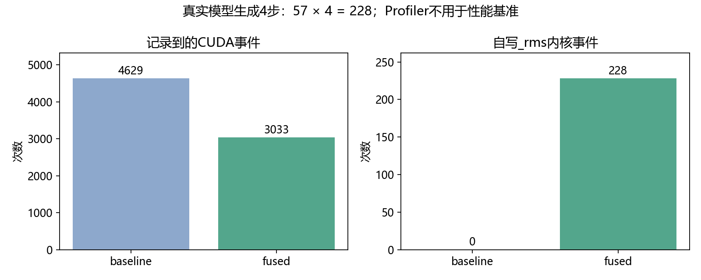

# 33 性能测量与瓶颈分析

代码运行成功，只说明它能执行。代码输出正确，说明它在已检查的输入上符合约定。要说它值得接入推理，还需要回答：与谁比较、计时范围是什么、改善发生在哪里？

## 33.1 先写清楚比较条件

本课程使用 RTX 4060 Ti 16GB、FP16、Qwen2.5-1.5B-Instruct、batch size 1、SDPA 注意力和 KV 缓存。两条路径都直接 argmax，也都只计算最后位置 logits。

唯一要研究的变量是 RMSNorm：原始 Transformers eager 实现，与我们的 Triton 融合实现。它不是与 vLLM 引擎的对比；借用 vLLM 镜像获得 Python 库，不等于运行了那个推理引擎。

完整版本记录在[28_environment.json](../outputs/part06/28_environment.json)，模型配置指纹在第34章报告中。更换硬件、库版本、模型或输入长度后，需要重新测量。

## 33.2 为什么不能直接掐一次秒表

首次调用可能包括编译、分配与库初始化。CUDA 调用又是异步的：CPU 提交完工作，不代表 GPU 已经做完。测到首次编译，或只测到提交动作，都无法代表稳定推理。

本课程计时前先预热，并在墙钟测量前后同步：

```python
torch.cuda.synchronize()
start = time.perf_counter()
output = run_generation()
torch.cuda.synchronize()
elapsed = time.perf_counter() - start
```

模型加载和 Triton 编译不放进稳定生成计时；服务启动耗时应另行评价。基准固定生成32步，即使出现 EOS 也继续，以保持对照工作量相同。真正 HTTP 服务则遇到 EOS 停止，这两种数据不能直接混用。

CUDA Event 可记录 GPU 时间线上的起止间隔。本课程微基准中，它包围多次 Python 调用，区间可能含 CPU 提交不及时导致的 GPU 空闲，因此也不应把该数值当作单个内核的纯执行时间。

## 33.3 多次采样与交替顺序

每种长度测9轮，顺序交替为 baseline→fused、fused→baseline。这样能减轻“第二个总是更热”或机器状态逐渐变化的影响，不能消除所有噪声。

记录全部原始样本，用中位数概括一次实验。9个数排序后第5个就是中位数；它不容易被单个异常值拉偏。四分位区间可表示样本分散程度，但样本很少时不能把它当作严密的置信区间。

加速比与耗时降低比例分别为：

```math
s=\frac{t_{\rm baseline}}{t_{\rm fused}},\qquad
r=1-\frac{t_{\rm fused}}{t_{\rm baseline}}=1-\frac1s.
```

例如1.16倍加速对应约13.8%的耗时降低，不是16%的耗时降低。低于1说明新路径更慢。

不要只保留最快一次，也不要把同一段 JSON 多次复制后当成独立采样。后台 GPU 工作、温度、频率和 Windows/WSL 调度都可能改变结果；我们的数字是这次运行的观察，不是产品性能保证。

## 33.4 Profiler 证明什么

Profiler 可以记录框架操作和 GPU 内核。它适合寻找大量重复的小操作，确认自写内核有没有执行，以及观察各段耗时。

```bash
python3 script/part06/33_profile_model.py
```

脚本在两条真实模型路径各生成4步。这个 Qwen 模型有28层，每层两处 RMSNorm，再加最终一处，共57处。预期融合内核调用为：

```math
57\times4=228.
```

本次实际观察到融合路径228个 `_rms` 内核事件、包装器228次调用、零回退；原路径没有这个内核。两条路径记录到的 CUDA 事件总数分别为4629和3033。



这说明执行路径确实改变了。事件数减少不等于按相同比例加速，因为不同内核的耗时不一样，CPU 提交间隙也不同。

结果见[33_profile.json](../outputs/part06/33_profile.json)。本地还生成 trace-baseline.json 与 trace-fused.json，方便用时间线工具查看；文件较大，Git 忽略，不要求读者下载。使用方式参考[PyTorch Profiler 文档](https://docs.pytorch.org/docs/stable/profiler)。

Profiler 会增加开销，所以剖析与性能基准分开执行。记录表中的剖析耗时，不拿来替代第34章的墙钟基准。

## 33.5 计算、搬运和提交，谁限制了速度

算术强度是“计算量除以数据量”，常用 FLOP/byte 表示。它帮助我们判断：一项工作更需要计算能力，还是更需要数据传输能力。

向量加法每个元素只做一次加法，却读取两个数并写出一个数；矩阵乘法则可以反复使用读入的数据。第30章分块正是为了提高复用。

但实际还存在小任务的提交开销。单 token 解码中的归一化行很短，融合可能主要减少操作与内核的数量；长提示词下，注意力和投影占比更大，局部改善不一定转化为明显整体收益。

第29章向量加法得到的逻辑有效带宽约1250 GB/s。不要据此声称4060 Ti的物理显存带宽达到这个值：同一组约12 MiB的数据被反复访问，缓存可参与供给。逻辑字节数除以耗时衡量的是这项任务的有效吞吐，不自动等于外部显存流量。

如果要继续深入，可以用 Nsight 检查缓存命中、实际内存流量和占用率；在没有这些证据时，将瓶颈解释写成待验证假设。关于有效带宽的计算，参见[NVIDIA 最佳实践指南](https://docs.nvidia.com/cuda/cuda-c-best-practices-guide/index.html)。

## 33.6 为什么保留成熟库基线

第31章同时测 torch.compile 的归一化函数，避免只与多操作 eager 比较。第30章同时测 cuBLAS，发现教学分块 GEMM 仍明显落后。

这两类结果都值得保留：前者说明编译器本身也能融合，后者说明手写不自动意味着更快。是否采用自写实现，取决于支持范围、真实收益与维护成本，而不是代码是否从零开始。

## 33.7 本章产出

得到真实调用证据和一套可复用测量方法。能区分单算子、剖析、完整生成与 HTTP 观察，并能准确解释加速比。下一章将把这些证据与模型输出正确性放在一起。

[上一章](32-Softmax贪心选择与少算一步.md) · [下一章：接入模型](34-把融合算子接入真实推理.md)
