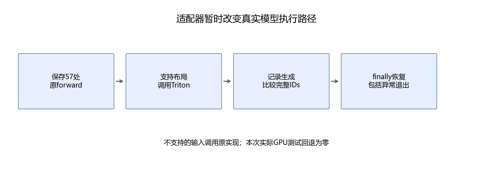
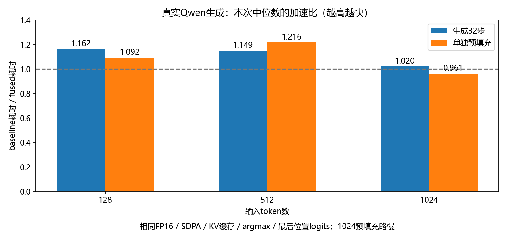

# 34 把融合算子接入真实推理

现在把独立实验接到第四部分已经使用的 Qwen 模型上。目标是保留模型权重、注意力与生成规则，只替换归一化实现；比较输出与完整生成耗时，再判断这项工作是否值得继续。

## 34.1 找到真实调用位置

先查看模型模块，而不是猜它的结构：

```python
for name, module in model.named_modules():
    if type(module).__name__ == 'Qwen2RMSNorm':
        print(name, tuple(module.weight.shape))
```

本次模型每层有 input_layernorm 与 post_attention_layernorm，另有最终 model.norm。虽然名字里有 layernorm，这个类实际执行的是 RMSNorm。28层共57个模块，权重宽度1536。

替换时使用每个模块自己的 weight 与 variance_epsilon，不另外生成一套参数。它们来自现有模型权重，不能因为公式相似就改用随机权重。

## 34.2 用上下文管理器暂时替换

先理解 `yield` 划出的使用范围、`finally` 的恢复顺序，以及循环里默认参数保存原始方法的作用。对应短例子见[工程 Python 附录第3、4节](../附录/03-读懂后续工程代码.md#3-异常finally-与-with失败后仍然收尾)，它们不需要模型或 GPU 就能运行。

完整实现见[model_adapter.py](../script/part06/model_adapter.py)。主要结构是保存旧方法、安装新方法、在 finally 中恢复：

```python
with torch.inference_mode():
    with fused_qwen_norms(model) as info:
        output = decode(model, input_ids, steps=32)
# 离开 with 后恢复原方法，即使内部发生异常
```

前几部分学过 with 管理文件与事务，这里管理模型的临时执行状态。`types.MethodType` 把函数绑定为某个模块的方法；闭包中的 `_original=original` 固定当前模块的旧方法，避免循环结束后所有回退都误用最后一个模块。



若输入布局或类型不支持，或者梯度仍然开启，适配器调用该模块的原方法。直接调用 Triton 包装器则拒绝不支持的输入。两者职责不同：包装器说明算子约定，适配器保障集成路径。

回退是保留可用性的方法，不是性能成功的证据。真实测试必须记录回退次数；如果全部回退，结果正确也不能宣称自写算子已参与推理。

这是一种便于讲解的 Python 集成，依赖当前版本的内部模块类名。版本升级后若没有找到类，代码明确报错。它没有修改 vLLM 内部算子，也没有注册训练反向传播。需要兼容 torch.compile 等更多子系统时，再学习[PyTorch 自定义算子接口](https://docs.pytorch.org/docs/main/library.html)，不要把课程适配器当作完整框架扩展。

## 34.3 保持生成流程一致

本次流程是：应用聊天模板，输入完整提示词，生成第一个 token；此后每次只输入新 token，同时传回 past_key_values。每步选取最后位置 logits 的 argmax。

```python
result = model(
    input_ids=current_ids,
    past_key_values=past,
    use_cache=True,
    logits_to_keep=1,
)
past = result.past_key_values
current_ids = result.logits[:, -1, :].argmax(-1, keepdim=True)
```

这段循环的完整版本在[inference.py](../script/part06/inference.py)。batch size 固定为1，不处理带 padding 的多请求批次；不能只把 batch 参数调大，就声称完成了批量服务。

两条对照使用相同模型、输入、FP16、SDPA、KV 缓存和选择规则。第32章的少算 logits 已同时启用，不作为 RMSNorm 的功劳。

## 34.4 从数值误差检查到生成检查

检查分成三个层次。

1. 第31章先比较独立 RMSNorm 的输出，覆盖不同形状、精度与尺度。
2. 三条真实中文提示词分别生成8步，逐步比较全部词表 logits，记录最大误差，并要求生成 token 完全相同。
3. 性能基准的128、512、1024 token 输入分别固定生成32步；每轮两条路径的完整32个 token 都必须相同，且同一路径重复结果稳定。

这些检查没有要求所有浮点数逐位相同。模型中的浮点误差可以积累，token 是否改变还取决于候选分数之间的间隔。通过这组输入不意味着任何提示词都不会改变答案；扩大使用范围时应加入业务评价集。

另外，第33章验证228次真实内核调用，并模拟异常确认恢复原方法。正确结果、实际执行、可恢复状态，缺一项都不足以交付。

## 34.5 真实测量结果

```bash
python3 script/part06/34_model_benchmark.py
```

模型加载与首次编译在计时之外。每种长度交替测9轮，生成32步；数字为本次墙钟中位数，单位毫秒。输入长度实验通过重复合法 token 序列构造，目的在于控制形状，不代表某类自然语言题目的质量评价。

| 输入 token 数 | 原实现整段生成 | 融合实现整段生成 | 整段加速比 | 单独预填充加速比 |
|---|---:|---:|---:|---:|
| 128 | 1106.14 | 951.85 | 1.162 | 1.092 |
| 512 | 1118.93 | 974.08 | 1.149 | 1.216 |
| 1024 | 1147.63 | 1124.93 | 1.020 | 0.961 |



完整中位数、每轮耗时与生成 IDs 都在[34_real_inference.json](../outputs/part06/34_real_inference.json)。结果展示了收益范围：短输入这次有明显改善，长输入收益很小，而1024 token 的预填充略慢。背景调度波动也较大，不能把2%的观察包装成可靠的普遍提升。

为什么可能这样？归一化只占模型计算的一部分，长输入会增加注意力与投影工作；融合还带来自己的调度与资源开销。这是与现象相符的解释，精确归因需要更多硬件计数与重复实验。

本课程没有测完整模型 torch.compile 基线，也没有比较 vLLM、TensorRT-LLM 等成熟引擎。因此结论限定为：在本次硬件和输入上，我们的算子进入了真实 Transformers eager 推理，且部分形状观察到整段收益。

## 34.6 没有收益时怎样继续

先看 Profiler 确认调用，再检查形状、配置和回退。若目标工作负载本来就由矩阵乘法或注意力主导，继续把 RMSNorm 微基准做到更快，也可能无法显著改善业务。

可以尝试不同 warp 配置，或考虑与相邻操作进一步融合；每次改变后仍要验证数值、真实调用与整体耗时。也可以接受成熟实现更合适，把教学算子保留为实验资产，而不是默认进入服务。

## 34.7 本章产出

得到一个可恢复的模型适配器、一份完整生成一致性报告和真实推理基准。自写算子已经跨过“独立运行”的阶段；下一章把它接成可调用、可对照、可交付的服务。

[上一章](33-性能测量与瓶颈分析.md) · [下一章：部署与交付](35-算子部署评价与交付.md)
