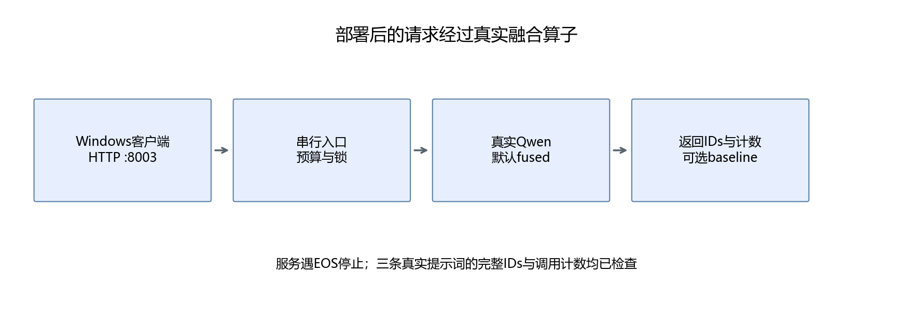

# 35 算子部署、评价与交付

这一章完成最终实践：HTTP 请求进入真实 Qwen 生成过程，默认使用自写融合 RMSNorm，返回模型输出与调用信息。保留 baseline 入口，方便同一环境对照或停用优化。

## 35.1 服务由哪些部分组成



启动时加载模型并预热融合路径；请求时编码提示词，在推理上下文中临时替换归一化，执行带 KV 缓存的贪心生成，然后恢复原实现。

完整入口见[35_server.py](../script/part06/35_server.py)。不需要把 CUDA 编译器、模型权重和 HTTP 逻辑全部塞进一个文件：各模块分别负责算子、适配、生成和服务。

服务只开一个 worker，并用锁一次接受一个生成任务。模块方法的替换是进程共享状态，若并发请求一边替换、一边恢复，可能干扰彼此。当前设计用明确的串行边界处理这个问题，不把它当作高并发推理引擎。

## 35.2 启动可运行的GPU服务

在 WSL 终端执行，先将宿主目录换成自己的实际路径。下面命令复用现有镜像，不重新下载权重：

```bash
docker run --name handmade-llm-part06-service \
  --gpus all --ipc=host \
  -p 127.0.0.1:8003:8000 \
  -e HF_HUB_OFFLINE=1 -e TRANSFORMERS_OFFLINE=1 \
  -v /mnt/g/project/handmade-llm-normal:/workspace \
  -v /mnt/g/models/qwen2_5_1.5b_instruct:/models/qwen:ro \
  -w /workspace --entrypoint python3 \
  vllm/vllm-openai:v0.20.1-cu129-ubuntu2404 \
  -m uvicorn 35_server:app --app-dir script/part06 \
  --host 0.0.0.0 --port 8000 --workers 1
```

看到 Application startup complete 后再测试。模型读取可能较慢，首次 Triton 调用还需编译；`/health` 可用代表启动预热已完成，不代表所有形状都编译好了。

容器退出后，保留原容器可通过 `docker start -a handmade-llm-part06-service` 再次启动。创建同名新容器前先检查已有容器，不要直接复制命令反复创建。

## 35.3 从Windows调用

conda base 已有 requests，可在 VS Code 终端运行：

```python
import requests

session = requests.Session()
session.trust_env = False  # 本地请求不经过系统代理
response = session.post(
    'http://127.0.0.1:8003/generate',
    json={'prompt': '用一句话解释什么是矩阵。',
          'backend': 'fused', 'max_new_tokens': 32},
    timeout=(5, 180),
)
response.raise_for_status()
print(response.json())
session.close()
```

`backend` 默认 fused，改为 baseline 就使用原方法。返回值包括 text、ids、输出 token 数、停止原因、生成耗时、替换模块数、自定义调用次数与回退次数。

HTTP 服务遇到 EOS 会停止，返回的 token 数包含产生的 EOS，但展示文字会跳过特殊 token。没有产生 EOS 时，达到 max_new_tokens 后返回 length。不要把“达到长度限制”误写成“模型认为回答完成”。

## 35.4 证明请求确实经过算子

```powershell
python script/part06/35_client.py --url http://127.0.0.1:8003
```

客户端实际发送三条课程相关提示词，每条分别调用 baseline 与 fused，要求完整返回 IDs 相同。融合路径还必须满足：57个模块被替换、回退为零、自定义调用次数等于57乘生成步数。

调用计数是应用内部证据，第33章的 Profiler 提供 GPU 执行证据，二者相互补充。本次请求均通过，保存于[35_http.json](../outputs/part06/35_http.json)，含真实返回内容与 IDs。

计数器不会把返回 JSON 里的数字变成独立硬件测量；如果修改了适配器，仍要重新检查内核事件。也不能因为计数正确就省去输出一致性测试。

## 35.5 入口边界与恢复

请求限制如下：prompt 为1～1200个字符；max_new_tokens 为1～128；编码后输入加生成预算不超过2048 token。字符与 token 不是一回事，所以先校验字符，再校验编码后的预算。

不合法的 backend 或参数返回422，超上下文预算返回413，生成锁已占用返回429。业务方应处理这些状态，而不是把 HTTP 200 之外的结果当成空回答。

上下文管理器在异常时恢复原方法，请求的 finally 释放锁。第33章验证过异常恢复，客户端检查了非法 backend 的422；这并不等于已经覆盖所有网络或硬件故障。

要立即关闭优化，可以让请求使用 baseline；若计划长期部署，再把默认 backend 变成服务配置。不要通过改模型权重来停用算子，因为权重本来就没有变化。

## 35.6 交付材料应该包含什么

| 材料 | 位置与用途 |
|---|---|
| 教学原理与支持范围 | 本部分各章及运行指南 |
| 原生CUDA源码 | assets/part06/cuda/，学习索引、归约与复用 |
| Triton与适配源码 | script/part06/，实际进入模型 |
| 正确性与性能原始数据 | outputs/part06/，保留不利结果 |
| GPU环境与配置指纹 | 28_environment.json 与34报告 |
| 部署实际请求报告 | 35_http.json，证明服务实际调用 |
| 源码与报告指纹 | 35_manifest.json，记录本次交付版本 |

生成交付清单：

```powershell
python script/part06/35_release.py
```

模型权重来自第四部分的本地副本，不放入 Git。编译产物、Profiler 大时间线和本地日志也不上传；保存源码、环境与小型结果，使读者能够重新生成它们。

## 35.7 最后怎样判断采用与否

如果目标是学习，原生 CUDA、分块 GEMM 和 Softmax 都有价值：它们把数据布局、同步与归约讲清楚。如果目标是服务加速，就必须再看目标输入的整段收益、正确性覆盖、已有成熟方案和维护成本。

本次融合 RMSNorm 在短输入真实推理中起到了作用，但长输入收益有限。教程保留这种结果，是为了让读者学会选择优化对象，而不仅是模仿一个内核。

继续做新的算子时，沿用同一过程：明确输入输出与精度约定，写参考实现，测试边界，建立多种基线，接入真实路径，检查实际调用，再测业务耗时。没有整体改善时，也应能给出解释与下一步，而不是只交一个能运行的函数。

## 35.8 本章产出

完成默认使用自写算子的真实 HTTP 推理服务，保留对照与恢复方式，并交付源码、正确性报告、性能数据与复现清单。至此，课程从 Python、数学与模型训练，走到了 Agent 应用和推理底层优化的两条实践分支。

[上一章](34-把融合算子接入真实推理.md) · [返回本部分目录](README.md)
