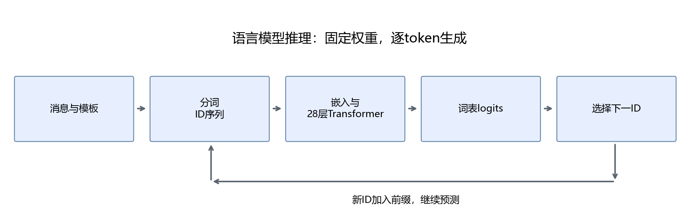
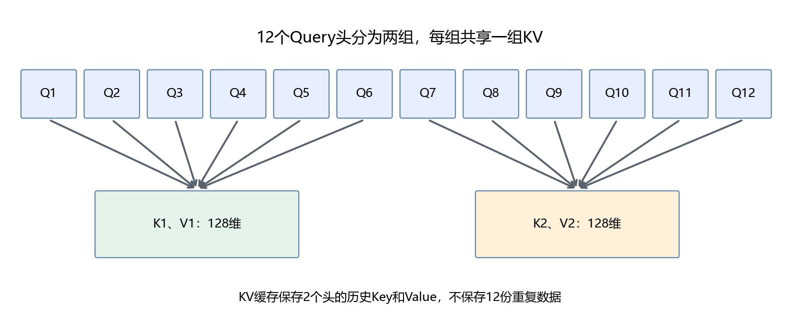

# 第14章 语言模型与大模型结构

目标：把第13章的序列生成扩展到真实语言模型，理解训练阶段与推理的区别，读懂一份模型配置。本章先检查配置，不加载数GB权重，也不重新预训练模型。

## 14.1 从预测数字到预测文本

若位置轴、词表轴或条件概率还不熟，先做[第四部分入口自测](../附录/02-学习路线与前置自测.md#5-第四部分入口从训练转到加载与生成)，需要时查[数学速查](../附录/04-数学符号与计算速查.md)第2、4节。本章从小模型的生成目标转向真实配置，不要求先会部署服务。

第13章给定数字前缀，预测下一个编号。语言模型采用类似的条件概率分解，只是词表更大，数据变为文本：

```math
P(x_1,\ldots,x_T)=\prod_{t=1}^{T}P(x_t\mid x_{<t}).
```

$`x_t`$是第$`t`$个token，$`x_{<t}`$是它之前的全部token。这里的token是分词器定义的文本单元，不一定是一个汉字或一个英文单词。第15章会直接打印真实分词结果。

这条公式来自第6章的条件概率乘法。三个token的例子可以写成：

```math
P(x_1,x_2,x_3)=P(x_1)P(x_2\mid x_1)P(x_3\mid x_1,x_2).
```

如果三项分别为0.5、0.4和0.2，整个序列概率是0.04。为了训练，我们通常对概率取负对数，把乘法转换为加法：

```math
L=-\frac{1}{T}\sum_{t=1}^{T}\log P_\theta(x_t\mid x_{<t}).
```

$`\theta`$代表模型参数。这就是逐位置交叉熵的平均形式。被忽略的padding或提示位置不计入平均，实际分母应是有效目标数量。

```python
import numpy as np
probabilities = np.array([0.5, 0.4, 0.2])
sequence_probability = probabilities.prod()
mean_loss = -np.log(probabilities).mean()
assert np.isclose(sequence_probability, 0.04)
assert np.isclose(np.exp(-3 * mean_loss), sequence_probability)
print(sequence_probability, mean_loss)
```

训练时已知真实下一个token，用它计算损失；生成时没有未来答案，需要把新生成token加入前缀，再预测下一项。这个区别与第13章相同。

## 14.2 “大”体现在哪里

参数量、训练数据与计算规模共同影响模型能力。增加层数或隐藏维度，会增加参数与计算；扩大数据覆盖范围，可能让模型学到更多语言与任务模式。但参数更多并不保证每个任务更准确，还要考虑数据、训练方法与评价条件。

本部分采用Qwen2.5-1.5B-Instruct作为可运行样例。它属于开放权重的指令模型，便于本地加载和观察；选择它是为了控制资源需求，不把它当成当前最强模型。本文涉及的具体配置以本地`config.json`及[官方模型说明](https://huggingface.co/Qwen/Qwen2.5-1.5B-Instruct)为准。



模型参数在生成前已经通过训练获得。本部分主要使用这些现成参数进行推理和部署。把模型载入内存不是训练，发送一条提示词也不会自动改变权重。

## 14.3 预训练、指令微调与偏好优化

这些词描述不同的训练目的：

| 阶段 | 常见数据形式 | 主要变化 |
| --- | --- | --- |
| 预训练 | 大量文本及其相邻token | 学习语言分布与广泛模式 |
| 监督指令微调，SFT | 指令、上下文与示范回答 | 学习任务格式及回答方式 |
| 偏好优化 | 回答比较、奖励或偏好数据 | 调整对不同回答的倾向 |
| 推理 | 当前请求的token | 使用已有权重生成输出 |

这张表说明常见流程，并不表示每个模型都采用完全相同的数据和算法。基础模型通常偏向文本续写；指令模型经过额外训练，通常更适合消息形式的交互。模型名字中的`Instruct`表示这里选择的是指令版本。

SFT依然会更新参数，只是训练样本结构与损失位置可能不同。例如输入“解释矩阵”，目标是示范回答；可以只对回答位置计算损失。偏好优化也不等同于把正确事实全部写进参数，它解决的是训练目标定义下的回答选择问题。

提示词、检索与微调需要区分：提示词改变当前输入；检索先找资料，再把资料加入输入；微调通过训练更新一部分或全部参数。第五部分会进一步讨论Agent、规则、skills与知识资料的组织，本部分先把模型接口做清楚。

## 14.4 三类Transformer结构

第13章采用因果Decoder结构。实际模型还存在其他组织方式：

| 结构 | 可读取的位置 | 典型任务 |
| --- | --- | --- |
| Encoder | 通常允许双向读取输入 | 表示学习、分类、序列标注 |
| Decoder-only | 当前与历史位置 | 自回归文本生成 |
| Encoder-Decoder | 编码器读输入，解码器读历史输出并读取编码结果 | 翻译等输入到输出任务 |

区别首先在信息如何流动，而不是名称长短。Decoder-only也可以完成分类：把类别定义为输出文本，或者接专门分类头。但生成一段看起来合理的文字，并不自动说明分类结果经过了校准。

本部分的Qwen是Decoder-only模型。输入经过嵌入、多个Transformer块与最终归一化，线性输出层给词表中每个token一个logit；Softmax及选token规则随后产生下一项。

## 14.5 先读配置，再计算形状

在第四部分环境设置完成后运行：

```powershell
python script/part04/14_model_structure.py
```

脚本读取本地配置并保存`outputs/part04/14_structure.json`。实际样例包含以下字段：

| 配置 | 本地值 | 含义 |
| --- | --- | --- |
| `hidden_size` | 1536 | 每个位置的隐藏向量维度 |
| `num_hidden_layers` | 28 | Transformer块数量 |
| `num_attention_heads` | 12 | Query头数量 |
| `num_key_value_heads` | 2 | Key、Value头数量 |
| `intermediate_size` | 8960 | 前馈层中间维度 |
| `vocab_size` | 151936 | 词表大小 |
| `max_position_embeddings` | 32768 | 配置的最大位置范围 |

每个注意力头的维度为$`1536/12=128`$。一个批次输入$`T`$个token，隐藏张量形状为$`(B,T,1536)`$；Query投影输出1536维，Key与Value各输出$`2\times128=256`$维。

```python
hidden_size, query_heads, kv_heads = 1536, 12, 2
head_dim = hidden_size // query_heads
assert head_dim == 128
assert kv_heads * head_dim == 256
print((query_heads, head_dim), (kv_heads, head_dim))
```

PyTorch的`Linear`权重按`(out_features,in_features)`保存；正文按右乘矩阵表达时形状为`(in_features,out_features)`。不要只看1536与256就认为维度放反，先确认代码使用的乘法约定。

配置的最大位置范围不是当前电脑一定能承受的输入长度。第17章计算KV Cache与权重预算，第18章还会给教学服务设置更小的上下文限制。

## 14.6 GQA为什么有12个Query头，却只有2个KV头

第13章中每个头都有自己的Query、Key、Value。分组查询注意力GQA让多个Query头共享一组Key、Value。在当前配置中，12个Query头分成2组，每组6个头使用同一组KV。



各Query头仍分别计算注意力分数，因此不是把12个输出头直接合并成2个。减少的是KV投影和缓存的头数量。相同序列长度与数据类型下，2个KV头所需缓存是12个KV头的六分之一；实际运行时间还取决于实现与硬件。[GQA原论文](https://arxiv.org/abs/2305.13245)

第16章查看缓存如何增长，第17章会把这个比例代入字节公式。这是结构选择影响部署资源的具体例子。

## 14.7 RMSNorm、RoPE与SwiGLU

这三个模块先理解其输入输出与作用，不要求首次阅读就重写全部模型。

### RMSNorm：按均方根缩放

```math
\operatorname{RMSNorm}(x)_i=
\frac{x_i}{\sqrt{\frac{1}{d}\sum_{j=1}^{d}x_j^2+\epsilon}}\gamma_i.
```

先平方求均值，再开方，然后逐项相除并乘可训练系数$`\gamma_i`$。它与LayerNorm的一个区别是这里不先减均值。$`\epsilon`$避免全零向量造成除零。

```python
x = np.array([3., 4.])
rms = np.sqrt(np.mean(x * x))
normalized = x / rms
assert np.isclose(np.mean(normalized * normalized), 1)
print(normalized)
```

上面的示例为便于手算，令$`\gamma=1`$并省略$`\epsilon`$；实际实现必须保留稳定项。

### RoPE：把位置引入Query与Key

二维旋转的基本式是：

```math
\begin{pmatrix}u'\\v'\end{pmatrix}=
\begin{pmatrix}\cos\theta&-\sin\theta\\\sin\theta&\cos\theta\end{pmatrix}
\begin{pmatrix}u\\v\end{pmatrix}.
```

RoPE对Query与Key的成对分量进行与位置相关的旋转，不同分量采用不同频率。这样点积会反映相对位置信息。它与第13章“直接把位置向量加到嵌入上”的实现不同，但都在解决模型如何区分顺序的问题。

注意力缓存中保存的Key已经包含相应位置变换。增量生成需要继续使用正确的新位置；只传一个新token而把位置重置到0，会改变计算结果。

### SwiGLU：前馈层中的门控乘法

按行向量约定，可以写成：

```math
\operatorname{FFN}(x)=
\bigl(\operatorname{SiLU}(xW_g)\odot(xW_u)\bigr)W_d,
\qquad \operatorname{SiLU}(z)=z\sigma(z).
```

两条投影分别形成门控分支与数值分支，对应位置相乘，再投影回隐藏维度。$`\odot`$是逐项相乘，不是矩阵乘法。它不同于第13章的普通两层前馈结构，因此不能把两个模型配置完全照搬。

## 14.8 参数量与模型文件

词嵌入表包含$`V\times d`$个参数。当前配置为$`151936\times1536=233373696`$，约2.33亿个。这还不包括28层内部参数。

`tie_word_embeddings=true`表示输入词嵌入与输出词表投影共享权重。统计独立参数时不要把这份张量重复计数。第15章会加载模型，用`sum(p.numel() for p in model.parameters())`得到实际独立参数量。

`config.json`保存结构，`model.safetensors`保存权重，分词器文件保存词表与编码规则，`generation_config.json`保存部分生成默认值。只复制权重而漏掉分词器或配置，不能保证部署结果一致。

## 14.9 本章产出与验收

产出为[配置检查脚本](../script/part04/14_model_structure.py)及结构报告。完成后应能：

1. 将下一个token概率连成完整序列概率，并解释负对数损失。
2. 区分训练阶段与推理，说明提示词是否更新权重。
3. 根据配置算出头维度、KV投影维度与嵌入参数量。
4. 说明当前GQA配置为什么减少KV Cache。

下一章开始加载现成模型，检查token、对话模板与实际生成结果。[第四部分运行指南](README.md)

### 补充练习与验收

先独立完成[本章两道练习](../assets/practice/part04.md#第14章)，再核对参考答案和本章验收证据。记录自己的输入、结果与边界案例，不要求复制作者的实验数值。
