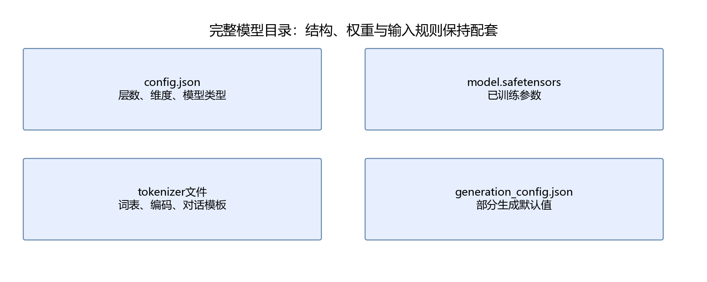

# 第15章 本地加载与对话输入

目标：加载本地分词器和模型，完成一次真实推理，并能解释消息、token ID、logit与生成文本之间的关系。先完成[环境与模型准备](README.md#环境与模型准备)。本章只加载权重，不训练模型。

## 15.1 先确认模型目录完整

基础实验统一使用Qwen2.5-1.5B-Instruct。已有权重时直接指定本地目录，不需要重新下载：

```powershell
conda activate handmade-llm
$env:LLM_MODEL_PATH = 'G:\models\qwen2_5_1.5b_instruct'
python script/part04/15_local_inference.py
```

示例使用运行指南中新建的 `handmade-llm` 环境；复用作者已有环境时，将激活命令改为 `conda activate vllm`。路径是本机示例，其他电脑应替换成自己的目录。若使用运行指南中的可选下载脚本，默认目录为工作区的`models/qwen2.5-1.5b-instruct`。



至少确认以下内容：结构配置、权重、分词器配置和词表。大型模型可能把权重拆成多个分片，并提供索引文件；分片缺一份也不完整。不能只根据目录存在就认为加载成功。

参考脚本设置`local_files_only=True`，运行时不会默默联网补文件。缺文件会报错，应该先检查路径、模型完整性和版本。指定`trust_remote_code=False`，本样例由Transformers内置Qwen2实现加载。

## 15.2 环境名、驱动与PyTorch是三个不同检查

本机有RTX 4060 Ti 16GB，但复用的`vllm`环境中PyTorch是CPU版。因此基础实验实际在CPU上运行，不因为环境叫这个名字就调用vLLM，也不因为`nvidia-smi`正常就使用CUDA。

```python
import torch
print(torch.__version__)
print(torch.version.cuda)
print(torch.cuda.is_available())
```

三项分别显示包版本、该包编译时对应的CUDA运行时、当前是否可访问CUDA设备。CPU版会得到`None`和`False`。本部分不要求更换它；模型结构、分词与HTTP部署都可以先在CPU检查。

若在已有可用GPU环境中运行，设置`LLM_DEVICE=cuda`。脚本会在CUDA不可用时明确报错，而不是偷偷切回CPU。默认`auto`只在`torch.cuda.is_available()`为真时选择GPU。

CPU参考使用FP32；CUDA路径使用FP16。两种精度在速度、占用和数值误差上不同，不能把CPU测得的延迟直接称为GPU性能。

## 15.3 分词：字符数不等于token数

分词器把文本转换为整数序列，模型只接收这些整数所对应的嵌入向量。常见分词可能按子词或字节片段组织，空格、标点与汉字都可能影响切分。

下面只加载分词器，通常比加载模型快得多：

```python
import os
from transformers import AutoTokenizer
tokenizer = AutoTokenizer.from_pretrained(
    os.environ["LLM_MODEL_PATH"],
    local_files_only=True,
    trust_remote_code=False,
)
text = "我正在学习Python。"
ids = tokenizer.encode(text, add_special_tokens=False)
print("字符数：", len(text), "token数：", len(ids))
print(ids)
print(tokenizer.convert_ids_to_tokens(ids))
assert tokenizer.decode(ids) == text
```

`convert_ids_to_tokens`显示内部词表片段，可能包含不直观的字节编码符号；最终可读文本用`decode`获得。单个token解码也可能只是一个不完整字符，因此不能认为每个生成ID都能单独显示成一个汉字。

同一文本使用不同分词器，ID与长度都可能不同。不能把某模型的ID序列直接送给另一模型，也不应使用“中文一字一个token”估算严格的上下文上限。

## 15.4 消息列表如何变成模型输入

常见消息包含`role`和`content`：

| role | 表示什么 |
| --- | --- |
| `system` | 当前交互的行为要求或任务说明 |
| `user` | 用户提供的问题与信息 |
| `assistant` | 已有模型回答或预先提供的回答示例 |

角色字段不是单独的神经网络输入通道。对话模板会把它们转换成模型训练时采用的文本标记，再分词成一条序列。不同模型的模板不能随意互换。[Transformers对话模板说明](https://huggingface.co/docs/transformers/v4.57.1/en/chat_templating)

```python
messages = [
    {"role": "system", "content": "请用中文简短回答。"},
    {"role": "user", "content": "用一句话解释什么是矩阵。"},
]
formatted = tokenizer.apply_chat_template(
    messages, tokenize=False, add_generation_prompt=True
)
print(formatted)
inputs = tokenizer(formatted, add_special_tokens=False, return_tensors="pt")
print(inputs.input_ids.shape)
```

`add_generation_prompt=True`补上“接下来由assistant开始”的模板部分。模板中已有特殊标记，因此再次分词使用`add_special_tokens=False`，避免重复添加。也可以直接让`apply_chat_template`输出张量；本章分两步写，是为了看清中间文本。

不要把字典的`str(messages)`作为对话输入。那样模型看到的是Python字典表示，不是正式对话格式。

## 15.5 历史对话必须显式提供

本地模型对象保存参数，通常不自动保存某位用户的聊天历史。一次请求结束后，下次请求要继续对话，就需要把相关历史消息重新组成输入。

```python
history = [
    {"role": "user", "content": "矩阵是什么？"},
    {"role": "assistant", "content": "矩阵是按行和列排列的数。"},
    {"role": "user", "content": "给一个两行两列的例子。"},
]
history_text = tokenizer.apply_chat_template(
    history, tokenize=False, add_generation_prompt=True
)
assert "两行两列" in history_text
print(len(tokenizer.encode(history_text, add_special_tokens=False)))
```

历史越长，占用的输入token和KV Cache越多。保留、删减或总结历史是应用层决定，不是模型权重自动增长。第18章的服务是无状态接口，每次请求只使用发送来的消息。

system消息也不能保证模型绝不犯错。它是输入的一部分，会影响生成，但真实遵循程度应通过第19章的用例检查。

## 15.6 加载权重与选择计算精度

参考实现的核心加载方式为：

```python
from transformers import AutoModelForCausalLM
torch.set_num_threads(4)
model = AutoModelForCausalLM.from_pretrained(
    os.environ["LLM_MODEL_PATH"],
    local_files_only=True,
    trust_remote_code=False,
    dtype=torch.float32,
    attn_implementation="eager",
).to("cpu").eval()
```

`from_pretrained`先根据配置创建结构，再载入参数；`to`决定设备；`eval`切换推理模式。`eager`使用便于观察的注意力实现，本章不以它作为最高性能配置。

`.eval()`与`torch.inference_mode()`有不同作用：前者调整Dropout等模块行为，后者关闭此处不需要的自动求导记录。预测时一般同时使用。

1.5B权重转换为FP32后仅参数就约需6.17GB十进制字节。加载峰值和总占用还包括临时数据、张量与缓存，电脑可用内存不能只刚好等于这个数。第17章会展开计算。

## 15.7 一次前向得到什么

对于`(B,T)`的token ID，语言模型返回的logits通常为`(B,T,V)`，其中$`V`$是词表大小。最后位置的分数用于预测下一个token。

```python
with torch.inference_mode():
    logits = model(**inputs, use_cache=False).logits
last_logits = logits[0, -1].float()
probabilities = torch.softmax(last_logits, dim=-1)
values, indices = torch.topk(probabilities, 5)
print(logits.shape)
print([(int(i), float(p)) for i, p in zip(indices, values)])
assert torch.isclose(probabilities.sum(), torch.tensor(1.0))
```

这里取的是“下一token候选”，不是五个完整回答。选择第一项以后，后续分布还会随前缀变化。概率高也不等于事实可信度高，它首先是模型对当前词表候选的相对分配。

第16章会展示贪心、温度和top-p如何从这些分数选择下一项。

## 15.8 生成结果为什么要切掉输入

`generate`通常返回输入加新增token。因此先记录输入长度，再截取新增部分：

```python
with torch.inference_mode():
    outputs = model.generate(
        **inputs, max_new_tokens=64, do_sample=False,
        pad_token_id=tokenizer.eos_token_id,
    )
new_ids = outputs[0, inputs.input_ids.shape[1]:]
answer = tokenizer.decode(new_ids, skip_special_tokens=True)
print(answer)
assert 0 < len(new_ids) <= 64
```

`max_new_tokens`限制新增token数量，不包含输入。`skip_special_tokens=True`隐藏结束等特殊标记，便于显示；检查是否正常结束时仍需查看实际ID，而不是只看文本。

不要把首次模型加载时间算进每次生成时间。完整脚本分别记录`load_seconds`和`generation_seconds`，并保留实际设备、精度、参数量与token数。

## 15.9 常见问题如何定位

| 现象 | 优先检查 |
| --- | --- |
| 找不到配置或词表 | `LLM_MODEL_PATH`和目录完整性 |
| `qwen2`结构不识别 | Transformers版本及当前解释器 |
| `torchvision::nms`不存在 | torch与torchvision是否配套 |
| GPU存在但CUDA不可用 | 当前PyTorch是否为CPU版 |
| 输出重复了提示文本 | 是否只解码新增token |
| 对话格式不正常 | 是否使用该模型的chat template |
| 回复截断 | `max_new_tokens`及结束token |

避免一遇到错误就升级所有库。先打印解释器路径和包版本，再定位具体层。课程验证版本和本机修复记录见运行指南。

## 15.10 本章产出与验收

运行[完整本地推理脚本](../script/part04/15_local_inference.py)后，得到`outputs/part04/15_inference.json`，其中包含分词往返检查、模板文本、下一token的前五项及完整生成结果。

验收时确认：分词能还原原文；消息确实经过模板；只显示新增回答；实际设备和精度已记录。尝试改变一句提示，再比较输入token数和回答，不能只检查“程序打印了一段话”。

下一章分析生成策略和缓存，并检查增量计算是否与完整前缀计算一致。

### 补充练习与验收

先独立完成[本章两道练习](../assets/practice/part04.md#第15章)，再核对参考答案和本章验收证据。记录自己的输入、结果与边界案例，不要求复制作者的实验数值。
