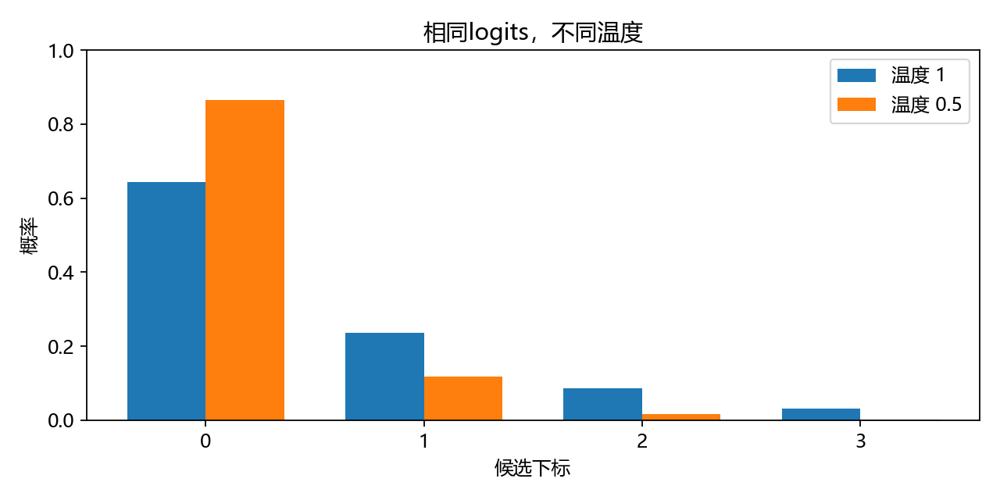
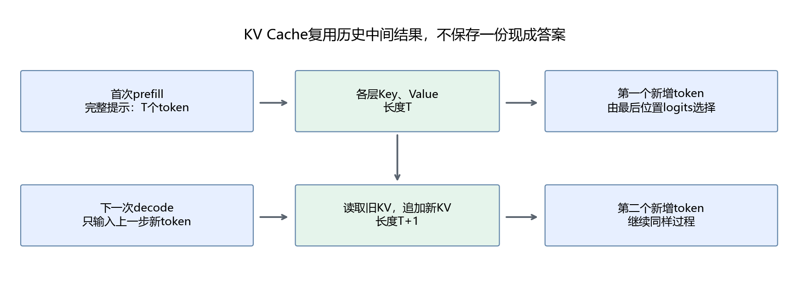

# 第16章 生成策略与KV缓存

目标：从logits计算选token规则，区分prefill与decode，并检查真实模型的缓存计算。需要第6章的概率、第13章的因果注意力与第15章的本地推理。

## 16.1 生成是重复执行下一token预测

对于当前前缀，模型输出下一token的logits。选择一个token，加入前缀，再重复前向计算，直到生成结束token或达到长度限制。

```text
输入前缀 → 下一token分数 → 选择ID
    ↑                         ↓
    └──── 把新ID加入前缀 ──────┘
```

一次前向得到的是各候选的分数，选择规则才决定最终输出。因此“模型一样”不等于“回答一定一样”：输入模板、采样配置和计算精度都需要固定。

本章先用四个候选的数值例子计算分布，再观察真实模型。例子中的候选编号只是下标，不是Qwen的实际token ID。

## 16.2 贪心选择与温度

贪心选择直接取最大logit：

```math
x_{t+1}=\arg\max_i z_i.
```

它每一步选局部最高分，不保证整个回答拥有最高联合概率。它也不保证答案正确，只是选择策略确定。

采样时通常先使用温度$`\tau`$调整分布：

```math
p_i=\frac{\exp(z_i/\tau)}{\sum_j\exp(z_j/\tau)},\qquad \tau>0.
```

温度小于1，较高分数的相对优势增大；温度大于1，分布通常更平缓。温度不是准确率控制器，降低它不能修复知识错误。

```python
import numpy as np
logits = np.array([2., 1., 0., -1.])
def probabilities_at_temperature(logits, temperature):
    scaled = logits / temperature
    exponentials = np.exp(scaled - scaled.max())
    return exponentials / exponentials.sum()
p1 = probabilities_at_temperature(logits, 1)
p_half = probabilities_at_temperature(logits, 0.5)
print(p1, p_half)
assert np.isclose(p1.sum(), 1)
assert p_half[0] > p1[0]
```



温度1时第一项概率约0.644，温度0.5时约0.865。每项仍为非负且总和为1。数学上$`\tau=0`$不能代入上式；在参考实现中，贪心用`do_sample=False`，不依赖把温度设成0。

## 16.3 top-k与top-p保留哪些候选

top-k只保留概率最大的$`k`$项，再重新归一化。top-p先按概率降序排列，选择累计概率首次达到或超过$`p`$的最短前缀，再在其中采样。

例如概率为`[0.60,0.25,0.10,0.05]`，top-p取0.8，应保留前两项，因为0.60未达到0.8，加入0.25后为0.85。不能把跨过阈值的那一项也删除，否则累计质量不足。

```python
probabilities = np.array([0.60, 0.25, 0.10, 0.05])
order = np.argsort(-probabilities)
count = np.searchsorted(np.cumsum(probabilities[order]), 0.8) + 1
selected = order[:count]
filtered = np.zeros_like(probabilities)
filtered[selected] = probabilities[selected]
filtered /= filtered.sum()
assert selected.tolist() == [0, 1]
assert np.isclose(filtered.sum(), 1)
print(filtered)
```

对于只有一项就超过阈值的情况，仍至少保留这一项。温度缩放会影响概率，进而影响top-p候选集合。参考脚本的`nucleus`函数检查范围，并处理阈值等于1时的边界。

当`do_sample=False`时，温度和top-p不是决定贪心输出的主要控制项。加载模型默认配置后，要明确本次生成策略，避免把文件里的采样默认值与请求设置混在一起。[Transformers生成参数](https://huggingface.co/docs/transformers/v4.57.1/en/main_classes/text_generation)

## 16.4 结束条件与重复输出

模型可能生成EOS，也可能达到`max_new_tokens`后被停止。这两种结束方式需要区分：前者是模型发出结束标记，后者可能截断一句话或一个JSON对象。

如果输出重复，先检查输入模板、历史消息、长度设置和模型能力，再考虑重复惩罚。重复惩罚也是改变选择分数的规则，可能影响需要保留重复项的任务，例如代码、列表和数字序列。不要只因一条回复重复，就把固定惩罚当成所有任务的默认答案。

固定随机种子有助于复现采样，但跨硬件、精度和库版本仍可能存在变化。教学服务默认使用贪心，并记录版本；评价时也保留原始输出。

## 16.5 为什么需要KV Cache

因果注意力中，旧位置的表示只依赖旧位置及之前的输入。模型参数不变、位置不变、推理模式不变时，新增一个token不会改变此前位置各层的Key与Value。因此可以保存它们，下一步只计算新位置的Q、K、V。

缓存的不是已经生成的中文答案，而是每层注意力要使用的Key、Value张量。新Query仍需要与历史Key计算分数，再按权重汇总历史Value。



这里能复用历史结果，依赖因果约束。对于任意双向注意力输入，新增内容可能改变旧位置表示，不能直接套用同样逻辑。编辑已有前缀、切换模型或改变位置规则，也可能使缓存失效。

## 16.6 prefill与decode分别做什么

**Prefill**处理完整输入提示，生成各层初始KV Cache，并计算第一个新增token的分布。**Decode**通常每次只输入一个新token，用旧缓存产生下一项。

假设提示长40个token，要生成8个token：首次处理40个输入；选择第一项后，第二次只输入这个新ID，同时保留40个旧位置的KV。缓存长度随后依次增长。

输出的最后一个token不一定已经被写入缓存。例如我们第八次前向以后选出了第八项，但还没有进行第九次前向，缓存里只有原始输入和前七项。第16章报告因此检查：

```math
T_{\text{cache}}=T_{\text{prompt}}+N_{\text{steps}}-1.
```

这能帮助区分“生成了几个token”与“实际前向处理了几个token”。

## 16.7 增量输入长度变小，attention mask仍覆盖历史

从第二次前向开始，`input_ids`可以只有`(1,1)`，但当前Query仍会读全部历史KV，attention mask需要覆盖历史加当前输入。

示意调用如下，完整实现见[缓存检查脚本](../script/part04/16_generation_cache.py)：

```text
首次：input_ids = 完整提示，past_key_values = None
之后：input_ids = 上一步选出的一个ID
      past_key_values = 上次返回的缓存
      attention_mask = 覆盖历史与本次位置
```

当前固定版本的Qwen实现根据缓存长度继续处理位置；使用其他模型或更新库时，还要检查`cache_position`和`position_ids`约定。不能只把完整输入切成最后一列，就宣称实现了正确缓存。

## 16.8 先验证等价，再测时间

每一步同时运行两条路径：

1. 不使用缓存，对同一个完整前缀重新计算。
2. 使用缓存，仅计算当前新增位置。

对照两条路径最后位置的全部logits，并确认贪心选择的ID相同。两条路径必须接收相同前缀，不能各自采样后再比较。

```powershell
python script/part04/16_generation_cache.py
```

脚本使用`torch.inference_mode()`，先做不计时的预热；GPU计时前后会同步。本机CPU/FP32的八步实验中，最大logit差约`1.05e-4`，所选token全部一致。不同形状的矩阵运算存在浮点舍入差异，检查采用数值容差，不要求逐位相同。

本实验固定执行八步以便对照，即使遇到EOS也继续检查计算。这是等价性实验的约定；正式回答生成仍应按结束条件停止。

## 16.9 KV Cache减少什么，不减少什么

它避免重复计算旧位置的投影、前馈网络等，并复用旧KV。但新Query仍读取越来越长的历史。因此缓存不会让任意长上下文的每一步都具有相同成本，也不会消除注意力对历史数据的访问。

缓存还增加内存占用。序列更长、并发请求更多、KV头更多，缓存通常也更大。第17章使用真实配置计算字节数。

短提示、少量token或CPU小模型上，缓存收益可能不显著；首次prefill更不应该算作“缓存后每步时间”。报告把首次与后续时间分开，比较同一步完整前缀和缓存路径。

本机测量是逐步、串行、eager实现的局部实验，不代表高并发推理引擎吞吐。第18章会说明连续批处理与教学服务的差别。

## 16.10 本章产出与验收

得到`outputs/part04/16_cache.json`：包含温度分布、top-p筛选、每步logit差、选择ID、缓存长度与两条路径耗时。

验收时应能手算top-p保留项，解释首次prefill与后续decode，说明为什么只输入一个ID仍需要历史mask，并检查缓存长度少于“提示加全部输出”一个位置的原因。

下一章将这些张量形状换算成内存需求，再介绍量化与参数适配的基础。

### 补充练习与验收

先独立完成[本章两道练习](../assets/practice/part04.md#第16章)，再核对参考答案和本章验收证据。记录自己的输入、结果与边界案例，不要求复制作者的实验数值。
