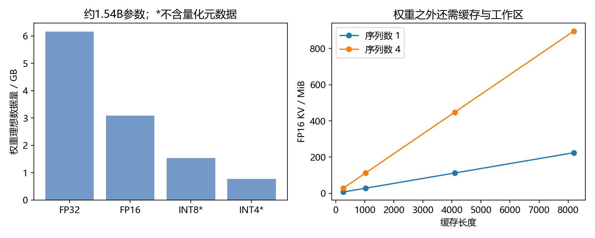
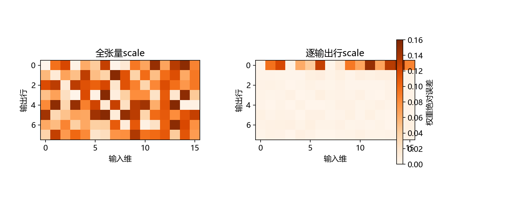

# 第17章 资源预算、量化与参数适配

目标：在加载更大模型前估算权重和KV Cache占用，手算并实现小矩阵INT8量化，理解LoRA增量及合并。本章量化与LoRA实验只操作教学矩阵，真实Qwen仍使用原始权重。

## 17.1 先区分磁盘、内存与显存

磁盘存模型文件；加载到CPU时使用系统内存；放到GPU时使用显存。三者容量不能相加后直接当成“可用显存”。CPU卸载可以减少GPU常驻量，但引入传输和执行成本，也需要对应框架支持。

`nvidia-smi`显示的是显卡容量和当前使用情况；它不显示所有CPU内存需求。文件大小也不等于推理占用：权重可能转换精度，还会创建KV Cache、激活、中间结果和运行时工作区。

先列资源项，再估算数量：



## 17.2 参数量怎样换算成字节

```math
M_{\text{weights}}=P\times s_w.
```

$`P`$是独立参数数量，$`s_w`$是每个参数的存储字节数。FP32通常4字节，FP16/BF16通常2字节，INT8理想数据部分1字节，INT4理想数据部分半字节。

假设有15.4亿个参数，FP16权重约为$`1.54\times10^9\times2=3.08\times10^9`$字节。十进制GB除以$`10^9`$，GiB除以$`2^{30}`$；二者不要混用。

```python
parameters = 1_540_000_000
for bytes_per_parameter in (4, 2, 1, 0.5):
    size = parameters * bytes_per_parameter
    print(bytes_per_parameter, "bytes/parameter:", size / 10**9, "GB", size / 2**30, "GiB")
```

量化还要存scale、可能的zero point和分组元数据，不能只用INT4理想值当作真实文件大小。当前真实模型在第15章统计的独立参数量略不同于四舍五入后的1.54B，精确预算用实际数值。

FP16与BF16字节数相同，但表示范围与精度分配不同，硬件支持也可能不同。选择精度时同时检查数值行为与运行环境，不能只比较名字。

## 17.3 KV Cache预算从张量形状推出来

一层Key形状可按$`(B,H_{kv},T,d_h)`$理解，Value同样大小。共有$`L`$层，因此：

```math
M_{\text{KV}}=2LBT H_{kv}d_h s_{kv}.
```

2表示Key和Value两份；$`L`$为层数；$`B`$为批量或同时保留的序列数；$`T`$为已缓存长度；$`H_{kv}`$为KV头数；$`d_h`$为头维度；$`s_{kv}`$为缓存元素字节数。

代入当前配置：28层、2个KV头、头维128、FP16每项2字节。一个序列的每个token需要：

```math
2\times28\times2\times128\times2=28672\text{ bytes}=28\text{ KiB}.
```

长度4096时约112MiB；4个同长度序列约448MiB。本机基础推理是FP32，元素4字节，以上占用需要加倍。图和报告中的FP16预算是指定精度下的估算，不是CPU实际测得占用。

```python
layers, batch, length, kv_heads, head_dim, item_bytes = 28, 1, 4096, 2, 128, 2
kv_memory = 2 * layers * batch * length * kv_heads * head_dim * item_bytes
assert kv_memory / 2**20 == 112
print(kv_memory / 2**20, "MiB")
```

动态缓存可能涉及分配与复制；静态缓存可能提前保留容量；分页实现又有块与元数据开销。这条公式计算有效KV数据的基础量，不包含全部实现开销。[Transformers缓存策略](https://huggingface.co/docs/transformers/v4.57.1/en/kv_cache)

## 17.4 为什么能推理不代表能训练

训练还需要梯度、优化器状态及反向所需激活。Adam类优化器通常保存一阶与二阶状态；具体精度、是否保存主权重和是否做分片，影响总量。

因此“权重约3GB，显卡16GB”只说明权重这一项可能放下，不能推出全量训练一定可行。推理也必须留出缓存、临时张量与其他程序占用。

本部分复用现成模型做部署，不把全量训练作为门槛。参数适配在17.8介绍基本计算，真实微调的数据准备、训练与评价需要独立实验设计。

## 17.5 对称INT8量化公式

先看一个权重数组，使用对称范围$`[-127,127]`$：

```math
\begin{aligned}
s&=\frac{\max_i|w_i|}{127},\\
q_i&=\operatorname{clip}\left(\operatorname{round}(w_i/s),-127,127\right),\\
\hat w_i&=s q_i.
\end{aligned}
```

第一步选scale，把最大绝对值映射到127；第二步四舍五入并限制范围，得到整数；第三步恢复近似浮点值。量化不可逆，通常只能得到$`\hat w`$而不是原始$`w`$。

```python
import numpy as np
weight = np.array([-1., -0.3, 0., 0.7, 1.], dtype=np.float32)
scale = np.max(np.abs(weight)) / 127
quantized = np.clip(np.rint(weight / scale), -127, 127).astype(np.int8)
restored = quantized.astype(np.float32) * scale
print(quantized, restored)
assert np.max(np.abs(weight - restored)) <= scale / 2 + 1e-7
```

上面的误差界对应没有额外裁剪溢出、按最近整数舍入的例子。全零数组要单独处理scale，参考实现将其设为1，得到全零量化与恢复结果。

INT8虽然可以表示−128，本例采用对称的−127到127，便于统一两侧范围。实际量化格式可能采用不同约定，必须读对应格式与实现。

## 17.6 离群值与分组scale

如果大部分权重在−1到1，只有一个为40，全张量scale约为$`40/127\approx0.315`$。许多较小值会落在相同整数格点，产生明显误差。

可以为每个输出通道或小分组单独保存scale，使一个局部离群值不影响全部权重。代价是增加元数据，以及计算时需要处理多个scale。



参考脚本生成8×16权重，在第一行加入一个40的离群值，比较全张量scale与逐输出行scale：

```powershell
python script/part04/17_memory_quantization.py
```

报告同时看权重最大误差和矩阵乘法输出RMSE。参数误差不自动等于任务性能下降：它会受输入、层间传播及后续运算影响。真实模型量化后还要重新运行任务评价。

## 17.7 量化保存、量化计算与量化后端

本章先将权重保存为INT8，再恢复成浮点数做矩阵乘法。这能检查量化误差与理论存储量，但**不是INT8硬件加速实验**。恢复后的计算仍是浮点计算。

实际部署还涉及权重布局、整数或混合精度内核、分组大小及硬件支持。W4A16表示权重4位、激活16位；它不等于所有中间数据都是4位。KV Cache是否量化也应单独检查。

GGUF是模型存储格式之一，常与llama.cpp配合；文件后缀本身不指定全部量化细节。Windows CPU部署可进一步探索llama.cpp，但需要匹配的模型格式与后端。本课程基础路线不要求转换现有权重或额外下载GGUF。[llama.cpp官方构建说明](https://github.com/ggml-org/llama.cpp/blob/master/docs/build.md)

不要把本章小矩阵的压缩比或误差直接套到Qwen整模型。本章没有执行真实模型量化。

## 17.8 LoRA的低秩增量

LoRA冻结原始权重，训练较小的低秩增量。按本教程的右乘矩阵约定：

```math
Y=XW+\frac{\alpha}{r}(XA)B.
```

$`W`$形状为$`(d_{in},d_{out})`$；$`A`$为$`(d_{in},r)`$；$`B`$为$`(r,d_{out})`$。$`r`$是秩上限，$`\alpha/r`$为缩放系数。对应增量为$`\Delta W=(\alpha/r)AB`$。[LoRA原论文](https://arxiv.org/abs/2106.09685)

如果输入输出均为1536维，原矩阵有$`1536^2=2359296`$个参数；当$`r=8`$，两份适配矩阵共$`8(1536+1536)=24576`$个参数。可训练参数减少，不代表前向和反向的全部内存都按同样比例减少，底座与激活仍有开销。

对于可合并的同一浮点线性层，可以写成$`W'=W+(\alpha/r)AB`$，使部署时使用单个更新后的矩阵。参考脚本以FP64检查分开计算与合并计算一致，避免把舍入误差与代数错误混淆。

这只是合并关系的验证，没有给真实模型训练adapter。adapter还必须匹配底座版本、目标模块和scale；量化底座合并后的行为需另行验证，不能直接宣称无损。

## 17.9 如何选择下一步

| 当前问题 | 优先行动 |
| --- | --- |
| 想先跑通模型 | 用现有权重、单请求、较短输出 |
| 权重放不下 | 检查精度、模型规模与可用量化后端 |
| 长输入导致占用增长 | 计算KV预算，设置上下文限制 |
| 多请求竞争资源 | 限制并发或使用具备调度能力的引擎 |
| 输出格式不稳定 | 先完善提示与评价，再判断是否微调 |
| 专有资料缺失 | 下一部分讨论资料检索与知识组织 |

性能优化必须同时保留正确性检查。减少位宽、缩短上下文或更换模型都可能改变结果，评价用例应跟随配置重新执行。

## 17.10 本章产出与验收

产出为[资源与量化脚本](../script/part04/17_memory_quantization.py)和`outputs/part04/17_memory.json`。其中记录不同长度与批量的FP16 KV预算、两种量化误差、实际数组字节数及LoRA合并差异。

验收时能够算出4096长度、一个序列的112MiB KV数据，解释CPU FP32为什么翻倍；能说明全零scale处理、离群值影响及小矩阵实验与真实量化部署之间的区别。

下一章将模型包装为可调用HTTP接口，明确资源限制、请求契约和失败处理。
