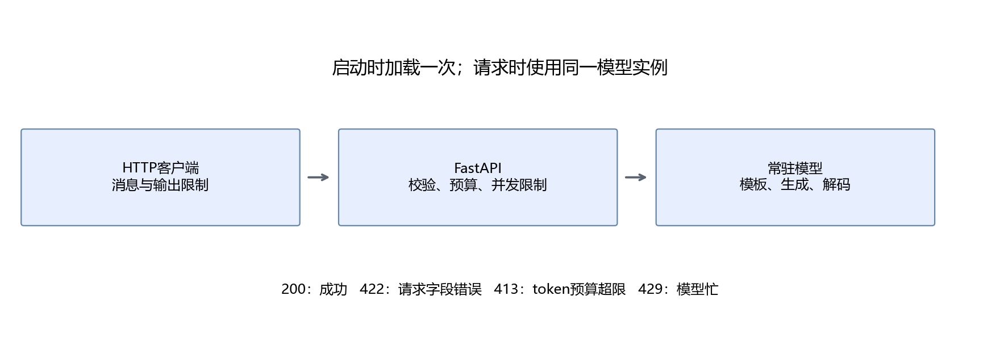

# 第18章 HTTP服务与部署实践

目标：把本地模型包装成HTTP服务，明确请求格式、token预算、并发限制与错误响应，再用独立客户端调用。模型加载与生成逻辑沿用第15章，不重新训练。

## 18.1 从本地函数到HTTP接口

本地推理把消息传给Python函数，返回文本。HTTP服务增加了一个网络接口：客户端发送JSON，服务校验请求、调用常驻模型，再返回JSON。模型参数与生成规则没有因HTTP而改变。



本章使用FastAPI声明接口，用Uvicorn运行服务。服务在启动时加载一次模型；多个请求复用这一个实例。避免每次请求都重新载入数GB权重，也避免在代码导入时重复加载。

`/health`检查服务是否已完成启动；`/generate`执行文本生成。这里的接口是课程自定义协议，不宣称兼容任何现成SDK。

## 18.2 地址、端口、方法与请求体

`http://127.0.0.1:8000/generate`可以分为：协议`http`、地址`127.0.0.1`、端口`8000`、路径`/generate`。`127.0.0.1`只表示当前机器。

客户端用POST提交消息，JSON作为请求体。GET用于健康检查。响应除了状态码，还包含JSON内容：

```json
{
  "messages": [
    {"role": "system", "content": "请用中文简短回答。"},
    {"role": "user", "content": "用一句话解释什么是矩阵。"}
  ],
  "max_new_tokens": 64
}
```

`messages`是有序数组；每项包含角色与文本。`max_new_tokens`是本次新增token上限，不是字符数，也不是输入与输出总长度。

请求不是直接传入`model.generate`的任意Python参数。服务只开放明确支持的字段，方便控制资源和复现评价。本版固定贪心生成，未开放温度或top-p。

## 18.3 请求模型先检查哪些错误

服务使用Pydantic字段规则：

| 字段 | 本版规则 |
| --- | --- |
| `messages` | 1～32条 |
| `role` | `system`、`user`、`assistant` |
| `content` | 每条1～4000个字符 |
| `max_new_tokens` | 1～128 |
| 角色顺序 | 可选开头system，其后user/assistant交替，最后为user |

这些是教学接口的契约，不是所有模型都必须采用的规则。未来Agent可能需要工具消息等类型，应通过新协议明确支持，而不是临时混进当前字段。

字段校验在生成前执行；不合法请求返回422。比如`role="tool"`或`max_new_tokens=129`都不会进入模型计算。JSON能解析只是第一步，还要检查值的范围与相互关系。

## 18.4 token预算在模板处理后计算

字符限制不能替代token限制，角色标记与历史消息也会占token。服务先使用当前分词器与chat template编码完整消息，再检查：

```math
T_{\text{input}}+T_{\text{requested output}}\leq T_{\text{service limit}}.
```

本版服务限制为512，输出最多128。若输入500个token、请求64个输出token，则564超过512，返回413；不会截断文本后继续猜测。

```python
def within_budget(input_tokens, output_limit, context_limit=512):
    return input_tokens + output_limit <= context_limit
assert within_budget(400, 64)
assert not within_budget(500, 64)
```

模型配置支持更长位置范围，不意味着教学服务必须允许同样长度。较小限制使CPU实验时间和内存更可控。若扩大限制，需要重新检查第17章的资源预算和第19章的延迟。

这里采用请求上限做预算，即使模型可能提前发出EOS，也先为最大情况留出余量。

## 18.5 单模型实例怎样处理并发

本版一次只允许一个生成请求。使用非阻塞锁获取执行资格；模型忙时立即返回429，而不是让不受控请求无限等待或同时占用缓存。

关键流程为：

```text
获取执行资格
    失败 → 429
    成功 → 编码 → token预算 → 生成 → 返回
          无论成功或异常，finally释放锁
```

这个设计便于观察单请求行为，不是高吞吐调度器。它没有连续批处理、请求队列或跨请求前缀共享。健康检查仍可响应，返回`busy`说明当前状态。

并发不等于线程数量多就更快。多个模型前向可能同时争夺CPU或GPU内存；让每个请求各自加载一份模型，通常又会扩大常驻占用。先确认资源与策略，再增加并发。

## 18.6 为什么启动时加载一次

FastAPI的lifespan负责启动和关闭阶段。启动成功后，模型和分词器放在`app.state`；请求处理只读取它们，不重新执行`from_pretrained`。[FastAPI生命周期说明](https://fastapi.tiangolo.com/advanced/events/)

本版使用一个进程、一个模型实例。Uvicorn的`workers=4`通常意味着四个进程，不能理解成免费增加四条计算线程；每个进程都可能独立加载模型。GPU场景尤其需要先算容量。

本实验关闭自动重载。开发模式的reload适合普通代码调试，但修改文件会重启进程并重载权重，不适合作为稳定测量方式。

## 18.7 启动服务与客户端

在工作区根目录打开第一个VS Code终端，使用运行指南中新建的 `handmade-llm` 环境和模型路径。复用已有环境时，将两个终端的激活命令都改为该环境名；作者已有环境名为 `vllm`：

```powershell
conda activate handmade-llm
$env:LLM_MODEL_PATH = 'G:\models\qwen2_5_1.5b_instruct'
python script/part04/18_server.py
```

启动完成后，服务监听`127.0.0.1:8000`。第二个终端运行：

```powershell
conda activate handmade-llm
python script/part04/18_client.py
```

客户端先GET `/health`，再POST `/generate`。其网络连接与读取都有超时；`raise_for_status()`让失败状态明确报错。请求回环地址时关闭环境代理，避免本地流量误走代理服务器。

本机实际返回示例包含：

```json
{
  "model": "Qwen/Qwen2.5-1.5B-Instruct",
  "finish_reason": "eos",
  "text": "矩阵是一种数学结构，由多个元素按特定方式排列而成的矩形数组。",
  "input_tokens": 26,
  "output_tokens": 19
}
```

完整响应还包含请求ID和生成耗时，见`outputs/part04/18_http.json`。这里的输出token数包括生成的特殊结束标记，显示文本会隐藏它，因此不等于回答字符数。

## 18.8 如何理解结束原因与错误码

| 状态 | 本版含义 | 客户端行动 |
| --- | --- | --- |
| 200 | 生成成功 | 读取文本、token数和结束原因 |
| 422 | 字段或角色顺序不合法 | 修改请求，不直接重试相同内容 |
| 413 | 输入加输出预算超过512 | 减少历史或请求输出长度 |
| 429 | 模型正在处理另一请求 | 等当前请求结束，再有限重试 |
| 500 | 生成内部失败 | 用请求ID检查服务日志 |

`finish_reason=eos`表示最后生成的是结束ID；`length`表示没有在本次上限内正常发出结束标记。200不表示回答内容必然正确，仍需要下一章的任务评价。

客户端读超时也不表示服务已经停止计算。当前教学实现没有请求取消机制，客户端断开后生成可能继续到结束条件。实际应用要进一步设计取消、队列、资源回收和重试策略。

本版只记录请求ID、token数和耗时，不在常规请求日志里打印全文。错误日志供本机定位；HTTP错误响应不直接泄露内部堆栈。

## 18.9 完整返回与流式返回

当前`/generate`等待整段生成结束，再返回一个JSON对象。第一段可见文本的时间接近整段完成时间，所以它不能用来测真实流式首token延迟。

流式服务在生成过程中持续返回事件，常见协议有SSE。网络事件、token和可读字符并不一一对应：可能需要拼接字节或累积文本后才显示完整字符。结束事件还需要携带结束原因与统计量。

本版没有实现流式接口，不能把完整回答切成几段后发送称为降低了模型首token延迟。后续切换推理引擎时，可使用它正式支持的stream协议，并编写对应客户端。

## 18.10 从教学服务到推理引擎

当目标变为多用户同时访问，优先考虑具备批处理和缓存管理的推理引擎。连续批处理允许不同请求在不同生成阶段加入和退出；分页缓存管理减少固定大块预留造成的浪费。它们与本版“一个锁限制一个请求”有明显区别。

vLLM是GPU部署扩展。官方版本主要面向Linux环境，Windows可通过WSL2与合适的容器运行；不是在Windows创建一个名叫`vllm`的conda环境就完成安装。[vLLM安装说明](https://docs.vllm.ai/en/v0.20.1/getting_started/installation/gpu/)

已有WSL镜像和容器时，先检查容器内Python、PyTorch CUDA、vLLM版本与GPU访问，再决定是否复用。模型和源码通过只读或适当读写挂载进入容器；Windows的`G:\models`在WSL通常对应`/mnt/g/models`。

支持vLLM的Linux环境中，部署命令形式为：

```bash
vllm serve /models/qwen2_5_1.5b_instruct \
  --served-model-name tutorial-qwen \
  --host 0.0.0.0 --port 8000 \
  --max-model-len 2048 --gpu-memory-utilization 0.6
```

这是引擎扩展命令，实际镜像、版本及本机验证步骤以[运行指南](README.md)为准。模型名、路由和返回结构与课程自定义服务不同，客户端也需要改用对应协议；不能直接把`18_client.py`当作所有后端的通用客户端。[vLLM服务协议](https://docs.vllm.ai/en/v0.20.1/serving/openai_compatible_server/)

## 18.11 理解WSL、镜像、容器与挂载

WSL2提供Linux运行环境，Docker在其中管理镜像和容器。镜像保存打包好的文件与依赖；容器是使用镜像启动的运行实例。已有镜像可以创建多个容器，不需要重复下载。停止容器不会删除镜像，也不等于删除挂载在宿主机的模型文件。

本机镜像名为`vllm/vllm-openai:v0.20.1-cu129-ubuntu2404`，新建教学容器名为`handmade-llm-part04-vllm`。模型从Windows磁盘映射到WSL，再只读挂载到容器：

```text
Windows  G:\models\qwen2_5_1.5b_instruct
WSL      /mnt/g/models/qwen2_5_1.5b_instruct
容器     /models/qwen
```

容器内程序使用`/models/qwen`，不能直接使用Windows路径。只读挂载的`:ro`允许模型读取文件，不允许容器修改这份宿主权重；缓存和日志另由容器运行目录处理。

端口映射`127.0.0.1:8001:8000`表示宿主回环地址8001转发到容器8000。容器内监听`0.0.0.0`使转发能够到达服务，并不要求把宿主端口开放给局域网。Windows调用8001，教学CPU服务仍用8000。

镜像里可能没有`python`别名，本机镜像的检查命令使用`python3`。它的默认入口已经是`vllm serve`，启动时只传模型路径和选项；额外重复写一次`vllm serve`会改变参数解析。

## 18.12 vLLM客户端与流式事件

GPU服务启动成功后，从Windows conda环境运行：

```powershell
python script/part04/18_vllm_client.py
```

[独立客户端](../script/part04/18_vllm_client.py)先查看`/v1/models`，确认`tutorial-qwen`已注册，再调用`/v1/chat/completions`。该协议的输出上限字段为`max_tokens`；响应文本在`choices[0].message.content`，统计在`usage`，与课程自定义协议不同。

随后以`stream=true`发送同一贪心请求。SSE事件用`data:`行承载JSON，客户端从`delta.content`拼接文本，记录第一次非空文本片段到达的时间，最后确认`[DONE]`和结束原因。流式输出拼接后应与同配置的完整回答相同。

第一段可见文本到达时间包含网络、事件缓冲和模型生成，不能直接称为服务内部精确TTFT。客户端使用较小读取块减少本地缓冲影响，并分别保存首次可见与完整结束时间。

客户端还发送JSON schema约束，要求`name`为字符串、`age`为整数且没有额外字段。这是在解码时限制合法输出结构，不只是提示词写“只输出JSON”。schema有效仍需检查字段值是否正确，第19章会把格式与内容分开评价。

## 18.13 本章产出与验收

产出为[服务](../script/part04/18_server.py)、[客户端](../script/part04/18_client.py)及HTTP报告。课程核验还会真实发送非法角色、超出输出上限、超出上下文和并发请求，检查422、413与429。

验收不只看一次200：确认模型只在启动时加载，失败后执行资格会释放，健康检查能响应，结束原因和token数能读懂。运行结束后在服务终端按`Ctrl+C`停止进程。

下一章用固定用例评价格式、内容与延迟，并整理可复核的部署材料。
