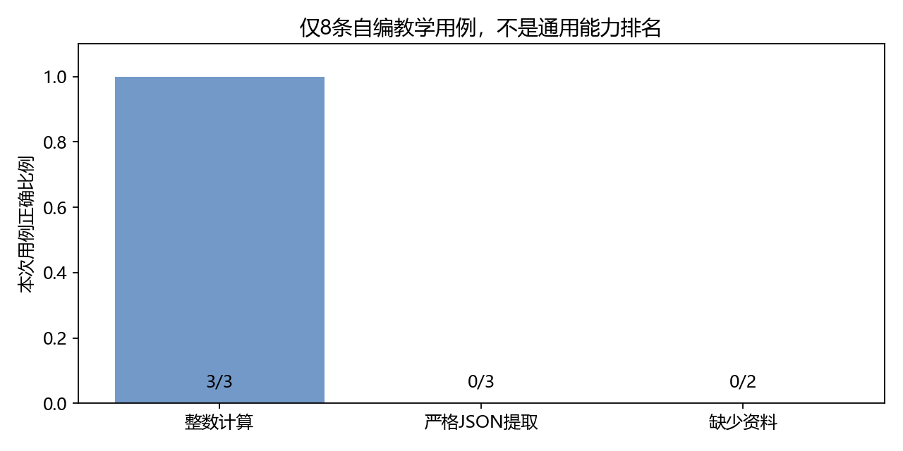

# 第19章 提示设计、评价与部署交付

目标：为模型定义明确输出契约，用真实HTTP调用评价格式与内容，记录延迟和失败，再保存能够复核的交付清单。本章不以模型自己评价自己代替可检查结果。

## 19.1 先明确任务与输出契约

“回答得好”需要拆成可以观察的条件。本章选择三个小任务：整数运算、JSON信息提取、根据限定资料回答缺失信息。每项都提供明确输入和期望输出。

| 任务 | 输入例子 | 契约 |
| --- | --- | --- |
| 整数运算 | 计算2+3 | 只输出整数5 |
| 信息提取 | 王明今年20岁 | 只输出含`name`和整数`age`的JSON对象 |
| 缺少信息 | 资料只有开门时间，问关门时间 | 只输出约定的缺失提示 |

这些是8条自编教学用例，不是大规模标准评测，也不代表通用数学、抽取或事实能力。好处是判定规则短、失败原因可见，适合先学习评价流程。

原始数据在[data/part04/evaluation.jsonl](../data/part04/evaluation.jsonl)。每行独立JSON，包含ID、类别、提示和期望值，方便逐条读取与定位。

## 19.2 提示包含哪些信息

一个可执行任务提示通常要说明：要做什么、允许使用什么输入、必须输出什么形式、缺少信息时怎么办。表达应与判定规则一致。

例如提取任务明确说“键为name和age，age是整数，不要其他文字”。如果程序要求严格JSON，但提示只是“介绍一下这个人”，出现解释性文字就不是意外。

示例可以帮助模型理解格式，但也会增加输入token，可能带入偏置。提供一两个覆盖边界的例子后，需要在其他用例上验证，不能只检查模型是否重复了示例答案。

提示设计改变当前输入，不改变权重。提示中的“只输出JSON”也不等于程序已经启用了受约束解码。模型仍可能输出围栏、说明文字或缺失字段，因此服务端需要校验。

## 19.3 格式有效和内容正确分开判断

JSON能被解析，不一定满足schema；满足schema，也不一定提取正确。至少拆成三层：

1. 原始回答是否是可解析的JSON。
2. 是否具有准确的键和类型。
3. 字段值是否与期望一致。

```python
import json
text = '{"name":"王明","age":20}'
obj = json.loads(text)
schema_valid = (
    isinstance(obj, dict)
    and set(obj) == {"name", "age"}
    and isinstance(obj["name"], str)
    and type(obj["age"]) is int
)
assert schema_valid
assert obj == {"name": "王明", "age": 20}
```

这里检查`type(age) is int`，避免把Python中的布尔值误当成整数。多余键也不符合当前严格契约。真实任务可以允许可选字段，但应先定义规则再运行评价。

包含Markdown代码围栏的回答不是直接可解析JSON。若业务允许去围栏，应该把它定义为显式预处理，并分别报告原始合规率与处理后结果；不能事后只删除失败证据。

## 19.4 exact match适合哪些问题

整数结果可以先要求匹配整数格式，再比较数值。缺少信息任务在当前数据中要求固定短句，因此使用去除首尾空白后的完全匹配。

```python
import re
raw_answer = "5"
integer_format = bool(re.fullmatch(r"-?\d+", raw_answer.strip()))
assert integer_format and int(raw_answer) == 5
assert "资料未提供。" != "资料未提供"
```

最后一个断言说明严格匹配会把句号差异算成失败。它能检查接口是否严格遵循格式，但不能据此宣称模型没有识别出信息缺失。

开放式解释不适合只用一条参考答案做字符串匹配。需要把准确性、覆盖点、矛盾及表达等分开评价，或使用人工审核。即使采用另一个模型做辅助评价，也要说明规则并抽样核对。

## 19.5 通过部署接口评价

先按第18章启动服务，然后运行：

```powershell
python script/part04/19_evaluate.py
```

脚本先发送不计入统计的预热请求，再依次调用8个用例。每个用例保存原始输出、期望值、格式结果、正确性、HTTP耗时、token数和结束原因。

评价使用同一个部署入口，能同时覆盖模板、分词、生成、解码和HTTP返回。如果只在另一个独立函数上测模型，却上线了不同模板或默认参数，结果不能直接代表服务表现。

数据文件SHA-256也写入报告，便于确认两次评价是否使用相同输入。它只证明文件内容是否相同，不证明评价设计充分。

## 19.6 本机失败结果说明了什么

本机CPU、FP32、贪心配置的一次结果为：

| 类别 | 严格正确 | 观察 |
| --- | --- | --- |
| 整数运算 | 3/3 | 输出仅含整数 |
| JSON提取 | 0/3 | 字段值正确，但输出附带Markdown围栏 |
| 缺少信息 | 0/2 | 输出“资料未提供。”，比约定多句号 |



因此总严格正确为3/8。它主要暴露当前提示与模型对精确格式契约的遵循差异，不能把这组数直接解释为知识正确率。

可以进一步改进提示、规定解析规则或引入受约束输出。但修改后应保留原始报告，并用新增独立样例检查，避免不断针对这8条调节直到满分，就声称能力得到普遍提升。

当前实现保留失败输出，没有自动去围栏或去句号。这样读者能够直接看到判定规则造成的差异，之后再设计适合实际任务的规则。

### GPU后端与受约束输出的对照

同一份8条数据通过vLLM GPU服务评价，未启用schema约束的严格结果仍为3/8，记录在`19_evaluation_vllm.json`。换硬件和后端改善执行速度，不自动修复提示的格式遵循问题。

另一个独立schema约束请求返回了可直接解析的`{"name":"王明","age":20}`，见`18_vllm_http.json`。它检查了格式约束和这一条的字段内容，不等于证明全部抽取任务都正确。受约束解码能限制结构，仍可能在合法结构里生成错误事实。

本机GPU串行用例p50约0.11秒、p95约0.41秒；只针对这组短输入短输出、当前FP16与eager设置。CPU与GPU两条路线的精度、注意力实现和缓存策略不同，不把延迟比当成单独的硬件或框架加速比。

## 19.7 延迟与吞吐怎样测

端到端延迟从客户端发送请求前，到收到完整响应后计算；它包括请求处理、模板、模型生成及网络。服务内`generation_seconds`只覆盖生成调用，不等于端到端时间。

总输出token数除以总耗时，是这组串行请求的平均生成速率。单请求完成速度不代表多用户吞吐；不同输出长度也会显著影响耗时。

常见统计为p50、p95。p50约表示一半观测不超过该值，p95描述较慢一端。但只有8条样本，百分位主要用于演示计算，统计稳定性有限。

```python
import numpy as np
latencies = np.array([1., 1.2, 1.5, 2., 3.])
print(np.percentile(latencies, [50, 95]))
assert np.percentile(latencies, 50) == 1.5
```

首次模型加载与预热应单独记录。GPU执行异步，服务内测量需要同步；客户端HTTP完整响应通常已经包含等待结果的时间，但流式首token和完整结束仍要分开。

当前非流式服务不提供真实TTFT指标。不能把完整请求耗时除以输出token数称为首token延迟；prefill与decode并不具有相同成本。

## 19.8 评价版本需要固定哪些内容

至少记录：模型文件版本、分词器、chat template、精度与设备、生成参数、数据文件和判定规则。只写“Qwen 1.5B”不足以复现。

如果同一模型名称下的文件更新，结果也可能变化。已有本地权重时，使用文件SHA-256记录内容；新下载时还可以固定Hub revision。微调adapter应额外记录对应底座，量化模型应记录格式与配置。

本课程生成manifest时读取现有文件，不复制或上传权重。代码仓库中保留小报告和实验源码，数GB模型目录被`.gitignore`排除。

```powershell
python script/part04/19_release_manifest.py
```

得到`outputs/part04/19_manifest.json`，包括配置、词表相关文件、权重与许可文件的哈希，以及服务限制和评价数据哈希。

## 19.9 部署材料如何整理

| 材料 | 用途 |
| --- | --- |
| 模型来源、许可与文件manifest | 确认使用的模型及实际内容 |
| 固定依赖和启动命令 | 重建运行过程 |
| 请求与响应契约 | 让调用方知道可传什么、如何解析 |
| 上下文、输出与并发限制 | 避免误用资源 |
| 用例、原始输出和判定代码 | 复核能力及失败原因 |
| 健康检查、错误码与日志约定 | 定位运行问题 |

升级模型或引擎时，重新验证这些契约，尤其是chat template、结束ID和输出字段。回退也需要完整配置，而不仅是一份旧权重。

如果部署到容器，记录镜像ID或固定tag、挂载位置、GPU可见性与端口映射。可重复启动比只保存一个正在运行的容器更重要；不要把个人模型路径写成所有读者的默认路径。

## 19.10 本部分与两条分支的连接

第五部分将在可调用模型基础上增加规则、skills、工具与知识资料。当前已具备消息输入、明确响应、错误码、token预算和可检查评价；接入工具后，还需要定义行动权限、工具结果与任务验收。

第六部分转向NVIDIA算子。第14章的张量结构、第16章的缓存、第17章的精度预算提供计算背景；优化某个算子时，既要比较耗时，也要验证输出误差，不能只看一条速度数字。

模型服务、Agent控制流程与底层内核属于不同层次。先明确当前修改影响哪个层次，再选择对应实验和检查方式。

## 19.11 本章产出与验收

产出为[评价脚本](../script/part04/19_evaluate.py)、[manifest脚本](../script/part04/19_release_manifest.py)、8条用例及两份报告。

验收时应能说明3/8严格正确为何不等于事实能力差，找到JSON围栏失败的原始记录，解释p95在小样本下的局限，并用manifest确认实际模型文件。第四部分至此完成本地推理、资源分析、HTTP部署与评价流程。

### 补充练习与验收

先独立完成[本章两道练习](../assets/practice/part04.md#第19章)，再核对参考答案和本章验收证据。记录自己的输入、结果与边界案例，不要求复制作者的实验数值。
