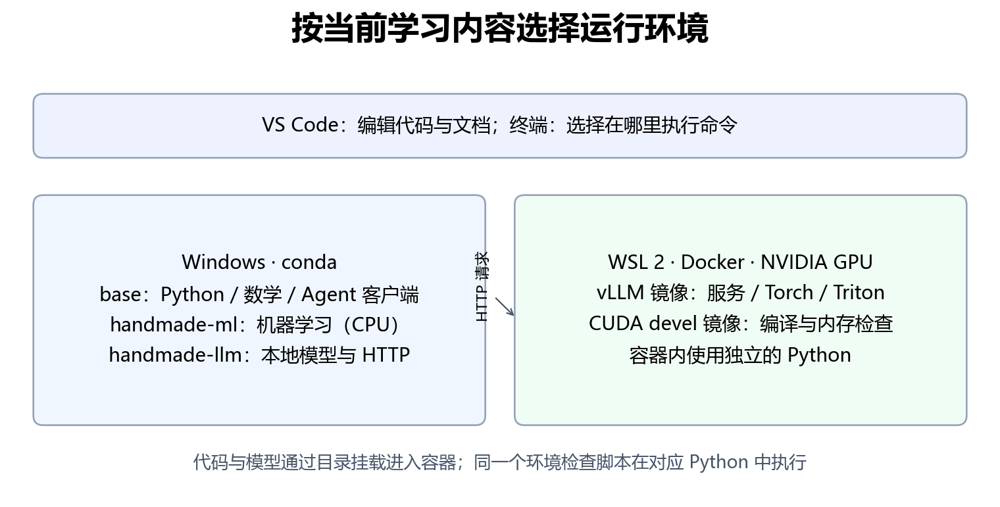

# 附录：环境准备与复现

这一页解决“从一台没有作者环境的电脑，怎样开始运行”的问题。按正在学习的部分安装，不需要在读 Python 第一章时就准备显卡、Docker 和模型。编辑器始终使用 VS Code；Windows 上用 conda 管理 Python，GPU 实验放在 WSL 的 Linux 容器中。

## 1. 先选当前需要的环境



| 学习内容 | 在哪里运行 | 环境入口 | 是否需要 NVIDIA GPU |
|---|---|---|---|
| 第一、第二部分，Agent 离线练习与客户端 | Windows / VS Code 终端 | conda base | 否 |
| 第三部分机器学习与深度学习 | Windows / VS Code 终端 | conda handmade-ml | 否，基础实验使用 CPU |
| 第四部分本地模型与 CPU 服务 | Windows / VS Code 终端 | conda handmade-llm | 否，但模型需要额外内存 |
| 第四、第五部分 GPU 模型服务，第六部分 Triton | WSL / Docker 容器 | 固定版本的 vLLM 镜像 | 是 |
| 第六部分原生 CUDA 编译 | WSL / Docker 容器 | 本仓库 Dockerfile 构建的开发镜像 | 是 |

`base`、`handmade-ml`、`handmade-llm` 是三个不同的 Python 环境。容器里的 Python 又是另一套。Windows 安装好了 torch，不表示容器里也安装好了；在 Windows 激活 conda，也不会改变 `docker exec` 使用的 Python。

先看命令块标注的终端：`powershell` 在 Windows 执行，`bash` 在 WSL Ubuntu 执行。进入容器时，命令会明确写出 `docker run` 或 `docker exec`。

## 2. Windows：conda 与 VS Code

首次安装与解释器选择见[第一章的环境准备](../第一部分-Python与计算基础/01-Python基础.md)。在 VS Code 打开仓库根目录，终端里的当前目录应能看到 `README.md`、`script` 和 `tools`。

下面的依赖版本对应作者 Python 3.12 的基础环境。如果你的 base 使用另一代 Python，先检查这些版本是否支持它，不必覆盖已有环境；也可以新建 Python 3.12 的学习环境，再按第一章选择解释器。安装好 conda 后先检查版本，再安装：

```powershell
conda --version
conda env list
conda activate base
python --version
python -m pip install numpy==1.26.4 matplotlib==3.8.4 requests==2.32.2 -i https://pypi.tuna.tsinghua.edu.cn/simple
python tools/check_environment.py --profile base
```

第三部分的 `handmade-ml` 创建命令与固定版本见[第三部分运行指南](../第三部分-机器学习与深度学习/README.md)。创建后检查：

```powershell
conda activate handmade-ml
python tools/check_environment.py --profile ml
```

第四部分的 `handmade-llm` 创建命令见[第四部分运行指南](../第四部分-大模型与部署/README.md)。创建后检查：

```powershell
conda activate handmade-llm
python tools/check_environment.py --profile llm
```

清华镜像是本教程使用的第三方 PyPI 下载来源，地址与用法见[清华镜像站说明](https://mirrors.tuna.tsinghua.edu.cn/help/pypi/)。CPU 版 PyTorch 使用章节给出的官方 `--index-url`，不要把它改成普通 PyPI 镜像后仍认为下载的是同一套构建。镜像站能解决下载来源问题，不能保证随意组合的版本兼容。

检查输出的 `passed: true` 表示当前配置通过这组基础检查；它没有训练模型，也没有证明每个章节的实验结果一致。失败时先看具体条目的 `detail`，确认当前解释器，再安装相应依赖。

## 3. GPU 路线：第一次准备 WSL 和 Docker

### 3.1 安装 WSL 2

已有 WSL 的读者先执行 `wsl -l -v`，如果 Ubuntu 已是版本 2，就不需要重新安装。首次安装在管理员 PowerShell 执行：

```powershell
wsl --install -d Ubuntu
```

按提示重启，打开 Ubuntu，完成 Linux 用户名与密码设置。这个密码用于自己电脑的 Linux 管理操作。随后在 PowerShell 检查：

```powershell
wsl --update
wsl -l -v
```

Ubuntu 对应的 `VERSION` 应为 `2`。若已有发行版显示为 `1`，可用 `wsl --set-version Ubuntu 2` 转换；发行版名称以自己的列表为准。步骤依据 [Microsoft WSL 安装文档](https://learn.microsoft.com/en-us/windows/wsl/install)。

### 3.2 安装 Windows 驱动与 Docker Desktop

在 Windows 安装或更新适合自己显卡的 NVIDIA 驱动。WSL 使用 Windows 提供的 GPU 驱动接口，**不要在 WSL 里另装 Linux NVIDIA 显示驱动**。本教程把 CUDA 编译工具放在容器里，不要求 Windows 或 WSL 宿主机安装 nvcc。依据 [NVIDIA 的 WSL 指南](https://docs.nvidia.com/cuda/wsl-user-guide/index.html)。

首次使用 Docker，按 [Docker Desktop Windows 安装说明](https://docs.docker.com/desktop/setup/install/windows-install/) 安装。在设置中启用 WSL 2 后端，并在 **Resources → WSL Integration** 启用 Ubuntu。使用 Linux containers，保持 Docker Desktop 运行，然后打开 Ubuntu 终端。GPU 支持的条件与设置见 [Docker GPU 文档](https://docs.docker.com/desktop/features/gpu/)和 [WSL 后端说明](https://docs.docker.com/desktop/features/wsl/)。

在 Ubuntu 执行：

```bash
docker version
docker info
nvidia-smi
```

`docker version` 应同时列出 Client 和 Server。只看到 Client 并提示无法连接，说明引擎尚未启动或当前终端没有连到它。`nvidia-smi` 应能列出显卡；它能运行仍不等于 PyTorch 能完成 GPU 计算，后面还要做实际计算检查。

### 3.3 已有 WSL 原生 Docker Engine 的情况

作者本机使用已有的 WSL Docker Engine。这也是可用路线，不要求改成 Docker Desktop。先检查现有 `docker info`、`docker images` 和 GPU 容器；已能使用 `--gpus all` 就直接进入下一节。

如果你主动选择在 WSL 内安装 Docker Engine，先按 [Docker Engine Ubuntu 文档](https://docs.docker.com/engine/install/ubuntu/)完成引擎安装，再按 [NVIDIA Container Toolkit 安装文档](https://docs.nvidia.com/datacenter/cloud-native/container-toolkit/latest/install-guide.html)添加软件源并安装 Toolkit。**以下两条配置命令只用于这条原生 Engine 路线**，在 Toolkit 安装后执行：

```bash
sudo nvidia-ctk runtime configure --runtime=docker
sudo systemctl restart docker
```

不要在已工作的 Docker Desktop 路线上照抄这组宿主机配置。两条路线择一使用，避免装出两个引擎后，把镜像拉到一个引擎，却在另一个引擎里寻找。

## 4. 路径与模型：先把目录对应起来

Windows 的 `G:\project\handmade-llm-simple`，在 WSL 中通常对应 `/mnt/g/project/handmade-llm-simple`。作者的编写目录叫 `handmade-llm-normal`，Git 工作目录叫 `handmade-llm-simple`，这两个名称都不是程序要求；读者只需要指向自己实际保存代码的目录。

下文假设你在 WSL 中进入仓库根目录，并定义两个变量。模型路径应指向包含 `config.json`、tokenizer 文件和权重文件的那一层：

```bash
cd /mnt/g/project/handmade-llm-simple
tutorial_root="$(pwd)"
model_root="$tutorial_root/models/qwen2.5-1.5b-instruct"
ls "$tutorial_root/script"
```

有完整模型就复用它，把 `model_root` 改成其路径，例如作者实际使用的 `/mnt/g/models/qwen2_5_1.5b_instruct`。没有模型时，在 Windows 的仓库根目录执行：

```powershell
conda activate handmade-llm
python script/part04/download_model.py
python tools/check_environment.py --profile llm --model-path models/qwen2.5-1.5b-instruct
```

下载脚本把 Qwen2.5-1.5B-Instruct 保存到仓库的 `models/qwen2.5-1.5b-instruct`，模型文件不提交 Git。下载需要网络和数 GB 磁盘空间；CPU 加载还需要权重之外的运行内存。`--model-path` 只检查必要文件是否存在，实际加载与生成仍需第15章验证。

容器命令中的 `-v "$tutorial_root:/workspace"` 把代码映射到容器的 `/workspace`；`-v "$model_root:/models/qwen:ro"` 把模型映射到 `/models/qwen`，`:ro` 表示只读。容器内应使用 `/models/qwen`，不能直接传入 Windows 的 `G:\...`。

## 5. 准备并检查 GPU Python 镜像

先查看 `docker images`。如果已经有下面的固定标签，可以直接复用；没有才执行拉取：

```bash
docker pull vllm/vllm-openai:v0.20.1-cu129-ubuntu2404
```

这是较大的 GPU 镜像，拉取需要网络和磁盘空间。第四部分用其中的 vLLM 引擎部署模型；第六部分只借用其中的 PyTorch、Triton 和 Transformers 运行库，不调用 vLLM 引擎。

在 WSL 的仓库根目录执行实际 GPU 检查：

```bash
docker run --rm --gpus all \
  -v "$tutorial_root:/workspace:ro" -w /workspace \
  --entrypoint python3 \
  vllm/vllm-openai:v0.20.1-cu129-ubuntu2404 \
  tools/check_environment.py --profile gpu
```

输出应列出 torch、triton、transformers 的版本，并出现 `cuda_compute` 和 `passed: true`。这里真的在显卡上计算了一个矩阵乘法，随后同步并检查结果。它是运行环境的检查，不是 Triton 算子或模型性能验收。

通过后，按[第四部分](../第四部分-大模型与部署/README.md)启动模型服务，按[第五部分](../第五部分-Agent/README.md)连接 Agent，或按[第六部分](../第六部分-NVIDIA算子开发/README.md)启动实验容器。不要为了每章重新下载模型。

## 6. 从公开基础镜像构建 CUDA 开发环境

第29、30章需要 nvcc、C++ 编译器、cuBLAS 开发文件与 compute-sanitizer。只有 Python GPU 镜像还不够，只有 CUDA runtime 镜像通常也不能编译。

仓库提供 [Dockerfile](../assets/part06/environment/Dockerfile)，默认从公开的 `nvidia/cuda:12.4.1-devel-ubuntu22.04` 构建，不依赖作者私有的 `cuda-ops-dev:latest`。在 WSL 的仓库根目录执行：

```bash
docker build -t handmade-llm-cuda:12.4.1 \
  -f assets/part06/environment/Dockerfile assets/part06/environment
docker run --rm --gpus all \
  -v "$tutorial_root:/workspace:ro" -w /workspace \
  --entrypoint python3 handmade-llm-cuda:12.4.1 \
  tools/check_environment.py --profile cuda-dev
```

构建会下载基础镜像和 Ubuntu 软件包，不会下载模型，也不会安装 PyTorch。构建时已经检查开发工具与 cuBLAS 头文件；第二条命令再次检查容器里的 Python、编译器和检查工具。原生程序的编译、真实执行和内存检查仍在第29、30章完成。

如果已有兼容的 CUDA 12.4 devel 镜像，可传入 `--build-arg BASE_IMAGE=自己的镜像名` 复用。这样验证的是这个已有基础镜像上的构建，不能把它写成默认公开基础镜像从零构建成功。固定标签和 Dockerfile也不等于冻结每个 Ubuntu 软件包；记录自己的镜像 ID 与实际版本，性能结果应以本机实验为准。

## 7. 遇到问题先定位哪一层

| 现象 | 先检查 | 接下来做什么 |
|---|---|---|
| PowerShell 不认识 conda | conda 安装与终端初始化 | 回第一章，重新打开初始化后的终端 |
| Windows 导入成功，容器导入失败 | 命令实际使用的 Python | 在容器中运行对应 profile，检查镜像标签 |
| docker 只有 Client，没有 Server | Docker Desktop 或原生 Engine 是否运行 | 启动自己选择的引擎，重新检查 docker info |
| GPU 容器启动报设备驱动错误 | Windows 驱动、WSL 2、Docker GPU 接入 | 按第3节对应路线检查；不要重装 Linux 显示驱动 |
| GPU profile 的 CUDA 不可用 | 是否传了 --gpus all，是否使用 CPU 版 torch | 用第5节完整命令复查 |
| 找不到模型 config.json | 宿主机目录与挂载后的路径 | 确认 model_root 指到模型文件所在层 |
| nvcc 或 sanitizer 不存在 | 是否用了 devel 开发镜像 | 按第6节构建，不能用运行镜像代替 |
| 容器名已存在 | docker ps -a | 复用自己的容器，用 docker start；不要重复 docker run |
| 显存不足或测量波动 | 是否同时运行多个模型服务 | 停止自己不再使用的服务，再按章节降低预算 |

`check_environment.py` 不安装依赖、不修改配置、不启动常驻服务；成功退出码为 `0`，失败为 `1`。可以把输出保存作学习记录。环境检查通过后，再按对应章节的验收要求核验产出。

## 8. 本次实际核验范围

| 项目 | 实际核验 |
|---|---|
| Windows Python | 已有 base、handmade-ml 和作者 vllm 环境分别通过 base、ml、llm 检查 |
| GPU Python 镜像 | 固定标签镜像完成 CUDA 矩阵计算，模型必要文件检查通过 |
| CUDA 开发镜像 | 使用 Dockerfile 的默认公开基础镜像构建成功，未用本地镜像替代基础镜像 |
| 原生 CUDA | 向量加法、RMSNorm、GEMM 与 cuBLAS 对照运行通过；三个程序的 memcheck 均为零错误 |
| 失败路径 | 模型目录不存在时返回失败，退出码为 1 |

完整记录见[环境核验报告](../outputs/environment/verification.json)、[开发工具检查](../outputs/environment/cuda-dev.json)与[原生程序报告](../outputs/environment/native-cuda.json)。原生验证在临时目录执行，没有覆盖第六部分原来的性能报告；此处报告用于确认环境能编译、运行和检查内存。

本次没有重新安装 Windows、WSL 或 Docker Desktop，也没有新建 conda 环境；首次安装步骤按前文引用的官方文档整理，实际构建与 GPU 检查使用本机已有 WSL Docker Engine。模型文件检查没有重新加载模型，模型推理结果仍见第四、六部分的既有验收记录。
