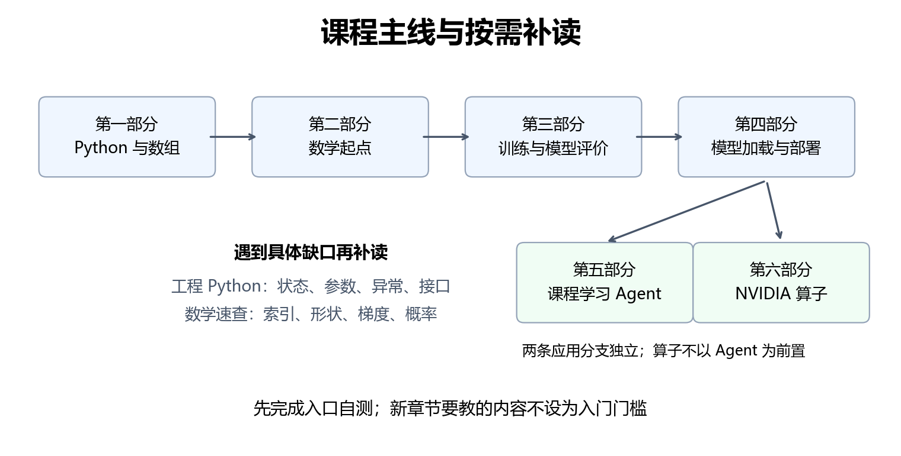

# 学习路线与前置自测

这一页帮助你决定从哪里开始，以及遇到困难时回到哪里。自测不用查资料、不要求背术语，先写下答案与理由，再看末尾解析。能解释主要步骤就继续；卡住某题，只补对应小节，不必把前面所有内容重读一遍。

## 1. 按已有能力选择入口

| 当前情况 | 建议路线 | 先确认什么 |
|---|---|---|
| 尚未写过程序 | 第一部分顺序学习，再进入数学 | 能独立运行文件，解释变量、循环和函数 |
| 写过 Java 等语言，数学较久不用 | 第1章关注 Python 差异，第2、3章完成自检；第二部分按自测补读 | 缩进、切片、对象共享、数组形状与导数 |
| 做过模型实验，运行经验多于推导经验 | 第三部分从评价与手写网络开始，按需回看数学 | 能解释数据划分、梯度方向和张量每个轴 |
| 主要想做 Agent | 完成 Python 与必要的大模型部署知识，再进入第五部分 | 能读 JSON、调用 HTTP、区分模型输出与工具执行 |
| 主要想做 GPU 推理优化 | Python、数组、PyTorch、模型加载与缓存，再进入第六部分 | 能解释形状、精度、生成过程和基准比较 |

选择路线依据实际能力，而不是学历或岗位。Agent 的离线练习可以先运行，但真实模型接入需要第四部分的服务知识。算子分支不要求先完成 Agent 项目；它需要第四部分的模型加载与缓存。两条分支可以独立学习。

各章的“选修”“可选扩展”可先跳过。先完成主线，再回来扩展。环境问题先查[环境指南](01-环境准备与复现.md)，代码写法查[工程 Python 补读](03-读懂后续工程代码.md)，数学符号查[数学速查](04-数学符号与计算速查.md)。

## 2. 第一部分入口：从运行一行代码开始

不设置数学或编程门槛，也没有章末作品。第一次学习直接从[第1章](../第一部分-Python与计算基础/01-Python基础.md)开始。

先检查三件事：能找到自己保存的 `.py` 文件；知道 VS Code 的编辑区和终端是不同位置；在终端运行 `python --version` 能得到版本。如果尚不能做到，停在第1章环境与运行小节，暂时不读后面的语法。

## 3. 第二部分入口：数组与函数是否熟悉

这部分需要 Python 函数、索引、NumPy 形状、按轴计算和简单图表；不要求已经学过微积分。先尝试：

1. 一个函数接收 `x`，返回 `x * x`。输入 `3` 时返回什么？`return` 与 `print` 有什么区别？
2. 数组 `[[1, 2, 3], [4, 5, 6]]` 的形状是什么？`mean(axis=1)` 得到哪些数？
3. 将同一份记录绑定给两个变量，修改其中一个，另一个一定不变吗？

第1题卡住：回第1章“函数”。第2题卡住：回第3章“创建数组”“按轴汇总”。第3题卡住：回第1章“对象共享”和第3章“视图与复制”。答得出后进入[第4章](../第二部分-面向机器学习的数学基础/04-函数与微积分入门.md)，再学习导数等新知识。

## 4. 第三部分入口：先检查局部计算

需要理解函数变化、向量点积、概率和数组形状。矩阵分解、完整动态规划证明可以后补，不是第8章的先决条件。

1. 向量 `[1, 2]` 与 `[3, 4]` 的点积是多少？
2. 损失为 $`L(w)=(w-3)^2`$，当前 $`w=1`$。导数是多少？学习率为 $`0.1`$ 时，一次梯度下降后的 $`w`$ 是多少？
3. 模型给三个类别的概率为 `[0.1, 0.7, 0.2]`。最大概率对应哪个索引？概率较大的预测是否一定正确？

分别补读第5章的点积、第4章的导数与梯度下降、第6章的概率。然后进入[第8章](../第三部分-机器学习与深度学习/08-机器学习任务与模型评价.md)。第8章建立数据与评价，第9章推导反向传播，第10章学习框架；不需要在入门自测里先证明这些尚未讲过的内容。

### 从训练基础进入 CNN

进入第11章前，解释输入形状 `(N, C, H, W)` 中四个轴，并说出训练与测试使用同一张图片会造成什么问题。卡在形状，回第3章和第10章；卡在划分，回第8章。卷积、步长、padding 是第11章要教的新知识。

### 从图像进入 NLP

进入第12章前，确认自己能用字典建立“符号 → 整数编号”的映射，并区分单个类别输出与一串输出。文本不是把图片换成字符串后就能直接送入原模型：本章会重新介绍词表、编码和序列模型。字典不熟回第1章，分类评价不熟回第8章。

### 从序列模型进入 Transformer

进入第13章前，解释“用前面的符号预测下一个符号”，并区分序列长度与词表大小。卡住时回第12章的字符生成；注意力和因果掩码由第13章建立，不要求提前理解完整公式。

## 5. 第四部分入口：从训练转到加载与生成

需要能读张量形状，理解分类分数转为概率，以及按前缀预测下一项。读过第13章后，再检查：

1. 词表有 `100` 个符号，输入有 `8` 个位置。每个位置都输出词表分数时，忽略 batch，分数数组的形状是什么？
2. 连续两个目标符号的条件概率分别是 `0.5` 和 `0.2`。它们按指定顺序出现的联合概率是多少？
3. 加载已有权重后生成答案，是否一定会改变模型参数？

形状卡住回第3、13章；条件概率卡住回第6章；训练与推理卡住回第10、13章。然后进入[第14章](../第四部分-大模型与部署/14-语言模型与大模型结构.md)。token、聊天模板、KV 缓存和部署预算会在这一部分解释。

## 6. 第五部分入口：把数据、决定和执行分开

需要字典、JSON、函数、异常处理和 HTTP 请求。入门离线循环不依赖高级数学，也不要求理解全部 CNN 推导。

1. 解析 `{"action": "search", "args": {"query": "梯度"}}` 后，怎样取得 `query` 的值？
2. 模型输出“已经保存”，能否据此断定磁盘里已经存在学习记录？应该检查什么？
3. 服务返回 HTTP 200，是否就证明返回的动作参数符合工具约定？

第1题卡住回第2章 JSON 与工程附录“嵌套数据”；第2题卡住回第18章请求、处理与响应；第3题卡住先看工程附录“JSON 与 HTTP 的检查顺序”。进入[第20章](../第五部分-Agent/20-Agent的组成与运行过程.md)后，再学习动作协议、权限、技能、检索与状态。

第25章使用深复制和数据库事务，按需补读工程附录第1、5节。第26章使用 HTTP 服务入口，补读工程附录第2、6节即可，不必先学完整 Web 开发课程。

## 7. 第六部分入口：先能描述要比较的计算

需要数组形状、逐元素运算与归约、精度、PyTorch 推理、prefill/decode 和缓存。不会 C++ 可以先进入第29章的最小语法；不要求在入口就会写 CUDA。

1. 对形状 `(2, 3)` 的数组按最后一个轴求均值，输出形状是什么？保留该轴为长度 `1` 时呢？
2. 把输入和输出的每个元素都改为 FP16，相比 FP32，逻辑存储字节数如何变化？这是否保证耗时减半？
3. 某段计算只占原程序耗时的 `10%`。即使这段变得无限快，整个程序最多能快多少倍？

第1题卡住回第3、5章或数学速查的“轴与广播”；第2题卡住回第17章资源预算；第3题卡住可直接读数学速查的“局部收益与整体收益”，第28章会继续解释。进入[第28章](../第六部分-NVIDIA算子开发/28-从推理瓶颈到GPU执行.md)前，准备环境见附录1。

第34章替换模型方法时涉及装饰器、`yield` 和异常恢复，按需看工程附录第3、4节。第35章的异步启动代码另见第6节；它不是所有 kernel 实验的前置要求。

## 8. 自测答案与理由

### 第二部分入口

1. 返回 `9`。`return` 把值交给调用者，`print` 把内容显示到输出中；只打印不返回的普通函数，返回值是 `None`。
2. 形状 `(2, 3)`，按每行的三个值求均值得到 `[2, 5]`，结果形状 `(2,)`。
3. 不一定。两个变量可能指向同一可变对象，修改会被双方看到；数组视图也可能共享底层数据。

### 第三部分入口

1. $`1\times3+2\times4=11`$。
2. $`L'(w)=2(w-3)`$，当前导数为 `-4`；$`w_{new}=1-0.1\times(-4)=1.4`$。导数为负，更新时减去负数，参数向右移动。
3. 索引 `1`，Python 索引从 `0` 开始。这里只表示模型更偏向该类别；实际标签仍可能是另一个类别。

### 第四部分入口

1. `(8, 100)`。位置轴与类别轴承担不同职责，不能互换理解。
2. `0.1`。第二个概率已经以第一个符号出现为条件，这里使用条件概率乘法，不需要另假定两个符号独立。
3. 普通推理不会更新参数。生成过程会产生 token 和缓存，这些运行状态变化不等于训练权重更新。

### 第五部分入口

1. 先 `json.loads` 得到字典，再读取 `action["args"]["query"]`；字段不存在时直接读取会报错。
2. 不能。应检查是否执行了保存工具、工具是否成功，以及实际记录是否存在。
3. 不能。HTTP 成功、JSON 可解析、字段与取值有效、动作获准执行，是不同层次的检查。

### 第六部分入口

1. 不保留轴是 `(2,)`；`keepdims=True` 是 `(2, 1)`，便于与每行的三个元素广播。
2. 理想的元素存储量减半：FP16 每元素 2 字节，FP32 每元素 4 字节。启动、计算、访存和转换等开销仍存在，不保证耗时减半。
3. 最快仍需要原时间的 `90%`，加速比上限为 $`1/0.9\approx1.111`$。

## 9. 卡住时怎样提出一个能核对的问题

记录当前小节、原式或代码、自己预期的结果、实际结果，以及第一步不理解的位置。例如：“输入形状 `(2, 3)`，为什么 `mean(axis=1, keepdims=True)` 得到 `(2, 1)`？请按两行数据展开，不提前介绍神经网络。”

向 AI 询问后，自己换一个数或换一个形状再核对。若解释无法落实到具体值、数组形状或输出，就继续追问这一小步。抄出完整实验的答案不能替代这种核对。
